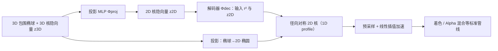

## 一句话总结

提出一个可微框架，用两个小型 MLP 自动学习**随视角变化的 2D 泼溅核**，把"核的形状该长什么样"从手工设计的解析公式变成数据驱动的学习结果，从而在新视角合成上同时提升重建质量和表示效率。

## 研究背景

- 领域现状：自 3D Gaussian Splatting 问世以来，基于泼溅的表示与渲染取得了巨大成功。核（kernel）是决定重建质量与表示效率的关键因素，于是大量工作把原始高斯替换成各种解析核——广义指数、Student's t、可变形 Beta 等；也有工作把体积基元隐式建模为视角无关的 2D 核，如线性核、重叠高斯、B 样条等。
- 核心痛点：解析核的形状变化完全由手工公式决定，无法真正随场景自适应，表达力受限。而想直接从数据学核又卡在一个数学难点——**一般 3D 基元没有闭式的线积分公式**（泼溅时需要对基元沿视线做积分），只能用"切片"近似，或把基元限制成平面、或限制成特定网络结构，代价都是牺牲表达力。因此"如何系统性地、数据驱动地学习通用泼溅核"仍是开放问题。
- 本文 idea：不去显式建模 3D 密度分布再积分，而是**直接对基元投影后的积分结果建模**——即直接学习投影得到的 2D 核，绕开难算的线积分；同时给核引入学习到的**视角依赖性**，作为一种数据驱动的多视角一致性来提升质量。

## 方法

整体框架：每个基元由一个 3D 包围椭球（几何代理，类似 vanilla 3DGS 的截断高斯）加一个表示 3D 核的隐向量组成。渲染时先把椭球投影成 2D 包围椭圆；再用一个"椭球感知"的投影 MLP 把 3D 核隐向量变换成 2D 核隐向量；最后由解码器把该隐向量解码成一个以马氏距离为自变量、被椭圆约束的**径向对称 2D 核**，作为最终泼溅形状，送入标准泼溅管线做着色、alpha 混合等后续处理。

关键设计：

1. **神经投影 Φproj（3D 核到 2D 核）**：类比 EWA 泼溅把 3D 椭球投影成 2D 椭圆，作者用一个全局 MLP 把 3D 核隐向量投影成 2D 核隐向量。输入不只是几何与相机，还额外喂进相机空间下的椭球中心 $$\boldsymbol{\mu}^{\text{cam}}_{3D}$$（空间感知）、缩放因子 $$\boldsymbol{s}$$（尺度感知）以及相机空间的旋转矩阵 $$\boldsymbol{R}^{\text{cam}}$$（紧凑编码 3D 视角朝向）。消融显示这套输入在保持泛化的同时带来质量提升。默认是 4 层、每层 64 神经元、leaky-ReLU 的轻量 MLP。

2. **核解码器 Φdec（隐向量到形状）**：对某个像素先按马氏距离算出 $$r^2$$，再用解码器替换掉解析核公式，输出不透明度 $$d = \Phi_{\text{dec}}(r^2, \boldsymbol{z}_{2D})$$。它本质上刻画的是径向对称 2D 核在 $$r^2 \in [0,1]$$ 上的一维剖面。默认 3 层、每层 4 神经元，末层用 sigmoid 约束输出。

3. **为什么必须径向对称**：把任意 3D 视角条件映射到一个 2D 坐标系上（一般 2D 核所需）存在理论上的不连续性，即"毛球定理"。作者在预实验里用平滑技巧缓解，却导致核在某些视向附近急速旋转、动画时很扰人。改为只输出径向对称核，就根本不需要那个 2D 坐标系，从源头规避了这个问题。

4. **加速与训练**：逐像素跑 Φdec 太贵，于是对一维剖面预采样 $$k$$ 个点、渲染时线性插值，把像素数与 MLP 调用数解耦；多数实验取 $$k=2$$ 即够用。训练上先对两个网络做预训练（体积用余弦剖面 $$d=\cos(\tfrac{\pi}{2}r^2)$$ 作目标、平面用 2D 高斯 surfel），再两阶段联合优化（先冻结网络若干迭代再全参优化），损失沿用 Deformable Beta Splatting 的图像损失加正则，并复用与核无关的 MCMC 密度控制。此外框架还能扩展到 2DGS 的平面基元，此时核不必径向对称，可学习一般 2D 核，甚至用于通用 2D 图像的高效表示。

## 实验结果

在 4 个标准数据集（Mip-NeRF360、Tanks & Temples、Deep Blending、NeRF Synthetic）共 21 个场景上评测，重建质量指标为 PSNR / SSIM / LPIPS。下表取 3D 泼溅在两个真实拍摄数据集上的质量对比作为主实验（本文两种颜色模型 SH / SB）：

| 方法 | T&T PSNR↑ | T&T LPIPS↓ | Deep Blending PSNR↑ | Deep Blending LPIPS↓ |
|------|-----------|------------|---------------------|----------------------|
| 3DGS | 23.15 | 0.183 | 29.41 | 0.243 |
| 3DGS-MCMC | 24.29 | 0.190 | 29.67 | 0.320 |
| SSS | 24.87 | 0.138 | 30.07 | 0.247 |
| DBS | 24.79 | 0.148 | 30.10 | 0.240 |
| 本文 3D+SH | 25.42 | 0.141 | 30.52 | 0.233 |
| 本文 3D+SB | 25.35 | 0.145 | 30.54 | 0.237 |

在 3D/2D 两种泼溅、所有基准的所有质量指标上，本文方法都是最优或次优。表示效率方面（Tanks & Temples，关闭视角相关颜色只看几何），在相近显存下本文质量更高，且随显存增大有良好可扩展性：约 100MB 时本文（$$k=2$$）达到 PSNR 25.22，明显高于 3DGS 的 23.38、SSS 的 24.38、DBS 的 24.24。代价是渲染更慢——运行时开销大致按 Φproj、Φdec、光栅化 = 9:2:1 分布，多数情况下仍可实时（大于 50 fps）。

消融还表明：投影 MLP 的输入同时具备空间、尺度、视角感知时质量最好；小显存下增大 $$k$$（核更有表达力）能提升质量，大显存下因单个 splat 屏幕尺寸变小、简单的"锥帽"形核（$$k=2$$）就够用；预训练优于不预训练，其中余弦目标剖面效果最佳。此外几何视角依赖与颜色视角依赖作用在不同通道（alpha vs RGB），二者不可等价替代。方法还被扩展到通用 2D 图像表示，相近显存下优于手工 Gabor 核的 GabSplat。

## 亮点与局限

- 亮点：
  - 用"直接建模投影后的 2D 核"这一巧思绕开了通用 3D 基元线积分难算的核心障碍，且不绑定任何特定网络类型。
  - 首次系统性地把泼溅核做成**数据驱动 + 视角依赖**，学习到的视角依赖可视为一种软性的多视角一致性；同一框架统一覆盖体积基元与平面基元，还能迁移到 2D 图像表示。
  - 用"毛球定理"清晰论证了径向对称的必要性，并用预采样插值把神经核的推理成本与像素数解耦。

- 局限：
  - 渲染速度低于 SOTA，瓶颈在两个 MLP（尤其 Φproj 占约 9/12 的时间），有待通过权重剪枝、FP16、甚至符号回归蒸馏出解析等价式来加速。
  - 未考虑抗锯齿，也未对 MLP 输入采用位置/频率等高级编码。
  - 主要在静态重建质量与效率上验证，动画时序质量缺乏量化指标。

## 延伸思考

作者指出学习到的核在同类场景（如植被、头发）下分布高度相似，暗示可进一步压缩、为特定场景类型自动生成"专用核"而非通用核，这把泼溅从"选一个好核"推向"自动设计表示"。另一个值得追问的方向是：这里学到的"视角依赖一致性"与刚性欧氏 3D 一致性到底有何区别、各自捕捉了什么，若能解析清楚，或可用于正则化生成式 3D 建模等下游任务。此外与实时加速、抗锯齿（如 Mip-Splatting 思路）以及重光照工作的结合，都是让该表示走向实用的自然路径。
