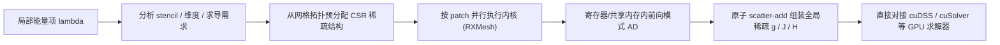

## 一句话总结

面向三角网格的 GPU 自动微分系统：把求导下沉到单个网格元素、全程留在寄存器与共享内存里做前向模式 AD，直接在 GPU 上组装稀疏梯度、Jacobian 和 Hessian，让二阶方法在百万级网格上也不再被求导拖垮。

## 研究背景

- 领域现状：机器学习催生了 PyTorch、JAX 等高度优化的 AD 框架，但它们的计算模型是稠密张量 + 大而规整的计算图，擅长稠密连接的神经网络。
- 核心痛点：科学计算与图形学里的网格问题是另一套范式——不规则连接带来大规模稀疏系统与局部依赖，Jacobian、Hessian 随分辨率增大但始终稀疏。通用 AD 框架用稠密或隐式稠密的中间表示，既浪费内存又跑得慢；在 GPU 上更是内存受限（瓶颈在访问/更新稀疏数据结构，而非算术），求导开销有时甚至超过后续线性求解本身。这逼得实践者只能限制问题规模、放弃二阶方法或手推导数。
- 本文 idea：网格能量天然"部分可分"——每个局部项只依赖一小撮固定邻域自由度。据此在单元级别做前向模式 AD，把局部求导完全关在寄存器/共享内存中，全局耦合只通过稀疏累加产生，从而对齐 GPU 内存层次、消除全局计算图与主机-设备同步。

## 方法

系统让用户只写"局部能量项"（定义在顶点/边/面或其邻域上的 lambda），框架自动负责并行求值、求导、稀疏组装与矩阵-free 运算。对标量目标 $$F(x)=\sum_{j\in E} f_j(x_j)$$，每个局部项产生稠密小梯度 $$g_j$$ 与 Hessian $$H_j$$，再按选择矩阵 $$S_j$$ 组装为全局稀疏结构 $$g=\sum_j S_j^\top g_j,\ H=\sum_j S_j^\top H_j S_j$$；向量值目标则组装稀疏 Jacobian $$J=\sum_j P_j^\top J_j S_j$$。

关键设计：

1. **前向模式而非反向模式**：网格计算图浅且稀疏，每个局部项输入维度小，前向与反向在单元级理论代价相当；但前向模式无需记录/反向遍历全局计算图，所有中间量（primal、方向导数、局部 Jacobian/Hessian）都能留在寄存器或共享内存，全局访存只剩"读网格 + 写最终稀疏导数"两次。

2. **局部性优先的数据结构（RXMesh）**：把网格切成能塞进 GPU 内存层次的小 patch，一个 CUDA block 处理一个 patch，用 ribbon（幽灵元素）缓存跨 patch 邻居。传统 halfedge/指针邻接表靠指针跳转、访存不规整，不适合 GPU；patch-local staging 让局部项所需连接与属性一次性载入共享内存并复用。本文是首个把 patch 局部性用于 AD 的工作。

3. **端到端 GPU 常驻执行 + 拓扑预分配稀疏**：Hessian 块稀疏结构由网格连接与声明的邻域查询决定、完全可预测，因此初始化时就按 CSR 预分配（并行分析 + 前缀和求偏移），求值时各内核用原子加累加进预分配结构，避免运行时动态分配、tape、计算图等中间体。稀疏矩阵存 CSR 以直接对接 cuDSS/cuSolver。

4. **动态交互项与稀疏更新**：碰撞/邻近等运行时产生的元素对（Op::VV、Op::VF 等）会引入 Hessian 的非对角块。系统把"交互发现"与"交互求值"解耦，用双缓冲 CSR + 预留存储在 GPU 上并行插入新非零、交换缓冲，全程无 CPU 往返。组装统一用原子 scatter-add：局部求导线程私有无需同步，仅在全局累加点用原子操作，网格局部性使写冲突通常很低。

## 实验结果

在 RTX 4090 上覆盖七个应用（质点弹簧布料、参数化、ARAP、frame field、流形优化、面积平滑、含接触的弹性壳）。以质点弹簧布料的每步求导时间（梯度 + Hessian，不含线性求解）为主实验，对比稠密的 PyTorch 与稀疏的 IndexedSum：

| 顶点数 | PyTorch (ms) | IndexedSum (ms) | 本文 (ms) |
|--------|--------------|-----------------|-----------|
| $$10^2$$ | 269.8 | 17.07 | 0.18 |
| $$50^2$$ | 7205.6 | 18.72 | 0.22 |
| $$100^2$$ | 29516.76 | 11.74 | 0.25 |
| $$500^2$$ | OOM | 15.73 | 3.09 |
| $$1000^2$$ | OOM | 39.67 | 11.7 |

相较 PyTorch 稠密实现有两个数量级以上加速，相较 IndexedSum 在约 $$10^6$$ 顶点网格上约 5.1× 加速，把瓶颈从求导转移到线性求解。其余应用：参数化（矩阵-free Hessian-向量积）对 PyTorch 几何平均 2.29×；ARAP 对 Thallo 约 2.01×；frame field 全程 8.22 s vs PyTorch 377.49 s；流形优化 L-BFGS 对 JAXopt 约 2.1×；面积平滑对 PyTorch/Warp/JAX/Dr.JIT/EnzymeAD 分别约 8.87×/8.63×/12.19×/4.53×/1.26×，对手写梯度仅慢 1.71×（说明系统开销极小）。最具说服力的是约 700 头 Spot（2.1M 顶点、含 IPC 接触）的弹性壳仿真：接触检测与线性求解占约 87.3% 运行时，而自动微分 + 稀疏组装即使在稀疏模式剧烈变化下也只占 12.2%。

## 亮点与局限

- 亮点：
  - 把 TinyAD 式的"每元素前向 AD"真正搬到 GPU，用 patch 局部性把求导关进片上内存，实测让二阶求导退出关键路径。
  - 统一编程模型同时支持标量/向量目标、显式稀疏 Hessian/Jacobian、矩阵-free Hessian-向量积、以及运行时动态稀疏；局部项用标准 CUDA/C++ 写，支持分支、有界循环、复数（thrust::complex）等。
  - 全程 GPU 常驻、CSR 直接对接 cuDSS/cuSolver，易与 BVH 等加速结构集成；开源于 RXMesh。
  - 证明"显式物化稀疏 Jacobian"在大规模几何问题上反而划算（换 cuDSS 直接解再快 2.9×），挑战了 ML 框架"只做 JVP/VJP"的默认做法。

- 局限：
  - 目前只针对三角面网格，尚未支持四面体等体网格（作者列为未来方向）。
  - 每个能量项单独起一个内核，缺少跨项 kernel fusion，仍有额外访存开销可优化。
  - 原子累加天然非确定性，会带来运行间的微小数值差异；虽通常不影响收敛，但对可复现性敏感的场景需注意。
  - 依赖 RXMesh 的 patch 结构与预分配假设，动态网格连接、更宽 k-ring stencil、复合算子（如 bi-Laplacian）尚待扩展。

## 延伸思考

这项工作把"稀疏 + 局部性"作为 GPU 数值求解器的一等设计原则，思路与 Herholz 等的符号微分互补——后者做表达式级优化，本系统做访存级优化，二者可组合（符号前端 + 本文 GPU 后端）。对做可微仿真、逆向几何、物理反问题的人，它意味着 Newton 类二阶方法在交互式、百万级网格上重新变得可行，瓶颈回到线性求解与碰撞检测。值得追问的是：kernel fusion 与线性代数加速（如 JAX 式融合）叠加后能再压多少求导时间；以及这套 patch-local 前向 AD 思路能否迁移到体网格、点云或更一般的图结构稀疏优化上。
