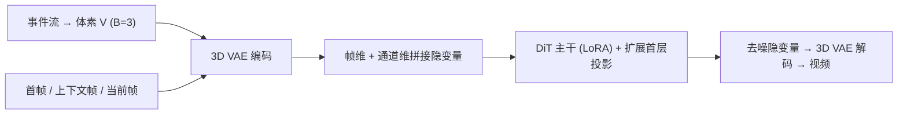

## 一句话总结

LongE2V 用一个基于预训练视频扩散先验（CogVideoX I2V）的统一框架，把"从事件相机流恢复视频"这一问题拆成重建、预测、插帧三种任务，通过自回归展开、自适应上下文切换和重编码对齐等机制，在长序列上兼顾高保真纹理与时间稳定性。

## 研究背景

- 领域现状：事件相机以微秒级分辨率、高动态范围异步记录亮度变化，不易运动模糊，但输出稀疏且无绝对强度，需要专门算法把事件流还原成可读视频。早期用 CNN / RNN（E2VID、FireNet），后来引入 Transformer、超网络，近来又把视频扩散模型（如 VDM-EVFI）用于插帧。
- 核心痛点：回归类方法因"回归到均值"倾向而纹理模糊；扩散类方法在长序列上误差累积严重，出现颜色漂移；插帧方法在快速复杂运动下产生重影。更关键的是，这些方法大多针对单一任务、各用一套架构，缺乏统一性。
- 本文 idea：借助预训练视频扩散先验，把重建、预测、插帧统一表述为"事件体素驱动的条件视频生成"，只需微调即可高数据效率地共享一套权重，并针对长程漂移与插帧对齐问题设计专门模块。

## 方法

整体上，作者把三类事件视频任务统一为条件生成：视频帧、上下文帧、首帧、事件体素都经冻结的 3D VAE 编码进隐空间，沿帧维与通道维拼接后送入 DiT 主干；主干用 LoRA 高效微调，只把承接额外事件通道的首层投影层做全量微调。通过切换输入条件（是否给首帧、是否给首尾帧）即可在重建、预测、插帧之间自由转换。

关键设计分四点：

1. **事件表示与统一条件化**：事件 $$e_i=(x_i,y_i,t_i,p_i)$$ 按线性插值累积极性离散成体素网格 $$V\in\mathbb{R}^{B\times H\times W}$$（取 $$B=3$$，正好匹配 VAE 的 3 通道输入）。首帧、上下文帧、当前帧和事件体素分别编码为隐变量后拼接，损失只作用在带噪的 $$Z_t$$ 分量上；对首帧隐变量做 5% dropout，并以 20% 概率引入文本提示以支持文本引导生成。

2. **自回归展开（Autoregressive Unrolling）**：长视频常把上一块的末帧当作下一块条件，导致误差累积。作者先用真值上下文帧训练至收敛，再"激活展开"——用模型在训练集上自己生成的预测替换真值上下文帧继续微调，如此重复 $$T$$ 次（实验中 3 次），迫使模型适应自身预测误差，弥合训练与推理之间的分布差。

3. **自适应上下文切换（Adaptive Context Switch）**：每块都强制更新上下文会累积误差。作者把去噪后的隐变量重新送入 DiT 提取注意力图，计算当前 token 对上下文 token 的平均注意力权重 $$\mu_{attn}$$。若 $$\mu_{attn}\ge\tau$$ 则保留现有上下文以防漂移；若低于阈值（$$\tau=0.05$$）则触发单次重试：丢弃当前生成、把上下文更新为紧邻的前一块并重新生成。

4. **重编码对齐与交叉残差校正（面向插帧）**：3D VAE 的时间压缩使得隐空间翻转与像素空间翻转不可交换，即 $$\mathrm{Flip}_{lat}(Z_t)\neq E(\mathrm{Flip}_{pix}(D(Z_t)))$$，直接翻转会造成前后向分支错位。重编码对齐通过"解码到像素空间 → 翻转 → 重新编码"来纠正。由于额外的解码-编码回路会带来重建损失，再用交叉残差校正：计算原始隐变量与重编码隐变量之差作为残差，把前向残差注入后向对齐隐变量、后向残差注入前向，实现对称的交叉注入以恢复高频细节并促成时间一致性。此外，事件体素密度增强在训练时随机缩放事件体素并按非零统计量归一化，让模型对不同传感器分辨率与场景深度带来的密度差异更鲁棒。

## 实验结果

主实验是在 ECD、MVSEC、HQF 三个真实事件数据集上的重建与预测对比（遵循 EVREAL 基准，序列长度从约 300 帧到 2000 多帧，专门考察长程稳定性）。下表取 HQF 数据集上与代表性基线的对比：

| 任务 / 方法 | PSNR↑ | SSIM↑ | LPIPS↓ |
|------|------|------|------|
| 重建 HyperE2VID | 16.42 | 0.539 | 0.257 |
| 重建 本文 | 16.45 | 0.603 | 0.240 |
| 预测 VDM-EVFI | 13.52 | 0.373 | 0.520 |
| 预测 本文 | 16.67 | 0.619 | 0.229 |

重建任务上，本文在三个数据集上都取得最优 LPIPS（感知质量），SSIM 也普遍领先；预测任务上相对 VDM-EVFI 在所有指标、所有数据集上都大幅领先，验证了长程生成的稳定性。

插帧任务是零样本迁移：模型只在重建与预测上训练，未做任何插帧微调，就直接用同一套权重在 BS-ERGB 和 HQF 上插 31 帧，与监督训练的 CBMNet-Large、TLXNet+ 比较。本文在 LPIPS 上明显更优（HQF 上 0.105 对 0.166），并能保持文字清晰可读，而基线出现重影或结构崩塌；回归基线虽靠模糊纹理拉高 PSNR，但感知质量差。消融实验证明：预训练先验是收敛的前提（从头训练只出噪声）、上下文机制与自回归展开/自适应切换共同抑制长程漂移、交叉残差校正把插帧 LPIPS 改善 0.037、事件体素密度增强缓解测试时上采样导致的密度失配伪影。文中还展示了文本引导的事件视频上色，说明模型能解耦事件驱动的运动与文本定义的外观。

## 亮点与局限

- 亮点：
  - 用一套权重、仅靠切换输入条件就统一了重建、预测、插帧三类任务，且插帧是零样本迁移，通用性强。
  - 自回归展开直击"训练用真值上下文、推理用自身预测"的分布差，配合自适应上下文切换在长序列上有效抑制漂移。
  - 揭示并解决了 3D VAE 时间压缩下"隐空间翻转与像素空间翻转不可交换"这一插帧对齐问题，方案清晰。
  - 仅在 BS-ERGB 上训练即获得跨数据集的强泛化，数据效率高。

- 局限：
  - 依赖大型预训练视频扩散主干，推理成本高，作者也把加速推理列为未来工作。
  - 由于事件流缺乏绝对强度，评测时需将生成结果的全局亮度对齐到真值，说明绝对光度恢复仍有先天不确定性。
  - 训练数据来源单一（BS-ERGB），在更极端传感器/场景下的表现仍需更多验证。

## 延伸思考

把预训练视频扩散当作强通用先验、再用轻量条件与微调适配到具体逆问题的范式，正从文本到视频扩展到事件相机等神经形态传感场景，这与近期"扩散先验零样本迁移到视频复原"的思路一脉相承。值得追问的是：自适应上下文切换的注意力阈值判据能否推广到其它长视频生成任务作为通用的漂移检测信号；以及重编码对齐揭示的 VAE 时间压缩不可交换性，是否会影响更广泛的隐空间视频编辑与时序操作。对长程一致性所需的显式记忆机制，也是作者点明的下一步方向。
