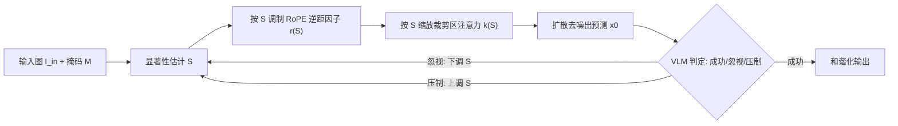

## 一句话总结

针对"裁剪—粘贴"式的显式图像编辑，本文提出无需训练、无需文本提示的 LooseRoPE：用显著性图调制扩散 Transformer 中的旋转位置编码（RoPE）与注意力权重，让粘贴物在保持身份的同时与新场景语义融合。

## 研究背景

- 领域现状：扩散模型驱动的图像编辑近年进展显著，主流做法是靠自然语言指令引导（如 InstructPix2Pix、FLUX Kontext），交互直观。
- 核心痛点：文本控制天生"粗"——物体的确切位置、形状、外观细节难以用语言精确表达。若改用直接"裁剪—粘贴"的显式编辑，又会遇到一个根本矛盾：既要保住粘贴物的身份（identity），又要让它和新语境协调（harmonization）。传统的图像和谐化方法只做像素级/光照级的颜色调整，无法完成语义或结构层面的调整；而指令式编辑模型难以平衡两个目标，会出现两种失败：一是"忽视"（neglect），粘贴区几乎不被改动；二是"压制"（suppression），粘贴物直接消失。
- 本文 idea：作者发现注意力图本身就决定了某个区域是被"从输入图复制"还是被"改动以求协调"——忽视源于注意力过于局部，压制源于注意力过于弥散。于是提出用显著性图连续地调制注意力"视野范围"，把这两种模式之间的过渡变成一个可控的滑杆，作者称之为"语义和谐化"（semantic harmonization）。

## 方法

### 整体框架

方法建立在 FLUX Kontext 这类基于 RoPE 的扩散 Transformer 编辑模型上。输入是一张"底图 + 粗糙粘贴的裁剪块"的图像 $$I_{in}$$ 和标记粘贴区的二值掩码 $$M$$。核心是在推理时，对"输出图中位于粘贴区的 query"与"输入图的 key"之间的注意力做两阶段调制：先按显著性放松 RoPE 的位置约束，再按显著性缩放注意力权重，另配一个视觉语言模型（VLM）做参数自动纠偏。全程无需训练、无需文本描述。

### 关键设计

1. 显著性估计。作者要一张能"突出五官、物体细节等区分性特征，抑制冗余纹理和背景"的图。做法是取一个预训练实例检测网络若干高分辨率早期层的特征，对每层算特征范数图 $$S_l = \lVert F_l \rVert_2$$，上采样后跨层平均得到 $$S = \frac{1}{L}\sum_{l=1}^{L}\mathrm{Interp}(S_l)$$。若裁剪来自同一张图、留下空洞，则空洞处显著性置零。这张图作为后续注意力调制的空间权重。

2. RoPE 的"松绑"（LooseRoPE 得名于此）。标准 RoPE 把位置坐标 $$m$$ 编码成一系列不同频率的 2D 旋转 $$v'_d = e^{i(\theta_d m)} v_d$$。作者引入一个逆距因子 $$r \in [0,1]$$ 缩放位置坐标：$$v'_d = e^{i(\theta_d r m)} v_d$$。当 $$r < 1$$ 时，token 之间的有效空间距离被压缩、彼此在位置空间中"更近"，从而拓宽 query 的注意力视野。给每个粘贴区 query 赋一个随显著性单调递增、上界为 1 的 $$r(S(q))$$：低显著性 query 视野放宽、更多吸收周边语境以求融合；高显著性 query 保持局部、锁住细节与身份。这样就在"语义适配"和"结构保真"之间实现平滑过渡。

3. 裁剪注意力缩放。仅靠放松 RoPE 会有副作用：显著区可能因视野变大而丢身份，掩码内的大片背景又可能因注意力被拉到远处而融合不足。为此再引入一个裁剪注意力因子 $$k(S(q)) \in [k_{low}, k_{high}]$$，对落在裁剪掩码内的 key 所对应的注意力权重做缩放。高显著性 query 得到更强的缩放（趋近 $$k_{high}$$），低显著性趋近 $$k_{low}$$。去噪早期令 $$k_{high} > 1$$，加强显著区对输入图对应区域的注意力以防压制；随去噪推进 $$k_{high}$$ 逐渐回到 1，让其平滑融入场景。$$r(\cdot)$$ 与 $$k(\cdot)$$ 都用 tanh 型映射实现，保证显著与非显著 query 之间平滑且高对比的调制。

4. VLM 参数纠偏。注意力调制虽稳健，但小裁剪块易被压制、背景差异大的裁剪块易被忽视，手动调参又会牺牲跨样本的普适性。作者观察到忽视/压制的迹象会在预测的清晰图 $$\hat{x}_0$$ 早期就显现，于是在若干采样步后用 VLM 把当前状态分类为成功、忽视或压制：判为忽视就下调显著性图，判为压制就上调并截断到 1.0，然后带着更新后的图重启扩散，循环直到 VLM 报成功或达到最大尝试次数。

## 实验结果

作者指出已有和谐化/合成基准只考察外观级一致性，layout/reference 类基准又常改变物体姿态结构，都不契合本任务，故自建了一个含 150 组多样化组合（合成与自然图、跨图与同图裁剪、含子物体级编辑）的新基准。评测沿两个互补维度展开：图像质量用无参考的 CLIP-IQA，身份保持用 LPIPS（整图与裁剪前景两种）。

除自动指标外，作者做了两选一强制选择的用户研究：27 名用户、每人 20 题、每类 540 份回答，从身份保持、融合、放置、总体四个维度比较。下表为本文方法相对各基线的胜率（%）：

| 基线 | 身份保持 | 融合 | 放置 | 总体 |
|------|------|------|------|------|
| AnyDoor | 66.07 | 58.93 | 66.96 | 63.39 |
| SwapAnything | 63.39 | 50.89 | 67.86 | 55.36 |
| TF-ICON | 74.23 | 74.23 | 75.26 | 81.44 |
| Kontext | 59.82 | 65.18 | 65.18 | 65.18 |

本文方法在全部四个维度上都优于所有基线。自动指标上，方法取得较高的 CLIP-IQA 同时维持适中的 LPIPS，体现了质量与身份保持之间的平衡——作者强调，过低的整图 LPIPS 往往是"忽视"（没真正融合）而非真正的高保真。消融显示三大组件缺一不可：去掉注意力缩放会导致编辑内容溢出预期区域（空间漂移），去掉 RoPE 缩放或 VLM 控制则导致部分乃至完全的融合忽视。方法还被验证可迁移到另一 RoPE-based 编辑骨干 Qwen-Image-Edit（"Ours-Qwen"），并可迭代地做多次裁剪—粘贴。

## 亮点与局限

- 亮点：
  - 训练无关、提示无关，即插即用于 RoPE-based 的扩散 Transformer 编辑模型，且跨骨干可迁移。
  - 把"身份保持 vs 语义融合"这一矛盾巧妙地映射到 RoPE 位置约束的松紧上，用显著性把注意力视野连续地当滑杆控制，视角新颖、可解释。
  - VLM 闭环纠偏把易失败的极端样本也拉回成功，减少了手动调参负担。
- 局限：
  - 作者明确表示方法侧重语义与结构一致性，牺牲了细粒度光照调整，因此在纯光照/色调匹配上不如传统和谐化方法。
  - 依赖 FLUX Kontext 等生成先验与预训练检测网络的特征，其能力与偏差会传导到结果。
  - VLM 循环需要多轮扩散重启，带来额外推理开销；评测基准为作者自建（150 组），规模有限。

## 延伸思考

- "让注意力视野随图像内容自适应，而非被外部提示驱动"这一思路，指向更通用、更可解释的视觉控制形式——把注意力本身当作细粒度生成的媒介，值得推广到其他编辑/生成任务。
- 作者提出的未来方向包括扩展到视频（物体插入的时序一致性）、单场景内多个相互关联的裁剪块（复杂组合交互），以及让模型基于对自身注意力机制的理解去自动识别并纠正不一致。
- 与同组一系列注意力调控工作（如 Bounded Attention、Be Decisive）一脉相承，都是在"操纵扩散模型内部注意力"这条线上做文章，可对照阅读理解其方法论演进。
