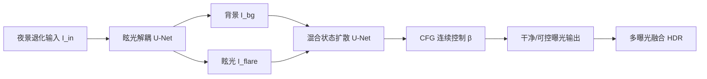

## 一句话总结

LUCID 用一个统一的扩散框架，把夜景照片里"眩光/耀斑"与"欠曝/噪声"这两类纠缠在一起的退化一起处理，并通过四模式训练 + CFG 引导，让用户连续可控地调节曝光、决定是否保留光源，还能从单张图重建 HDR。

## 研究背景

- 领域现状：低光增强（LLIE）和镜头眩光去除（flare removal）各自都有较成熟的深度学习方法，扩散模型也已被广泛用作图像修复的生成先验；合成眩光数据集（如 Flare7K）让眩光可以按加性成分建模、灵活合成训练数据。
- 核心痛点：现有方法把 LLIE 和去眩光当成两个独立问题，忽视了二者在物理上是耦合的。简单地把去眩光模型和增强模型级联会不稳定——第一步残留的微弱眩光被黑暗掩盖，到增强阶段又被放大成严重伪影。此外真实夜景成对数据稀缺、现有数据集场景单一，且大多数框架是黑盒、缺乏让用户调节亮度与可见度的控制手段。
- 本文 idea：把夜景修复重新定义为一个"连续、可控的过程"而非一次性的固定校正。先显式地把眩光从场景内容中解耦出来作为结构先验，再用扩散模型协同地恢复干净、曝光良好的图像，并通过专门设计的训练模式让曝光和光源保留成为两个可连续调节的维度。

## 方法

整体框架：LUCID 从 Retinex 成像模型出发，把夜景成像写成 $$I = R \cdot L + F$$，其中 $$R \cdot L$$ 是干净背景（反射率乘光照），$$F$$ 是眩光/鬼影造成的加性杂散光。它先用一个轻量 U-Net 做"眩光解耦"，再把解耦出的背景与眩光成分送入一个"混合状态扩散"模块协同重建，最后借助分类器无关引导（CFG）实现连续可控的曝光与光源调节。

关键设计：

1. 眩光解耦（Flare Disentanglement）。利用眩光具有强空间连贯性（平滑光晕、结构化鬼影）的观察，用一个共享编码器 + 两个并行解码器的 U-Net，把输入拆成眩光成分 $$I_\text{flare}$$ 和背景成分 $$I_\text{bg}$$。两个解码器前若干层共享权重、之后分叉，并在分叉首层的特征上施加正交约束 $$L_\text{ortho} = \lVert F^k_\text{bg} \odot F^k_\text{flare} \rVert_2^2$$ 强制互斥；再加重建约束 $$L_\text{recon} = \lVert (I_\text{flare} + I_\text{bg}) - I_\text{in} \rVert_2^2$$ 保证自洽。背景直接代表 $$R \cdot L$$，作为后续修复的可靠结构先验。

2. 四模式混合状态扩散（Four-Mode Mixing-State Diffusion）。借鉴多视图扩散思路，把修复看作由双先验驱动的重建 $$\{I_\text{main}, I_\text{ref}\} \to I_\text{out}$$。两路输入经共享 VAE 编码进隐空间后，沿"状态维"拼接成 $$z \in \mathbb{R}^{B \times 2 \times C \times H \times W}$$，再重排把状态维塞进空间维做自注意力，从而让网络在统一去噪过程中显式关注参考状态提供的结构/眩光线索。这就是把两类退化"表示上解耦、求解上协同"的关键。

3. 基于 CFG 的连续控制。作者设计四个训练模式来支撑两个正交维度。曝光维：正模式用背景 $$I_\text{bg}$$ 作主输入、原始夜景 $$I_\text{in}$$ 作参考、目标是无眩光良曝图 $$I_\text{enh}$$；负模式把参考换成眩光 $$I_\text{flare}$$、目标设为欠曝图 $$I_\text{sup}$$。这两端定义了曝光控制谱的两个端点。光源维：给每个曝光模式加"保留/抑制光源"的子配置，用 Flare7K 协议合成干净光源图 $$I_\text{enh+l}$$、$$I_\text{sup+l}$$，并用文本提示词 "light source" 触发这一语义调制。推理时通过标量 $$\beta$$ 在负解与正解间连续插值 $$\hat{z} = z_\text{neg} + \beta(z_\text{pos} - z_\text{neg})$$，调 $$\beta$$ 加开关提示词即可从激进去眩光平滑过渡到保留光源。训练用的扩散损失综合了像素级、感知（LPIPS）与复用解耦网络编码器得到的内在特征损失 $$L_\text{diff} = L_\text{intri} + L_2 + L_\text{LPIPS}$$。

4. 单图 HDR 重建。既然 CFG 能连续调曝光，就能从单张夜景合成一组"虚拟曝光包围"序列，再用拉普拉斯金字塔融合 + 质量感知加权把它们融成亮度分布均衡、光源表现自然的 HDR 结果。

## 实验结果

作者用 SD-Turbo 作扩散骨干，训练数据取自 RELLISUR、LSRW、SICE、SID 等真实低光数据集，用 Flare7K 的物理眩光合成管线制造退化输入，在单张 A800 上以 512×512 训练。评测覆盖三个任务：ExDark 上的通用夜景增强、Flare7K 上的眩光去除、SiHDR 上的单图 HDR；由于真实夜景没有唯一的"正确亮度"，主实验用无参考图像质量指标（越高越好）。

在 ExDark 子集（1271 张）上的无参考画质对比（固定 $$\beta = 1.05$$）：

| 方法 | CLIPIQA↑ | MANIQA↑ | MUSIQ↑ | LIQE↑ | NIMA↑ |
|------|----------|---------|--------|-------|-------|
| ExDark（原图） | 0.4281 | 0.2939 | 50.99 | 2.267 | 5.227 |
| Zero-DCE | 0.4243 | 0.2899 | 50.98 | 2.078 | 4.999 |
| Retinexformer | 0.3749 | 0.2588 | 52.26 | 2.058 | 5.121 |
| Reti-Diff | 0.4159 | 0.2867 | 50.91 | 1.967 | 5.083 |
| DarkIR | 0.4107 | 0.3078 | 52.03 | 2.076 | 5.046 |
| 本文（β=1.05） | 0.4774 | 0.3264 | 61.45 | 3.019 | 5.390 |

LUCID 在全部五个指标上都居首，其中 MUSIQ、LIQE 提升尤为明显。定性上：面对极暗、强高对比、逆光眩光、色偏四类夜景，基线常出现噪声放大、局部过曝、穿不透眩光、盲目增强单一色调等典型失败，而 LUCID 抑噪、压缩动态范围恢复高光纹理、纠色更自然。眩光去除任务中，专用去眩光基线要么残留条纹光晕、要么在光源周围过度扣除产生生硬边界，LUCID 则能重建自然的光源衰减，结果偶尔优于 GT。控制性方面，统计显示曝光值增量 ΔEV 对 $$\beta$$ 呈单调近线性响应（$$\beta \in [0.25, 1.5]$$ 内结构保持稳定），与朴素全局提亮、级联管线、纯文本商用 GenAI 相比，LUCID 兼顾生成保真度与用户可控性。HDR 任务中相比 IntrinsicHDR、LEDiff、GasLight，LUCID 避免了阴影压死、生成幻觉、颜色漂移和错误放大眩光等问题。

## 亮点与局限

- 亮点：
  - 抓住了夜景退化"眩光与欠曝物理耦合"的本质，用"表示上解耦、求解上协同"的框架统一处理，而非把两个模型危险地级联。
  - 用四模式训练把曝光和光源保留变成两个连续可调的维度，借 CFG 的标量 $$\beta$$ 和一个 "light source" 提示词就能连续控制，赋予创作者细粒度的可控性。
  - 单图即可合成虚拟曝光序列做 HDR，且能作为图像编辑/生成流程的即插即用前处理或后处理模块。
  - 真实夜景评测用无参考指标并配合大量定性对比，贴合"无唯一 GT 亮度"的实际。

- 局限：
  - 依赖生成先验，幻觉是当前生成模型难以回避的问题；极暗场景下作者选择保守、可控的重建而非激进补细节，本质上牺牲了部分细节恢复能力。
  - 主实验以无参考感知指标为主，缺少像素级保真度的成对量化，重建"好看"与"忠实"之间的界限较难界定。
  - 训练用的退化夜景是通过在低光图上叠加合成眩光得到的，真实世界更混沌的眩光/散射模式与合成分布之间可能存在差距。

## 延伸思考

把"修复"重新框定为"连续可控生成"是这篇最有意思的视角——它和一批用 CFG 做保真度/真实度权衡的扩散修复工作（DiffBIR、SeeSR、SUPIR 等）一脉相承，但把控制轴换成了物理上有意义的曝光与光源维度，更贴近摄影师的创作直觉。值得追问的是：$$\beta$$ 的线性 ΔEV 响应在更极端的动态范围或多光源冲突场景是否仍成立；解耦出的眩光图能否进一步用于可编辑的"眩光风格迁移"（把某部电影的各向异性眩光签名迁到别的镜头）；以及在缺乏成对 GT 时，如何设计更能区分"忠实重建"与"合理幻觉"的评测协议。
