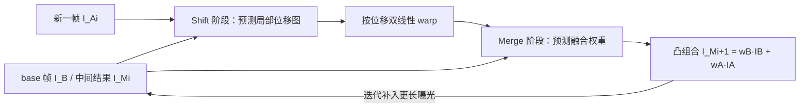

## 一句话总结

LuckyHDR 借鉴天文摄影里的"幸运成像"思路，用极轻量的对齐+融合网络把手持拍摄的多曝光 RAW 序列逐帧对齐再凸组合，每个输出像素都只是输入像素的加权平均，从而在手机上得到高动态范围图像而不产生"幻觉"伪影。

## 研究背景

- 领域现状：人眼可感知约二十档动态范围，而手机传感器受限于小尺寸，只有约十二档。多帧曝光包围（bracketing）、单帧 HDR 预测、特殊传感器等方法各有进展，实践中手持拍摄大约能扩展 3–5 档。
- 核心痛点：传统对齐-融合方法在极暗和极亮两端都吃力；近来的深度 HDR 方法（直接回归像素、或用扩散生成先验）容易在近饱和区和遮挡边缘产生幻觉纹理与鬼影，且计算量大、难以在手机上实时运行。
- 本文 idea：不直接"合成"像素，而是让网络只预测局部位移和融合权重，最终图像限定为观测像素的凸组合。核心洞见是每个区域只需要一两个"幸运"曝光良好的像素就能估计该处颜色；这样从设计上杜绝了幻觉，也让网络可以做得非常小。

## 方法

整体框架是一个"逐帧迭代的对齐-融合"流水线：从最短曝光帧（base frame）出发，把后续每一帧依次对齐到当前融合结果上，再预测融合权重合成新的中间结果，如此从短曝光到长曝光逐步补入中间调与阴影细节。对齐模块和融合模块的权重在所有迭代中共享，因此能处理任意长度的输入序列且无需按帧数重训。

关键设计分四点：

1. **图像形成与"幸运像素"假设**：单像素记录值建模为 $$V = \mathrm{round}(\min(A(p(I\Delta t) + \eta(\sigma)), T))$$，其中包含泊松散粒噪声与高斯读噪声、增益 $$A$$ 与阱容 $$T$$。任一像素在某些帧欠曝有噪、在另一些帧过曝被裁剪，但跨整个曝光序列，总有一个或几个"幸运"的良好曝光样本可用来合成该处颜色。

2. **曝光归一化 + 曝光不变对齐特征**：先把 RAW 减黑电平、除有效量程、做轻量高光恢复映射到线性 sRGB，再用全局 tone 曲线 $$T_\mu(x) = \log(1+\mu x)/\log(1+\mu)$$ 压缩强度。对齐用的特征 $$\phi(I)$$ 由归一化 tone-map RGB 与亮度梯度幅值拼成 4 通道，对曝光差异不敏感。

3. **由粗到细的位移预测**：把 $$\phi(I_A), \phi(I_B)$$ 及其差拼成 12 通道输入，先在 $$1/d$$ 分辨率预测一个有界粗位移（用 $$\tanh$$ 加固定缩放约束幅度），上采样后再预测有界残差细化。默认 $$d=4$$、粗阶段可容忍全分辨率约 52 像素位移，细阶段上限 6 像素，符合曝光归一化后"小运动"的假设。

4. **凸组合融合**：融合网络是三层轻量 CNN，输入是 base 帧与 warp 后帧的强度加 gamma 空间亮度线索，输出两通道 logit 经 softmax 得到非负权重，最终在线性空间做逐像素凸组合 $$I_{\text{merged}} = w_B \odot I_B + w_A \odot I_A^{\triangle}$$。权重再按 warp 有效性掩码 gate 并重归一化，保证输出恒为有效输入像素的凸组合——这正是"不产生幻觉"的结构性保证。整条流水线仅在合成数据上训练：从干净 HDR 图重曝光、加空间变化噪声、合成局部运动前景与全局手抖模糊，构造出贴近真实手持包围拍摄的训练分布。

## 实验结果

在带真值的合成数据上，LuckyHDR 用最少的参数（66K，比 HDRFlow 少约 50×，比其它深度基线少 17× 以上）取得了最好的整体质量，尤其在 HDR-VDP2 感知指标上领先。下表为曝光步长 3 EV 设置下的主对比（PSNR 越高越好、LPIPS 越低越好、ITPI 为单图推理耗时）：

| 方法 | 参数(K) | ITPI(ms) | PSNR_l↑ | PSNR_μ↑ | HDR-VDP2↑ | LPIPS↓ |
|------|--------|---------|---------|---------|-----------|--------|
| LuckyHDR | 66 | 62 | 50.2 | 36.5 | 43.7 | 0.107 |
| HDRFlow | 3270 | 61 | 47.9 | 35.0 | 38.6 | 0.120 |
| SAFNet | 1120 | 208 | 46.4 | 32.4 | 33.8 | 0.164 |
| AHDRNet | 1520 | 504 | 40.4 | 32.2 | 30.0 | 0.305 |
| HDR-Trans. | 1220 | 9371 | 37.9 | 31.8 | 36.4 | 0.253 |
| HDR+ | 0 | 8 | 44.1 | 28.4 | 30.6 | 0.338 |

其它关键结论用文字补充：把 HDRFlow/SAFNet 官方权重（/p 行）换成在本文合成数据上重训后，鬼影和高光幻觉大幅减少，说明起决定作用的是训练数据分布而非网络本身；但直接回归像素的方法仍会过度平滑纹理或幻觉出边缘，而 LuckyHDR 因凸组合设计规避了这两类失败。运行时上，$$512^2$$ 分辨率每次融合仅 7 ms（比 HDR-Transformer 快约 160×），在 $$4096^2$$ 下 Transformer 类方法因显存超限无法输出，而 LuckyHDR 仍可运行；iPhone 17 Pro Max 上单次迭代 $$512^2$$ 用 NPU 仅 8.33 ms。消融还确认了选最短曝光作 base 帧最优、以及运动/模糊/噪声增强对真实泛化不可或缺。

## 亮点与局限

- 亮点：
  - 凸组合的结构性约束从设计上杜绝了幻觉，可解释、可信；
  - 网络极小（66K）且与序列长度解耦，能处理 3–9 帧、跨 20+ 档，真正适合手机端交互式部署；
  - 完全用合成数据训练即可零样本泛化到多款相机的真实 RAW，还能反过来提升其它 SOTA 方法。
- 局限：
  - 对低纹理区域的大幅局部运动（快速行人/车辆，如 80 像素位移）会失败并产生鬼影，作者明确将其排除在"夜间模式式的刻意静止拍摄"范围之外；
  - 未建模若干手机 ISP 效应（曝光相关 PSF 变化、光源周围的 veiling glare）；
  - 假设整个包围序列 ISO 固定，联合调 ISO 与曝光可能进一步扩展动态范围。

## 延伸思考

- 该方法与 HDR+、multi-frame burst denoising 一脉相承，但把"融合"从直接回归改成受约束的凸组合，是把生成式方法"拉回测量驱动"的一个干净范式；这种"只预测权重/位移、绝不凭空造像素"的思路可迁移到去噪、超分、去模糊等对保真度敏感的低层视觉任务。
- 处理大位移的自然扩展是先用基于特征的单应对齐把大位移压到网络可处理的小残差（约 8 像素），再交给现有对齐网络——本质是"经典几何 + 轻量学习"的混合。
- 完全依赖合成数据训练却能泛化到真实 RAW，提示合成数据的"退化建模保真度"往往比网络容量更关键，值得在其它计算摄影任务中借鉴。
