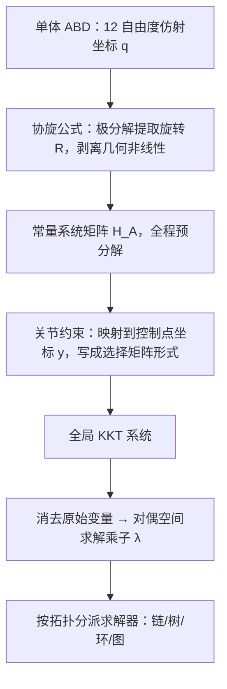

## 一句话总结

本文提出 M-ABD：用仿射体（ABD）坐标 + 协旋（co-rotated）公式把每个刚体的系统矩阵变成常量并预分解，再把复杂多体系统的关节约束用 KKT 精确投影到最小自由度的对偶空间求解，从而在单线程 CPU 上稳定、交互式地模拟包含上百万连杆的大规模铰接系统。

## 研究背景

- 领域现状：铰接多体系统（机器人臂、链条、树木、布料状网格）广泛存在于图形、机器人与控制。传统刚体动力学（RBD）用 6 自由度表示每个刚体，但空间坐标与旋转参数之间是非线性关系；一旦要用 KKT 精确施加关节约束，时变的约束雅可比就导致系统矩阵每步都在变。仿射体动力学（ABD）把每个刚体扩到 12 自由度，用线性映射替代非线性旋转，雅可比对空间坐标保持常量。
- 核心痛点：现有 RBD 多体方法要么用显式积分配极小时间步、要么用罚方法近似约束，规模一大就丢失约束、数值失稳、约束漂移；而 ABD 虽然雅可比是常量，但刚度带来的材料非线性仍要求每次牛顿迭代都重新组装并分解系统矩阵，加上 12 自由度比 6 自由度更贵，一直被认为不如 RBD 可扩展。
- 本文 idea：抓住一个关键观察——高刚度会压制本构（材料）非线性，真正的难点只剩几何非线性，而几何非线性恰好可以用协旋公式剥离。把旋转分量提取出来后，单体 ABD 的系统矩阵变成常量、可全程预分解（即使用隐式积分）；在此基础上把所有常见关节推广到仿射坐标，用 KKT 精确施加，并把问题压到最小自由度的对偶空间高效求解。

## 方法

整体框架：先为单个仿射体构造一个协旋、可预分解的常量矩阵求解器（M-ABD 的基石）；再把各类关节约束统一表达在"控制点"坐标上，组装成全局 KKT 系统；然后消去原始变量、在维度小得多的对偶空间求解拉格朗日乘子；最后针对链、树、环、图等不同关节拓扑分别设计专用高效求解器。

关键设计：

1. 协旋公式让 ABD 系统矩阵变常量。ABD 的非线性源自"旋转不变"的刚性材料，而在多体场景里各刚体几乎不变形，小变形先验意味着切向刚度矩阵可近似为 $$\tilde{\boldsymbol{K}} = \operatorname{diag}_N(\boldsymbol{R})\,\bar{\boldsymbol{K}}\,\operatorname{diag}_N(\boldsymbol{R}^\top)$$，其中 $$\boldsymbol{R}$$ 由当前仿射坐标极分解得到。利用"空间坐标与广义坐标同步协旋"这一性质，广义刚度阵可写成 $$\boldsymbol{K}_A = \operatorname{diag}_4(\boldsymbol{R})\,\bar{\boldsymbol{K}}_A\,\operatorname{diag}_4(\boldsymbol{R}^\top)$$，广义质量阵同样旋转不变。于是单体系统 $$\bar{\boldsymbol{H}}_A\,\operatorname{diag}_4(\boldsymbol{R}^\top)\,\delta\boldsymbol{q} = \operatorname{diag}_4(\boldsymbol{R}^\top)\boldsymbol{f}_A$$ 里的 $$\bar{\boldsymbol{H}}_A = \tfrac{1}{h^2}\boldsymbol{M}_A + \bar{\boldsymbol{K}}_A$$ 是常量、只需分解一次。作者进一步用线性弹性材料并可跳过极分解、改用一次归一化近似旋转，使单步只剩轻量的 BLAS 1/2 级运算。基准测试里协旋 ABD（27–34 毫秒）比原始隐式 ABD（161 毫秒）快数倍，甚至快过显式 RBD。

2. 用控制点坐标把关节约束线性化。把仿射坐标 $$\boldsymbol{q}$$ 重参数化为一个"控制四面体"四个控制点的空间坐标 $$\boldsymbol{y} = \boldsymbol{T}\boldsymbol{q}$$（$$\boldsymbol{T}$$ 常量、可逆）。在控制点坐标下：球关节退化成点点重合约束（3 自由度、线性）；铰链关节可写成 6 自由度边边对齐（线性），也可在局部坐标里压到 5 自由度的更紧凑（非线性）形式；万向节是两个铰链的叠加，可用 12 自由度或压缩到 4 自由度；移动关节用 5 自由度。作者对"线性/非线性"的取舍原则是——相比线性性，更看重约束秩最小化，因为更小的秩直接给出更小的对偶矩阵。

3. 对偶空间 KKT 消元。$$M$$ 个连杆、$$K$$ 个关节的全局 KKT 系统里，块对角 Hessian $$\tilde{\boldsymbol{H}}$$ 已逐体预分解。消去原始增量 $$\delta\tilde{\boldsymbol{q}}$$ 后得到对偶系统 $$\big(\nabla\tilde{\boldsymbol{C}}\,\tilde{\boldsymbol{H}}^{-1}\nabla^\top\tilde{\boldsymbol{C}}\big)\,\delta\tilde{\boldsymbol{\lambda}} = \nabla\tilde{\boldsymbol{C}}\,\tilde{\boldsymbol{H}}^{-1}\tilde{\boldsymbol{f}}_A$$。对偶维度是各关节秩之和 $$\sum_k C_k$$，通常远小于 $$12M$$，且对偶矩阵块稀疏（两关节共享同一刚体时才有非零块）。因为 $$\boldsymbol{R}\approx\boldsymbol{A}$$，约束近似成 $$\tilde{\boldsymbol{q}}$$ 的二次函数、其梯度是线性的，构造对偶矩阵很快。多数场景一次牛顿迭代就能把约束满足到设定容差。

4. 按拓扑分派的专用求解器。链结构（$$M-K=1$$）给出块三对角对偶矩阵，用块 Thomas 算法 $$O(K)$$ 线性时间求解；树结构提出 ABD-ABA（把 Featherstone 铰接体算法搬到仿射坐标），叶到根做铰接惯量凝聚、根到叶回代局部 KKT，并证明 ABD 坐标下陀螺项自动抵消、无需显式补偿；闭环用 Schur 补处理"断环"低秩子系统；一般关节图则用双向块 Gauss-Seidel 沿多条预定义链逐关节松弛。

## 实验结果

主实验是与主流商用/学术多体求解器在球关节网上的鲁棒性与效率对比（$$10\times10$$ 网、280 连杆，时间步 $$h=1/30$$ 秒）。下表对比各方法达到"稳定且约束满足"所需的迭代数、单步耗时与结果质量：

| 方法 | 每步迭代 | 约束满足 | 单步耗时 | 结果 |
|------|---------|---------|---------|------|
| 本文 M-ABD | 1 | 精确满足 | < 1 毫秒 | 稳定、几何保持 |
| VQ（四元数约束刚体） | 全局牛顿 | 精确满足 | ≈ 27–30 毫秒 | 高质量但大规模不可行 |
| MuJoCo（等式约束） | 30 | 关节可见缝隙 | — | 约束不达标 |
| Bullet | 30 | 关节可见缝隙 | — | 约束不达标 |
| PhysX | 10 | 关节可见缝隙 | — | 约束不达标 |

其余实验用文字概述：单体基准（旋转盒、T 形手柄的中间轴翻转、重陀螺的进动章动、物理摆的椭圆积分解析解）验证协旋 ABD 与隐式 RBD 及解析参考高度吻合，且对时间步更不敏感、快 30% 以上。大规模场景包括 100 万+ 连杆的巨型滑轮系统（$$h=10^{-2}$$ 秒、单迭代、单线程约 904 毫秒/步）、$$100\times100$$ 关节网、柳树/梨树（21K/29K 连杆、约 20 毫秒/步）、11.7K 连杆的"斗篷"网格随人体运动、27 个布娃娃落网、720 个混合关节体堆叠、与 Neo-Hookean Armadillo 的 FEM 强耦合，以及机器人抓取-放置与 SARS-CoV-2 蛋白骨架构象重建等跨领域应用；在这些例子中 MuJoCo、Bullet、PhysX 大多发散或失败（即便用极保守的 $$h=10^{-4}$$ 秒）。

## 亮点与局限

- 亮点：
  - 洞察准——把"刚性材料非线性"与"几何非线性"分离，用协旋公式把 ABD 从"每步重分解"变成"一次预分解"，反过来让 12 自由度的 ABD 比 6 自由度 RBD 还快。
  - 关节体系完整：球/铰链/万向/移动关节都在仿射控制点坐标下给出线性或最小秩非线性表达，并配套链/树/环/图四类专用求解器。
  - 可扩展性与鲁棒性突出：百万级连杆、大时间步、单次迭代、单 CPU 线程仍稳定并精确满足约束，商用引擎在同等设置下普遍失败。
- 局限：
  - 只对等式（关节）约束用 KKT 精确处理；不等式约束（碰撞屏障）会在原始矩阵引入非线性非对角项，破坏逐体预分解优势，尚未纳入统一的原始-对偶框架。
  - 求解在 CPU 上用牛顿法，大规模分子等场景仍需 GPU 求解器进一步加速（作者列为未来方向）。
  - 对"高刚度、近刚性"这一小变形先验有依赖，柔性材料并非其目标场景。

## 延伸思考

M-ABD 本质上是把 IPC/ABD 一系的"优化式时间积分 + 仿射坐标"与经典机器人学的 Featherstone 铰接体算法在同一套仿射广义坐标下打通：既拿到 ABD 的常量雅可比与欧氏轨迹（利于接触/CCD），又拿到 ABA 的连通度线性复杂度。值得追问的是不等式约束的纳入——作者提到要"激活"正确的原始自由度（等价于主动集/pivot 策略），这与 IPC 的屏障能量如何在预分解框架下共存是关键难点。另一个自然延伸是把对偶块 Gauss-Seidel 与 ABD-ABA 搬上 GPU，用于蛋白构象、具身智能大规模并行数据合成，这也正是论文反复强调的目标应用场景。控制四面体使 ABD 天然是"单元素 FEM"，与体弹性无缝耦合，这一点对刚柔混合仿真管线尤其有价值。
