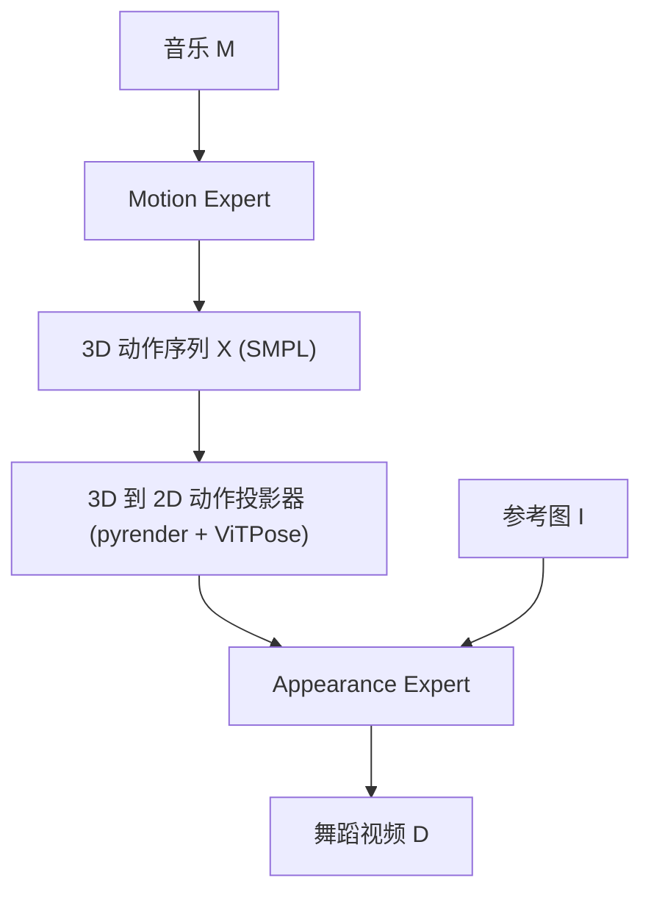

## 一句话总结

本文提出 MACE-Dance，一个级联专家（cascaded Mixture-of-Experts）框架：先用 Motion Expert 把音乐生成 3D 舞蹈动作，再用 Appearance Expert 结合参考图把动作渲染成高保真舞蹈视频，用 3D 动作作为两个专家之间的中间桥梁，从而同时兼顾动作的运动学合理性与视觉外观的时空一致性。

## 研究背景

随着在线舞蹈视频平台的兴起与 AIGC 的快速发展，音乐驱动的舞蹈视频生成成为一个有吸引力的研究方向。它面临两大核心挑战：一是要生成既运动学合理又富有艺术表现力的舞蹈动作；二是要保证高保真的视觉外观与强时空一致性。

已有工作难以直接迁移到这一任务：

- 音乐驱动的 3D 舞蹈生成（GAN、自回归、扩散三大流派）只关注动作本身，忽略了作为艺术形式核心的视觉外观。由 3D 动作渲染出的 2D 视频往往缺乏真实的人-场景交互与细腻纹理，视觉质量欠佳。
- 姿态驱动的人物图像动画能产出高质量外观，但姿态设计这一最耗时环节仍需手工完成，难以直接服务于舞蹈视频生成。
- 语音驱动的说话人头像生成主要处理相对简单的上半身手势，无法应对舞蹈所需的复杂全身运动。
- 现有的少量音乐驱动舞蹈视频生成方法（如从音乐预测 2D 关键点再驱动图像动画）没有捕捉舞蹈内在的 3D 属性，导致动作质量与视觉外观都打了折扣，且难以处理肢体遮挡与复杂全身移动。

作者由此提出用级联专家把任务解耦：动作语义与视觉外观分开学习，并用显式 3D 动作作为可解释的中间接口。

## 方法

### 整体框架

给定音乐 $$M \in \mathbb{R}^{T \times C_m}$$ 与参考图 $$I \in \mathbb{R}^{H \times W \times 3}$$，目标是合成舞蹈视频 $$D \in \mathbb{R}^{T \times H \times W \times 3}$$。MACE-Dance 采用级联 MoE：Motion Expert 把音乐转成 3D 动作序列 $$X \in \mathbb{R}^{T \times C_x}$$，Appearance Expert 再用该动作与参考图驱动视频合成。这种解耦把"音乐直接到视频"的高复杂映射拆成两步，显著降低学习难度，并用显式 3D 表示抑制虚假的跨模态相关性。

作者刻意用 3D 动作（而非 2D 关键点）作为桥梁，原因有三：3D 保留全身几何结构与全局平移旋转，空间保真更高；3D 把姿态与相机视角、主体外观解耦，监督信号更干净；3D 对自遮挡与视角变化更鲁棒。中间表示采用 SMPL 参数（现有 3D 舞蹈方法多聚焦身体级动作，body-level 已足以产生强视觉效果，且框架可扩展到 SMPL-X）。

### Motion Expert：音乐到 3D 动作

生成策略上采用扩散模型（DDPM），前向加噪、反向去噪，直接预测干净动作。关键是用 Guidance-Free Training（GFT）替代传统的 classifier-free guidance（CFG）。CFG 只在推理时组合有条件与无条件预测，容易引入分布错配；GFT 保持相同的最大似然训练目标，但用不同的参数化让单个模型在训练时就隐式表达"温度可控"的采样行为。优化目标定义为

$$x_\beta = \beta \hat{x}_\theta(z_t, t, c, \beta) + (1 - \beta) \operatorname{sg}[\hat{x}_\theta(z_t, t, \varnothing, 1)]$$

其中 $$\varnothing$$ 表示无条件设置，$$\operatorname{sg}$$ 是停止梯度，$$\beta$$ 是同时作为条件输入的温度参数。训练时 $$\beta$$ 与 $$t$$ 分别从 $$U(0,1)$$ 与整数集合中随机采样。为增强物理合理性与美感，损失在重建损失之外还加入 3D 关节损失、速度损失、足部接触损失：

$$\mathcal{L} = \lambda_{rec} \mathcal{L}_{rec} + \lambda_{joint} \mathcal{L}_{joint} + \lambda_{vel} \mathcal{L}_{vel} + \lambda_{foot} \mathcal{L}_{foot}$$

推理用 DDIM 加速，$$\beta$$ 靠近 0 偏高保真、靠近 1 偏高多样，默认设 $$\beta = 0.75$$。GFT 每步只需一次条件计算，理论上比 CFG 快一倍。

架构上采用 BiMamba–Transformer 混合骨干：双向 Mamba 捕捉音乐或舞蹈的模内局部依赖（凭其序列归纳偏置擅长细粒度局部连续性），Transformer 建模跨模态全局上下文。每个去噪块内先经 BiMamba，再用 FiLM 注入融合后的 $$t$$-$$\beta$$ 嵌入，接着 Transformer 做跨模态注意力（动作特征为 query，音乐特征为 key/value）：

$$\text{Attention} = \operatorname{softmax}\!\left(\frac{Q_d \cdot K_m^{T}}{\sqrt{C}}\right) V_m$$

得益于此，Motion Expert 以非自回归方式一次生成整段序列，既提效又避免自回归与 inpainting 方法的曝光偏差问题。

### Appearance Expert：动作与参考图驱动的视频合成

基于 Wan-Animate 构建，但直接迁移到舞蹈视频效果有限（舞蹈的全身协调与动态运镜远比通用视频复杂）。作者提出解耦的 Kinematic–Aesthetic 两阶段微调：

- Projector：把 SMPL 序列先转成 3D 网格，用 pyrender 在固定正面相机下渲染，再用 ViTPose 提取 2D 关键点，衔接下游动画。
- Kinematic 阶段：只微调 Body Adapter，冻结其余部分，强化运动学条件与动作贴合度。作者刻意不新增身体交叉注意力分支，因为那会扰乱预训练归纳偏置、与面部交叉注意力竞争造成特征纠缠，还会带来显存/延迟开销与训练不稳。
- Aesthetic 阶段：冻结运动学通路，在每个 DiT 块的注意力与前馈投影上挂轻量 LoRA 适配器，做面向舞蹈美感的参数高效微调（锐化皮肤、头发、织物纹理，稳定服饰配饰，处理丰富运镜）。LoRA 用低秩分解更新权重：

$$W = W_0 + \Delta W = W_0 + AB$$

## 实验结果

数据集为作者自建的 MA-Data：7 万段 5–10 秒片段（共 116 小时），覆盖 20 多种舞种，由两部分组成。3D 渲染数据（重动作）源自 FineDance，渲染正面视频后滑窗切片得 2 万段（28 小时）；野外互联网数据（重外观）来自 TikTok、YouTube 高热度创作者，经镜头边界检测、光流去静止、单人约束、滑窗切分等多级清洗得 5 万段（88 小时）。另收集 200 段 5 秒片段作测试集。评测采用动作-外观协议：动作维用 ViTPose 提取 2D 关键点后评 FID/DIV（kinetic 与 geometric 两个特征空间）与节拍对齐分 BAS；外观维用 VBench 选一组舞蹈相关指标（成像质量 IQ、美学质量 AQ、主体一致性 SC、背景一致性 BC、运动平滑度 MS、时序闪烁 TF）。

主表为 MA-Data 上音乐驱动舞蹈视频生成的对比：

| 方法 | IQ↑ | AQ↑ | SC↑ | BC↑ | MS↑ | TF↑ | FID(k)↓ | FID(g)↓ | DIV(k)↑ | DIV(g)↑ | BAS↑ |
| --- | --- | --- | --- | --- | --- | --- | --- | --- | --- | --- | --- |
| Ground Truth | 67.12 | 53.51 | 91.86 | 92.97 | 98.20 | 96.88 | – | – | 9.24 | 5.31 | 0.526 |
| Hallo2 | 62.64 | 50.79 | 92.48 | 93.84 | 98.30 | 96.56 | 16.55 | 1.29 | 8.11 | 5.47 | 0.505 |
| WAN-S2V | 64.10 | 50.20 | 92.30 | 93.40 | 98.20 | 96.70 | 18.90 | 1.45 | 7.60 | 5.44 | 0.485 |
| Echomimic-V3 | 63.20 | 49.00 | 91.90 | 93.10 | 98.05 | 96.40 | 19.60 | 1.32 | 7.20 | 4.60 | 0.460 |
| EDGE | 63.05 | 49.70 | 91.79 | 93.30 | 98.64 | 97.10 | 21.77 | 1.39 | 9.08 | 5.74 | 0.498 |
| Lodge | 63.69 | 49.22 | 91.67 | 92.98 | 98.46 | 97.05 | 18.73 | 1.49 | 8.87 | 5.71 | 0.474 |
| MEGA | 66.14 | 49.89 | 92.95 | 94.13 | 97.45 | 96.32 | 18.98 | 1.65 | 8.78 | 5.59 | 0.513 |
| MACE-Dance（本文）| 65.35 | 51.79 | 93.97 | 94.57 | 98.46 | 97.10 | 16.46 | 0.28 | 9.74 | 6.34 | 0.523 |

MACE-Dance 在动作维全部指标最优，在外观维多数指标最优，整体取得 SOTA。子任务上也各自领先：在 FineDance 的音乐驱动 3D 舞蹈生成上 Motion Expert 达 FID(k)=17.83、DIV(k)=10.30、BAS=0.229、FPS=770；在 MA-Data 的姿态驱动图像动画上 Appearance Expert 达 FVD=274.94、SSIM=0.739、LPIPS=0.066、PSNR=22.40。

消融显示：把 BiMamba 换成单向 Mamba 会削弱时序理解、动作趋于平庸；换成纯 Transformer 则丧失非自回归能力，动作坍缩为原地抖动；用 CFG 替代 GFT 各指标小幅下降且推理慢约 1.62 倍。Appearance Expert 去掉 Kinematic 阶段出现运动学错误与运动模糊，去掉 Aesthetic 阶段出现明显重影。2D vs 3D 中间表示的对比表明 3D 在动作生成与最终视频两个层面都持续优于 2D。

## 亮点与局限

亮点：

- 用级联专家把"音乐到视频"解耦为"音乐到 3D 动作"与"动作+参考图到视频"，用显式 3D 动作作可解释中间接口，抑制虚假跨模态相关性。
- Motion Expert 的 BiMamba–Transformer 混合架构兼顾模内局部依赖与跨模态全局上下文，非自回归一次成序列，避免曝光偏差，效率高（FPS 达 770）。
- 引入 GFT 替代 CFG，单次条件计算即可，理论提速一倍，$$\beta$$ 还能作为控制多样性的旋钮。
- Appearance Expert 的 Kinematic–Aesthetic 两阶段解耦微调，先保运动学贴合再保美学质量，避免新增分支扰乱预训练偏置。
- 贡献了大规模 MA-Data 数据集与动作-外观双维评测协议，填补该任务的基准空白。

局限：

- 中间表示采用 body-level 的 SMPL，未建模精细手部（作者称当前 body-level 已足够，需 SMPL-X 与合适数据才能扩展）。
- Appearance Expert 依赖 Wan-Animate 预训练能力，方法性能受基座模型约束。
- 野外数据经多级清洗仍以娱乐性动作为主，专业度有限；长序列生成依赖专门的中继渲染与身份锚定设计来缓解漂移。

## 延伸思考

MACE-Dance 最值得借鉴的是"用显式 3D 表示当作两个生成阶段的接口"这一思路。相比端到端硬学音乐到像素，中间插入一个物理可解释、视角无关的 3D 动作层，既让动作生成能用运动学损失约束，又让视频合成能复用成熟的图像动画基座，把一个难任务拆成两个各有强基线的可解任务。这种"可解释中间表示 + 专家级联"的范式，或许能推广到其他跨模态生成任务（如语音到手语视频、文本到动作视频）。

另一个有意思的点是 GFT 对生成任务的价值：把引导从推理期挪到训练期，既省一半推理计算，又用一个连续温度参数统一了保真-多样的权衡。对动作生成这类既要合理又要有表现力的任务，这种可调旋钮比固定引导强度更实用。而 BiMamba 与 Transformer 的分工（局部连续性 vs 全局乐句结构）也提示，音乐-动作这类强时序、强节奏的模态，混合状态空间模型与注意力可能比单一架构更契合。
