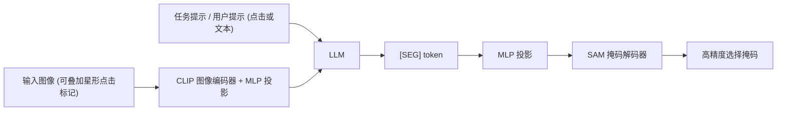

## 一句话总结

MAOAM 用一个"VLM + 分割头"的统一模型，让用户能用点击或文本任意组合，既选物体也选材质，把交互式图像编辑里的选择操作打通成一个界面。

## 研究背景

- 领域现状：交互式图像编辑里，"选择"（生成像素级掩码）是核心操作。近年的分割模型分两派——SAM 系列靠点击/框做交互，VLM 系列（LISA、GLaMM、Sa2VA 等）靠文本做指代分割。另一条线是材质选择（Materialistic、SAMa 等），基于材质相似度把同材质区域一起选出来。
- 核心痛点：现有 VLM 分割方法几乎都是"物体中心"，且通常只支持单一交互方式。材质选择方法又只支持点击，无法表达"所有有光泽的金属""后面那块布料"这类全局或相对语义，也无法区分用户到底想选物体还是材质。单一模态常常不足以消歧——比如厨房里既有陶瓷盘也有塑料盘还有陶瓷锅时，"选盘子"会选进塑料盘，"选陶瓷"会选进锅，只有"选所有陶瓷盘"才对，而这需要在一个模型里对物体和材质联合推理。
- 本文 idea：做一个统一选择框架，同时支持物体级与材质级、点击与文本的任意交互。用 VLM 解读用户意图（选物体还是选材质）并编码视觉属性与空间关系，把信息压进一个 [SEG] token，再交给 SAM 掩码解码器产出高精度掩码。针对"没有带文本标注的材质数据集"这一关键障碍，提出一条可扩展的数据生成流水线。

## 方法

整体框架：给定输入图像，模型接收一个指定选择意图（物体还是材质）的任务提示，外加一个用户提示（点击或文本）。若是点击，就在点击处叠加一个星形标记作为视觉线索。VLM 的 CLIP 编码器把图像特征映射到语言空间，LLM 处理图文特征后吐出一个 [SEG] 分割 token，再由 MLP 投影成掩码解码器的提示，解码出 1024×1024 的稠密掩码。训练用点击选择、文本指代选择、VQA 三个任务的多任务目标。

关键设计：

- 用星形叠加统一点击输入：点击不以坐标 token 形式喂给解码器，而是在图像上叠加一个星形标记，让 VLM 在与其他视觉线索（边界、纹理、上下文）相同的像素空间里推理点击位置。这对材质选择尤其重要，也让点击和文本共享同一套输入接口。作者强调星形只是"易识别、自然图像里罕见"的记号，形状本身不关键（消融里星形叠加优于坐标和边界框）。
- 单 [SEG] token 瓶颈：把选择意图（物体还是材质）、视觉属性（颜色、反射率、粗糙度）、空间关系（"在前面"、点击位置）全部逼进一个 [SEG] 嵌入。这样强迫 VLM 产出一个显式、任务相关的表示，解码器不需要任何额外的人工提示就能直接消费它，把"语言/意图理解"隔离在 VLM 里，把"边界刻画"交给 SAM 的强掩码先验。
- 多任务目标：损失为 $$L(x) = \lambda_1 L_{\text{click}}(x^*_{\text{img}}) + \lambda_2 L_{\text{ref}}(x_{\text{img}}, x_{\text{txt}}) + \lambda_3 L_{\text{vqa}}(x^*_{\text{img}}, x_{\text{txt}})$$ 。点击与文本选择任务都用"token 级交叉熵（语言建模，含 [SEG]）+ 逐像素掩码监督（BCE + DICE）"；VQA 用 token 级交叉熵。点击选择和 VQA 用带星形的图像，文本指代选择用原图，鼓励纯语言驱动的定位。
- 可扩展材质数据生成：现有材质数据集要么没有文本、要么材质分配语义不一致（如"布料做的盘子"）。作者先收集真实与合成的高精度材质掩码——RealMat（约 8K 张 Pexels 图、约 49K 掩码，人工标注）、SynMat（用 Blender 和 132 个 Evermotion 场景渲染语义正确的材质，约 5.5K 图、约 55K 掩码）、以及 SAMa（约 1.3K 图、约 3.3K 掩码）。再用 Qwen3-VL-235B-A22B-Thinking 配合 Set-of-Marks 提示为每个区域生成三类描述（含实体名 / 含空间信息 / 纯材质自述，各 10~50 词共 6 个变体），并用同一模型做验证过滤。VQA 部分构造四选一多选题，含"难负样本挖掘"（把"带黑纹的棕木"改写成"横纹浅木"作为迷惑项），逼模型在文本空间里学到细粒度材质知识。最终混入 RefCOCO/RefCOCO+/RefCOCOg（文本物体选择）与 EntitySeg（点击物体选择），凑成约 190K 训练样本、材质与物体约 1:1。

## 实验结果

主实验是与 SOTA 分割模型在材质与物体选择上的 mIoU 对比（下表取各基准平均意义下的代表数字，均为 mIoU）。MAOAM 在材质选择上大幅领先，同时在物体选择上不逊于甚至超过物体中心的基线，说明联合训练没有牺牲物体能力。

| 方法 | RealMat 文本↑ | RealMat 点击↑ | RefCOCO 文本↑ | EntitySeg 点击↑ |
|------|------|------|------|------|
| MAOAM (本文) | 0.740 | 0.808 | 0.809 | 0.821 |
| Sa2VA | 0.473 | 0.260 | 0.781 | 0.435 |
| GLaMM | 0.349 | 0.185 | 0.616 | 0.364 |
| LISA | 0.332 | 0.129 | 0.732 | 0.209 |
| SAM3 | 0.263 | 0.538 | 0.433 | 0.664 |
| Materialistic | 不支持 | 0.524 | 不支持 | 0.147 |

其余结论用文字概述：

- 文本材质选择上平均 mIoU 比 Sa2VA 高约 67.5%；点击材质选择上比专门做点击材质的 Materialistic 高约 35.5%。
- VQA 上 MAOAM 两个变体都远超 Qwen2.5-VL-7B 和 Sa2VA；且 MAOAM 在更难的 Q2（含难负样本）上反而比 Q1 更好，暗示它真正获得了细粒度材质理解，而基线被相似选项迷惑。
- 涌现的多模态交互：尽管只用单模态提示训练，推理时把文本和点击结合能进一步提升掩码质量，这一行为未经显式监督。
- 消融：验证阶段（尤其对 8B 生成模型）稳定提升指标；混入物体数据不损害材质性能、部分点击结果反而更好；真实与合成数据互补，全量训练最强（较单数据集最高提升约 21.49%）；对提示长度（短/中/长）鲁棒，方差很低；星形叠加优于坐标与边界框。

## 亮点与局限

- 亮点：
  - 首个在物体级与材质级、点击与文本四种组合上统一的 VLM 选择模型，交互界面干净一致。
  - 用星形视觉叠加统一点击输入，避免额外坐标 token 或跨模态模块，架构简单且兼容预训练 LLM 骨干。
  - 一条可扩展的 VLM 材质文本标注流水线，配合 VQA 与难负样本挖掘，解决了"无文本标注材质数据"的根本瓶颈。
  - 出现了未被显式训练的"文本+点击"联合细化的涌现能力，贴近真实编辑场景。
- 局限：
  - 推理能力受 VLM 骨干限制，作者指出可借助思维链等 test-time compute 改善。
  - 掩码质量受 SAM 解码器限制，细节场景（如砖缝里的灰浆、细小三角布片）会失败，可能需要额外的精修模块。
  - 材质掩码数据仍依赖大量人工标注与渲染，合成数据虽互补但需要精心构造语义正确的场景。

## 延伸思考

- 把"意图 + 属性 + 空间关系"压进单个 [SEG] token 的瓶颈设计很干净，但也把可解释性和可控性压缩掉了；若要支持更复杂的多目标、多轮编辑，是否需要多 token 或结构化中间表示值得追问。
- 材质文本描述由大 VLM 自动生成再自我验证，本质上是"用一个 VLM 的知识蒸馏进选择模型"。这条数据流水线的上限受标注模型的材质认知约束，遇到罕见或专业材质时可能系统性偏差。
- 涌现的多模态细化提示：即便只用单模态数据训练，共享像素空间的表示也能在推理时组合模态。这对未来"用廉价单模态数据训练、推理时灵活组合交互"的编辑系统是有启发的方向。
- 与 3D/视频材质选择（SAMa 等）结合后，统一选择接口有望延伸到时序一致的材质编辑与重纹理工作流。
