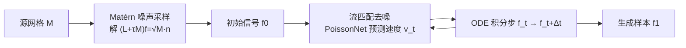

## 一句话总结

本文把流匹配（flow matching）生成范式搬到三角网格上，核心是提出一种"与三角剖分无关"的噪声分布——基于 Matérn 过程的噪声，使得同一个训练好的模型能作用于任意三角剖分乃至更高分辨率的网格，稳定生成顶点信号（如网格形变）。

## 研究背景

- 领域现状：扩散模型与流匹配在 2D 图像、3D 体素等规则网格模态上生成质量极高，但三角网格作为最常用的 2-流形表示，一直缺乏同等质量的"在既有网格上生成信号"的生成能力。这里的"生成"指把网格当作定义域（类比图像的像素网格），在顶点上生成数值，例如生成一组 $$(x,y,z)$$ 坐标得到形变。
- 核心痛点：网格是不规则图，同一个 3D 物体可以有千差万别的三角剖分。生成模型要"与三角剖分无关"（triangulation-agnostic），即对同一表面的不同剖分给出近乎一致的行为。作者的关键观察是：仅仅用一个三角剖分无关的网络架构还不够——采样时的噪声分布本身也必须与剖分无关。常规的逐顶点独立同分布（iid）高斯噪声做不到这点：换一个剖分、加密网格，噪声的频谱特性就变了，采出的噪声对训练好的去噪器而言是"分布外"的，导致模型无法泛化到未见过的剖分。
- 本文 idea：为网格设计一种谱域上行为稳定、与剖分无关的噪声分布，把它作为流匹配去噪过程的初始噪声，配合一个本身就三角剖分无关的去噪网络 PoissonNet，构成完整的三角剖分无关生成管线。

## 方法

整体框架：管线分两步。先用 Matérn 噪声采样器（求解一个屏蔽泊松方程）从三角剖分无关的分布中采出初始信号 $$f_0$$；再把它作为流匹配去噪过程的起点，用 PoissonNet 反复预测速度场并做 ODE 积分，把噪声逐步"去噪"成最终样本 $$f_1$$。

关键设计：

1. **用频谱来定义"三角剖分无关"**。两个网格顶点数不同、也没有点对点对应，直接比较分布很难。作者把信号 $$f$$ 投影到网格拉普拉斯算子的特征向量上得到谱系数 $$\hat{f}$$（相当于网格上的傅里叶变换，特征值 $$\lambda_i$$ 对应频率）。于是在频率这个"天然的一维坐标系"里比较分布。一个分布被定义为三角剖分无关，当其谱系数满足三条性质：各频率系数相互独立；每个系数的单变量分布只由其特征值 $$\lambda_i$$ 决定、且对特征值 Lipschitz 连续（用 2-Wasserstein 距离度量），跨任意网格都成立；高频能量有界，即加密网格不会注入无限增长的高频能量。

2. **Matérn 过程恰好满足这三条性质**。在连续域上，Matérn 过程由随机偏微分方程 $$\Delta f + \tau f = W$$ 定义（$$W$$ 为白噪声，$$\tau>0$$ 为屏蔽项）。用几何处理的语言说：先采一个白噪声，再对它解一个屏蔽泊松方程，相当于对频谱做低通滤波。作者证明其线性有限元离散后的谱协方差为 $$\hat{D}_{\text{Matérn}} \equiv \mathcal{N}(0, (\Lambda+\tau I)^{-2})$$：协方差对角（各频率独立），每个系数方差 $$1/(\lambda_i+\tau)^2$$ 只依赖特征值且随频率快速衰减，正好满足三角剖分无关的要求。屏蔽项 $$\tau$$ 控制高频含量，$$\tau$$ 越大相对高频方差越大，作者取 $$\tau=100$$。

3. **极简高效的采样算法**。采样无需做特征分解，只需解一个稀疏正定线性系统：采 iid 高斯 $$n$$，再解 $$(L+\tau M)f=\sqrt{M}\,n$$。该矩阵可预先 Cholesky 分解以快速重复采样。相比"显式取前 $$k$$ 个特征向量做随机线性组合"的做法，本方法免去了昂贵且缺乏可靠 GPU 求解器的特征分解，实测在大网格上快约 628 倍，且能产生更丰富的高频内容。为保证跨不同形状与不同缩放尺度的一致性，作者进一步用离散 LBO 的 Frobenius 范数 $$\Gamma=\lVert M^{-1}L \rVert_F$$ 归一化屏蔽项（$$\tau=c\Gamma$$）并对输出乘以 $$\sqrt{\Gamma}$$，从而获得完全的尺度不变性。

4. **流匹配训练与 PoissonNet 去噪器**。采用整流流的标准训练：在 Matérn 噪声 $$f_0$$ 与数据样本 $$f_1$$ 之间构造线性路径 $$f_t=(1-t)f_0+t f_1$$。去噪网络用 PoissonNet——它在梯度域预测雅可比速度，再经泊松方程转成顶点速度。损失同时约束顶点速度与雅可比速度：

$$L(\theta)=\mathbb{E}_{t,f_0,f_1}\left[\lVert M\boldsymbol{\delta}-v_\theta^t \rVert^2 + \lVert A\nabla\boldsymbol{\delta}-J_\theta^t \rVert^2\right]$$

其中 $$\boldsymbol{\delta}=f_1-f_0$$ 为真实速度，$$M$$、$$A$$ 分别为顶点质量与面片面积对角阵。推理时用中点 ODE 求解器对顶点速度做积分。

## 实验结果

作者聚焦"生成形变"任务：模型只在单一低分辨率三角剖分上训练，再在其他更高分辨率的剖分上验证等效表现。主实验是 MOYO 瑜伽姿态数据集上的 SMPL 人体重摆姿（reposing），与两种已有网格生成方法 MDF、DoubleDiffusion 及若干噪声消融对比。指标含逐顶点 MSE（回归到 SMPL 参数空间的拟合误差）、最小匹配距离 MMD、覆盖率 COV。

| 方法 | MSE·10⁴ ↓ | MMD ↓ | COV ↑ | 参数量 |
|------|-----------|-------|-------|--------|
| MDF | 1411 | 0.5121 | 0.051 | 11.5M |
| DoubleDiffusion | 155 | 0.1009 | 0.387 | 2.2M |
| Naïve（iid 高斯） | 2.52 | 0.1365 | 0.210 | 1.4M |
| White noise（白噪声） | 2.91 | 0.1499 | 0.189 | 1.4M |
| Explicit（显式谱分解） | 0.51 | 0.0744 | 0.483 | 1.4M |
| Ours（无屏蔽项 τ=0） | 0.66 | 0.0897 | 0.418 | 1.4M |
| Ours（完整） | 0.27 | 0.0693 | 0.487 | 1.4M |

完整方法在所有指标上均领先，且参数量最小。消融显示：白噪声/iid 高斯噪声在非均匀剖分上直接失败，验证了三角剖分无关噪声的必要性；去掉屏蔽项（$$\tau=0$$）会损失高频内容，手指等小结构生成变差。其余实验用文字补充：在合成高斯混合（GMM）任务上（训练于规则网格、测试于非均匀网格），本方法测试误差 0.0071，显著优于 MDF（0.5245）与 DoubleDiffusion（0.0325）；弹性平衡态实验中模型仅在 9k/10k 面训练，却能在 70k 乃至上百万面网格上生成多样且合理的形变；鲁棒性实验表明源网格开孔、缺失部分或三角剖分质量退化时，方法仍能产出合理结果，仅在改动边界附近出现伪影。

## 亮点与局限

- 亮点：
  - 首个既三角剖分无关、又能扩展到高分辨率（百万级三角形）网格的网格信号生成模型；训练在低分辨率、推理在高分辨率，兼顾效率与泛化。
  - 从谱域给出"三角剖分无关分布"的形式化定义（三条谱性质），并严谨证明 Matérn 过程的有限元离散恰好满足，理论与实践衔接扎实。
  - 采样极简高效：只需解一个稀疏正定线性系统（可 Cholesky 预分解），免去昂贵特征分解，比显式谱构造快约两个数量级。
  - 把统计学中成熟的 Matérn 过程引入图形学/几何处理，作为生成任务噪声模型，是一个新颖且可复用的工具。

- 局限：
  - 能力受去噪骨干 PoissonNet 限制：只适合不需要极端高频内容的任务（分割、形变），难以生成网格上清晰的 RGB 图像；且 PoissonNet 只支持单连通分量网格，架构局限于 2-流形。
  - Matérn 噪声对拓扑变化敏感（开孔会影响结果），理论保证依赖网格是"足够好"的逼近。
  - 生成结果并非物理精确，弹性形变实验中偶有穿地、自穿透等物理上不可能的样本——作者明确表示本工作不做神经物理仿真。

## 延伸思考

- 这项工作把"噪声分布本身要与离散化无关"提炼为核心洞见，对更广的非欧几何生成很有启发：任何在不规则域（点云、图、体网格）上做扩散/流匹配的工作，都可能因为噪声在不同离散化下频谱不一致而泛化失败，谱域定义 + Matérn 类噪声或许是通用的解法。
- 方法与 PoissonNet、DiffusionNet 等"梯度域/谱域"三角剖分无关架构深度绑定，其上限也被这些骨干锁定。若未来出现能处理高频、多连通分量、非流形的三角剖分无关架构，本文的 Matérn 噪声可以直接嫁接，值得关注这条组合路线。
- 作者提到 Matérn 噪声可定义在任意维度，但当前实验只覆盖 2-流形形变。把它推广到体网格模拟、纹理/材质生成，或与潜空间生成（目前"三角剖分无关的良好潜空间"仍是未解问题）结合，都是有价值的追问方向。
