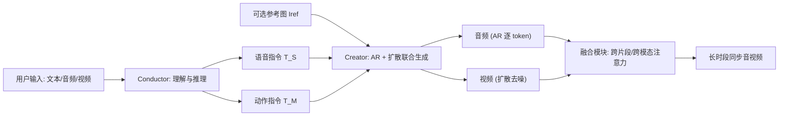

## 一句话总结

MAViD 用"指挥者-创作者"（Conductor-Creator）架构把多模态对话的**理解**与**生成**解耦，并结合自回归（AR）与扩散模型，实现单次推理即可生成约 30 秒、音色/身份/语调一致的同步音视频对话内容。

## 研究背景

- 领域现状：数字人对话交互是人机沟通的基础能力。早期方法只输出文本，近年逐渐加入音频模态（语音输入输出），但真正能**同时生成视觉**的交互系统还很少。
- 核心痛点：
  - "两阶段"路线（先生成音频再驱动视频）存在明显短板：多模态大模型生成的语音单调、缺乏人类表现力；而人类化 TTS 又难以处理音效、环境噪声等真实通用声音，导致视觉与声音对不齐。
  - 主流的联合生成用双 DiT 结构（音频、视频各一支），一次只能生成一个音视频片段，做长视频时很难保持跨片段的身份、音色和语调一致。
  - 现有联合网络（AR+扩散）大多只处理文本-视觉两种模态，用自注意力建模，不足以整合文本-音频-视频三模态。
- 本文 idea：把系统拆成 Conductor（理解+推理+出指令）和 Creator（据指令生成音视频）。Conductor 进一步把指令**拆成语音指令和动作指令**做细粒度控制；Creator 用 AR 建模长序列、扩散保证画质，再配一个专门的融合模块把三模态和相邻片段连起来，支撑长时段同步生成。

## 方法

MAViD 的目标是根据用户跨文本 $$T_{in}$$、音频 $$A_{in}$$、视频 $$V_{in}$$（图像视为单帧视频）的多模态提问，输出合适的文本-音频-视频三元组 $$O = \{T_o, A_o, V_o\}$$。整个框架围绕 Conductor-Creator 组织：Conductor 负责理解并给出全局文本指令，Creator 负责把指令落地成细节化的音视频内容。

关键设计分三块：

**Conductor：把指令拆成语音与动作两路。** 以 Qwen2.5-Omni 的 Thinker 为基线，含文本/音频/视频三个编码器和一个 transformer 解码器，通过 next-token prediction 理解语义并回复。作者观察到：只生成"面向语音的文本"会限制视觉结果的真实感，比如回复"同意"时人应该同时点头。于是把指令解耦成语音指令 $$T_o^S$$（提供听觉线索）和动作指令 $$T_o^M$$（提供来自环境与上下文的视觉线索）。做法是重构输入序列——条件部分把文本放前面、后接交错的音视频序列以加强关联；生成部分用特殊 token（motion 的起止标记）把动作线索与语音线索分开。为了在解耦的同时保住基线的理解能力，训练时采用混合策略。

**Creator：AR 打底、扩散提质的联合生成。** 以 Qwen2.5-Omni 的 Talker 为基线，含文本/音频/视频三个编码器、一个 transformer 解码器和两个音视频解码器。音频编码用 higgs-audio 的 tokenizer（能编码通用声音），视频用 Wan 的 VAE。由于视觉比音频复杂，作者把 Wan 的 DiT block 嵌进 AR 基线来处理视觉序列、保证画质。序列上文本在前、音视频片段交错在后，整体自回归运行：生成当前片段时把历史片段作为条件，$$AV_i = G(AV_{i-1}, T_o^S, T_o^M, I_{ref})$$，这为长时段生成打下基础。片段内部音频用 next-token 预测，视频用扩散整体去噪。选 AR 而非双 DiT 的理由是 AR 天然擅长长序列与多模态建模，也便于未来接入人体姿态、相机等更多模态。

**融合模块：把文本-音频-视频串起来。** 每个解码层里先用自注意力（SA）连接同模态的不同片段，再用交叉注意力（CA）建立跨模态关联。预测第 $$j$$ 个音频潜变量片段时，以语音指令、历史音频片段 $$a_{j-1}$$ 和干净视频片段 $$v_{j-1}$$ 为条件：$$\hat{a}_j = CA(SA([T_o^S \circ a_{j-1} \circ a_j]), F_v(SA(v_{j-1})))$$。作者发现把整段 $$v_{j-1}$$ 注入反而掉性能（引入了无关的早期视频信息），所以 $$F_v$$ 只注入 $$v_{j-1}$$ 的最后 10 个 latent（约 40 帧）。去噪第 $$j$$ 个视频片段时用 $$\hat{v}_j = CA(CA(SA([v_{j-1} \circ v_j]), T_o^M), F_a(a_j))$$，其中 $$F_a$$ 为每个视频 latent 定位对应时间位置的音频并嵌入前 4 个音频 token（约 40ms），以增强音视频时间一致性。

训练分三阶段：第一阶段用交叉熵损失 $$L_{AR} = -\sum_{i=1}^{L} \log p(q_i \mid q_{\lt i}, u)$$ 端到端训练 Conductor（并混入无动作数据把回复放进语音指令、动作指令置空，防止过度解耦削弱理解力）；第二阶段只训 AR 基线做音频生成；第三阶段加入 DiT block，用 $$L_{all} = L_{AR} + L_{DIFF}$$ 端到端训练，其中 $$L_{DIFF}$$ 为扩散速度损失。推理时用户可输入任意模态组合，可选参考图 $$I_{ref}$$ 用于替换首帧作首片段引导，音频经 higgs-audio 解码器还原、视频经 Wan 的 VAE 解码器还原。

## 实验结果

Creator 在标准 5 秒设置下与两阶段方法（Wan-S2V）及联合生成方法（JavisDiT、Universe-1、Ovi）对比。评测覆盖音频质量（PQ/CU/PC/WER）、视频质量（SC/DD/IQ）、音视频一致性（LS/TC/SAC）。下面摘取几个能体现核心结论的指标：

| 方法 | 类型 | PQ↑ | WER↓ | DD↑ | TC↑ | SAC↑ |
|------|------|------|------|------|------|------|
| Wan-S2V | 两阶段 | 7.698 | 0.102 | 0.559 | 0.612 | 0.393 |
| JavisDiT | 联合 | 4.945 | 0.907 | 0.214 | 0.587 | 0.471 |
| Universe-1 | 联合 | 4.116 | 0.268 | 0.524 | 0.526 | 0.302 |
| Ovi | 联合 | 5.713 | 0.121 | 0.667 | 0.744 | 0.570 |
| 本文 | 联合 | 6.007 | 0.126 | 0.828 | 0.767 | 0.595 |

结论：两阶段方法因用了专门独立的 TTS，纯音频质量最好；但在联合生成阵营里，本文与 Ovi 的音频更优。视觉上本文取得联合生成中最好的主体一致性（SC），动态程度（DD）最强（其他方法偏静态），代价是画质略降。音视频一致性方面，Ovi 靠双 DiT 逐块对齐拿到较好的唇同步（LS），但本文在音色一致性（TC）和场景-音频一致性（SAC）上更优。

长视频（18 秒、其他方法需多次推理拼接）对比中，本文因单次推理生成所有片段，音色/语调变化平缓自然；Ovi 因不建模历史片段导致音频突变；Universe-1 产生大量尖锐噪声。消融显示：去掉融合模块（w/o fusion）后音频生成能力显著下降、音视频一致性变差（如 PQ 5.687→5.032、LS 6.183→3.738），证明融合模块对长时段一致性至关重要。Conductor 侧在 MMstar、MMMU、MME 等七个理解基准上与 Qwen2.5-Omni 基线相当，说明指令解耦基本没损害原有理解能力。

## 亮点与局限

- 亮点：
  - 用 Conductor-Creator 显式解耦"理解"与"生成"，并把指令进一步拆成语音+动作两路，让点头等动作与语音语义对齐，交互更拟人。
  - 用 AR+扩散替代双 DiT，单次推理即可生成约 30 秒长视频（对比双 DiT 的 5 秒/片段），跨片段身份、音色、语调更一致。
  - 融合模块的注意力设计有实证细节支撑（只注入最近 10 个视频 latent、40ms 对齐音频），消融验证了其必要性；还能建模环境噪声等通用声音。
- 局限：
  - AR 逐片段生成会累积误差，导致长序列里变化"过于平缓"，动态起伏被削弱。
  - 画质（IQ）为追求动态性有所牺牲；唇同步（LS）不及依赖逐块对齐的 Ovi。
  - Conductor 与部分数据集细节放在补充材料，正文难以完整评估数据规模与泛化边界；音色/场景一致性的部分指标依赖 Gemini-2.5-Pro 打分，评测客观性有一定不确定性。

## 延伸思考

- AR 主干为未来接入人体姿态、相机轨迹等更多控制模态留了口子，这可能比双 DiT 路线更易扩展成"可控数字人"。
- 长序列误差累积是 AR 生成的共性问题，是否可以引入周期性的关键帧重锚定或参考图重注入来抑制"越走越平"的退化，值得探索。
- 两阶段方法在纯音频质量上仍领先，说明"联合生成 vs 专用 TTS"存在质量权衡；如何在联合框架里逼近专用 TTS 的表现力，是这条路线要持续追问的点。
