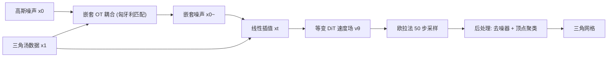

## 一句话总结

MeshFlow 把三角网格看作"三角汤（triangle soup）"，用尊重其排列对称性的等变最优传输流匹配模型直接生成网格，在保持与自回归方法相当质量的同时把推理速度提升约 18 倍、单个网格生成不到 1 秒。

## 研究背景

- 领域现状：网格是图形学最常用的 3D 表示。生成网格主要有两条路线：一是先生成点云 / 隐式函数 / 体素等"中间表示"，再用 Marching Cubes 等算法转成网格；二是把网格序列化后用自回归模型（如 PolyGen、MeshGPT、MeshXL）直接学习人工网格数据。
- 核心痛点：两阶段方法受限于第二阶段网格化算法的质量，容易过度细分、丢失尖锐特征，得不到艺术家那种有意图的三角剖分。自回归方法虽能逼近人工网格质量，但天然继承自回归的缺陷——推理慢、难以定义面片的规范顺序、长序列生成时误差累积。而此前把扩散 / 流匹配直接用于网格的尝试，质量普遍打不过自回归模型。
- 本文 idea：作者假设，扩散类方法之前失败的关键在于忽略了网格中面与顶点固有的排列对称性。于是提出 MeshFlow，用等变最优传输流匹配显式建模这些对称性，包含两点核心贡献：一个对三角汤对称群等变的 DiT 变体架构，以及一个基于最优传输、消除违反对称性训练信号的损失函数。

## 方法

整体框架：把网格表示为三角汤后，先在噪声 $$x_0$$ 与数据 $$x_1$$ 之间构造一个尊重对称群 $$G$$ 的最优传输耦合，得到"嵌套噪声" $$\tilde{x}_0$$；再对这对耦合做线性插值定义常速度场 $$u_t$$ 和采样点 $$x_t$$；最后用一个对 $$G$$ 等变的 DiT 网络去建模时间相关速度场 $$v_\theta(x_t, t)$$。生成时从高斯噪声出发、用 50 步欧拉法积分得到三角汤，再做后处理清理。

关键设计：

- **三角汤表示与两级对称性**：网格被表示为一组无序三角面 $$x \in \mathbb{R}^{N\times 3\times 3}$$，不建模面朝向与拓扑连接。它天然具有两级排列不变性——面级：$$N$$ 个三角面任意置换（对称群 $$S_N$$）不改变几何；顶点级：每个三角内三个顶点顺序无关（对称群 $$S_3$$）。二者构成 $$S_3$$ 与 $$S_N$$ 的花圈积子群 $$G = S_3 \wr_N S_N$$。这是全篇的建模基础。

- **等变 DiT 架构**：Transformer 本身对全部 $$3N$$ 个顶点是 $$S_{3N}$$ 等变的，但直接处理所有顶点自注意力复杂度是 token 数的平方、且对更大群 $$S_{3N}$$ 等变会削弱表达力（非等价的三角汤会得到相同特征）。作者的巧思是把等变性精确限制到 $$G$$：先用均值池化把每个面内三顶点特征聚合成"面特征"，只在面特征上做无位置编码的自注意力（复杂度大幅下降），再把注意力输出复制加回各顶点特征以保持顶点级等变，最后用逐顶点 FFN 增强表达。顶点编码用 NeRF 式正弦位置编码。此外通过 AdaLN 把时间戳 $$t$$ 与目标面数 $$\lvert F \rvert$$ 一起注入做条件——因为不同面片预算会导致不同几何风格（面少倾向大三角逼近平面，面多倾向小三角刻画曲面），而无位置编码的注意力难以从 token 数恢复面数。

- **嵌套最优传输耦合**：为利用两级不变性，把噪声与数据的耦合代价定义为在群 $$G$$ 轨道上的最小 $$\ell_2$$ 距离。求解分两层嵌套：先对每对面枚举 $$S_3$$ 内顶点置换得到最优顶点匹配与面间代价矩阵 $$M$$，再用匈牙利算法在 $$S_N$$ 上求最优面置换 $$\rho^*$$，从而同时确定面对应与顶点对应。相比只匹配面的"面耦合"或完全随机的"独立耦合"，嵌套耦合显著减少传输路径交叉，得到更直的积分轨迹、更低的 OT 代价。最终损失是把这个 OT 耦合噪声 $$\tilde{x}_0$$ 代入标准 CFM 目标：$$L(\theta) = \mathbb{E}[\lVert v_\theta(x_t, t; c) - (x_1 - \tilde{x}_0) \rVert^2]$$。

- **两步后处理**：连续域生成的原始输出常出现近重合顶点簇。第一步用一个不含 AdaLN、结构同等变 DiT 块的神经去噪器：训练时对真值网格加固定水平高斯噪声、用 $$L_2$$ 重建损失学习去噪，恢复干净几何；第二步做阈值聚类，把相互距离小于 0.015 的顶点合并为唯一顶点，并去掉重复面。该步几乎不增加延迟。

## 实验结果

在 ShapeNet 四个类别（Chair / Table / Bench / Lamp）上做无条件生成，用 1-NNA（越接近 50% 越好，衡量保真与多样）和自相交面比例 $$R_i$$（越低越好）评估，对比自回归方法 PolyGen / MeshGPT / MeshXL 及扩散方法 PolyDiff。

| 方法 | Chair 1-NNA↓ | Table 1-NNA↓ | Bench 1-NNA↓ | Lamp 1-NNA↓ |
|------|------|------|------|------|
| PolyGen (自回归) | 81.45 | 66.27 | 79.69 | 75.49 |
| MeshXL (自回归, 1.3B) | 55.32 | 57.78 | 56.25 | 46.77 |
| PolyDiff (扩散) | 79.91 | 73.25 | 61.49 | 70.81 |
| MeshFlow (本文, 124M) | 54.51 | 59.14 | 54.46 | 51.61 |
| MeshFlow + 后处理 | 56.77 | 57.00 | 59.82 | 56.45 |

MeshFlow 以仅 124M 参数在 4 类中的 3 类取得最佳 1-NNA，明显超过扩散基线 PolyDiff，并与大规模预训练的自回归模型相当。速度上单网格生成 0.877 秒，相较 MeshGPT（16.3s）、MeshXL（28.9s）实现约 18.55 倍加速，后处理仅增加约 0.023 秒。

消融实验（Chair 类）验证两大设计：把等变架构换成非等变 NN、仅面等变或仅顶点等变，1-NNA 都大幅劣化（如非等变 50 步为 83.87，本文为 55.97）；把嵌套耦合换成独立耦合或面耦合，性能与收敛速度也变差。尤其在仅 20 步推理时，独立耦合退化明显（67.58）而本文仍保持 57.74，印证了嵌套 OT 带来的更直轨迹让少步采样依然可用。后处理平均把自相交率降低约 56%，同时保持 1-NNA 基本不变。

## 亮点与局限

- 亮点：
  - 首个把等变最优传输生成用到"三角汤"网格表示的工作，抓住了此前扩散类网格生成失败的根因——排列对称性。
  - 架构改动"简单有效"：只是在面特征上做注意力再加回顶点，就把等变性精确约束到 $$G$$，兼顾效率与表达力。
  - 嵌套耦合让流轨迹更直，可用极少步数（20 步）生成高质量网格，是 18 倍加速的关键之一。
- 局限：
  - 耦合算法复杂度约 $$O(n^3)$$，难以直接扩展到大面数网格（作者提出 patch 训练、近似 OT 作为未来方向）。
  - 生成结果偶有重叠面、缺失面等瑕疵，作者归因于算力受限、期望靠大规模训练缓解。
  - 实验仅限 ShapeNet 四类、无条件生成；条件生成 / 后验采样仅作为展望，尚未验证。

## 延伸思考

这篇工作把分子、点云领域成熟的"等变 OT 流匹配"迁移到网格，核心洞见是"选对表示 + 尊重其对称性"往往比堆参数更重要——124M 的等变模型能对打 1.3B 的自回归模型即是明证。相比并发的 MeshCraft（在有序潜空间做 rectified flow）和依赖网格自编码器的路线，MeshFlow 直接在连续原始网格空间建模，避免了离散化误差与自编码器质量瓶颈。值得追问的是：$$O(n^3)$$ 耦合能否用近似或分块 OT 扩展到高面数、艺术家级复杂网格；以及作者提到的把扩散后验采样引入等变流匹配，若打通将使该框架具备即插即用的条件生成能力（如从点云 / 图像重建网格），这可能是其区别于自回归方法的更大价值所在。
