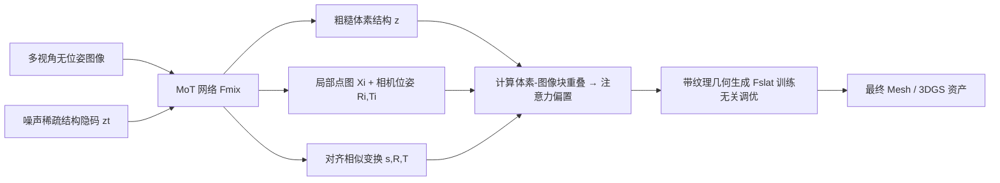

## 一句话总结

Mix3R 用一套 Mixture-of-Transformers 架构把预训练的前馈重建模型（π3）和 3D 生成模型（TRELLIS）融合到一起，让二者在稀疏视角下互相校准，从而同时得到与输入对齐更好的 3D 生成结果和更准的相机位姿估计。

## 研究背景

- 领域现状：从多视角图像做 3D 重建与位姿估计，近年分成两条路线。一条是**前馈重建**（VGGT、π3、MapAnything、DepthAnything3 等），直接回归像素对齐的点图、深度图、相机位姿；另一条是**生成式重建**（TRELLIS 等），把重建当成图像条件下的 3D 生成过程。
- 核心痛点：两条路线各有短板。前馈方法像素对齐做得好，但只能重建"看得见"的部分，强依赖视角间的重叠，稀疏视角下重建会不完整、不准确；生成方法能补出完整几何，但缺少显式的对齐控制信号，生成的形状往往只是"长得像"输入，几何尺寸和纹理细节不忠实。已有的统一尝试（如 ReconViaGen 单向把 VGGT 特征注入生成、CUPID 生成 UV 体素解位姿）要么是单向的，要么缺乏跨视角知识去处理"形状对称但纹理不对称"的情况。
- 本文 idea：把前馈重建和生成式重建**双向耦合**成一个互利的整体。核心洞察是这是一个"鸡生蛋"问题——如果前馈模型已知底层 3D 形状，就能把预测锚定到该形状而非依赖图像重叠；反过来，如果生成模型已知相机位姿，就能利用像素级对齐生成更贴合输入的形状。Mix3R 让两个分支在同一网络里交换信息，同时解决这两半。

## 方法

整体是沿用 TRELLIS 的两阶段由粗到细流程。第一阶段用一个 Mixture-of-Transformers（MoT）网络，给定多视角无位姿输入图像，联合生成粗糙 3D 结构（稀疏体素）、每视角局部点图、相机位姿，以及一个把点图对齐到 3D 形状体素空间的相似变换；第二阶段基于第一阶段得到的对齐关系，用一个训练无关的注意力偏置去引导预训练的带纹理几何生成模型，把输入纹理正确地贴到生成形状上。

关键设计分三部分：

1. **联合的粗几何生成与位姿估计**。第一阶段网络 Fmix 以三样东西为输入：按流匹配加噪的稀疏结构隐码 $$z_t = (1-t)z_0 + t\epsilon$$、多视角图像、以及一个代表对齐变换的可学习 token。3D 分支按流匹配预测速度场 $$v$$（监督目标是 $$\epsilon - z_0$$），2D 分支把图像 token 解码成局部点图和相机位姿。训练时不单独监督点图/位姿/变换，而是先把它们组合成对齐后的点图 $$\hat{X}_i = s(R(R_i(X_i) + T_i) + T)$$，再对 $$\hat{X}_i$$ 施加点坐标 L1 损失和法向 L1 损失。总损失是 $$L = L_{fm} + \lambda_{pts}L_{pts} + \lambda_{nml}L_{nml}$$。一个巧妙的细节是：网络只看到加噪的 $$z_t$$，当时间步 $$t$$ 较大时几何信息几乎被噪声淹没，对齐损失会变得没意义，因此让损失系数随 $$t$$ 变化，$$\lambda_{pts} = \mathrm{Sigmoid}(-24t + 9)$$，实现 $$t \ge 0.5$$ 时几乎不监督对齐、$$t \le 0.25$$ 时全力监督。

2. **MoT 架构的模块混合策略**。TRELLIS 有 24 个块、π3 有 36 个块（π3 沿袭 VGGT 交替使用局部自注意力和全局自注意力）。作者不去穷举融合方式，而是遵循几条原则设计混合：为最大保留预训练权重，用 MoT 自注意力（不同模态用各自的 QKV 矩阵）来插入信息交换；只把 π3 的全局块扩展成 MoT 自注意力，局部块保持局部；对齐变换分支采用与 TRELLIS 对称的结构。先把 18 个全局 π3 块均匀映射到 24 个 TRELLIS 块，剩下 6 个 TRELLIS 块再按保序方式唯一地与局部 π3 块匹配，最终得到三种混合块类型：局部 π3 块无匹配（不混合）、局部 π3 块与 TRELLIS 块匹配（扩展成跨 3D token 和变换 token 的 MoT 自注意力，并用交叉注意力把 π3 几何信息特征注入）、全局 π3 块与 TRELLIS 块匹配（进一步扩展成同时处理三个模态的大型全局 MoT 自注意力）。训练时冻结所有有预训练值且不受新模块影响的参数，只激活新增模块。

3. **训练无关的注意力偏置**。第二阶段要把纹理精确贴到生成形状上。作者在预训练的带纹理几何流模型 Fslat 的交叉注意力上加一个偏置矩阵：$$\mathrm{Softmax}(Q(f)K(y)^T / \sqrt{d} + B(f, y)) V(y)$$。其中 $$f$$ 的每个 token 对应一个体素、$$y$$ 的每个 token 对应某张输入图像的图像块。利用第一阶段得到的对齐点图，可以算出每个体素 $$p_j$$ 与图像块点集 $$\hat{x}_k$$ 的重叠点数 $$\lvert p_j \cap \hat{x}_k \rvert$$，并定义平均点数 APC。偏置 $$B(f_j, y_k)$$ 的思想是：如果某图像块与体素的重叠高于平均，就提高它们之间的注意力分数（偏置对下调做了截断到 0，因为经验上降分会掉性能），取 $$\alpha = 5$$ 缩放。这样在训练无关的前提下引导生成对齐纹理。此外第一阶段只预测位姿不预测内参，最后用最小二乘解透视投影补内参，再用 DRTK 可微渲染器通过 RGB 损失和 mask 损失联合精修内外参。

## 实验结果

模型在 TRELLIS-500k 的子集（404354 个物体，用 TRELLIS 自己生成训练数据）上训练，在 Toys4k 和 Google Scanned Objects（GSO）上评估。下面取"新视角合成与几何精度"这个主实验做对比（几何用 Chamfer 距离，纹理用 4 个新视角的渲染指标）：

| 方法 | Toys4k PSNR↑ | Toys4k LPIPS↓ | Toys4k CD↓ | GSO PSNR↑ | GSO CD↓ |
|------|------|------|------|------|------|
| TRELLIS | 23.930 | 0.055 | 7.9986 | 22.420 | 4.5658 |
| UniLat3D | 25.082 | 0.049 | 7.0876 | 22.765 | 7.1384 |
| MV-SAM3D | 23.550 | 0.059 | 2.7556 | 22.331 | 5.2356 |
| ReconViaGen | 24.491 | 0.046 | 1.9419 | 24.183 | 1.0015 |
| Mix3R | 27.177 | 0.033 | 0.7419 | 24.826 | 0.7945 |

（CD 单位为 $$\times 10^{-3}$$。）几何 Chamfer 距离大幅领先，说明更好地保持了物体尺寸与比例；即便外观有时与基线接近，Mix3R 也能把不对称纹理正确贴到对称形状上。

其余实验用文字概括：在**输入对齐**评测（直接用预测位姿渲染生成模型看与输入对齐程度）中，Mix3R 在 Toys4k（PSNR 28.144）和 GSO（PSNR 25.031）上均优于 ReconViaGen 和 MV-SAM3D。在**相机位姿精度**上（RRA / RTA / AUC@30°），Mix3R 在 Toys4k 上 AUC 达 70.63，同时超过前馈方法 VGGT、π3 和生成类方法；GSO 上综合表现也最好。真实手机拍摄的物体上，Mix3R 与 ReconViaGen 表现相当，而其他方法普遍出现几何或纹理失真。

## 亮点与局限

- 亮点：
  - 用 MoT 架构实现前馈与生成的**双向互利**，而非 ReconViaGen 那种单向特征注入；最大限度复用两个大规模预训练模型的先验。
  - 第二阶段的注意力偏置是**训练无关**的，用第一阶段的对齐结果即可引导纹理生成，额外成本极小。
  - 随时间步调整对齐损失系数的设计，巧妙规避了"高噪声步几何信息缺失导致对齐监督无意义"的问题。
  - 几何精度（Chamfer 距离）相比基线有数量级级别的改善。

- 局限：
  - π3 分支在测试视角配置偏离训练分布时，可能反而干扰 3D 分支、导致性能下降。
  - 受限于资源，训练用的是 TRELLIS 生成的数据，不含光照或视角相关的视觉效果，直接用于野外真实数据会掉点。
  - TRELLIS 的 VAE 解码器被冻结，生成质量受限于预训练的 TRELLIS 隐空间分布。

## 延伸思考

- Mix3R 本质是"如何优雅地缝合两个异构预训练大模型"的一个范例：块匹配 + MoT 自注意力 + 交叉注意力注入的组合，给"融合不同坐标空间、不同任务范式的模型"提供了可复用的思路，值得关注是否能推广到其他"前馈判别 + 生成"的配对（如深度估计与视频生成）。
- 训练无关的注意力偏置是很轻量的对齐手段，但它依赖第一阶段对齐的准确性——当位姿或点图估计出错时，偏置可能把纹理引导到错误区域，这一失败模式与鲁棒性值得进一步分析。
- 用生成模型（TRELLIS）自产训练数据绕开了昂贵的数据处理，但也把学生模型的上限锁死在教师分布内；如何引入真实的、含光照与视角相关效果的数据来突破这一瓶颈，是把该方法推向野外应用的关键。
