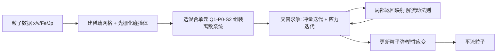

## 一句话总结

本文提出一族**混合物质点法（mixed MPM）**：把速度、应力、碰撞分别用不同的基函数离散，配合一个可在多种塑性行为间平滑插值的统一流动法则，并给出一个紧支撑、对称、适合 GPU 的隐式求解器，从而能在 CFL 时间步长下稳定模拟从砂土、雪到弹性固体的刚性弹粘塑性材料，直至不可压极限。

## 研究背景

- 领域现状：MPM 因其对拓扑变化的天然鲁棒性，已成为图形学和工程仿真里模拟颗粒、雪、软体、断裂的主力方法；随着高斯泼溅等点云重建数据激增，无网格粒子法重新受到关注。
- 核心痛点：传统 MPM 用二次/三次样条形函数避免"网格穿越不稳定性"，但插值模板跨越大量粒子与网格，粒子-网格间数据交换量大、计算昂贵。此外显式积分受材料刚度限制、时间步长极小；而不可压/近不可压材料在基于刚度的公式下也难处理。Daviet 与 Bertails-Descoubes（2016）虽提出过混合速度-应力离散，但只适用于 Drucker–Prager 粘塑性流动，且其配置式（collocated）Q1–Q1 单元在弹性固体等一般情形下会出现寄生振荡。
- 本文 idea：借鉴不可压流体常用的**混合速度-应力离散**（如 MAC 交错网格上梯度/散度算子模板小、且不随局部粒子数变化）的思路，把它推广到一般弹粘塑性材料。三项贡献：从任意弹性势与耗散势出发系统性推导一族混合 MPM 离散；一个统一的、能在 Drucker–Prager 颗粒与脆性固体之间插值的流动法则；以及针对该离散与流动法则、含刚体双向摩擦耦合的 GPU 隐式求解器。

## 方法

整体框架：把一个时间步的增量问题写成三个势函数（动能势、弹性势、塑性耗散势）的凸优化，通过引入对称拉格朗日乘子张量场（即 Cauchy 应力 $$\boldsymbol{\sigma}$$）转成鞍点问题，其最优性条件恰好是动量守恒与流动法则。随后用 MPM 在背景稀疏网格上离散：速度、应力、碰撞各自选一套形函数，组装成一个对称、紧支撑的离散系统，再由交替的"冲量求解 + 应力求解"迭代加局部返回映射来求解。

关键设计：

1. **混合单元与"分场离散"。** 速度、应力、碰撞用不同基函数：速度需要平方可积导数所以至少连续（三线性 Q1，或二次/三次样条 B2/B3）；应力/应变只需平方可积、可以不连续，于是可用逐单元常数 P0、不连续线性 dP1、不连续三线性 dQ1 或逐粒子（Part.）。文中主推 Q1–P0–S2 单元（三线性速度、分片常数应力、二次 serendipity 碰撞节点），在性能与精度间折中最好；大应变场景改用 Q1–dP1。相比旧方法的配置式 Q1–Q1，分场离散避免了弹性固体上的寄生振荡。基于柔度（compliance）而非刚度的公式，让泊松比可取到 $$\nu=0.5$$ 的不可压极限。

2. **统一流动法则。** 因为流动法则要在不落在粒子上的节点处强制执行、而材料参数存在粒子上需插值，作者设计了一个在 $$(p,\lvert \mathrm{Dev}\,\boldsymbol{\sigma}\rvert)$$ 空间中呈**多边形**的屈服面，它同时推广了 Drucker–Prager 与 Von Mises，并能内接或外接 Cam Clay 屈服面。屈服面由临界压力 $$p_c$$、拉伸屈服比 $$\beta$$、摩擦系数 $$\mu$$、切向屈服应力 $$\tau_c$$ 参数化。借助 de Saxcé 的**双势（bi-potential）** $$B(\boldsymbol{\sigma},\dot{\boldsymbol{\varepsilon}}_p)$$，可以统一表达关联与非关联流动，并通过一个膨胀系数 $$\theta$$ 在两者间平滑插值——非关联（$$\theta=0$$）时法向与切向解耦、颗粒可自由流动。

3. **紧支撑对称离散系统与约束节点。** 把弱形式的各双线性/仿射型 $$a,b,c,m$$ 组装为矩阵，系统只由应力 $$\boldsymbol{\sigma}$$ 与碰撞冲量 $$\mathbf{r}$$ 两组未知量决定。为保持对称性，作者用 Voigt 型等距映射把对称张量映到 $$\mathbb{R}^6$$，并选取线性算子 $$E$$ 使质量块 $$\Lambda$$ 对角化（P0/Part. 时质量矩阵天然对角，dP1/dQ1 时对分块做特征分解），同时保证特征向量定向一致，使得节点上强制的散度正性能传导到体积平均散度。碰撞用 Signorini–Coulomb 条件在有限个点上离散，S2 节点在细特征（如碎木机齿）处兼顾精度与性能。

4. **GPU 隐式求解器。** 整个隐式问题通过交替迭代求解：冲量求解用带质量分裂的 Jacobi 迭代（各向同性局部接触解），应力求解用**着色 Gauss–Seidel**（Q1 速度只需 8 种颜色，可并行且确定性）。局部流动法则求解是核心：把局部问题降到对切向 5×5 块做一次特征分解、丢弃法向-切向耦合模，再把返回映射转化为对标量 $$\alpha$$ 的**一维求根**问题（单调递减函数 $$g(\alpha)$$，带解析上下界，Newton 迭代无需线搜索即可稳定收敛）。每个时间步只需一次 5×5 特征分解，而经典 MPM 返回映射需每粒子一次 3×3 SVD。固体材料时问题线性，可用预条件共轭梯度（PCG）。刚体双向耦合通过 Delassus 算子 $$R=J^\top I^{-1}J$$ 实现，独立刚体得到隐式强耦合，关节体则用分块对角近似平衡稳定性与成本。

## 实验结果

作者用 NVIDIA Warp 实现并集成进 Newton 物理引擎，在单张 RTX PRO 6000 Blackwell GPU 上运行。下表是几个复杂场景的规模与性能（$$n_p$$ 粒子数，$$n_{GS}$$ Gauss–Seidel 迭代数，$$t_f$$ 每动画帧墙钟时间）：

| 场景 | 粒子数 $$n_p$$ | GS 迭代 | 每帧时间 $$t_f$$ (s) | 说明 |
|------|------|------|------|------|
| Dam Break | 679k | 115 | 0.1 | 无粘不可压流体 |
| Rigid Ball | 524k | 239 | 0.5 | Q1–P0 近刚体，对比 MuJoCo |
| ANYmal | 1.6M | 92 | 0.7 | 四足机器人地形双向耦合 |
| Shredder | 444k | 221 | 1.4 | 弹塑性 + 摩擦接触 |
| Avalanche | 14M | 149 | 5.4 | 雪崩，弱层负硬化 |
| Sand city | 49M | 234 | 4.0 | 49M 粒子砂土冲过城市 |

其他关键结论用文字概括：局部求解器在 $$10^6$$ 个随机局部问题上残差均值约 $$1.2\times10^{-9}$$、求根平均仅 6 次迭代；在 Drucker–Prager 砂柱坍塌上，本文各向异性局部解 + Gauss–Seidel 的收敛显著优于旧的 Fischer–Burmeister 非光滑 Newton（后者单次迭代太贵）。单元选择上，B2 速度精度高于 Q1 但成本高得多（同一砂柱实验 Q1–P0 约 106ms/帧，Q1–dP1 约 180ms，B2–dP1 高达 13.3s）；P0 应力单元无法表示大应变会碎裂，但很适合近刚体。方法还复现了砂柱坍塌、雪板断裂/雪崩传播、粘性流体盘绕、混凝土 Armadillo 压碎裂纹，以及可交互沙盒（约 67 万粒子、20–30 FPS 实时双向耦合）。

## 亮点与局限

- 亮点：
  - 从凸优化/双势出发的**统一推导**，把混合 MPM 从单一 Drucker–Prager 推广到任意弹粘塑性材料，理论干净且可解释。
  - 紧支撑混合单元 + 每步一次 5×5 特征分解的返回映射，让 4900 万粒子的砂土模拟在单 GPU 上达到约 4s/帧，性价比突出。
  - 统一多边形屈服面 + 膨胀系数 $$\theta$$，在关联/非关联、颗粒/脆性/流体之间平滑插值，配合柔度公式可达不可压极限。
  - 与刚体求解器的隐式双向耦合可共用时间步，实现机器人在可变形地形上的行走等场景。
- 局限：
  - 三线性速度的混合单元**不满足 inf-sup 稳定性条件**，应力空间变化较大，不可压情形数值系统不如专用离散良态；作者建议引入稳定化方法。
  - 着色 Gauss–Seidel / Jacobi 的**渐近收敛慢**，依赖热启动缓解，期待多重网格或原对偶（如 AVBD）等更快策略。
  - 材料参数存粒子、流动法则在网格节点求解，插值会模糊材料边界。
  - 目前主要用 corotated 弹性、各向同性材料，硬化用显式更新；超弹性/各向异性、隐式硬化等留作未来工作。

## 延伸思考

这项工作把"不可压流体里成熟的混合速度-压力离散"迁移到固体弹塑性 MPM，本质是用更小的模板换取可扩展性，与近期追求紧核 MPM（Liu et al. 2025）、可微/稀疏自动微分 MPM 的方向相呼应。它开源集成进 Newton 引擎并用 Warp 实现，配合与 MuJoCo Warp、XPBD 的双向耦合，指向一个"机器人学习 + 可变形地形/物料"的实用管线——对需要在颗粒、雪、泥等地形上训练或验证运动策略的具身智能研究尤其有价值。值得追问的是：inf-sup 不稳定在更极端不可压或更长时间尺度下会不会积累成可见问题，以及双势框架能否进一步吸纳各向异性损伤模型（如 AnisoMPM）与全隐式硬化，从而把"参数可插值"的统一性推广到更广的本构空间。
