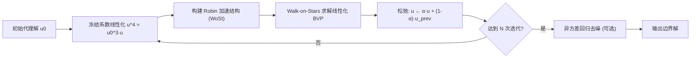

## 一句话总结

本文把 Picard 型不动点迭代嵌入 Walk-on-Stars 蒙特卡洛 PDE 求解器，让其首次能够处理由热辐射引入的非线性边界条件（Stefan–Boltzmann 定律里的 $$T^4$$ 项），并配套提出一种针对边界估计的异方差回归去噪方法。

## 研究背景

- 领域现状：蒙特卡洛 PDE 求解器（以 Walk-on-Spheres / Walk-on-Stars 为代表）近年在几何处理与图形学里越来越流行，因为它无网格、对复杂几何鲁棒。现有工作已经能处理 Dirichlet、Neumann 以及线性 Robin 边界条件，因此热传导和对流换热都已被较好支持。
- 核心痛点：辐射换热却几乎无人问津。辐射边界条件形如 $$\frac{\partial T}{\partial \vec{n}} + \frac{\sigma\epsilon}{k_0}\left(T^4 - T_0^4\right) = 0$$，其中未知温度上的 $$T^4$$ 非线性项破坏了经典蒙特卡洛估计器赖以成立的线性递归结构，使得直接递归积分不可行。而在真空/近真空环境（航天器、卫星、小行星）里辐射恰恰是主导换热机制，无法回避。
- 本文 idea：用"冻结系数"的方式把非线性项局部线性化，再套一层 Picard 不动点迭代反复修正，直到收敛到原非线性问题的解；同时针对辐射问题在边界上噪声极大、而已有方差缩减都只服务于域内求值这一空白，提出直接作用在边界估计上的去噪方法。

## 方法

整体框架：把非线性辐射项 $$u^4$$ 通过一个代理解 $$u_0$$ 冻结成 $$u^4 \approx u_0^3 u$$，于是辐射边界退化为一个线性 Robin 条件，可交给已有的 Walk-on-Stars 估计器求解；把这一步放进不动点迭代，用上一轮的解作为下一轮的代理系数，配合松弛因子稳定收敛，最后可选地用异方差回归去噪。

关键设计：

1. **不动点迭代框架（是什么 / 为什么 / 怎么做）**：把线性化求解抽象成算子 $$u = \mathcal{S}(u, f, g, h)$$，原非线性问题的解正是该算子的不动点，于是用 Picard 迭代 $$u_{n+1} = \mathcal{S}(u_n, f, g, h)$$ 逐步逼近。为什么需要迭代而非一次线性化：论文用一个比较定理说明，若代理解偏低则单步线性化得到的解会系统性偏高（反之偏低），一次线性化会留下系统偏差；迭代能持续修正。实现上，反射系数 $$\rho_\mu$$ 里含未知解 $$u_n^3$$，若直接递归采样会导致分支估计器、代价随递归深度指数增长，因此采用缓存策略：每轮把边界解估计一次、存为代理、供后续复用，从而把复杂度保持在样本数的线性级。

2. **松弛稳定收敛**：由于诱导的不动点映射不保证是压缩映射，纯 Picard 迭代可能震荡甚至发散。作者引入欠松弛 $$u_n \leftarrow \alpha u_n + (1-\alpha) u_{n-1}$$（$$\alpha \in (0,1)$$）抑制震荡。这是经验性的——收敛没有全局理论保证，参数选得不好仍可能发散。此外由于 $$\mathbb{E}[u^3] \neq \mathbb{E}[u]^3$$，用缓存均值算非线性项会引入偏差，但相比不当代理带来的系统偏差要小，且可通过增大样本数缓解。

3. **无网格边界函数表示**：每轮迭代都要在辐射边界上表示一个中间解场。逐顶点/逐面表示会把函数分辨率绑死在网格上，粗网格无法刻画辐射引起的高频变化，而为此重网格化又违背蒙特卡洛求解器"免预处理"的初衷。作者改用点云表示：每轮在边界均匀采 $$N$$ 个点、各自用 Walk-on-Stars 估计解值，再用移动最小二乘（MLS）局部线性拟合 $$u_n(x) \approx a + \boldsymbol{b}^\top (x - x_0)$$ 重建连续边界函数，用高斯权重、KD-tree 加速邻域查询。

4. **异方差回归边界去噪**：蒙特卡洛边界估计 $$\hat{u}(x) = u(x) + \epsilon(x)$$ 的噪声方差 $$\sigma^2(x)$$ 是空间变化的（不同边界位置来自不同的边界积分表示）。作者用紧凑神经网络（SIREN）联合回归均值场 $$u(x)$$ 与局部标准差 $$\sigma(x)$$，以负对数似然为损失 $$\mathcal{L} = \mathbb{E}_x\left[\frac{(\hat{u}(x)-u(x))^2}{2\sigma^2(x)} + \frac{1}{2}\log\sigma^2(x)\right]$$，显式建模异方差不确定性，避免对高方差样本过拟合。去噪器不预训练，每个场景从随机初始化临时训练，通常只在不动点迭代结束后对最终边界估计做一次。

## 实验结果

在合成解基准上（真解 $$u(x) = 10 + \cos(\omega x)\cos(\omega y)\cos(\omega z)$$，边界满足 $$\frac{\partial u}{\partial \vec{n}} + \gamma u^4 = f$$，$$\gamma = 10^{-3}$$，故意用远离真值的常数 8 作初始代理，每轮 $$10^4$$ 个边界点、每点 256 次随机游走、$$\alpha = 0.25$$），逐次迭代的边界均方误差（MSE）如下：

| 迭代次数 | Ball | Torus | Spot | Train |
|------|------|-------|------|-------|
| 1（单步线性化） | 0.5014 | 0.2917 | 0.8287 | 1.0014 |
| 2 | 0.1671 | 0.1430 | 0.2550 | 0.5191 |
| 3 | 0.0954 | 0.0929 | 0.1105 | 0.3652 |
| 6 | 0.0614 | 0.0714 | 0.0471 | 0.2770 |
| 去噪后 | 0.0031 | 0.0032 | 0.0021 | 0.0063 |

可以看到：相比只做一次线性化（迭代 1），不动点迭代把误差降低约一个数量级；随后的异方差去噪又把误差在各几何上再压低约一到两个数量级（去噪仅需十几到二十秒，相对上千秒的蒙特卡洛采样几乎可忽略）。经验上 5–10 次迭代即收敛。

其余实验用文字概述：在真空光-热耦合问题上，与商业 FEM 软件 COMSOL Multiphysics 的参考解对比，在球、spot 等中等复杂几何上相对 MSE 低至 $$10^{-3}$$ 量级并高度吻合；而对 train 这类拓扑复杂的模型，FEM 难以自动生成高质量体网格（论文标注为"网格失败"），本文方法仍能直接在表面几何上稳健求解。压轴的约 44 万三角形小行星（真空受平行光照）算例进一步展示了在无体网格、无视角因子预计算、无区域分解下求解大规模复杂几何的能力，结果与简化几何上的 FEM 参考一致，而朴素线性化则明显偏离。消融实验表明：初始代理越偏离真值、朴素线性化偏差越大而本文迭代能逐步纠正；松弛因子越小越稳（$$\alpha = 0.5$$ 会震荡/停滞）；异方差去噪相较同方差基线收敛更快、误差更低。

## 亮点与局限

- 亮点：
  - 填补了蒙特卡洛 PDE 求解器在非线性辐射边界条件上的空白，保持了无网格、免预处理、对复杂几何鲁棒的特性。
  - 缓存代理解的策略巧妙规避了反射系数递归依赖未知解导致的分支估计器爆炸，把复杂度保持在样本数线性级。
  - 首次针对"边界上"的蒙特卡洛估计做方差缩减（异方差回归去噪），补上了以往只服务域内求值的缺口，且模型无关、代价极低。
  - 框架不限于 $$T^4$$，可推广到更一般的非线性 Robin 边界（如含 $$u^2\sqrt{u}$$ 项）。
- 局限：
  - 收敛纯属经验性，不动点映射不保证压缩，缺乏全局收敛理论；松弛因子过大时会震荡/发散，需要人工调参与监控。
  - 用缓存均值算非线性项存在 $$\mathbb{E}[u^3] \neq \mathbb{E}[u]^3$$ 的偏差，只能靠加样本缓解。
  - 运行成本偏高：耦合算例约 30 分钟，而 FEM 在可网格化时约 1 分钟即可完成，二者更像互补而非全面超越。
  - 仅针对稳态问题；随机游走常穿越域内部，尚未接入 harmonic/neural caching、path guiding 等加速手段。

## 延伸思考

- 这项工作沿着 WoS → WoSt（Neumann）→ Robin（Brakhage–Werner）→ 非线性辐射的路线，把蒙特卡洛 PDE 求解器往"更真实物理边界"又推了一步，思路上与红外渲染中把辐射非线性做单步线性化的做法形成对照——本文的核心正是把那一步换成可迭代收敛的不动点。
- "在边界上做异方差去噪"是一个可迁移的点子：任何需要反复估计边界迹的蒙特卡洛问题（如 Robin/阻抗边界、耦合场问题）都可能受益于显式建模空间变化方差。
- 未来若能给出松弛因子的自适应选择或某种局部压缩性判据，将极大提升实用性；把域内加速缓存与边界去噪统一到同一方差预算下调度，也是自然的下一步。
- 对做行星/航天热分析或需要免网格热仿真的场景，这套方法提供了传统 FEM 之外的一条稳健路径，尤其在几何复杂到体网格化失败时价值明显。
