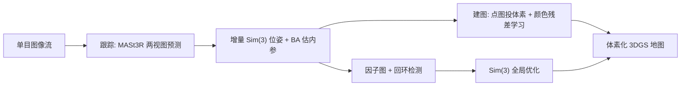

## 一句话总结

MoonSplat 是一个仅靠单目图像流的在线体素化 3DGS 重建框架，用 Sim(3) 全局优化联合校正相机位姿、尺度漂移与高斯地图，并用颜色残差学习加速体素高斯收敛，实现了长序列下鲁棒的实时高质量重建。

## 研究背景

- 领域现状：3D Gaussian Splatting（3DGS，把场景表示为一堆可微优化的三维高斯基元）凭借高质量实时渲染，成为在线三维重建与 SLAM 结合的首选表示，衍生出 SplaTAM、MonoGS、GigaSLAM、OTF-NVS 等一批在线 3DGS 方法。
- 核心痛点：现有在线 3DGS 有两大软肋。其一是位姿估计脆弱——依赖顺序 PnP 或渲染损失微调位姿，在相机基线不足（如手持快速旋转）时容易失败，且缺少回环闭合来纠正累积误差，长序列上会漂移直至跟踪崩溃。其二是效率与显存问题——原始 3DGS 高斯数量随序列暴涨导致显存溢出，OTF-NVS 把历史高斯卸载到磁盘却让它们无法参与全局优化，GigaSLAM 用体素化 Scaffold-GS 省显存却因网格特征与共享 MLP 联合训练收敛过慢而成为瓶颈。
- 本文 idea：在体素化 3DGS 表示之上，设计一个 Sim(3) 全局优化模块，把相机位姿、尺度漂移和高斯锚点位置放进带回环的因子图里联合优化；同时提出颜色残差学习（CRL），用关键帧点图颜色初始化锚点基色、让颜色 MLP 只学残差，从而攻克体素高斯收敛慢的效率瓶颈。

## 方法

整体框架：输入单目图像序列，系统对每个关键帧先做跟踪（用 MASt3R 两视图先验估计相对 Sim(3) 位姿与相机内参），再做建图（把带颜色的点图投进体素、以颜色残差学习解码高斯），并行地在因子图上做 Sim(3) 全局优化（回环闭合、联合校正位姿/尺度并同步搬移历史高斯锚点），最终得到全局一致的体素化高斯地图与相机轨迹。

关键设计分三点：

1. 基于多视图先验的跟踪与 Sim(3) 增量位姿。用 MASt3R 对相邻关键帧做两视图匹配，得到点图、匹配特征及置信度；当有效匹配比例低于阈值就新建关键帧。由于 MASt3R 对每对图像独立预测尺度，刚性 SE(3) 无法对齐两张点图，因此用高斯-牛顿最小化重投影残差求解相对 Sim(3) 变换（含旋转、平移和尺度因子），从根上处理尺度漂移。相机内参无法直接从点图稳定得到，作者对前若干关键帧做稠密匹配并构建 BA，用 Levenberg-Marquardt 联合优化焦距、三维点与位姿，再把后续点图按统一内参做深度重投影校正，保证渲染光线与三维点一致。

2. 颜色残差学习（CRL）。作者发现体素高斯收敛慢的主因是颜色 MLP：锚点特征初始为空、要和共享 MLP 从零学颜色，早期无效颜色预测会拖累其它高斯属性的优化。观察到同一锚点生成的高斯颜色高度相似、且与关键帧点图颜色一致，于是给每个锚点加一个基色 $$c_u$$（由落入该体素的关键帧点图 RGB 按匹配置信度加权平均得到，并随新点图动态更新），颜色 MLP 只预测相对基色的残差：

$$c_{ui} = c_u + F_c\left[\, f_{a_u}^\top,\ \vec{d}_u^\top,\ \delta_u \,\right]^\top,\quad F_c: \mathbb{R}^{d+4} \to \mathbb{R}^3$$

其中输入拼接了锚点可学习特征、单位视角方向和体素-相机距离，$$F_c$$ 为三层带 ReLU 的全连接接 tanh，把残差约束到 $$[-0.5, 0.5]^3$$。这样带色锚点同时充当几何与外观先验，早期就能渲染出接近真值的结果。

3. 因子图上的 Sim(3) 全局优化与回环。把每个关键帧作为节点（存 RGB、加权平均点图、Sim(3) 变换、高斯锚点子集索引），边连接相邻或回环节点并记录点匹配及置信度。回环检测借鉴 MASt3R-SfM 的 ASMK 描述子做检索，命中且匹配数达标就加双向回环边。优化时先最小化各边的双向加权重投影误差求解各节点 Sim(3)（用稀疏 Cholesky 的高斯-牛顿），再按下式同步搬移历史高斯锚点位置，最后把锚点重新分配到最近体素以维持体素结构：

$$\tilde{\mu}_m = \tilde{T}_m \cdot T_m^{-1} \cdot \mu_m$$

相比 MASt3R-SLAM 只优化点图上的 Sim(3)，本文额外联合优化了 3DGS 锚点位置，实现细粒度、全局一致的高斯地图对齐。

## 实验结果

在 Tanks-and-Temples、ScanNetV2、Waymo 共 30 个室内外复杂场景上，对比三个开源在线 3DGS 方法（OTF-NVS、S3PO-GS、GigaSLAM），指标为轨迹误差 ATE、渲染 PSNR/SSIM/LPIPS 及 FPS。整体结论是 MoonSplat 在跟踪成功率与各项渲染指标上均领先，且保持实时。基线在手持、基线不足的 Tanks-and-Temples 与 ScanNetV2 上频繁跟踪失败（表中以 - 表示），而在以平移为主的 Waymo 上则相对稳定。

下表取 ScanNetV2 的 scene0004 作为代表主实验（- 表示跟踪失败）：

| 方法 | ATE(m)↓ | PSNR↑ | SSIM↑ | LPIPS↓ |
|------|---------|-------|-------|--------|
| OTF-NVS | 0.543 | 24.374 | 0.824 | 0.335 |
| S3PO-GS | - | - | - | - |
| GigaSLAM | 0.702 | 24.072 | 0.985 | 0.474 |
| Ours | 0.098 | 30.721 | 0.997 | 0.121 |

效率上，MoonSplat 在 ScanNetV2/Waymo 上分别达到约 7.07/4.32 FPS，均高于三个基线，同时得益于 Scaffold-GS 体素表示，长序列下显存占用增长缓慢（固定部分小于 4 GB）。消融实验（scene0010、scene0040、Playground、Auditorium）显示：把 Sim(3) 换成 SE(3) 刚性变换会显著损害轨迹精度与鲁棒性，进而拖垮渲染质量；去掉 CRL 则在相同迭代次数下收敛更慢、渲染保真度下降。二者都被验证为关键组件。

作者还落地了一套真实 UAV 主动重建系统：无人机单目采图经 WIFI 传到 L40 服务器实时重建体素高斯地图，把渲染深度范围内的体素标为可通行区得到占用图，用下一最佳视角准则挑选视点并以 A* 规划无碰撞路径，再用视觉里程计与 Umeyama 对齐前 16 个关键帧以恢复真实尺度。

## 亮点与局限

- 亮点：
  - 首个为在线 3DGS 引入 Sim(3) 全局优化的框架，把位姿、尺度和高斯锚点放进带回环的因子图联合优化，直击多视图几何的尺度/位姿漂移，长序列鲁棒性明显优于基线。
  - 颜色残差学习用点图基色 + 只学残差的巧思，针对性解决体素高斯收敛慢的痛点，既提速又提质。
  - 无需输入相机内参，仅凭图像流即可自估内参并重建；并用真实无人机主动重建系统验证了实用性。

- 局限：
  - 不处理动态物体，动态占比过大时会污染点图匹配、破坏位姿与静态高斯渲染。
  - 依赖 MASt3R 两视图先验，点图置信度随距离下降，部分远景室外场景精度明显下滑。
  - 因需同步做 Sim(3) 全局优化，无法像 OTF-NVS 那样把历史高斯卸载到磁盘；因子图边数随节点线性增长，显存仍随序列变长而增加，超长序列可扩展性受限。

## 延伸思考

这项工作把 3D 基础模型（MASt3R/VGGT 这类点图先验）与经典 SLAM 的因子图全局优化在 3DGS 表示上真正打通，是"基础模型先验 + 全局几何优化"路线的一个较完整实例。值得追问的方向包括：如何引入动态物体分离（结合运动掩码或动静解耦）以摆脱静态假设；能否用可增删的稀疏化因子图或子图合并来缓解超长序列的显存线性增长；以及把 CRL 的残差先验思想推广到其它体素化/锚点化高斯属性（如透明度、尺度）的加速学习上。对做机器人在线建图、AR/VR 实时重建的研究者，这套无需内参、可回环的实时管线有直接的工程借鉴价值。
