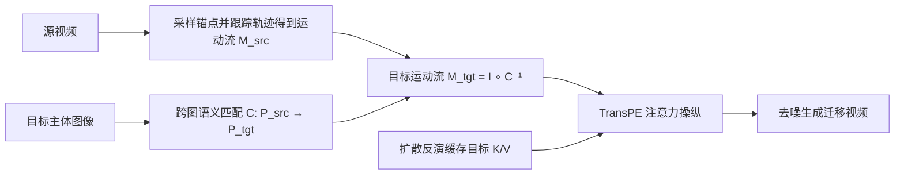

## 一句话总结

Motion4Motion 提出一个免训练（training-free）的视频运动迁移框架，不依赖预定义骨架，而是把源视频的稠密像素级"运动流"通过注意力操纵注入预训练视频扩散模型，从而在推理阶段实现跨物种、跨形态的高保真运动迁移。

## 研究背景

- 领域现状：运动迁移在角色动画、虚拟现实、影视后期中应用广泛。主流方法聚焦人体或类人角色，普遍依赖骨架表示来桥接不同主体之间的几何差异，通过提取结构化姿态取得了不错的迁移质量。
- 核心痛点：现有流水线为特定结构先验"硬编码"，难以泛化到形态差异巨大的角色（如不同物种的动物）——缺少共享骨架模板时空间对齐本身就无从定义。同时跨拓扑的高质量配对运动数据极度稀缺，限制了大规模训练；在没有骨架时，源与目标之间的语义对应也很模糊（例如椅子腿和四足动物腿的歧义）。即便是最相关的 FlexiAct，也因逐样本优化而过拟合、出现信息泄漏。
- 本文 idea：跳出基于骨架的框架，直接在稠密像素级运动流上操作，把运动流当作运动表示的基本单元。通过 TransPE 模块把源像素的时序动态映射到目标主体，实现无结构限制、纯推理期、可解释的运动迁移。

## 方法

整体框架建立在 WAN-T2V 这一采用 Flow Matching 的扩散 Transformer（DiT）之上。方法完全在推理期工作，不做任何训练：先在源视频中提取"运动流"并建立源、目标主体之间的跨图语义对应，再在去噪过程中用 TransPE 模块操纵自注意力，把运动流"写入"目标主体的生成轨迹。

关键设计：

1. 位置编码是运动的抓手。作者观察到 WAN 使用的 3D 旋转位置编码（RoPE）让注意力权重更关注时空邻近的 token，而非语义相似的 token。也就是说，token 的空间位置强烈决定了它在注意力中"被谁吸引"。这一发现是整个方法的出发点：既然位置决定了特征落在哪，那么改写位置就能改写运动。

2. 建立运动流与跨图对应。在源视频第一帧上用 Grounded SAM-2 在主体掩码内采样 $$N$$ 个锚点 $$P^1_{src}$$，用扩散特征做语义匹配得到目标主体上的对应点 $$P_{tgt}$$，形成映射 $$C: P^1_{src} \to P_{tgt}$$；再用基于 DIFT 特征的点跟踪在后续帧上追踪锚点轨迹，得到源运动流 $$M_{src}$$，即映射 $$I: P^1_{src} \to M_{src}$$。匹配与跟踪都在按时间 4 倍、空间 8 倍下采样后的坐标系里进行，与隐空间分辨率对齐。目标运动流由复合映射 $$M = I \circ C^{-1}$$ 得到，使目标语义点继承源的时空动态。

3. TransPE 注意力操纵。在去噪自注意力中保持原始 query $$Q$$ 不变。取目标主体首帧（由扩散反演缓存）的 key 特征在匹配点处的切片 $$K^\star_{tgt}$$，复制 $$F$$ 次得到外观 key 序列 $$\hat{K}$$，同样得到 $$\hat{V}$$；对 $$\hat{K}$$ 按目标运动流 $$M_{tgt}$$ 施加 RoPE 位置编码，让模型"到迁移后的新坐标去寻找目标主体的特征"，再把它们拼接进原 key、value：$$K_{new} = [\text{RoPE}(K), \text{RoPE}(\hat{K}, M_{tgt})]$$，$$V_{new} = [V, \hat{V}]$$，随后执行 $$X \leftarrow \text{Softmax}(\text{RoPE}(Q) K_{new}^\top / \sqrt{d}) V_{new}$$。这样就把带位置的目标外观特征"填"进注意力空间，迫使去噪过程在运动流指定的坐标处合成目标主体。

4. 真实图像的初始化。当目标是真实图像而非 T2V 生成时，先用 WAN-I2V 从目标图生成一段视频，再对其做确定性反演得到初始噪声隐变量作为后续注意力操纵的起点。默认在 $$[0, 40]$$ 层、50 步去噪的前 35 步内施加 TransPE。

## 实验结果

在 FlexiAct 提出的动物（33 对）与人体（123 对）迁移基准上评测，指标包括文本相似度 TS、运动保真度 MF、时序一致性 TC、外观一致性 AC，并在新建的 50 对跨类别动物基准上评测姿态相似度 PS。Motion4Motion 在所有指标上均优于基线。

| 方法 | TS↑ (综合) | MF↑ (综合) | TC↑ (综合) | AC↑ (综合) | PS↑ |
|------|------|------|------|------|------|
| MotionDirector | 0.251 | 0.305 | 0.908 | 0.881 | 0.342 |
| RoPECraft | 0.238 | 0.322 | 0.901 | 0.888 | 0.355 |
| MotionClone | 0.255 | 0.373 | 0.931 | 0.896 | 0.408 |
| FlexiAct | 0.265 | 0.384 | 0.922 | 0.938 | 0.415 |
| Motion4Motion | 0.285 | 0.448 | 0.952 | 0.967 | 0.543 |

运动保真度和姿态相似度提升最明显，作者归因于点到像素级的细粒度控制与显式语义桥接，相比依赖全局表示或模型级微调的方法能捕捉局部运动细节。用户研究采用盲配对比较（10 名评分者、50 个测试用例，以施加 TransPE 的 WAN-I2V-14B 为锚点），Motion4Motion 在运动一致性 92.5 v.s. 7.5、外观一致性 87.8 v.s. 12.2 大幅领先。此外在来自互联网的"野外"真实图像/视频上做零样本迁移，能在保持身份、服饰纹理、结构完整的同时迁移复杂舞蹈动作。

## 亮点与局限

- 亮点：
  - 完全免训练、纯推理期实现，无需大规模训练数据或额外驱动信号，避开了跨拓扑配对数据稀缺的瓶颈。
  - 用稠密运动流替代骨架，天然支持跨物种、跨形态迁移，摆脱统一骨架模板的限制。
  - TransPE 思路简洁：只改 key 的位置编码并拼接目标外观特征、保持 query 不变，可解释性好。
  - 展示了"教桌子走路"这类跨域概念合成的新应用：借助 SAM2 掩码把人腿绑定到桌腿，把生物运动迁移到无生命物体。

- 局限：
  - 依赖底座 WAN-T2V-14B 及扩散反演，单次生成的推理开销与外部工具（Grounded SAM-2、DIFT 匹配/跟踪）质量都会影响结果。
  - 跨形态迁移在结构差异极大时仍需人工绑定掩码（如桌腿）来消歧，并非全自动。
  - 语义匹配与点跟踪在下采样坐标系进行，对遮挡、大位移或匹配失败的鲁棒性未充分讨论。

## 延伸思考

- 与作者团队的 Motion2Motion（基于稀疏骨骼对应的跨拓扑迁移）形成互补：一个走稀疏骨骼对应、一个走稠密像素运动流，都在回避统一骨架这一约束。
- "位置编码即运动抓手"的观察对更广的 DiT 可控生成有启发——把 RoPE 当作可编辑的控制接口，或可推广到相机控制、布局编辑等任务。
- 方法目前解耦 self-attention 与 cross-attention 的 WAN 架构上验证，迁移到 MM-DiT（统一自注意力融合视觉与文本）架构时 TransPE 是否同样有效值得追问。
- 全自动的跨形态语义对应（免去人工掩码绑定）是自然的下一步，可能结合更强的开放词表分割与部件级对应。
