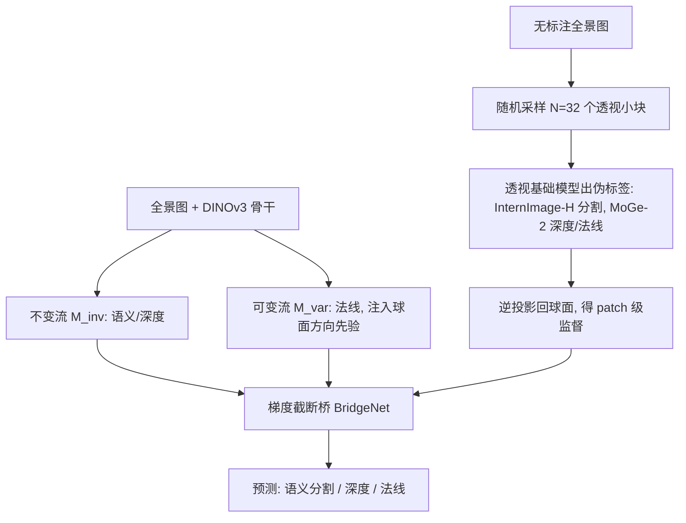

## 一句话总结

MTPano 用"透视基础模型当免费标注器 + 双流架构"训练出一个无需人工标注的全景多任务基础模型，一次预测深度、语义分割、法线，并在多个基准上超过各任务的专用模型。

## 研究背景

- 领域现状：360° 全景图能一次性观测整个环境，是 VR、机器人导航等沉浸式应用的关键。透视图（窄视角）领域的稠密预测（深度、法线、分割）已有 SAM、Depth Anything、MoGe 等强大的基础模型；全景领域也开始涌现 DA2、PanDA、Depth Any Panoramas 等专用工作。
- 核心痛点：全景稠密预测有两个硬约束。其一，高分辨率、多任务的全景像素级标注极其昂贵，数据稀缺；其二，直接把透视模型或透视多任务学习范式搬到全景上会失败——等距柱状投影（ERP）带来严重且随纬度非均匀的几何畸变，且不同任务对坐标变换的响应互相冲突。此外现有全景方法多是"单任务专家"，各干各的，忽视了任务间的协同。
- 本文 idea：从数据和模型两端同时解决。数据端用透视基础模型给全景图自动生成"无畸变、无域差"的伪标签，实现 label-free 训练；模型端提出 PD-BridgeNet，显式把任务拆成"旋转不变"与"旋转可变"两条流，用几何调制注入方向先验，再用"梯度截断桥"让两流交换有益信息却互不污染梯度。

## 方法

整体框架分两大部分：一条 label-free 训练流水线负责"造标签"，一个 PD-BridgeNet 负责"学得好"。流水线把全景图投影成若干透视小块、用现成透视模型出预测、再投影回球面作 patch 级监督；PD-BridgeNet 则在 DINOv3 骨干之上把特征拆成两条流并受控交互，同时预测语义分割、深度、法线三个主任务。

关键设计：

1. **Label-Free 训练流水线（用透视模型当标注器）**：给定无标注全景图，随机采样虚拟相机位姿（FoV、偏航、俯仰均随机），投影出无畸变的透视小块，再用 InternImage-H（分割）和 MoGe-2（深度/法线）出高质量预测。关键在于不直接拼接这些预测（会因尺度不一致产生接缝伪影），而是把伪标签逆投影回球面，只在有效像素上算损失——这种随机化 patch 监督相当于强正则，逼网络学一个跨视角一致的"平均分布"，过滤掉投影噪声。P2E 投影对不同任务做了任务感知处理：深度乘以光轴投影角、法线用旋转矩阵变换。

2. **旋转不变 vs 旋转可变的特征解耦**：论文指出全景多任务的核心冲突在于任务对相机朝向的依赖不同。语义分割、深度只依赖相对空间上下文，相机绕偏航角旋转后应保持一致（旋转不变）；而表面法线严格绑定相机坐标系，随视角变化（旋转可变）。硬共享这两组特征会导致负迁移。于是构造双流：不变流只提取无畸变视觉表征、不注入方向先验；可变流则通过 FiLM 层把每像素的归一化 3D 光线方向 $$\boldsymbol{d} = [\cos\varphi\cos\theta,\ \sin\varphi,\ \cos\varphi\sin\theta]^T$$ 与位置编码调制进特征 $$F_{var} = (1+\gamma)\cdot F_{backbone} + \beta$$，显式打破空间不变性、赋予"方向感"。

3. **ERP Token Mixer（纬度自适应卷积）**：ERP 在两极有严重拉伸，标准卷积失效。Token Mixer 把 ViT token 还原到 ERP 空间后，按纬度动态融合标准 3×3 核与宽 3×9 核：$$\text{Mixer}(X) = (1-w(\varphi))\cdot(K_{3\times3} * X) + w(\varphi)\cdot(K_{3\times9} * X)$$，融合权重 $$w(\varphi) = \lvert \sin(\varphi) \rvert$$ 随纬度增大，使球面各处的感受野聚合更均匀。

4. **梯度截断桥 + 稠密辅助任务**：两流独立处理保证了几何纯净但会丢协同信息。桥机制用 Cross-Attention（骨干特征作 query，各任务特征作 key/value）聚合多源线索成统一桥特征；关键是对跨流特征做 detach，只允许前向传递协同上下文、严格阻断来自对方分支的反向梯度，隔离优化冲突。同时给每条流加稠密辅助任务：不变流加图像梯度估计与边缘距离场（EDF）注入低级边界/纹理先验；可变流加度量点图估计（预测稠密 3D 坐标）强化绝对坐标理解。训练用 Zero-Convolution 初始化注入层保留骨干先验，并用渐进 warmup 先冻结骨干只训辅助头再整体微调。

## 实验结果

在合成室内基准 Structured3D 上与单任务专家和多任务基线对比三个主任务，MTPano 全面领先：

| 方法 | mIoU↑ (分割) | AbsRel↓ (深度) | Mean↓ (法线角误差) |
|------|------|------|------|
| MultiPanoWise（多任务） | 69.61 | 0.0557 | 5.940 |
| TaskPrompter（多任务基线） | 70.95 | 0.0414 | 5.962 |
| BridgeNet（多任务基线） | 70.13 | 0.0418 | 5.988 |
| DAP（深度专家） | - | 0.0341 | - |
| PanoNormal（法线专家） | - | - | 5.562 |
| MTPano（本文） | 75.66 | 0.0248 | 3.850 |

分割 mIoU 比此前最好的 SFSS-MMSI 高 3.69%；深度 AbsRel 降到 0.0248（优于专家 DAP 的 0.0341）；法线平均角误差降到 3.85°（优于专家 PanoNormal 的 5.56°）。相比 TaskPrompter、BridgeNet 等标准全景多任务基线，深度误差约降 40%。在真实世界基准 Stanford2D3D 上趋势一致：分割 69.47% mIoU（+8.87%），法线 9.71° 达到 SOTA；深度 AbsRel 略逊于专家 DA2 但显著优于所有多任务基线。

消融（Matterport3D，ViT-Small，用 ΔMTL 衡量相对单任务的平均提升）显示：朴素多任务基线出现严重负迁移（−3.64%），去掉特征解耦、梯度截断、ERP Token Mixer 或辅助头都会明显掉点，完整 PD-BridgeNet 达到 +7.21%。数据可扩展性实验表明，把 label-free 伪标注数据从 0k 扩到 140k，微调后性能持续提升。效率方面，相比三个单任务模型（合计 343×3 MParams）MTPano 总量 590 MParams、A100 上推理约 161 ms。

## 亮点与局限

- 亮点：
  - Label-free 思路把透视基础模型当"免费的高质量标注器"，patch 级随机监督巧妙规避了拼接接缝与投影噪声，绕开了全景标注稀缺这一根本瓶颈。
  - 对"旋转不变 vs 旋转可变"任务冲突的识别很有洞察力，双流 + FiLM 方向调制 + 梯度截断桥的组合，在保证几何纯净的同时实现安全的跨任务协同，消融证明每个组件都有效。
  - 统一多任务模型在深度、法线、分割上同时超过各自的专用专家模型，且带来跨任务互相纠错（用语义平滑不连续法线），说明协同确有增益。
- 局限：
  - 模型的输出空间继承自透视基础模型（如 ADE20k 语义类别、MoGe 的几何尺度），要在具体基准上比较仍需微调对齐，泛化到任意标签体系的能力受限。
  - 伪标签质量上限由所用透视模型决定，深度在真实 Stanford2D3D 上仍略逊于专用专家 DA2，说明蒸馏范式在某些指标上有天花板。
  - 主要在室内基准评估，室外/复杂真实场景的稳健性主要靠定性可视化展示。

## 延伸思考

这篇工作把"透视→全景"的知识迁移从单任务推广到多任务，核心贡献是把多任务学习里"任务冲突/负迁移"的经典问题，与全景特有的"旋转不变/可变几何冲突 + ERP 畸变"结合起来处理，思路可迁移到其他有坐标系依赖差异的多任务场景（如多视角、鱼眼、水下成像）。梯度截断桥这种"前向共享、反向隔离"的机制，本质是一种轻量的任务解耦手段，值得在通用多任务框架里复用。往后可关注：能否摆脱对固定透视教师模型的依赖、直接在球面上做自监督预训练；以及把点图估计这类几何辅助任务进一步扩展成真正的全景 3D 重建输出。
