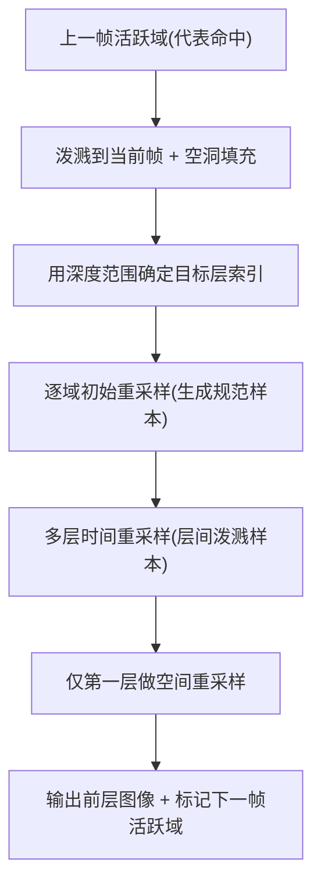

## 一句话总结

在 ReSTIR 里用"多层屏幕空间水库 + 水库泼溅"保存被遮挡的样本，让它们重新可见时能带着累积历史继续被复用，从而显著压低移动物体周围因遮挡消失（disocclusion）产生的噪声，代价只增加一点点。

## 研究背景

- 领域现状：实时路径追踪已经可行，ReSTIR 通过时空样本复用在 1 spp 下就能大幅降噪。近期的水库泼溅（Reservoir Splatting，Liu et al. 2025）把上一帧的主命中点直接前向投影泼溅到当前帧，比反向投影更容易命中相关像素，进一步改善了时间复用。
- 核心痛点：ReSTIR 的高质量依赖成功的时间复用，一旦复用失败，质量就退化到普通路径追踪。而动态场景里遮挡消失频繁发生：当一个表面被遮住时它的水库历史无法向前传递，等它重新露出来时只能从零开始，表现为移动物体后面拖着一条噪声"尾巴"，去噪后甚至像鬼影。水库泼溅在表面被遮挡时会直接丢弃这些时间样本，问题依旧。
- 本文 idea：不要在遮挡发生时丢样本，而是把它存进更深的一层水库里。维护多层屏幕空间水库（类似 deep frame buffer），用水库泼溅在层之间搬运样本，让暂时被遮挡、随后重新可见的样本保留住累积历史继续贡献。

## 方法

整体框架：为每个像素维护多层水库（第一层是主命中，往下依次是第二近、第三近命中……）。每帧先把上一帧"活跃域"的代表命中泼溅到当前帧确定它们落在哪一层，再做多层的时间/空间重采样。核心难点是"如何高效判断样本该进哪一层"以及"如何避免维护满屏所有层"，作者分别用深度范围和活跃域两招解决。

关键设计：

1. **多层水库与层间泼溅**：把路径积分按命中的"秩"（rank，沿相机光线的第几个交点）拆成多层积分，第 $$i$$ 层假设第 $$i$$ 近的交点直接可见。当像素发生遮挡消失时，当前帧前层积分 $$I_1$$ 往往能匹配上一帧某个深层估计 $$I^{\text{prev}}_i$$，因为可见的第一顶点集合基本一致，于是深层里存的历史可以无偏地复用到前层。为什么要这样：这正是把"被遮挡但会回来"的样本历史保住的机制。

2. **深度范围（Depth Ranges）**：严格按秩确定层需要逐个交点步进、追多条最近命中光线，很贵。作者观察到深层不必严格按秩定义（最终画面只由前层覆盖），于是为每层预计算不重叠的深度范围 $$D_i = [L_i, R_i]$$，把"追多条最近命中光线"替换成"两次可见性查询"：先测样本是否属于前层 $$A_1$$，否则找到包含其相机距离的深度范围 $$D_i$$，在该范围内做一次受限可见性查询确认它是范围内最近命中即可归到第 $$i$$ 层。每像素用各自的代表命中扩展成不重叠区间，每帧只预计算一次；相邻区间重叠时按中点 $$R'_i = L'_{i+1} = (R_i + L_{i+1})/2$$ 裁剪。

3. **活跃域（Active Domains）**：维护 $$k$$ 层会让 ReSTIR 成本乘以 $$k$$，但很多远处物体几乎不会被重新露出。作者只维护"可能很快重现"的活跃域子集，用一个传递式激活方案：首帧只有主层活跃；某活跃域被泼溅到当前帧后就把落到的域标为活跃，新可见域也标活跃；代表命中泼溅出屏幕则自动失活。为修补泼溅带来的空洞，还把活跃域固定半径（实现里为 3 像素）内的邻居也当作活跃参与采样（但不再向下帧传播激活）。此外用即时遮挡物（实例 ID）比对来剔除误激活的假阳性域。

实现上还有若干工程细节：每个域存一个代表命中（像素中心追出）和一个子像素样本命中；深度范围取 $$[(1-\epsilon)t, (1+\epsilon)t]$$，$$\epsilon = 0.01$$；只对前层做空间重采样；把活跃域压紧到连续缓冲、每域一线程以提升利用率；只保留奇数号交点（背面不贡献），第 $$i$$ 层对应第 $$2i-1$$ 个交点。

## 实验结果

在 Falcor 中实现，测试平台为 i9-13900K + RTX 4090，1920×1080，误差用 MAPE 与 FLIP。场景包括 Bistro、Subway、Emerald Square、Carousel（前三相机运动，Carousel 物体运动），最大层数按可见深度复杂度设为 2~5。

下表取 Carousel 场景的等价对比（对应论文主图），说明本方法相较基线水库泼溅在遮挡消失区域降噪明显，且远低于"暴力统一五层"的开销：

| 方法 | 耗时 | 遮挡消失区噪声 | 说明 |
|------|------|------|------|
| Reservoir Splatting [Liu 2025] | 15.5 ms | 高（拖尾噪声） | 遮挡时直接丢弃时间样本 |
| Ours（选择性活跃域 + 深度范围） | 22.5 ms | 低 | 质量接近统一五层，成本小得多 |
| Uniform 5 layers（无深度范围） | 42.8 ms | 低 | 上限参考，成本高 |

其余结论以文字补充：深度范围让泼溅阶段的光线数最多减少约 59%；活跃域虽然维护的深层域数量远少于统一 $$k$$ 层（如 Bistro 的深层域从 2.07M 降到 0.26M），但对遮挡消失像素的覆盖率仍接近统一方案（约 66%~90%）。层数消融显示层越多深层高质量样本越多、方差越低，重叠几何多的场景需要更多层，而因只维护活跃域，成本增幅有限。空洞填充能改善激活的空间连续性并降噪，半径增大收益递减。接 NVIDIA 实时降噪器（NRD）时，本方法提供更干净的输入信号，让 NRD 在遮挡消失的树叶区产生更时间一致、更少色块的结果，优于 NRD 自带的 disocclusion fix（后者会过度模糊）。与 SPMIS（Stochastic Pairwise MIS）互补，两者结合总体质量最佳。

## 亮点与局限

- 亮点：
  - 把"遮挡消失"这一 ReSTIR 的根本难题，用直观的多层水库 + 层间泼溅优雅地解决，保住了被遮挡样本的累积历史。
  - 深度范围把逐交点追光换成两次可见性查询，活跃域把 $$k$$ 倍成本压回到很小的增量，两项工程设计让方法真正实时可用。
  - 无偏：延续 GRIS/水库泼溅的置信权重与 MIS 框架，跨层复用保持无偏。
  - 与降噪器、SPMIS 等正交，可组合。

- 局限：
  - 纯屏幕空间、只存屏幕空间信息，无法处理从视锥外新进入画面的几何（如屏幕边界噪声）。
  - 选择性激活用覆盖率换开销，首次可见的区域初期仍会更噪。
  - 大量可见样本同时被遮挡时需维护很多域，成本上升。
  - 当前不支持景深与运动模糊（这些设置下判断遮挡需在整个光圈/时间区间上评估可见性）。

## 延伸思考

- 作者提出的未来方向很自然：把深层保存的"被遮挡样本信息"暴露给上采样器（DLSS/FSR）和降噪器，从数据源头改善它们对遮挡消失区的处理，而不是各自在末端硬猜。
- 另一个方向是扩展到透明渲染——跟踪透明面后的不透明样本，随物体移动复用其信息，思路和多层水库天然契合。
- 更一般地看，这是"deep frame buffer / depth peeling"经典思想在 ReSTIR 时代的再利用：过去深度剥离服务于顺序无关透明与屏幕空间 GI，这里被重新定位为"跨深度不连续处的无偏时间复用"，提示很多经典多层缓冲技术都值得在重采样框架下重新审视。
