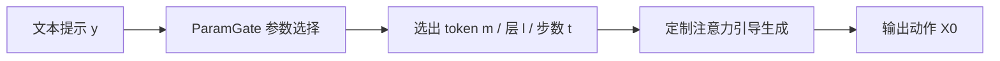

## 一句话总结

MultiAct 是一个无需重训练、推理时（inference-time）的文本到动作生成框架，通过自适应放大被忽视的文本 token 的交叉注意力，让预训练动作模型能同时生成复合文本里描述的多个并发动作。

## 研究背景

- 领域现状：文本到动作（text-to-motion）生成近年来进展迅速，扩散模型和 VQ-VAE 类模型都能从自然语言生成逼真的人体动作，为动画和人机交互提供了直观的接口。
- 核心痛点：现有模型在面对"同时发生多个动作"的复合提示（如"边向前跳边举起手臂"）时很脆弱。它们往往只关注一个主导动词，忽略次要约束（副词、方向、方式等），作者称之为"语义消失"（vanishing semantics）。根源在于交叉注意力纠缠：多个语义成分竞争时，注意力质量会坍缩到少数主导 token 上，压制了其余成分。
- 本文 idea：与其重训模型，不如在推理时直接干预。既然问题出在交叉注意力分配失衡，就用基于梯度的优化，选择性地放大那些被低估 token 的注意力分数。但作者发现有效的调制高度依赖提示，即"改哪个 token、哪一层、哪几个扩散步"因提示而异，于是又设计了一个轻量的参数选择方案 ParamGate 来自动决定这些参数。

## 方法

整体框架：给定一段文本提示，MultiAct 先用 ParamGate 为该提示挑选最优参数（要强化的 token、优化所用的 transformer 层、施加优化的扩散步数），再运行定制化的注意力引导生成，输出动作。整个过程作用在冻结的预训练扩散骨干（改造版 MDM，记为 MDM\*）上，不做微调也不改架构。

关键设计：

1. 注意力对齐损失与引导。作者把"低交叉注意力、对生成影响弱"的 token 定义为被低估 token。对选定的 token 索引 $$m$$、扩散步和 transformer 层，定义对齐损失 $$L_{atn} = \frac{1}{N}\sum_{i=1}^{N}(1 - A_{i,m})^2$$，其中 $$A_{i,m}$$ 是第 $$i$$ 帧对 token $$m$$ 的注意力分数。再沿梯度方向更新动作隐变量 $$X' = X - \eta \nabla_X L_{atn}$$，把动作结构拉向文本语义。这一步鼓励模型在整个时间维度上加强对被忽视 token 的关注。

2. 为什么需要按提示定制参数。作者发现图像域直接搬来的注意力操纵不稳定：动作的时空特性让时间连贯性对注意力扰动非常敏感，一个对某提示奏效的配置换个提示就失败。因此参数选择成了关键。他们先构造包含 token、层、扩散步范围的大参数空间，用 k-means 聚类剪枝：观察偏差图（deviation plot）里参数组合到原点距离的清晰视觉分离，把候选层缩到 3-5 层、扩散步缩到前 1-3 步（50 步里的第 46-48 步，即只在结构成形的早期干预），token 则锁定为"动作细节"类（副词、方向、方式），而非动词——因为自注意力里动作细节 token 往往同时编码了细节和底层动作，信息更丰富。

3. ParamGate 决策方案。剪枝后的空间不再能靠聚类分离，需要更精细的预测。由于精选提示集 Y 只有 100-200 条，作者用轻量的非深度学习方法：选层用最近邻（语义相似的提示共享最优引导层，用 CLS token 嵌入的 L2 距离找最近邻）；选扩散步数用一维阈值分类器（偏差越大、需要引导的步数越多）；选 token 用"测试时缩放"（test-time scaling）——让 LLM 抽出提示里的动词、动作细节和形容词（约 3-4 个候选），各生成一个动作并算偏差，取偏差最小者。作者也提供了更快但略差的方案：直接从缩小的 token 集里采样。

4. 文本对齐偏差度量。这是选参数的评判标准。基于 T2M 的多模态距离，把提示按"prefix while suffix"拆开分别评估、再取 L2 范数，称为"双多模态距离"（dual multi-modal distance）。作者用一个几何启发式（最大手-肩距离）做了 sanity check，验证低偏差确实对应正确生成、没有假阳/假阴。

## 实验结果

骨干是改造版 MDM（MDM\*），在 HumanML3D 上重训、用 BERT 做文本条件。作者自建了 140 条"既难又清晰"的并发动作提示集。主实验把 MultiAct 与四个基线对比：不专门处理并发动作的 MDM\* 与 MoMask，以及专门处理并发动作的 STMC 和适配到动作域的 Attend-and-Excite\*。

| 方法 | R Precision Top1 ↑ | Dual MM Dist ↓ | 用户研究总体偏好 ↑ |
|------|------|------|------|
| MDM\* | 0.08 | 110.64 | 8.74 |
| MoMask | 0.03 | 134.34 | 14.56 |
| STMC | 0.07 | 104.60 | 23.47 |
| Attend & Excite\* | 0.03 | 116.44 | 20.00 |
| MultiAct（动作细节 token） | 0.14 | 96.07 | 无 |
| MultiAct（测试时缩放） | 0.11 | 85.16 | 83.30 |

MultiAct 在文本对齐和用户偏好上都明显领先。用户研究里，相对最强基线 STMC，本方法在偏好、质量、文本-动作对齐上分别拿到 76.53% / 79.22% / 77.50% 的投票；相对骨干 MDM\* 更是在文本对齐上高达 97.51%。因为数据集是无配对的，FID、多样性等指标不适用，多样性通过定性结果展示。

其余实验：在 HumanML3D 的"prefix while suffix"子集（539 条）上，尽管该子集对本任务并不理想（约 40% 提示偏易、部分语义含混），MultiAct 仍在几乎所有指标上优于骨干。消融实验表明单一固定参数配置效果很差，逐步加入 ParamGate 的层选择、步数选择、token 选择后性能递增，测试时缩放最佳。定性上，本方法还能在并发动作的同时叠加动作风格（如"像醉汉一样走路同时挥手臂"），这是 STMC 等按身体部位分配动作的方法做不到的。

## 亮点与局限

- 亮点：
  - 完全推理时、无需重训或改架构，可直接套在已有预训练动作模型上，工程落地成本低。
  - 精准诊断出"语义消失"源于交叉注意力坍缩，并给出针对性的注意力放大方案。
  - 通过 ParamGate 用轻量非深度方法解决了"参数因提示而异"这一核心难题，避免了穷举搜索。
  - 发现"动作细节 token 比动词更适合强化"这一反直觉但有解释力的经验规律。

- 局限：
  - token 选择要么依赖耗时的测试时探索，要么依赖启发式语言线索，前者增加计算量（整体约为骨干推理的 6 倍），后者可能漏掉最有影响力的语义元素。
  - 方法性能受限于骨干，会继承其动作伪影、过度平滑或抖动等问题。
  - 目前主要处理"两个并发动作"，对更复杂的多元素交互描述支持有限。

## 延伸思考

这项工作把图像域成熟的注意力操纵思路（Attend-and-Excite 等）迁移到动作域，但没有生搬硬套，而是针对动作的时空敏感性做了"单层、单 token、早期少数步"的定制，这个"少即是多"的调制哲学值得注意。ParamGate 用最近邻、一维阈值、LLM 抽词这类朴素方法就把参数预测做通，反映出在小数据（100-200 条提示）场景下轻量方法反而更稳。未来方向包括扩展到多 token 引导、建立 token 与特定 transformer 层的关联，以及支持更复杂的交互式复合描述。对做可控动作生成或推理时引导的研究者，这套"冻结骨干 + 注意力引导 + 自动选参"的范式有较强的可复用性。
