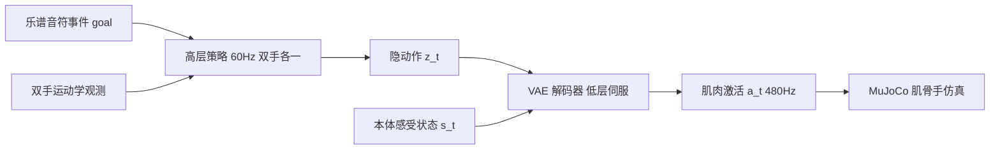

## 一句话总结

本文用"高频肌肉级控制 + 低频隐空间协调"的分层架构，让肌肉驱动的骨骼手模型能够物理仿真地演奏参考数据集之外的新曲目钢琴，在物理约束下实现精准的双手弹奏。

## 研究背景

- 领域现状：物理仿真合成人体运动已广泛用于角色动画、具身智能、机器人与生物力学。其中肌肉驱动（musculoskeletal）模型比传统关节力矩驱动更贴近真实生理，能分析肌肉疲劳、量化损伤风险。已有钢琴演奏合成工作要么在运动学空间生成手部动作，要么用物理仿真但只在关节空间控制。
- 核心痛点：现有 SOTA 的物理弹琴系统只控制关节空间，忽略底层肌肉动力学，常产生生理上不真实的关节姿态。而肌肉驱动系统本身"过驱动"（肌肉数远多于自由度）、动力学高度非线性、且驱动器只能单向拉伸（肌腱单元），对强化学习极不友好，同时又要求高频控制以保证手指姿态的精细协调。
- 本文 idea：把"通用肌肉协调"和"曲目相关的决策"解耦成两层。底层策略在高频直接输出肌肉激活、只负责模仿大规模弹琴数据集里的姿态；再把它蒸馏成一个平滑结构化的隐空间；高层策略在这个隐空间里以低频工作，把乐谱音符事件翻译成目标行为，从而合成参考数据之外的演奏。

## 方法

整体框架分三阶段训练：先用强化学习训练一个通用的单手**追踪策略** $$\pi_{\text{track}}$$，在 480Hz 直接输出肌肉激活去模仿参考动作；再通过监督式蒸馏把追踪策略压进一个 VAE 解码器，得到平滑的低频隐空间 $$z_t$$ 作为低层"伺服"；最后针对每首曲子训练一个高层控制器，在隐空间里以低频协调双手弹奏。

关键设计：

1. **双频追踪策略（底层）**：策略 $$\pi_{\text{track}}(a_t \mid s_t, h_t)$$ 在与物理同频的 480Hz 输出肌肉激活，而目标姿态轨迹按 60Hz 更新（每 8 帧一采样）。观测里包含每个肌腱单元的长度、速度和当前激活——因为激活是有时间常数的动力学过程，新激活取决于旧激活。奖励在追踪精度之外用四阶范数 $$r_{\text{act}} = \exp(-\lVert a_t \rVert_4^4 / \dim a_t)$$ 惩罚大激活、鼓励稀疏且类人的肌肉发力。位置奖励用两项指数（$$0.7\exp(-50 e_p) + 0.3\exp(-3 e_p)$$）同时覆盖厘米级大范围移动和毫米级按键精度。

2. **隐空间蒸馏（连接层）**：直接用目标姿态嵌入 $$h$$ 驱动高层探索太稀疏，于是按 $$\beta$$-VAE 把追踪策略蒸馏进一个 VAE，解码器把低频隐码 $$z_t$$ 映射回高频激活。训练用混合 on-policy 蒸馏：状态由 VAE 解码器自己 rollout（暴露自身误差、学会纠错），同时以 20% 概率注入 $$\pi_{\text{track}}$$ 的激活防止状态漂移。这个低维隐接口隐式地正则化控制、鼓励协调的激活模式。

3. **音乐条件的高层合成（顶层）**：把左右手当作两个独立 agent 做**去中心化多智能体强化学习**，各自有策略 $$\pi_{\text{high}}^{h}(z_t^h \mid Q_t, g_t)$$ 并共享双手运动学观测以协调、防碰撞。目标 $$g_t$$ 是接下来 $$N$$ 组按键模式的指示向量（88 键加一个 $$+/-$$ 号标记手别），比固定时间窗给出更长的规划视野。奖励含正项（鼓励正确按键、按下深度 $$d_k/D_k > \tau$$ 才算发声）和负项（惩罚非目标键的深按），并用 GAN 式对抗模仿 + 多目标学习平衡"动作自然"与"精准弹对"。采样上沿用基于 MCMC 的自适应采样，用 recall 分数驱动、专攻容易漏音的难段。

4. **增强的肌骨手模型**：基于 MyoHand，保留前臂（很多控制手指/手腕的肌肉源于此），在肘部加 6 自由度自由根。作者发现原模型缺少若干关键肌肉，导致手指外展-内收和屈曲力量不足，于是按解剖学在手掌两侧补了 FPB、AdP、APB、FDM、ADM 五组肌腱单元，改善拇指和小指的精细控制。最终每只手 44 个可驱动肌腱单元、23 个活动关节、50 个可控自由度，用 MuJoCo（MJX + JAX GPU）仿真肌腱动力学。

## 实验结果

主实验对比增强手模型与原始 MyoHand 在参考数据集上的追踪误差（mean，单位 mm，取左右手代表值）：

| 指尖/部位 | MyoHand（左/右） | 本文模型（左/右） |
|------|------|------|
| 手腕 | 3.7 / 2.9 | 1.5 / 1.4 |
| 拇指 | 11.2 / 12.1 | 2.4 / 2.3 |
| 食指 | 4.9 / 4.1 | 3.2 / 3.7 |
| 中指 | 3.9 / 3.7 | 3.1 / 3.1 |
| 无名指 | 3.7 / 3.1 | 3.3 / 3.1 |
| 小指 | 6.4 / 5.1 | 3.5 / 3.8 |

增强模型把所有指尖和手腕的平均误差压到 4mm 以内，拇指从超 1cm 降到约 2.4mm、小指从 5mm 以上降到约 3.5mm，且避免了 MyoHand 在极端外展/屈曲下的关节锁死。

高层合成方面，在 15 首数据集外、时长 15–32s、音符 100–354 个的曲目上，肌肉驱动策略 F1 平均 0.94、全部曲目 >0.9；关节驱动基线（同形态、PD 伺服，代表性能上限）F1 >0.96，本文在若干曲目上追平基线。此外用 EMG 实验验证：追踪策略复现受试者动作（指尖误差约 0.9–2.6mm）后，生成的肌肉激活在时序上与实测 EMG（EDC、FDP+FDS、ADM+FDM 等）整体吻合，三次重复动作对应三个激活峰。

## 亮点与局限

- 亮点：
  - 首个能合成物理与生物力学双重可信的钢琴演奏手部运动的系统，F1 >0.9。
  - 用隐空间接口取代显式关节/力矩耦合，把过驱动、非线性的肌肉控制难题拆成"通用底层 + 曲目高层"，显著提升训练效率与稳定性。
  - 底层追踪在无钢琴环境训练却能泛化到接触丰富的按键场景；涌现出无监督的指法推断、手部交叉/大跨越等协调行为。
  - 用 EMG 记录做生理保真度验证，而非仅看视觉效果。

- 局限：
  - 高层控制器是**逐曲训练**（piece-specific），换新曲需重新训练高层策略，不是一次训练泛化到任意乐谱。
  - 手别分配依赖 clef 启发式（低音谱号=左手、高音谱号=右手），复杂配器可能不适用。
  - EMG 验证仅单个受试者、且承认存在个体解剖差异导致的偏差；仿真肌肉模型（MuJoCo 耦合肌腱）也做了简化。

## 延伸思考

这套"通用低层技能 + 隐空间 + 任务高层"的分层范式与 PULSE、MaskedMimic、PhysicsVAE 等物理动画工作一脉相承，本文把它推进到肌肉驱动、强精度、接触丰富的双手灵巧操作这个更硬的场景。逐曲训练高层是当前主要瓶颈，一个自然方向是把高层也做成可泛化的、以乐谱为条件的策略（甚至用生成模型直接产隐轨迹），实现"看谱即弹"。肌肉级激活可与 EMG、疲劳/损伤分析结合，向生物力学、康复和生物机器人迁移；把黑箱肌肉动力学的思路推广到全身灵巧任务（吉他、打击乐已被相关工作触及）也值得追问。
