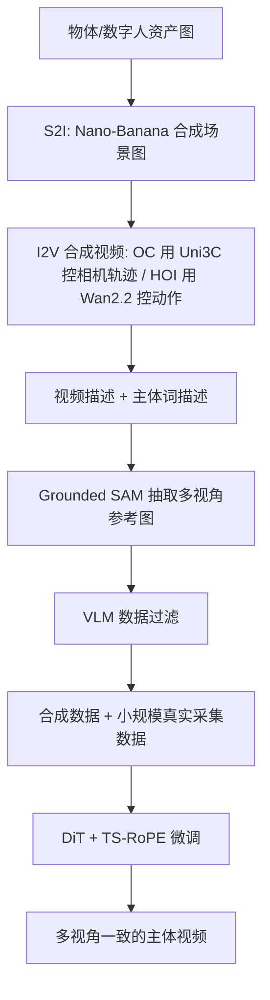

## 一句话总结

MV-S2V 首次提出并求解"多视角主体到视频生成"(MV-S2V) 任务：给定同一主体的多张不同视角参考图，合成一段在三维层面与参考保持一致的视频；其两大支柱是一条可控的合成数据构造管线与一种能区分"跨主体"与"跨视角"参考的时移旋转位置编码 (TS-RoPE)。

## 研究背景

主体到视频生成 (Subject-to-Video, S2V) 以文本提示加一组主体参考图为输入，要求生成视频中主体的身份保持一致，比文生视频 (T2V) 更可控、比图生视频 (I2V) 更灵活。但现有 S2V 有两个根本局限。其一，高质量训练数据采集成本极高。其二，几乎所有方法对每个主体只吃单张参考图，因而只能约束生成视频中主体的单一视角外观。作者尖锐地指出：在这种单视角设定下，S2V 其实可以被拆解为"主体到图 (S2I) + 图到视频 (I2V)"两级流水线，而这两个子任务的数据都远比 S2V 好收集——那么 S2V 相对于这条流水线的根本价值究竟在哪里？

作者的回答是多视角主体控制：用来自不同视角或状态的参考图，全面约束视频中主体随时间变化的动态外观。这正是 S2V 区别于"S2I + I2V"的核心价值，也对广告、增强现实等对主体高保真度要求苛刻的应用意义重大。由此提出 MV-S2V 任务。

实现这一目标面临两大挑战。第一是训练数据缺失：既要视频显式展示主体的不同侧面、又要与多视角参考图建立对应，这类视频在海量网络视频中占比极低，直接挖掘不可行；已有环绕数据集 (如 Co3D) 相机抖动严重、主体与背景多样性差，HOI 数据集 (如 HOIGen-1M) 中多视角展示样本又几近于无。第二是参考条件的注入：从单视角扩展到多视角后，模型必须同时区分"不同主体"与"同一主体的不同视角"，而现有沿帧维拼接或单图拼贴的条件机制无法区分这两种情况。

## 方法

### 整体框架

方法建立在预训练文生视频基座 Wan 2.1 之上，并从已在大规模单视角 S2V 上训练过的 Phantom-Wan 权重微调。输入为文本描述 $$y$$ 与一组参考图 $$\boldsymbol{R}=\{\boldsymbol{R}_1,\boldsymbol{R}_2,\ldots\}$$，其中 $$\boldsymbol{R}_i=\{I^{r_i}_1,\ldots,I^{r_i}_{M_i}\}$$ 表示第 $$i$$ 个主体的 $$M_i$$ 个参考视角。目标是建模条件分布：

$$p(\boldsymbol{V}\mid\boldsymbol{R},y)=p(I^v_1,\ldots,I^v_{T_0}\mid I^{r_1}_1,\ldots;I^{r_2}_1,\ldots;y)$$

目标视频与所有参考图共享同一个 3D VAE 编码器，从而在潜空间对齐；文本经 T5 编码后通过交叉注意力融合；DiT 在潜空间迭代去噪。视频潜元与参考潜元被拼成一个统一 token 序列，交由 DiT 的自注意力交互——旋转位置编码 (RoPE) 在此起关键作用，负责区分视频 token 与参考 token、并区分不同主体与不同视角。

### 数据构造管线

作者聚焦两类天然展示多视角主体的视频：物体中心 (Object-Centric, OC) 的环绕拍摄，以及人物操纵手持物体展示不同侧面的人物-物体交互 (Human-Object Interaction, HOI)。由于此类真实视频稀缺，管线转向用 I2V 模型合成可控数据：先用 S2I 模型 Nano-Banana 把约 16000 个物体资产 (美妆个护、鞋、箱包、玩具按 1:1:1:7) 与 4734 张人像合成场景图；OC 视频用可控相机的 Uni3C 保证多视角展示，HOI 视频用提示跟随力强的 Wan2.2 让人物平滑转动物体；再用 Taiser2 生成描述、Grounded SAM 抽取参考图。

一个关键小技巧：直接用类别词 (如 book, figurine) 让 Grounded SAM 分割常返回多个实例，而在提示前加"聚焦修饰语" (如 the most salient book, the handheld figurine) 就把分割可用率从 15% 提升到 90% 以上。为削弱从视频抠图带来的"复制粘贴"效应，作者生成较长原始视频、剪取较短片段作训练视频，而参考关键帧仍取自原始视频，使部分参考视角与训练视频解耦；并对参考图做尺度、旋转、平移、亮度增强。最终 OC/HOI 分别收集 11804 与 10130 条合成样本，另辅以视频与参考图完全分离采集的真实数据 (OC/HOI 各 1724、1514 条)。

### 多视角参考条件：TS-RoPE

作者系统比较了三种 RoPE 设计。Vanilla RoPE 直接把参考潜元沿时间维追加到视频后，保留基座结构，但不同主体与同主体不同视角可能落在相邻帧，导致混淆。Spatially Shifted RoPE (SS-RoPE) 把同主体的多视角安排在同一时间帧、用空间维错开区分视角——但空间位移在基座训练中不存在、需从零学起，且视频帧与参考仍缺乏清晰分隔。Temporally Shifted RoPE (TS-RoPE) 回到帧维统一逻辑：在视频与参考之间、以及不同主体的参考之间插入固定时间位移 $$\delta$$，同主体的不同视角则排在相邻帧。这样既清晰分隔了视频与参考、又区分了跨主体与跨视角，同时贴近基座固有结构。

训练基于 Rectified Flow，噪声插值 $$x_t=(1-t)\cdot x_0+t\cdot\epsilon$$，模型 $$G_\theta$$ 预测速度向量并最小化 $$\mathcal{L}_{rf}=\lVert v_t-u_t\rVert^2$$。训练中对参考与文本各施 0.1 dropout，并随机丢弃、打乱多视角参考以增强对视角数与顺序的泛化。共训练 2000 步 (批大小 64、学习率 $$1\times10^{-5}$$)，约 3600 A100 GPU 小时。推理用 UniPC 采样 50 步，对参考与文本分别施加 CFG (权重 $$\omega_{\boldsymbol{R}}=2.5$$，$$\omega_y=7.5$$)。

## 实验结果

评测基准取自 NAVI 的 35 个物体各采样 4 个稀疏视角，HOI 场景另用 Nano-Banana 生成 35 张人像。评测涵盖三方面：整体视频质量 (VBench 的美学、成像、运动平滑度)、文本-视频一致性 (ViCLIP)、以及主体-视频一致性。后者又细分为多视角一致性 (DINO/CLIP 双向特征相似度、相机对齐后的 MEt3R 分数) 与三维一致性 (用 $$\pi^3$$ 估计点云后的双向最近邻距离)。对比方法为 Phantom 与 MAGREF 各自的单视角 (SV) 与多视角 (MV) 变体。下表为物体中心场景主结果：

| 方法 | $$S^{v\to r}_{dino}\uparrow$$ | $$S^{r\to v}_{dino}\uparrow$$ | $$S^{v\to r}_{met3r}\downarrow$$ | $$S^{r\to v}_{met3r}\downarrow$$ | $$D^{v\to r}_{nn}\downarrow$$ | $$D^{r\to v}_{nn}\downarrow$$ | 成像 $$\uparrow$$ | ViCLIP $$\uparrow$$ |
| --- | --- | --- | --- | --- | --- | --- | --- | --- |
| Phantom-SV | 0.738 | 0.668 | 0.167 | 0.207 | 0.449 | 0.431 | 0.747 | 0.237 |
| Phantom-MV | 0.770 | 0.699 | 0.151 | 0.192 | 0.168 | 0.212 | 0.704 | 0.236 |
| MAGREF-SV | 0.700 | 0.685 | 0.173 | 0.178 | 0.562 | 0.451 | 0.722 | 0.239 |
| MAGREF-MV | 0.703 | 0.672 | 0.186 | 0.197 | 0.205 | 0.236 | 0.715 | 0.236 |
| MV-S2V (本文) | 0.776 | 0.755 | 0.131 | 0.141 | 0.110 | 0.177 | 0.747 | 0.229 |

本文在主体一致性 (尤其三维一致性的最近邻距离) 上全面领先，视觉质量与文本跟随力则具竞争力；HOI 场景结论一致。定性上，单视角基线只贴合单一参考视角、对其他视角靠"猜"，常与真实外观不符；多视角基线因训练与推理设定不匹配，易出现物体形变或碎裂。

消融方面：参考条件设计上 TS-RoPE 优于 Vanilla 与 SS-RoPE，其中 SS-RoPE 的三维最近邻距离显著恶化 ($$D^{v\to r}_{nn}$$ 高达 0.662)；时间位移取 $$\delta=10$$ 最优，$$\delta=5$$ 偏小会退化、$$\delta=20$$ 与默认相当，说明足够的时间位移对区分视频与参考至关重要。参考视角数从 1 增到 4，多视角与三维一致性稳步提升。作者还提出视锥距离 (View Frustum Distance, VFD) 量化新视角生成能力，结果显示模型显著超过简单插值基线 (FrameInterp)，即便只给单张参考也能生成多样新视角。

## 亮点与局限

亮点在于：以清晰的任务动机 (证明 S2V 相对 "S2I+I2V" 的不可替代价值) 立论，把"多视角主体控制"确立为 S2V 的核心；用 I2V 模型的可控性反向合成稀缺的多视角展示数据，并用长视频剪短、参考取自原始帧等手段缓解复制粘贴效应；TS-RoPE 以最小改动 (仅调整位置编码的时间位移) 就解决了跨主体与跨视角的混淆，贴近基座结构、易于微调收敛；此外还系统设计了多视角与三维一致性的评测指标 (DINO/CLIP、MEt3R、点云最近邻、VFD)，为该任务立了基准。

局限在于：目前主要处理 OC 场景下的单一中心主体，或 HOI 场景下额外加一个人物主体，尚未覆盖"多个主体各有多视角参考"的情形；同时只针对刚性主体的外观控制，未涉及可形变主体的多状态控制 (如给出冰箱开合两种状态参考图、生成开门视频)。

## 延伸思考

这项工作最有启发的地方是"用生成换采集"的数据思路：真实的多视角主体展示视频稀缺，就借助已足够成熟且可控的 I2V 模型定制合成，把无法自然获取的数据分布"造"出来，再用少量真实数据校正域差。这与用视频反推三维监督、用大模型合成标注等趋势一脉相承——当某种监督信号在真实世界中难以采集时,先问"能不能用现有生成模型可控地造出来"。

另一点是 TS-RoPE 体现的"以位置编码承载归纳偏置"范式。近年多项工作 (MSRoPE、ShiftPE、ReRoPE、PE-Field) 都在用 RoPE 注入分辨率、风格对齐、时序事件、视角对应等先验，本文把它用于分隔多视角参考的语义边界。相比新增模块或改架构，操纵位置编码几乎零参数、且最大限度保留基座能力，是微调大型扩散模型时值得优先考虑的低成本控制手段。一个开放问题是：当主体数与视角数进一步增长、序列被大量参考 token 占据时，这种时间位移排布是否会遇到注意力预算与位置外推的瓶颈。
