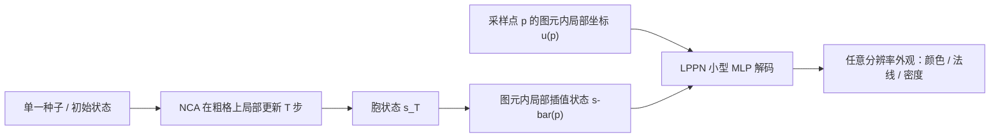

## 一句话总结

让神经元胞自动机（NCA）在一个粗网格上演化，再配一个轻量的、以坐标为输入的隐式解码器（LPPN），把粗网格的胞状态解码成任意分辨率的高清外观，从而在保留 NCA 自组织特性的同时突破长期困扰它的低分辨率瓶颈。

## 研究背景

- 领域现状：NCA 是一类受生物启发的动力系统，所有胞共享同一个可学习的局部更新规则，通过迭代自组织出复杂图案，天然具备再生、鲁棒、自发运动等特性，在纹理合成与形态发生（morphogenesis）上已有不少成果。
- 核心痛点：NCA 基本被困在低分辨率。原因有三：训练的显存与算力随网格尺寸近似平方增长；信息严格局部传播（每步只跨一个邻域），远距离协调需要很多步；高分辨率实时推理的计算负担重。现有 NCA 通常只能在 $$10^4 \sim 10^5$$ 个胞（约 $$64\times64$$ 到 $$256\times256$$）的规模上训练。
- 本文 idea：把"动力学"和"外观"解耦。NCA 只在粗格上跑局部更新负责决定结构在哪里生长；另设一个轻量、坐标驱动的神经场解码器 LPPN，以局部插值后的胞状态和图元内相对坐标为条件，在任意查询点渲染高清外观。渲染分辨率因此与 NCA 网格尺寸彻底脱钩，训练仍在低分辨率进行，推理因两者皆局部而高度可并行。

## 方法

整体框架：模型是 NCA + LPPN 的混合体，端到端联合训练。NCA 在粗格上迭代 $$T$$ 步得到胞状态；随后对任意采样点 p，先在其所属图元内做局部状态插值得到 $$\bar{\boldsymbol{s}}(p)$$，再算出该点在图元内的局部坐标 $$u(p)$$，两者一起送进共享的小型 MLP 解码器 LPPN，输出该点的外观属性（颜色、法线等）。LPPN 只在计算损失时才被求值，全部递归更新仍跑在粗格上，因此额外开销极小（约多 $$20\sim30\%$$ 参数）。

关键设计：

- 图元与局部坐标：每个采样点归属一个"图元"（primitive），即包围它的一组胞及其几何形状——2D 网格是矩形、3D 体素是立方体、三角网格是三角形、图/Voronoi 是多边形。用满足单位分解、非负、线性精度三条件的 $$\lambda$$-坐标（三角形用重心坐标、矩形用双线性权重、多边形用均值坐标）来描述 p 的相对位置，并由此对周围胞状态加权平均得到 $$\bar{\boldsymbol{s}}(p) = \sum_{j\in\Omega}\lambda_j(p)\boldsymbol{s}_j$$。随后把 $$\lambda$$ 转成更紧凑、零中心化到 $$[-1,1]$$ 的局部坐标 $$u(p)$$ 喂给解码器，经验上更利于学习。
- 保证 $$C^0$$ 连续与均匀性：原始局部坐标在图元边界处不连续，会让解码结果出现拼块伪影。对矩形/立方体，用正弦基编码 $$\boldsymbol{u}_{\text{aug}} = [\sin(\pi\boldsymbol{u}), \cos(\pi\boldsymbol{u}), \ldots]$$ 让坐标跨边界连续且图元内单射；对三角形/多边形，先按降序排序局部坐标消除顶点顺序依赖以取得 $$C^0$$ 连续，再做单调重映射把各分量的动态范围拉均匀。排序会破坏单射性，但 LPPN 同时以 $$\bar{\boldsymbol{s}}(p)$$ 为条件补足了缺失信息。
- 轻量 MLP 解码器：LPPN 是一个 4 层 SIREN（三层正弦激活 + 线性输出）的小 MLP $$\boldsymbol{f}_\theta$$，输出 $$\boldsymbol{o}(p) = \boldsymbol{f}_\theta(\bar{\boldsymbol{s}}(p), u_{\text{aug}}(p)) \in \mathbb{R}^K$$。$$K$$ 随任务变化，例如仅 RGB 时 $$K=3$$，PBR 时 $$K=9$$（反照率、法线、高度/粗糙度/环境光遮蔽）。
- 任务专用损失：纹理合成用基于 VGG 的松弛最优传输风格损失，并加三项扩展——把风格损失在全/半/四分之一三个尺度上用随机裁块评估（避免全分辨率金字塔喂 VGG 的平方级开销，且因规则和解码器都是局部权重共享，随机裁块的梯度能代表整幅输出）；为多张 PBR 贴图做伪目标（每次随机抽三个通道拼成合成三通道目标施加同一损失以对齐各贴图）；对强几何结构纹理可选加 FFT 自相关正则以增强远距离结构。形态生长损失则是 LPPN 输出的 RGBA 重建（L1+L2）、NCA 存活掩码上的形状损失、以及避免模糊的 LPIPS 损失三项之和。

## 实验结果

论文以定性对比为主，主基线是把 LPPN 换成"从局部平均胞状态做单一线性读出（无坐标输入）"、并通过增大 NCA 通道数匹配参数量。作者在四个设定上验证框架，下表汇总各设定的架构与训练配置（忠于原文的配置表），可见 LPPN 在各设定下仅增加约 $$25\%$$ 参数，却支持远高于 NCA 网格尺寸的输出分辨率。

| 设定 | NCA 网格/胞数 | NCA 参数 | LPPN 参数 | 输出分辨率 |
|------|------|------|------|------|
| 形态生长 Growing | 2D 96×96 | 41k | 11k | 768×768 |
| PBR 2D 纹理 | 2D 128×128 | 10k | 3k | 1024×1024 |
| 网格纹理 Mesh | 二十面球 约 40k 顶点 | 12k | 3k | 1024×1024 |
| 体积 3D 纹理 | 3D 64³ | 12k | 3k | 512×512 |

定性结论：相较基线，本方法在四个设定下都产生更锐利的形状与更精细的外观细节，基线则倾向模糊边界、抹平高频。模型保留了 NCA 的自组织特性——损伤后能再生回到同一吸引子；测试时替换模型参数会在两个收敛形态间渐变（morphing，为涌现属性、非显式优化）。交换不同模型的 NCA 与 LPPN 揭示"粗到细分工"：NCA 决定粗几何布局，LPPN 贡献细尺度外观。在与训练不同的分辨率上渲染依然稳定，分辨率越高细节越好（提供了算力—质量的调节旋钮），甚至能在无重训练下从 1024×1024 放大到 8192×8192。作者还提供了基于 WebGL/SwissGL、完全在浏览器 GPU 上运行的交互式在线 demo。

## 亮点与局限

- 亮点：
  - 用"粗格动力学 + 局部神经场解码"的解耦思路，干净地解决了 NCA 的分辨率瓶颈，且不牺牲局部性、鲁棒性、可控性与效率。
  - 框架统一适配 2D 网格、3D 体素、三角网格、图/Voronoi 等多种域，图元与局部坐标的抽象通用性强。
  - LPPN 极轻量（仅多约 25% 参数），因只在损失计算时求值，训练开销几乎可忽略；推理保持实时、可在边缘设备浏览器运行。
  - 针对高分辨率输出精心设计的任务专用损失（多尺度裁块、PBR 伪目标、自相关正则、形态生长的 LPIPS）在不爆显存的前提下提升质量。
- 局限：
  - LPPN 只以图元内坐标和局部插值状态为条件，无法访问所属图元之外的胞，可能产生淡淡的图元对齐拼块伪影。
  - 形态生长仍限于 2D 目标，未扩展到完整 3D 资产。
  - 与主基线的对比以定性为主，缺少 PSNR/SSIM/LPIPS 等定量指标的系统比较；也未与"直接在渲染分辨率上运行的 NCA"对比（因其训练显存超出当前 GPU 上限）。

## 延伸思考

这项工作与图像超分辨率有高层相似性（学习型解码器从低分辨率表征产生高分辨率输出），但解码器被刻意设计为局部、轻量、与 NCA 演化兼容，且可自然推广到网格与体素等非图像域。几个值得追问的方向：把形态生长从 2D 扩到 3D 资产并保持再生与可控；把纹理损失与 LPPN 求值更紧耦合（只渲染损失用到的查询区域）以进一步省显存、迈向 4K 以上；利用 NCA+LPPN 的紧凑性做图像/纹理的学习型压缩；以及探索无显式图元内坐标的"坐标无关"LPPN 变体，以更好适配各向同性设定和顶点数可变的一般多边形。
