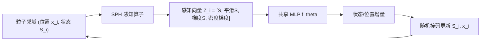

## 一句话总结

把神经细胞自动机（NCA）从固定网格搬到自由运动的粒子上，用可微 SPH 算子做"感知"、共享的小 MLP 做"更新规则"，让粒子系统仅凭严格局部交互就自组织出目标形态、纹理与分类结果。

## 研究背景

- 领域现状：自组织系统（细胞自动机、反应扩散、Boids 群体行为）用大量简单单元的局部交互涌现出全局结构，天然适合无界域、跨分辨率、抗扰动的交互式图形应用。NCA 用神经网络替代手工规则，在纹理合成、生长/形态发生、分布式分类上都很成功，且参数极少（上万级）、局部化、对扰动鲁棒。
- 核心痛点：现有 NCA 的单元都被钉死在固定网格（欧拉视角）上，邻域关系静态。这导致在无活动区域浪费算力，也难以支持异质动力学（需要把单元当作独立个体）。即便扩展到图或网格上，仍假设固定连通性。另一边，Particle Life、Particle-Lenia 这类粒子自组织系统虽直接在粒子上做局部交互，却是手工设计规则、不能从数据学习。两者的优点一直没被结合。
- 本文 idea：提出 Neural Particle Automata（NPA），把 NCA 拉格朗日化——每个"细胞"是一个带连续位置和内部状态的粒子，位置和状态都由同一个可学习的局部规则更新。用无网格、可微的 SPH 算子取代网格卷积来做邻域感知，既保留 NCA 严格局部、共享规则的结构，又获得粒子系统的稀疏性与灵活性。

## 方法

整体上，NPA 把一次更新拆成两段：先用 SPH 算子从 $$\epsilon$$ 邻域内的邻居粒子算出一个紧凑的感知向量，再送进一个共享的两层 MLP 预测状态（以及位置）的增量，像前向欧拉那样加回去，反复迭代即涌现出全局行为。

关键设计分四点展开：

1. **可微 SPH 感知算子**：SPH 是一种无网格数值方法，用支撑半径 $$\epsilon$$ 内的核加权求和来估计密度、梯度等场量，无需显式连通性。作者用 Poly6 核做平滑、Spiky 核做梯度，给出了密度、平滑值、密度梯度、矩阵矩、以及 0 阶/1 阶梯度等一整套算子。对比卷积、图卷积、集合算子、注意力、网格微分，SPH 在"无结构数据、利用空间结构、动态、局部、可扩展、跨分辨率泛化"六项性质上全部满足，是唯一全能的空间算子。

2. **可反传与稳定的梯度估计**：为端到端训练，作者解析推导了每个 SPH 算子的反向公式，且反向与前向共享同样的邻域聚合结构，无需额外中间数组。0 阶梯度在不规则采样下有偏，1 阶变体用矩阵矩 $$M_i$$ 校正但对 $$M_i^{-1}$$ 求导既不稳又贵；于是采用 $$\nabla S_i = \nabla_0 S_i + (\nabla_1 S_i - \nabla_0 S_i).\text{detach}()$$，前向用校正值、反传当作只用了 0 阶，当 $$\det(M_i) < 10^{-3}$$ 时退回 0 阶。

3. **更新规则与等变性**：感知向量取 $$Z_i = [S_i, \tilde{S}_i, \nabla S_i, \nabla \rho_i]$$，其中 $$(S_i - \tilde{S}_i)$$ 天然携带类拉普拉斯的扩散信息，密度梯度 $$\nabla \rho_i$$ 提供粒子离散特有的局部疏密线索。更新用 Bernoulli(0.5) 随机掩码只更新一部分粒子，摆脱全局同步。SPH 感知本身对粒子索引置换、全局平移不变；作者进一步设计对采样密度和空间尺度等变——粒子数变 $$k$$ 倍就把质量缩放 $$1/k$$ 保持总质量为 1，空间缩放 $$(x, \epsilon) \mapsto (cx, c\epsilon)$$ 时相应缩放各输入，使同一规则能跨粒子数、跨尺度复用。旋转等变未强制，但可用 Vector Neurons 引入。

4. **可扩展 CUDA 实现与训练技巧**：动态邻域若用连通矩阵表达会产生巨大低效的计算图，作者用哈希网格加速的自定义可微 CUDA 核实现 SPH 感知，格子边长等于 $$\epsilon$$，扫 $$3^D$$ 邻格并做真实半径测试；提供线程/粒子的朴素核与利用共享内存的优化核两种。训练上沿用 NCA 惯例（变步数、状态池、溢出正则），并新增：对梯度类向量做仿生对数响应缩放以防幅值爆炸；对动态粒子在感知中停止位置梯度以提升稳定性；用位移总量正则鼓励平滑轨迹；图像监督任务把粒子状态解码成属性后用高斯泼溅光栅化再算损失。

## 实验结果

三个代表性任务：2D/3D 形态发生（从"蛋状"均匀种子长成目标形状）、粒子纹理合成（从均匀方块自组织成 RGBA 纹理）、点云自分类。其中点云分类给出了明确的定量结果——在 PointMNIST 上（每张 MNIST 图采 512 点），512 个静态粒子仅靠局部通信迭代达成全局共识分类。

| 任务 | 配置 | 关键结果 |
|------|------|----------|
| PointMNIST 自分类 | N=512, 21k+7k 参数 | 测试集准确率 98.42% |
| 2D 形态发生 | N=4096, 11k 参数 | 相比网格版 GrowingNCA 同等细节下更省内存（耗时更长） |
| 3D 形态发生 | N=16384, 38k 参数 | 多视角监督下长出 3D 高斯泼溅表示 |
| 粒子纹理合成 | N=4096, 11k 参数 | 从方块种子自组织出目标 RGBA 纹理 |

此外一组测试时分析显示：改变 $$\epsilon$$（同时缩放种子）时动力学保持稳定；改变粒子数 $$N$$ 无形式保证但优雅退化、$$N$$ 越大越好；改变随机更新概率 $$p$$（训练恒用 0.5）依然鲁棒，$$p \to 0$$ 时趋于异步的泊松过程。模型对局部状态清零、切割、聚团三类扰动都能靠继续施加局部规则修复（后两类训练时从未见过）。隐藏通道会组织成有空间意义的表示（早期常出现类彩虹的方向信号），且目标达成后粒子仍在形状内部持续流动形成涡旋状轨迹，作者推测这是一种维持形态的分布式记忆。最后，多个独立训练的 NPA "物种"能在同一模拟中相遇并交互，从近独立到合作/干扰都有。

## 亮点与局限

- 亮点：
  - 概念上干净地把 NCA 从欧拉网格推广到拉格朗日粒子，粒子的清晰个体性带来异质动力学、算力聚焦活动区、稀疏表示等新能力。
  - 用 SPH 作为无网格感知算子是关键选择，六项空间算子性质全满足，且解析反向 + CUDA 哈希网格让大规模端到端训练可行。
  - 保留了 NCA 的核心优点：参数极少（上万级）、严格局部、无需全局同步、对扰动鲁棒且能再生；并新增跨分辨率/尺度泛化和多物种交互。

- 局限：
  - 粒子数固定，不能合并或分裂——目标区域小则粒子变密拖慢 SPH，需要高分辨率的区域无法征募更多粒子，过采样区域也甩不掉。
  - 梯度感知假设全局欧氏基，对旋转泛化受限。
  - 学习动力学对超参数敏感。

## 延伸思考

NPA 把"可学习的局部更新规则"和"无网格粒子表示"焊在一起，位置正好卡在 NCA、可微 SPH 模拟器、点云网络三者的交叉口。它与用 SPH 做流体反问题的可微模拟器（JAX-SPH、DiffSPH）思路互补——后者把 SPH 用在物理仿真回路里，NPA 则把 SPH 当成通用神经感知算子，因此能跳出流体去做形态发生、纹理、分类。值得追问的方向：一是学习粒子的合并/分裂动力学以突破固定粒子数瓶颈，让细节区域自适应加密；二是引入旋转等变（如 Vector Neurons）解除欧氏基假设；三是它作为"分布式动态系统的可训练构件"的潜力，比如无人机显示阵列、人群、流体初始条件优化、点云去噪，甚至流形上的纹理合成。多物种可组合这一点尤其有想象空间——不共同训练却能涌现协作，很像把 NPA 当作多智能体自组织的乐高积木。
