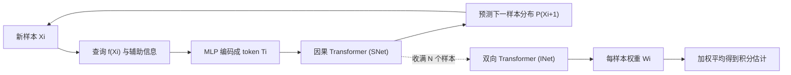

## 一句话总结

把积分估计当成"采样 + 重建"的端到端学习任务：用一个 Transformer 积分器（INet）为每个样本预测重加权因子、用一个自回归 Transformer 采样器（SNet）决定下一个样本打在哪里，两者用强化学习联合训练，在同等样本数下相比蒙特卡洛把 MSE 降低一到三个数量级。

## 研究背景

- 领域现状：图形学里的积分（尤其渲染）长期由蒙特卡洛与数值求积主导，配合各种分层/重要性采样来降方差。这些方法把积分看成"用点样本估期望"。
- 核心痛点：作者指出蒙特卡洛的两个根本局限。其一，每个样本其实携带大量辅助信息（样本位置、梯度、光路命中的光源位置/半径/辐射亮度、几何信息等），但经典估计器只对函数值做平均，白白丢掉这些信息。其二，蒙特卡洛把采样和积分强行绑在采样分布上——重要性采样要求密度正比于被积函数，这既让估计结果过度依赖分布，又堵死了"往锐利特征或边界附近采样"这类对重建有利、但对 MC 有害的自适应策略。作者用一个"路径引导悖论"说明：往已探明的高值区反复采样收益很低，去未知区探测才能真正降低不确定性，可这类样本若取到低值反而会伤害 MC 估计。
- 本文 idea：既然重建（denoising、求积）能有效利用样本间的空间信息与辅助信息，那就干脆放弃蒙特卡洛的无偏/一致性硬约束，把采样器和积分器都换成神经网络来端到端学习——让积分器学会"如何用样本"，让采样器学会"往哪采最有信息量"，两者互相配合。

## 方法

整体框架分两阶段：先由采样器 SNet 以自回归方式逐个抽样收集被积函数信息，收满后由积分器 INet 对所有样本做一次双向注意力，为每个样本预测一个权重，最终积分估计为加权平均。整个流程在一个大规模被积函数数据集上联合训练，推理时纯前馈、逐像素独立、不做跨像素复用。

关键设计：

- **把积分重写成"样本重加权"。** 估计式取 $$\hat{F} = \frac{1}{N}\sum_{i=1}^{N} W_i \, f(X_i)$$，网络只预测权重 $$W_i$$ 而不直接吐积分值。作者论证矩形法、梯形法、Gauss–Legendre、重要性采样、分层、控制变量、多重重要性采样（MIS）都能统一写成这种重加权形式，因此"加权平均"是积分任务一个很强的归纳偏置。消融显示预测权重明显优于直接预测函数值。
- **积分器 INet：双向注意力吃辅助信息。** 每个样本的信息向量（位置、函数值、梯度、离散段索引等）先 tokenize——连续量用 Fourier 位置编码、离散索引用可学习 embedding——再过一叠双向 Transformer，让所有样本互相 attend 后输出各自权重。因为权重依赖于整组样本 $$X_{1:N}$$，它能表达比"让每项趋于同一均值"丰富得多的加权策略。消融证实去掉梯度和段索引会掉点，说明网络确实在主动利用辅助信息。
- **采样器 SNet：自回归下一样本预测。** 借鉴大语言模型的 next-token 范式，用一个带因果注意力的 decoder-only Transformer，让最新 token attend 到 KV cache 里所有历史 token，输出下一个样本位置的分布。这样既能通过训练数据学到被积函数族的先验（a-priori），又能在推理时条件于已观测样本获得后验信息（a-posteriori），一次性融合两类自适应策略，还免去了手工调 $$N_{\text{init}}$$、$$N_{\text{adapt}}$$ 之类的分阶段超参。
- **用强化学习联合训练。** 采样器没有"最优采样序列"这种监督信号，采样又是随机、被积函数查询还常不可微，无法直接反传。作者把它建模成强化学习：采样器是 agent，动作是下一样本位置，环境是被积函数，奖励是积分估计负 MSE。采用 GRPO（Group Relative Policy Optimization）——每轮对同一积分 rollout 一组采样序列，用组内相对优势来鼓励表现更好的序列。积分器仍用普通监督（对参考积分做 MSE）训练，两者交替更新，形成混合联合优化。

## 实验结果

方法在多类积分任务上验证：一维分段函数、直接光照渲染（1D–6D）、二维广义缠绕数、透射率（非线性）、Walk-on-Spheres 解 PDE（12D）。核心结论一致——同等样本数下大幅优于蒙特卡洛，且"仅积分器 INet + 分层采样"通常稳居第二、超过所有传统基线；再加上联合采样器 SNet 还能进一步提升。

下面取直接光照的全图 MSE 主实验（16 SPP），对比基线与本文各变体（数值越低越好，最后一列为联合方法相对 MC+rand 的提升倍数）：

| 场景 | MC+rand | MC+strat | INet+strat | INet+SNet | 提升 |
|------|---------|----------|------------|-----------|------|
| 测试集均值（同分布） | 6.86e-2 | 1.91e-2 | 4.14e-3 | 2.26e-3 | 30.4× |
| WhiteRoom（OOD） | 7.53e-3 | 1.88e-3 | 9.75e-4 | 7.13e-4 | 10.6× |
| LivingRoom（OOD） | 2.32e-2 | 3.48e-3 | 1.52e-3 | 9.53e-4 | 24.3× |
| VeachMIS（OOD，强镜面） | 1.68e-1 | 3.00e-2 | 9.70e-2 | 2.73e-1 | 0.61× |

其余任务的量级：一维分段函数联合估计相比基础 MC 提升可达约 1940×；广义缠绕数测试集约 151×、部分 OOD 形状上百到上千倍；透射率相比随机 ray marching 约 100–500×；Walk-on-Spheres 约 20–30×。可解释性分析也很有意思：一维情形下采样器先探边界、再近似分层、约 12 个样本后向不连续处加密；直接光照里 INet 学会在 NEE 近乎最优时几乎忽略 BSDF 分量（这是均衡启发式做不到、最优 MIS 才有的行为）。

## 亮点与局限

- 亮点：
  - 用"样本重加权"这一视角统一了求积、控制变量、MIS 等一大类方法，为网络设计提供了清晰且强的归纳偏置。
  - 把自适应采样优雅地对应到强化学习的 next-token 生成，用 GRPO 绕开了无监督信号、随机性、不可微三重障碍。
  - 通用性强：线性/非线性、低维/高维、正值/实值积分都能覆盖，甚至能扩展到蒙特卡洛 WoS 求解器不适用的非线性 PDE（p-Laplacian）。
  - 纯逐像素、不依赖跨像素复用就取得显著增益，说明"仅靠单积分内部的样本"仍有大量效率可挖。
- 局限：
  - 明确放弃了无偏性与一致性，换来的是可能的偏差与伪影（SNet 有时降 MSE 却引入 artifact，体现偏差-方差权衡）。
  - 神经推理开销大，全流程比标准路径追踪慢约 5×–15×，因此只在等样本数下占优，等时间预算下未必超过基线。
  - 对训练分布敏感：强镜面场景（VeachMIS）因训练数据稀少而失败；OOD 几何上提升倍数明显下降。
  - 需要 $$O(N)$$ 存储所有样本，且每个任务都要在对应数据集上训练一套模型。

## 延伸思考

这项工作把渲染里的"积分"从统计估计问题彻底改写成了序列建模问题，和路径引导、去噪、可微渲染都有对话空间：路径引导可以作为它的另一层基底 PSS，去噪是跨像素、它是像素内，两者天然互补，联合训练一个"同时建模积分域与像素空间"的模型是作者点名的方向。更大的想象在于：当硬件让神经推理越来越便宜，等时间预算的劣势会被抹平，届时"学出来的求积规则"可能真的成为传统求积的替代品。值得追问的是无偏性缺失在生产渲染里的可接受边界，以及如何设计足够多样的训练数据来覆盖强镜面等长尾情形——否则泛化性会是落地的主要瓶颈。
