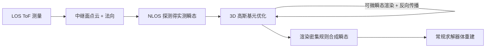

## 一句话总结

用 3D 高斯基元表示隐藏场景，配上一个物理可微的瞬态渲染模型，直接从实测瞬态信号端到端反解，实现了对任意（非平面、空间受限）中继面几何都稳健的非视距（NLOS）成像。

## 研究背景

- 领域现状：基于飞行时间（ToF）的非视距成像已能"看到墙角后面"，从早期的滤波反投影（FBP）、光锥变换（LCT）到波动光学方法（f-k migration、RSD），再到近年的学习类方法和"分析-合成"式的瞬态渲染重建（如 NeTF），重建质量与速度都在快速进步。
- 核心痛点：绝大多数方法假设一块大而连续的**平面中继墙**，且需要在其上做密集、规则的采样。但现实部署里，可用的中继面往往是空间受限、形状任意、法向分布复杂的表面（比如把两个行人的后背当中继面）。这类条件直接违反平面墙与密集采样假设，导致传统方法失效；而现有能处理任意瞬态的方法又常常需要数小时的优化、且在复杂环境下不鲁棒。
- 本文 idea：提出一个 **LOS 引导的 NLOS 成像流程**，对中继面几何不作任何先验假设。先用视距（LOS）测量恢复中继面的点云位置与局部法向，用它来引导 NLOS 探测与重建；再用轻量的 3D 高斯基元表示隐藏场景，耦合一个物理可微的瞬态渲染器，通过反向传播直接从实测瞬态优化。优化后的高斯表示可反过来渲染出密集、规则的合成瞬态，交给常规求解器完成最终体重建。

## 方法

整体框架是一条"LOS 测量建面 → 3D 高斯瞬态渲染优化 → 合成规则瞬态 → 常规求解器出体"的四段式流程：先用 LOS ToF 采集得到中继面点云并估计法向，构造一个虚拟中继面；把隐藏场景初始化为一组 3D 高斯基元（3D GP），用可微渲染模型把它们与实测的采集几何 $$(\boldsymbol{x}_i, \boldsymbol{n}_i, \boldsymbol{x}_d, \boldsymbol{n}_d)$$ 对齐，迭代优化每个高斯的位置、尺度、朝向与反照率去匹配实测瞬态；最后把优化好的高斯在虚拟平面上渲染成密集规则的合成瞬态，喂给 LCT / RSD 等常规求解器出最终体积。

关键设计分三点：

**1）3D 高斯基元的瞬态渲染。** 每个基元写作 $$G(\boldsymbol{x}_g, \boldsymbol{\Sigma}, \rho)$$，可理解为集中在均值 $$\boldsymbol{x}_g$$、按协方差 $$\boldsymbol{\Sigma}$$ 分布、由 $$\rho$$ 加权的一团局部散射密度。给定一对照明-探测点，渲染模型把每个 3D 高斯映射成一个 1D 时域高斯核 $$(\mu_t, \sigma_t, A)$$，分别编码到达时间的均值、时间展宽与辐射幅度。核心近似是：假设基元的空间展宽远小于传输距离，把光程 $$L(\boldsymbol{X}) = \lVert \boldsymbol{X} - \boldsymbol{x}_i \rVert_2 + \lVert \boldsymbol{X} - \boldsymbol{x}_d \rVert_2$$ 在 $$\boldsymbol{x}_g$$ 处一阶线性化，于是路径长度也近似为高斯分布，均值 $$\mu_L = d_i + d_d$$、方差 $$\sigma_L^2 = \boldsymbol{v}^\top \boldsymbol{\Sigma} \boldsymbol{v}$$（其中 $$\boldsymbol{v} = \hat{\boldsymbol{u}}_i + \hat{\boldsymbol{u}}_d$$ 是两条方向单位向量之和）。这样一个 3D 空间高斯就干净地"推前"成了 1D 时间高斯。

**2）物理化的辐射权重。** 幅度 $$A$$ 按物理光传输拆成三段：照明到高斯、高斯散射、高斯到探测。每段依据立体角 $$\Omega \propto A_\perp(\hat{\boldsymbol{u}})/d^2$$ 建模，其中 $$A_\perp$$ 是基元垂直于方向的有效投影面积。加上中继面的角度响应（漫反射假设下退化为余弦因子 $$\gamma_i = \max(0, \boldsymbol{n}_i^\top \hat{\boldsymbol{u}}_i)$$），最终得到 $$A = g\rho\gamma_i\gamma_d A_\perp(\hat{\boldsymbol{u}}_i) A_\perp(\hat{\boldsymbol{u}}_d) / (d_i^2 d_d^2)$$，自然复现了 NLOS 前向模型里常见的距离四次方衰减。显式引入中继面法向 $$\boldsymbol{n}_i, \boldsymbol{n}_d$$ 是它能处理任意几何的关键。

**3）端到端优化与后处理。** 协方差用旋转-缩放分解 $$\boldsymbol{\Sigma}_k = \boldsymbol{R}_k \boldsymbol{S}_k \boldsymbol{S}_k^\top \boldsymbol{R}_k^\top$$ 保证正定，位置用 tanh 约束在 ROI 内、反照率用 softplus 保非负。损失是渲染瞬态与实测瞬态的 L2 差 $$\min \sum_p \lVert \hat{\boldsymbol{\tau}}_p - \boldsymbol{\tau}_p \rVert_2^2$$，用 AdamW、对不同参数组（中心/尺度/旋转/反照率）分别设学习率、小批量训练以抗噪。收敛后再做一步轻量剪枝，丢掉靠近 ROI 边界或低反照率贡献可忽略的基元，得到更干净紧凑的表示。

## 实验结果

作者自建了一套非共轴双臂、独立收发的振镜 + SPAD + TDC 瞬态采集系统，支持在任意中继面几何上采样，并在公开数据集（Teaser、Statue）与自采数据上验证。评测覆盖共焦（区域受限 / 孔径受限 / 分辨率受限）与非共焦（平面墙、双人体模型任意中继面）多种配置。定性上，在只有 3000 随机点、孔径小于目标本身、采样间距超过目标分辨率（2 cm 特征）等苛刻条件下，本方法都能给出比 LCT、f-k、RSD、NeTF、CC-SOCR、Virtual Scanning 更清晰的重建，并展现出超分辨效果；在双人体模型这类任意曲面中继面上更是显著超过所有基线。

运行时间是最直观的优势项（1.5 m 立方体、约 8000 条瞬态的平均耗时）：

| 方法 | 训练耗时 | 推理耗时 |
|------|----------|----------|
| 本文 3D-GTR | 10.9 秒/epoch | 0.6 秒（含 LCT 求解器） |
| NeTF | 0.31 小时/epoch | 4.2 秒 |
| CC-SOCR | 不适用 | 1.1 小时/loop |
| FBP | 不适用 | 25.9 秒 |

消融实验证实：在非共焦、任意中继面设置下去掉照明法向 $$\boldsymbol{n}_i$$ 和/或探测法向 $$\boldsymbol{n}_d$$ 会带来明显的模型失配、重建质量显著下降（激光固定时因 $$\boldsymbol{n}_i$$ 基本不变故影响较小），说明显式建模局部表面朝向是性能的关键来源。

## 亮点与局限

- 亮点：
  - 对中继面几何"零假设"，同时天然支持共焦 / 非共焦以及任意照明-探测配对，大幅拓宽了 NLOS 的实用边界。
  - 用 3D 高斯基元 + 光程一阶线性化，把 3D 空间高斯解析地推前成 1D 时间高斯，得到轻量、稀疏、高度并行、完全可微的物理瞬态渲染器，速度比 NeTF / CC-SOCR 快一到多个数量级。
  - 物理化参数化让优化能部分吸收中继面几何误差、测量噪声、探测器时间抖动等现实缺陷；显式的法向建模从模糊真实测量里榨取更多线索。
  - 用真机自采数据（含非平面中继面）验证，而非只靠仿真。

- 局限：
  - 场景特定（scene-specific），换隐藏场景需重新优化，尚未达到实时。
  - 共焦模式为缓解 SPAD 堆积效应需加照明-探测空间偏移，这在复杂非平面表面上不易实现，因此共焦对比只限于平面中继面。
  - 变动照明位置（局部扫描）虽能补全缺失区域（如人体模型头部），但会对测量误差和时间波动更敏感，引入轻微的手臂形变。

## 延伸思考

这项工作把 3DGS 的"轻量、并行、可微"从常规透视渲染迁移到了瞬态/主动传感物理，和近期把高斯泼溅用于 LiDAR、传播光逆渲染、声呐雷达成像的一批工作是同一股潮流——只要把泼溅过程适配到传感物理，高斯表示就能超出标准视角渲染发挥作用。作者也点出了通向实时 NLOS 的两条路：更好的高斯初始化（借鉴原始 3DGS 的经验）以加速收敛，以及把这个可微物理表示与即插即用先验或时空 Transformer 等视频重建技术结合。值得追问的是：法向估计误差在更极端的曲面上会如何传播、剪枝阈值对细节保真的敏感度，以及"合成密集瞬态 + 常规求解器"这条后端链路是否会成为最终精度的瓶颈。
