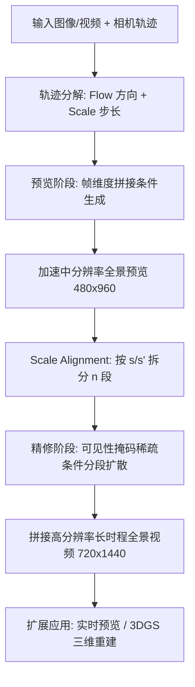

## 一句话总结

OmniRoam 提出一个可控的全景视频生成框架，利用全景表示天然的"每帧全场景覆盖"与全局空间记忆，配合"先预览再精修"的全局到局部策略，实现沿长距离相机轨迹的长时程场景漫游。

## 研究背景

用视频生成模型来建模场景近年备受关注，但绝大多数方法建立在透视视频之上。透视视频只反映以人为中心的有限视场，天然难以覆盖完整物理环境；当相机做大范围运动时，基于自回归的世界模型又容易累积误差、发生时序漂移，全局一致性难以维持。

作者的核心洞察是：全景表示相比透视视图能提供整体场景覆盖与全局空间记忆，是维持长时一致性的稳固基础。特别地，聚焦"全景视频漫游"这一任务，让相机沿延展轨迹探索场景，每一帧都能保留原本需要随时间累积的全局上下文，从而为长视频生成提供显式的时空信息保持机制。尽管已有工作把生成架构迁移到全景数据，但往往只是把全景当作透视图像的直接扩展，没有充分利用其表征优势。

由此提出 OmniRoam，采用全局到局部的设计：先由全景表示建立全局场景结构，再通过提升空间与时间分辨率逐步细化局部细节，得到既高保真又全局一致的场景。主要贡献包括：基于预览-精修全局到局部设计的可控长时程全景视频生成框架；证明全景表示与该设计在多项指标上优于透视方法；构建可扩展的全景视频数据生成管线与带轨迹的数据集；提出用于量化长时全局空间一致性的新指标 Loop Consistency。

## 方法

### 整体框架

OmniRoam 是一个相机可控的两阶段框架。预览阶段以输入图像/视频与指定相机轨迹为条件，生成中等分辨率（480×960）、播放加速的全景视频，快速纵览大尺度场景布局；精修阶段在选定预览基础上做时间扩展与空间上采样，产出正常播放速度的高分辨率（720×1440）长视频。两阶段模型均从预训练的 Diffusion Transformer（Wan2.1-1.3B）微调而来。

### 预览阶段：轨迹可控视频预览

关键创新是把相机运动控制分解为两个正交因子：flow（每帧位移的归一化方向）与 scale（全局步长）。这种分解既能直观调速以高效探索场景，又能提供更细粒度控制——scale 全局调制所有帧的运动幅度，flow 逐帧指定方向；同时也简化了精修阶段，使其只需调整单一参数 scale。分解基于两个假设：相机近似匀速运动、相机朝向在序列中保持不变，这些假设通过数据整理来强制满足。

帧维度视频条件借鉴 ReCamMaster：输入视频/图像 $$V_{in}$$ 与目标视频 $$V_{v}$$ 经 3D 变分自编码器编码为潜表示，源潜表示与目标潜表示沿帧维度拼接以保证严格的视觉连续性。scale 用对数空间表示以覆盖宽速度范围，$$z_s = \phi(\log(s))$$，该嵌入被全局注入 Transformer 块统一调制所有时间 token；flow 是一串单位向量 $$D = \{d_k\}_{k=1}^{f}$$，$$\|d_k\| = 1$$，经零初始化的相机编码器逐帧编码。训练遵循 rectified flow，前向过程在数据与噪声间插值 $$z_t = t z_v + (1-t)\epsilon$$，仅对目标潜表示加噪、源潜表示保持干净，损失只在目标部分计算：

$$L_{preview} = \mathbb{E}_{t, z_0, \epsilon} \left\| v_\Theta([z_{in}, z_t]_{frame}, t, c) - (z_v - \epsilon) \right\|_2^2$$

### 精修阶段：长时程视频精修

由于一次性生成长且高分辨率的视频计算不可行，第二阶段做分段精修。给定在 scale $$s \in [1.1, 8.0]$$ 下生成的预览视频与目标 scale $$s'$$（如正常播放 $$s' = 1.0$$），需按 $$s/s'$$ 扩展时间分辨率，分段数 $$n = \lceil s/s' \rceil$$。对第 $$i$$ 段，用二值可见性掩码 $$m^{(i)} \in \{0,1\}^f$$ 从预览中选取窗口帧作为稀疏条件：

$$m_j^{(i)} = \begin{cases} 1 & j_0^{(i)} \le j < j_0^{(i)} + w \\ 0 & \text{otherwise} \end{cases}$$

其中 $$w = \lceil (f-1)/n \rceil$$ 为窗口大小，推理时 $$j_0^{(i)} = (i-1)w$$，训练时随机采样 $$j_0$$ 以增强泛化。预览编码后掩码经平均池化下采样得 $$m'^{(i)}$$，掩码潜条件为 $$\tilde{z}_p^{(i)} = z_p \odot m'^{(i)}$$。将目标段潜表示与掩码条件沿帧维度拼接，仅对目标加噪，损失同为 rectified flow 形式，最终把 $$n$$ 段拼接成长视频 $$V = [V^{(1)}, V^{(2)}, \dots, V^{(n)}]$$。

### 数据集与一致性指标

作者建立规范全景坐标系：在等距柱状投影全景中，相机旋转对应像素的循环平移而非透视中的几何遮挡，因此设计一个旋转不变坐标系，消除相机自转（滚转、俯仰、偏航），轨迹严格由相对 ERP 中心的平移 $$(x, y, z)$$ 定义，使视觉动态仅由空间平移驱动。数据集为混合构成：约 2000 段手持全景真实视频（500 万帧，涵盖酒店、学校、户外等），经重力对齐并用 COLMAP 估计轨迹、过滤异常尺度；另有从 InteriorGS 渲染的 1000 个 3DGS 场景，通过自动管线合成物理可行的精确轨迹（在 1.3m–1.5m 垂直范围内过滤障碍、覆盖 50% 自由空间、全程匀速）。

针对长时全局一致性，作者提出 Loop Consistency 指标，衡量生成场景在闭环轨迹后能否回到初始视角：

$$C_{loop} = 1 - \frac{S_2}{1 - S_1}$$

$$S_1 = \frac{1}{P^2} \sum_{q=1}^{P} \sum_{p=1}^{P} \mathrm{Sim}(I_p, I_{f-q+1})$$

$$S_2 = \frac{1}{P(f-2P)} \sum_{p=1}^{P} \sum_{q=P+1}^{f-P} \mathrm{Sim}(I_p, I_q)$$

其中 $$\mathrm{Sim}$$ 为 CLIP 嵌入余弦相似度，$$S_1$$（闭环得分）衡量首尾 $$P$$ 帧相似度，$$S_2$$（中间得分）衡量与中间帧相似度，缓冲 $$P=5$$ 提升鲁棒性。该指标奖励高闭环相似（$$S_1 \to 1$$）同时保持探索过程中的充分变化（$$S_2 \to 0$$）。

## 实验结果

作者定义七种相机轨迹（前进、后退、左、右、S 曲线、闭环、真值），均未在训练中直接出现，从视觉质量（FAED、SSIM、LPIPS）、轨迹可控性（多时间窗 PSNR）与闭环一致性三方面评估，对比 Matrix-3D 与 Imagine360。

| 方法 | 分辨率 | 帧数 | FAED ↓ | SSIM ↑ | LPIPS ↓ | PSNR'25 ↑ | PSNR'55 ↑ | PSNR'75 ↑ | Loop ↑ |
| --- | --- | --- | --- | --- | --- | --- | --- | --- | --- |
| Matrix-3D | 480p | 81 | 8.64 | 0.63 | 0.37 | 19.05 | 17.35 | 17.04 | 1.38 |
| Imagine360 | 480p | 81 | 23.35 | 0.33 | 0.61 | – | – | – | – |
| Ours | 480p | 81 | 5.27 | 0.70 | 0.18 | 23.06 | 20.69 | 19.87 | 2.34 |
| Matrix-3D | 720p | 81 | 9.76 | 0.66 | 0.36 | 19.06 | 17.63 | 17.12 | 1.41 |
| Ours | 720p | 641 | 5.07 | 0.66 | 0.33 | 19.75 | 18.59 | 18.24 | 1.96 |

定量上本文在视觉质量的全部指标、轨迹可控性的各时间窗 PSNR、以及闭环一致性上均优于基线。定性上，Imagine360 多数情况无法生成有意义的全景内容，Matrix-3D 虽能跟随轨迹但外观模糊、几何畸变明显；本文方法在跟随轨迹的同时保持更清晰的物体边界与更稳定的几何结构。

设计分析（641 帧）方面：把全景表示换成透视表示后（透视数据从全景数据裁剪、同设置训练），视觉质量、可控性与闭环一致性全面下降，说明有限视场难以在大相机运动下维持全局结构；把全局到局部策略换成直接自回归生成器，各指标均更差、闭环一致性差距尤为明显（本文闭环得分近乎自回归基线的两倍），源于分段误差累积。CLIP 相似度曲线显示本文方法随相机远离而下降、闭环闭合时回升，而自回归变体单调漂移、透视变体恢复微弱且几何退化。

## 亮点与局限

亮点在于：把全景表示作为长时程场景生成的基础，用"每帧全局覆盖"替代"随时间累积上下文"，从根本上缓解透视视频的漂移与不一致；将相机控制解耦为 flow 与 scale 两个正交因子，既支持直观调速探索又简化了精修阶段的条件设计；预览-精修的全局到局部两阶段既回避了一次性生成长高分辨率视频的算力瓶颈，又借稀疏可见性掩码在分段间传递一致性；提出 Loop Consistency 指标填补了 FVD/FID 无法刻画长时全局结构一致性的空白。框架还展示了两个扩展：经 self-forcing 蒸馏的实时预览器 7 秒即可生成 81 帧全景视频（原预览模型约 5 分钟、Matrix-3D 约 11 分钟），以及从 641 帧长视频裁取多视角做 3DGS 三维重建。

局限在于：方法依赖相机匀速、朝向固定这两个较强假设，通过数据整理强制满足，对更自由的相机运动（自转、变速）覆盖有限；旋转不变坐标系虽简化了生成空间，但也意味着不直接建模 6-DoF 中的相机自转；长视频靠分段拼接完成，尽管闭环一致性显著优于自回归，误差累积在超长序列中仍是潜在挑战；真实数据规模（约 2000 段）与合成场景（1000 个）相对有限，泛化到更多样场景仍待验证。

## 延伸思考

这项工作最具启发的一点，是把"表示选择"当作长时一致性问题的第一性解法，而非仅在建模或训练策略上做文章。透视视频的漂移本质源于视场受限、全局上下文需靠时间累积，而全景表示让每一帧自带全局信息，等于把"记忆"从时间维度搬到了空间维度——这解释了为何在同等模型设计下，仅替换表示就能带来跨指标的普遍提升。

flow 与 scale 的正交分解也值得关注：它把"往哪走"和"走多快"解耦，使加速预览与正常速度精修能共享同一套轨迹语义，仅靠调节 scale 衔接两阶段。这种"用一个可缩放的时间因子桥接粗细两级生成"的思路，对其他需要在算力约束下生成长序列的任务（长视频、长程世界模型）具有借鉴意义。此外，Loop Consistency 用闭环轨迹的"回到原点"来度量全局一致性，是一个巧妙的自监督式评估设计，把难以直接标注的长时结构一致性转化为可计算的相似度比值，或可推广到更广义的场景生成一致性评测。
