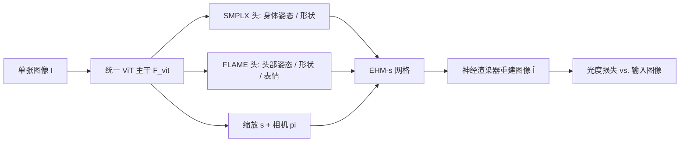

## 一句话总结

PEAR 用一个精简的单 ViT 主干，从单张自然图像同时回归 SMPLX 身体与 FLAME 头部参数，并借助可微渲染的像素级监督弥补简单架构的细节损失，在 100+ FPS 下实现表现力强、像素对齐的全身人体网格恢复。

## 研究背景

- 领域现状：单图人体网格恢复（HMR）是计算机视觉的基础任务，广泛用于数字人、沉浸式游戏、具身智能等。参数化人体模型（SMPL、SMPLX、GHUM）把高维几何压到低维流形，让神经网络能直接回归参数。要同时表达面部表情和手部动作，SMPLX 这类全身表现力模型是合适选择。
- 核心痛点：现有 SMPLX 方法有三大问题。其一，**表现力受限**——SMPLX 的形状空间把头部特征和身体形状耦合在一起，难以建模差异化的头身比例和细腻表情；其二，**像素级错位**——依赖稀疏关键点监督，在脸和手这类精细区域出现滑动伪影与错位；其三，**计算瓶颈**——为缓解上述问题常用高分辨率输入或多分支架构，导致推理慢、难以实时部署。
- 本文 idea：作者主张一个精简架构在有效监督下同样能兼顾保真与速度。于是引入可回归的 EHM-s 表示（SMPLX 身体 + FLAME 头部，外加一个全局头部缩放参数 $$s$$），用单个轻量 ViT 统一回归，再用可微神经渲染器提供稠密像素级监督来补细节，并配套一套模块化的部件级数据标注策略增强鲁棒性。

## 方法

整体框架：给定单张图像 $$I$$，一个统一的 ViT 主干 $$F_{vit}$$ 直接预测全套 EHM-s 参数 $$[\theta_b, \beta_b, \theta_h, \beta_h, \phi_h, s, \pi]$$，其中 SMPLX 分支负责身体姿态与形状、FLAME 分支负责头部姿态/形状/表情、相机头负责投影参数 $$\pi$$。第一阶段用参数与关键点监督训练出粗网格，第二阶段再接入可微渲染器做像素级精修。

关键设计：

1. **EHM-s 表示与解耦的头部缩放**：在 SMPLX 身体上嫁接 FLAME 头部，获得比 SMPLX 原生面部更强的表情自由度；关键是引入全局头部缩放参数 $$s \in \mathbb{R}^3$$，作用于预测的头部几何 $$V_h = s \cdot F_{FLAME}(\theta_h, \beta_h, \phi_h)$$。这一步把头部尺寸从身体形状里解耦出来，使模型能泛化到头身比偏离成人常态的分布（如幼儿或卡通角色）。

2. **统一单 ViT 主干替代多分支**：不走高分辨率输入或人脸/手/身体各配编码器的多分支老路，只用单个 ViT-B 主干在 256×192 低分辨率下同时预测三部分参数，保证快速推理。面部单独作为一条分支预测 FLAME 参数，即便没有身体输入也能独立推理面部，从而对各种裁剪更鲁棒。参数监督用 MSE/L1，身体和面部分别加 3D、2D 关键点投影监督，如身体关键点损失 $$L_{kp1} = \lVert X_b - X_b^* \rVert_1 + \lVert \pi(X_b) - x_b^* \rVert_1$$。

3. **像素级增强（分析-合成范式）**：单 ViT-B 对高维细节建模能力有限，作者接入一个预训练的基于 3DGS 的神经渲染器（GUAVA）提供像素级监督。把预测网格与相机送入渲染器得到重建图 $$\hat{I} = F_{ren}(F_{ehm}(\Phi), I, \pi)$$，再施加光度损失 $$L_{photo} = L_1(I, \hat{I}) + L_{lpips}(I, \hat{I})$$。这要求预测网格先与图像大致对齐，高斯点才能被正确绑定，否则外观与几何会严重耦合——因此必须配合两阶段训练。

4. **部件级伪标签精修的数据策略**：现有 SMPLX 方法多沿用旧管线的伪标注，误差会传播；且作者发现 SMPLX 方法在身体姿态精度上落后于 SMPL 方法。为此对身体、脸、手分别独立标注：用 ProHMR 估 SMPL 身体姿态并通过 T-pose 对齐估计偏移 $$\Delta\theta$$ 转成 SMPLX（$$\theta_{b,\text{SMPL-X}}^* = \theta_{b,\text{SMPL}}^* + \Delta\theta$$），用 HAMER、TEASER 得到手部和面部初值，再用 DWPose 的 2D 关键点精修。模块化标注让模型能从头部、上半身、全身等部分输入中稳健学习。

训练分两阶段：第一阶段在大规模图像属性数据上训 ViT（约 200k 迭代，batch 40，8×A6000，约 10 天）；第二阶段引入渲染器的像素级监督精修细节（20k 迭代，batch 2，约 1 天）。

## 实验结果

面部表情重建是最能体现方法收益的对比之一，其中 LVE（唇部顶点误差）被作者列为最重要指标。在 UBody 与 3DPW 上与专用表情捕捉方法及 SMPLX 方法比较，PEAR 无需人脸裁剪即取得明显领先：

| 方法 | UBody MLE↓ (×10⁻³ m) | UBody LVE↓ (×10⁻⁵ m) | 3DPW LVE↓ (×10⁻⁴ m) |
|------|------|------|------|
| SMIRK | 2.81 | 8.02 | 2.77 |
| TEASER | 1.92 | 4.23 | 5.60 |
| SMPLest-X | 8.93 | 15.6 | 9.38 |
| Ours | 0.72 | 1.22 | 0.99 |

其余实验用文字概述：在身体姿态上（COCO、LSP-Extended、PoseTrack 的 PCK 以及 3DPW、AGORA 的 MPJPE/MVE），PEAR 全面超过 OSX、Multi-HMR、SMPLest-X 等同类 SMPLX 方法，且 FPS 达到约 100（对手多在 10~20）。手部（EHF、UBody-intra 的 PA-PVE）在仅 256×256 输入下取得与高分辨率方法相当的结果。消融显示光度损失 $$L_{photo}$$ 一致提升脸和手的精细精度而不损害身体姿态；数据消融则发现加入 Part 2 数据提升身体精度但会牺牲手部精度。速度方面 EHM-s 推理约 0.009~0.015 s，加动画驱动总耗时约 0.023~0.035 s（多种 GPU、FP32）。

## 亮点与局限

- 亮点：
  - 用单个 ViT-B 就实现全身（身体+手+脸）表现力网格恢复，100+ FPS、无需预处理裁剪，非常适合实时下游应用。
  - 可微渲染带来的像素级监督只在训练期生效，推理零额外成本，却显著改善精细区域对齐。
  - EHM-s 的头部缩放解耦让模型能泛化到卡通角色、幼儿等非常规头身比，这是先前 SMPLX/MHR 方法不支持的。
  - 部件级标注策略同时提升了数据质量与对多样裁剪输入的鲁棒性，且承诺开源数据与管线。

- 局限：
  - 作为 Type3（身体+手+脸）方法，在纯身体姿态精度上仍可能被输出空间更小的 Type1/Type2 方法在某些指标上超过，属于表现力与精度的权衡。
  - 在极端遮挡与复杂交互场景下仍会失效，是未来方向。
  - 像素级监督依赖预训练神经渲染器且要求初始网格已大致对齐，训练流程对两阶段策略和标注质量较敏感。

## 延伸思考

PEAR 把"分析-合成"思路以极低推理代价注入前馈 HMR，本质是用一个可微的 3DGS 渲染器把稠密像素信息蒸馏进回归网络的训练信号——这与近来可泛化人体重建（LHM、GUAVA 等）互为补充：一个负责快速拿参数，一个负责提供监督/驱动外观。值得追问的是，头部缩放 $$s$$ 之外是否还能对肢体比例做类似解耦以进一步覆盖非常规体型；以及在动态视频输入下，像素级监督能否结合时序一致性来缓解遮挡与复杂交互的失败情形。对做实时数字人、动捕驱动或 VR/AR 化身的工作，这种"单模型、免裁剪、100 FPS 出全套 SMPLX+FLAME"的形态是很有吸引力的上游模块。
