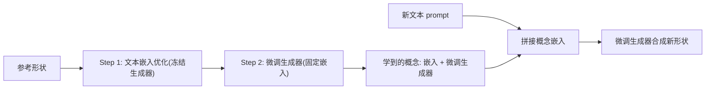

## 一句话总结

PEGAsus 把"3D 个性化"重新定义为从参考形状里抽取可复用、跨类别的几何/外观"概念"，再把这些概念与文本组合去生成全新形状，实现了几何与外观的解耦控制以及全局/局部两种粒度的概念提取。

## 研究背景

- 领域现状：艺术家做出一个满意的 3D 设计后，往往希望复用它的几何或外观属性来创作新设计，而不是每次从零开始。已有方案主要有两条路线——基于样例的建模（检索并拼装数据库里的部件）和 3D 风格化（把参考的风格迁移到给定目标形状上）。图像领域的个性化（Textual Inversion、DreamBooth 等）也已相对成熟。
- 核心痛点：样例建模本质是启发式的部件重组，语义可控性差、难以跨类别泛化；3D 风格化必须预先给定一个目标形状，无法只靠参考就生成新形状；把 2D 图像个性化直接抬升到 3D 又会让几何和外观纠缠在一起，几何控制弱、跨类别泛化差。
- 本文 idea：直接在 3D 空间做个性化，把参考形状的属性抽象成"概念"。关键要求是显式解耦几何与外观两类控制，同时支持局部区域的概念学习和跨类别复用。作者借助大型 3D 基础模型 TRELLIS 天然的"几何/外观两阶段"结构来达成这种解耦。

## 方法

整体框架：PEGAsus 建立在 TRELLIS 之上——后者用结构化隐表示 SLAT 把生成拆成两阶段，先由几何生成器 $$G_{geo}$$ 生成稀疏结构，再由外观生成器 $$G_{app}$$ 在固定几何上生成外观特征。PEGAsus 把一个"形状概念"联合建模为一个可学习的文本嵌入加一个微调后的生成器，并用一套渐进式优化策略从对应阶段分别抽取几何概念与外观概念，最后在推理时把概念与文本拼接送入微调生成器合成新形状。

关键设计：

- 渐进式优化策略：核心矛盾是概念保真度（多准确地抓住参考属性）与可迁移性（多灵活地与文本组合生成新形状）之间的权衡。只优化文本嵌入，容量不足以编码细致的几何/外观细节；只微调生成器又容易在单个参考上过拟合、丢掉 3D 先验。于是分两步走且共用同一个损失：第一步用较高学习率只优化从中性词（如 "object"、经 CLIP 编码）初始化的文本嵌入，冻结生成器，抓住粗粒度全局结构而不破坏生成先验；第二步固定优化好的嵌入、用较低学习率保守地微调生成器，补回嵌入表达不了的高频细节，同时缓解过拟合。

- 几何/外观解耦：几何概念学习中，参考形状先体素化、编码成隐特征网格 $$X$$，用与 TRELLIS 一致的 flow matching 目标训练 $$G_{geo}$$，但把标准文本条件换成可学习嵌入 $$S_{global}$$。外观概念学习中，参考数据是 SLAT 表示 $$(V, Z)$$，其中 $$Z$$ 是目标外观特征、$$V$$ 作为固定几何条件，同样把文本条件换成可学习的外观嵌入 $$A_{global}$$。两者分处 TRELLIS 的两个阶段，天然解耦。

- 区域级概念学习：为支持从用户指定的局部区域抽取概念，作者引入掩码 $$M$$ 并设计两个互补损失来平衡"上下文感知"与"概念独立"。上下文感知损失 $$L_{ctx}$$ 把完整参考喂进生成器，但只在掩码区域内计算损失，保证局部与全局结构的语义连贯；上下文无关损失 $$L_{free}$$ 则先把区域外的部分掩掉再输入，逼模型在没有周边上下文的情况下重建目标区域，从而让学到的概念与邻域解耦、真正独立。区域几何/外观各自把两项按 $$L_{region} = L_{ctx} + \lambda L_{free}$$ 组合。

- 概念组合推理：几何概念 $$(S', G'_{geo})$$ 先与新文本拼成目标 prompt 生成几何 $$V$$，外观概念 $$(A', G'_{app})$$ 再在生成的几何上合成外观 $$Z$$，最后解码成 3D 资产。由此支持"全局/区域 × 几何/外观"四种个性化模式的自由组合，例如让椅子的下半部分follow青蛙腿的几何、外观follow西瓜。

## 实验结果

作者在 Objaverse-XL 上构建了基准（几何 30 个参考形状 × 3 条文本 = 90 个案例；外观 30 对），用 KID、CLIP R-Precision、ArtFID、FID 等客观指标，配合 10 人用户研究（几何评 Quality/Attribute/Text Score，外观评 Quality/Matching Score，0-5 分）做评估。几何概念主实验对比如下，PEGAsus 在全部指标上领先：

| 方法 | KID ↓ | CLIP-R ↑ | QS ↑ | AS ↑ | TS ↑ |
|------|-------|----------|------|------|------|
| Qwen-Edit | 0.0088 | 0.778 | 3.87 | 3.13 | 3.62 |
| Edit360 | 0.0082 | 0.644 | 3.43 | 2.44 | 3.53 |
| Coin3D | 0.0176 | 0.544 | 2.45 | 1.81 | 2.39 |
| VoxHammer | 0.0094 | 0.200 | 3.44 | 4.11 | 1.23 |
| StyleSculptor | 0.0197 | 0.589 | 3.88 | 1.30 | 4.27 |
| 本文 | 0.0064 | 0.833 | 4.41 | 4.15 | 4.31 |

外观概念上，PEGAsus 相比 Paint3D、StyleTex、StyleSculptor 也全面领先（ArtFID 23.45、FID 235.9、QS 4.67、MS 4.37，均为最优）。消融实验显示：只做嵌入优化会丢失细粒度几何/外观属性（生成泛化的通用形状），只做模型微调则过拟合、丢失文本控制；区域级学习中去掉 $$L_{ctx}$$ 会破坏视觉连贯性（几何碎裂），去掉 $$L_{free}$$ 则无法保留区域属性。定量消融同样表明去掉任一步都会同时损害几何与外观概念学习。

## 亮点与局限

- 亮点：
  - 把 3D 个性化从"实例级编辑"提升到"概念级抽象"，思路上更接近语言层面的创作——从样例学抽象属性再与语义意图灵活组合，而非又一个几何编辑技术。
  - 借 TRELLIS 两阶段结构实现几何/外观真正解耦，配合渐进式优化在保真度与可迁移性间取得较好平衡。
  - 区域级的上下文感知/无关双损失设计巧妙地解决了"局部概念既要连贯又要独立"的矛盾，支持跨类别复用。

- 局限：
  - 强依赖 TRELLIS 这一特定基础模型的两阶段结构，方法的上限与偏差都受其约束。
  - 每个概念都要做嵌入优化 + 生成器微调，属于按参考实例的逐一优化，效率与规模化程度在文中未见讨论。
  - 评估以 Objaverse-XL 的自建基准和 10 人用户研究为主，规模有限；论文未设独立的失败案例/局限章节。

## 延伸思考

这项工作把图像个性化里 Textual Inversion / DreamBooth 的"学一个概念嵌入 + 微调"范式干净地搬到了 3D，并额外解决了几何-外观解耦和区域局部化两个 3D 特有难题，可视为"3D 版可组合的概念库"。值得追问的方向包括：能否摆脱逐实例优化、做成前馈式的概念编码器以支持大规模复用；概念之间组合时的冲突与语义一致性如何保证；以及这套 SLAT 上的概念学习能否迁移到其他 3D 基础模型或显式表示上，从而降低对单一 backbone 的依赖。
