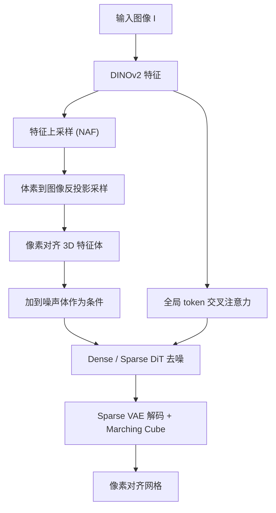

## 一句话总结

本文提出 Pixal3D，一种像素对齐的 3D 生成范式：不再像主流方法那样在规范姿态（canonical pose）下生成再靠交叉注意力"猜"图像与 3D 的对应关系，而是把图像特征沿相机光线反投影（back-projection）进 3D 体素，建立显式、无歧义的 2D-3D 对应，从而在图像到 3D 生成中实现接近重建级别的保真度。

## 研究背景

从图像自动生成高质量 3D 资产是计算机图形学的核心目标之一，对游戏、AR/VR 与数字制造意义重大。近年的 3D 生成模型在几何精细度、外观真实感、可控部件等方面进展迅速，但一个关键瓶颈仍未解决：保真度（fidelity）——生成的 3D 资产在像素级上是否忠实于输入图像。多数方法只能产出"大致相似"的形状，存在明显错位与细节丢失。用户真正想要的是：既能精确重建可见表面，又能对不可见区域做合理补全，形成一个完整可用的 3D 资产。

作者观察到，这一保真度问题在 3D 重建领域并不突出。原因在于重建天然建立了显式的 2D-3D 对应：多视图几何依赖像素对应与三角化，单视图重建则以像素对齐的方式预测深度、法向或点图，建立起清晰的一对一映射。相比之下，现有 3D 原生生成方法都在规范姿态下合成形状，再用交叉注意力把图像信息注入 3D 隐变量，使得 2D-3D 对应变成隐式且不确定的——注意力必须去"搜索"每个图像特征该影响 3D 的哪个位置，这在局部细节、重复结构或多视图之间引入歧义，最终表现为保真度下降。

Pixal3D 的思路是把重建的几何严谨性与生成模型的创造力结合起来：直接在与输入图像一致的像素对齐姿态下生成 3D，用反投影替代交叉注意力来注入图像信息。

## 方法

### 规范姿态 vs 像素对齐生成

现有 3D 原生生成通常工作在以物体为中心的规范姿态：为物体定义一个视角无关的默认朝向，把语义部件锚定到预设坐标轴。这利于学习类别级先验，但从根本上欠约束了图像条件生成的 2D-3D 对应——在未知姿态下，规范空间里多个 3D 位置都能解释相似的 2D 证据，模型往往"作弊"地依赖全局语义线索，而非建立数学上忠实的像素到 3D 映射。

Pixal3D 转而在输入相机坐标系下定义物体，即"从相机看到的样子"。3D 体与图像视锥（frustum）对齐，每个像素对应唯一的相机光线，也就对应 3D 中一段确定的轨迹。对应关系由此从一种习得的随机行为变成了坚实的几何先验。

### 反投影条件的 3D 隐扩散

Pixal3D 建立在 3D 隐扩散模型之上，基座采用开源 SOTA 的 Direct3D-S2（稀疏体素隐表示，分 dense 与 sparse 两阶段，各配 VAE 与 DiT，最后经 Marching Cube 得到网格）。关键区别是：VAE 编码的是像素对齐的物体而非规范物体，不同输入视角对应不同的相机空间物体与不同隐变量，因此扩散模型学到的是视角相关、像素对齐的生成。

反投影条件方案：给定输入图像 $$I$$，先用 DINOv2 提取 2D 特征图 $$I'$$。特征图中每个像素可反投影为 3D 相机坐标系中的一条光线，光线上任一点都是目标物体潜在的表面点，所有光线合起来构成相机视锥。生成模型需要一个预定义包围盒（通常单位立方体，体素化如 $$64^3$$），因此要确定立方体的尺度与放置位置——由相机平面到立方体中心的距离参数 $$d$$ 和立方体尺度参数 $$s$$ 控制，目标是既不让立方体过大导致投影光线只占少量体素（降分辨率），也不过小导致视锥信息丢失。据此在像素 $$(u, v)$$ 与立方体内体素 $$(i, j, k)$$ 之间建立显式对应。

实现上采用反向做法（沿用 Atlas、NeuralRecon 等）：把体素投影到图像平面并采样特征，便于处理插值。训练时用真值投影参数（相机内参、$$d$$、$$s$$）；推理时不需要这些参数，而是选一个较小的视场角、单位立方体尺度，再计算相机距离，使图像四角射出的光线恰好穿过单位立方体后表面的四个顶点，保证视锥信息完整且不过度浪费体素利用率。

得到的特征体与扩散模型的噪声体在空间上对齐，因此直接把特征体加到噪声体上作为图像条件；同时把 DINOv2 的全局特征 token 经交叉注意力注入，提供额外的全局语义引导。

多尺度特征：DINOv2 特征偏高层语义、粒度较粗，容易丢失低层细节。作者用现成的特征上采样模型（NAF）把 DINOv2 的 patch token 上采到全分辨率，得到细节丰富、与图像一致的特征图 $$I_h$$。反投影方案不变——把每个体素投到图像平面、在各尺度双线性采样再平均。值得强调的是：交叉注意力方法对高分辨率特征做密集注意力代价高昂，而像素对齐的显式对应让这一升级几乎零成本，还能带来可测量的收益。

### 多视图扩展与场景生成

多视图：由于单视图模型本就用投影几何显式建模，扩展到多视图非常自然。假设各视图相机参数已知（与传统 MVS、NeRF、3DGS 的设定一致），把每个视图的多尺度特征反投影进 3D 空间，在每个体素内简单平均聚合，融合后的特征体作为条件信号。视角越多，可见表面越大，形状越确定。

场景生成：当输入是含多物体的场景图时，可逐物体生成再在图像空间对齐，得到物体分离的完整 3D 场景。作者提出三步模块化流水线：先用 SAM3 交互式分割得到物体掩码、再用 Qwen-image-edit 对遮挡区域做 2D 补全；把补全图送入 Pixal3D 生成 3D（朝向已与图像对齐，只需解相对尺度与深度）；最后用 MoGe 预测全局点图，利用双方都像素对齐的特性构造逐点约束、解最小二乘估计各物体尺度与深度。相比需要估计 7-DoF 物体位姿的 SAM3D，该流水线绕开了不稳健的位姿估计，对齐更准更稳。

## 实验结果

训练用 Objaverse 的 TRELLIS-500K 子集，通过随机以物体为中心的旋转、以不同视场角与相机距离的正面渲染来构造像素对齐的图-网格对。基座沿用 Direct3D-S2 的 VAE 与 DiT，仅把交叉注意力条件换成反投影条件；图像编码器用 DINOv2-Large，NAF 上采到 $$518 \times 518$$；多视图训练在单视图模型上微调，随机采样 2 到 6 个视图。

单视图在 Toys4K 上评测：把生成网格在输入图像坐标系下渲染表面法向，与真值法向图比较（基线用真值相机位姿渲染，Pixal3D 直接用推理期投影）。主表如下：

| 方法 | IoU↑ | PSNR↑ | SSIM↑ | LPIPS↓ | Mean↓ | Median↓ | Mean_B↓ | 11.25°↑ | 22.5°↑ | 30°↑ |
| --- | --- | --- | --- | --- | --- | --- | --- | --- | --- | --- |
| TRELLIS | 79.48 | 20.98 | 0.883 | 0.204 | 25.00 | 17.97 | 36.04 | 46.82 | 63.99 | 70.80 |
| TripoSG | 73.54 | 19.73 | 0.873 | 0.250 | 28.55 | 21.20 | 41.71 | 39.85 | 57.18 | 64.81 |
| Hunyuan3D-2.1 | 83.33 | 21.96 | 0.889 | 0.179 | 21.19 | 14.05 | 32.46 | 51.37 | 69.08 | 75.83 |
| Direct3D-S2 | 74.23 | 19.49 | 0.851 | 0.268 | 29.99 | 23.46 | 41.04 | 37.56 | 55.46 | 63.20 |
| Pixal3D（本文）| 93.57 | 24.21 | 0.897 | 0.108 | 16.63 | 11.77 | 21.80 | 53.13 | 77.96 | 85.35 |

Pixal3D 在全部指标上大幅领先。作者还额外收集 150 张互联网与 AI 生成图像（几何复杂、语义多样）作为野外测试集，用 Uni3D、ULIP2 评图-3D 一致性并做 30 人用户研究（保真度与质量各 1–5 分打分）：Pixal3D 的 Uni3D=42.11、ULIP2=45.04 最高，用户研究保真度 4.91、质量 4.74，显著优于第二名 Direct3D-S2（3.21 / 3.64）。多视图在 Toys4K 上对比 VGGT 与多视图版 TRELLIS，CD / EMD / F-Score 全面领先，且视角从 2 增到 6 时指标持续改善（F-Score 64.94→69.04），符合"视角越多、重建线索越强、歧义越小"的规律。消融显示：去掉特征上采样只能靠粗特征图（如 $$37 \times 37$$ patch token）表达细节，导致细节缺失与错位；去掉反投影条件、换回交叉注意力后训练收敛慢且不稳定，保真度大幅下降。

## 亮点与局限

亮点：

- 把 3D 重建里"显式 2D-3D 对应"的核心思想引入 3D 生成：用反投影把图像特征沿光线抬升进 3D 体素，取代模糊的交叉注意力，从几何上根治保真度瓶颈。
- 在输入相机坐标系下做像素对齐生成，可见表面被图像强约束（像重建）、不可见区域由生成先验合理补全，形成"3D 生成式重建"范式。
- 与具体 3D 生成骨干正交，可复用 Direct3D-S2 等基座并搭上后续几何/部件/纹理表示的进展。
- 因对应显式，接入高分辨率多尺度特征几乎零成本；单视图与多视图统一在同一投影几何公式下，多视图只需按体素平均聚合。
- 场景生成流水线绕开脆弱的 7-DoF 位姿估计，用像素对齐生成加全局深度对齐得到物体分离场景。

局限：

- 对像素级噪声（如不完美的分割边界）敏感，噪声会被反投影放大成小几何伪影。
- 当前多视图设定假设相机位姿已知且较准确。
- 场景生成依赖 2D 补全遮挡区域，复杂遮挡下可能引入错误。
- 当前骨干只做几何，纹理与材质合成留待未来（作者认为像素对齐范式尤其适合提升外观保真度）。

## 延伸思考

Pixal3D 最有启发的一点是重新审视了"生成"与"重建"的边界。长期以来 3D 生成默认在规范空间里做，把姿态无关性当成优点，却也因此把 2D-3D 对应交给了注意力去隐式学习。本文指出这正是保真度的病根，并给出一个朴素但有力的解法：既然重建靠显式对应就能高保真，那就把这套几何对应直接搬进生成的条件注入环节。这种"用几何先验替代习得行为"的思路，可能适用于更多需要严格空间对齐的生成任务。

另一个值得玩味的是范式的可组合性。因为生成天然在相机坐标系下、与像素对齐，多视图聚合、场景组合、乃至与深度/点图等重建产物的融合都变得简单——不再需要单独训练一个脆弱的位姿估计器。这提示我们，一个"对齐友好"的表示设计，其价值不仅在单任务指标，更在于它为下游一系列任务（编辑、交互、场景合成）提供了统一且稳健的接口。当几何做扎实之后，把纹理与材质纳入同一像素对齐框架，或许能让图像到 3D 真正达到端到端的重建级保真。
