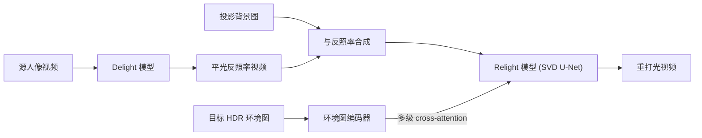

## 一句话总结

本文用一套立方体形 LED 灯箱（Pixel Cube）真实复现环境光、采集"同一动作在不同光照下"的动态人像视频数据集，再基于视频扩散模型微调出一个"先去光、再重打光"的模型，实现照片级、时序一致且保身份的动态人像视频重打光。

## 研究背景

- 领域现状：人像重打光大多依赖 light stage 采集的 OLAT（一次只亮一盏灯）数据。OLAT 能记录空间变化的光照，但天然只能拍静态图，扩展到动态视频极难——即便用 2000 FPS 高速相机循环点灯，有效帧率也只有约 15 FPS。近年扩散模型被引入重打光，但视频人像方向仍缺高质量、带真值光照的训练数据。
- 核心痛点：现有真拍的动态人像重打光数据集普遍**没有真值环境光图**，只能退而依赖"外观迁移"式的弱监督；而扩散模型要想物理准确地学会重打光，恰恰需要"视频 + 真值光照 + 真值反照率"三者配对的高保真数据。
- 本文 idea：造一个能忠实再现真实世界 360° 环境光的全包围 LED 立方灯箱，用时间复用的方式在同一段动作里交替显示多张环境图，从而拿到"同一动作、不同光照、且配对白光反照率"的视频数据；再把这套数据喂给视频扩散模型，微调出去光—重打光两阶段模型。

## 方法

整体框架分两块：一是**数据采集系统**（Pixel Cube 灯箱 + 时间复用采集 + 辐射度补偿），二是**重打光模型**（在 Stable Video Diffusion 上微调出 delight 与 relight 两个模型，用环境图与背景图做光照控制）。

关键设计：

1. **Pixel Cube 灯箱与辐射度补偿**：一个 2m×2m×2m 的立方体，内壁贴 90 块高分辨率 LED 面板（每块 864×864、峰值 1900 nits），把 360° 全景 HDR 环境图重映射成立方体贴图显示，让被摄者被物理准确的全包围辐射包裹。相机与面板刷新同步，可在 60 FPS 下捕获动态序列。为了让显示辐射真正正比于真实场景辐射，作者做了三重补偿：辐射线性化（用逆 gamma 修正显示响应曲线 $$I_c=\left(\dfrac{L_c}{L_{\max}}\right)^{1/\gamma}$$）、距离与角度衰减补偿（角落像素相对中心衰减约 50%，类似暗角）、以及防反射掩膜引起的颜色相关衰减补偿。对比实验显示灯箱重现的阴影与高光与真实环境几乎一致。

2. **时间复用采集拿到配对数据**：采集时按 $$E_w \to E_1 \to E_2 \to E_w \to \dots$$ 交替显示一张纯白背景与两张环境图。因为相机与面板同步，采完可把交错帧重排成三段"同一动作、不同光照"的序列；相邻序列间时延仅 16 ms，动作不剧烈时可忽略。纯白背景那段即可当作真值平光反照率。真拍覆盖 24 名被试（年龄 19–75）、约 3000 张环境图、超 200 万帧。为补充外观多样性，又用 Unreal Engine 的 MetaHuman 渲染 30 个数字人、约 130 万帧合成数据，按 Melanin/Hemoglobin 体积分数均衡采样肤色。

3. **去光—重打光两阶段扩散模型**：以预训练 SVD 为骨干，把视频经 VAE 编码后与噪声隐变量拼接送入扩散 U-Net，优化 $$\min_{\theta}\lVert f_{\theta}(z_t; c, t) - z_o \rVert$$。**Delight 模型**学习把任意光照的人像还原成平光反照率，先把问题正规化；**Relight 模型**再吃反照率视频，用目标环境图做光照条件。环境图不与输入像素对齐，因此不直接拼接，而是先过 VAE、再过一个去掉注意力/时序模块的环境图编码器 $$c=E_{env}(z_E)$$ 抽出多分辨率特征，注入多级 cross-attention 做光照控制。同时把反照率与投影背景图按 $$M\cdot A+(1-M)\cdot B$$ 合成，用背景图额外控制曝光与色调，使结果与背景更协调。环境图被拆成三张图（tone-mapped LDR 保色、log 强度图保 HDR 对比、方向编码图表相机系下光向）送入编码器。

4. **长视频推理**：模型按固定长度（训练 30 帧）训练，长视频用滑动窗口切成重叠短序列。对重叠帧，直接沿用上一序列的干净隐变量 $$z_0$$ 与高斯噪声 $$\epsilon$$（噪声调度 $$z_t=z_0+\sigma_t\epsilon$$ 遵循 EDM），保证相邻批次重叠帧一致，从而借助时序注意力实现跨序列的时序连贯。实验中重叠 20 帧。

## 实验结果

在自采数据上做像素对齐的定量评测（同一动作两种已知环境光，一段作输入、另一段作真值），对比 PN-Relight、SwitchLight、RelightVid 三个 SOTA。下表为四名未见过被试上的平均表现（relight 结果对四张环境图取平均）：

| 任务 | 方法 | PSNR↑ | SSIM↑ | LPIPS↓ |
|------|------|-------|-------|--------|
| Delight | SwitchLight | 20.0 | 0.90 | 0.10 |
| Delight | RelightVid | 7.2 | 0.73 | 0.28 |
| Delight | Ours | 26.9 | 0.93 | 0.07 |
| Relight | SwitchLight | 14.4 | 0.71 | 0.22 |
| Relight | RelightVid | 14.8 | 0.71 | 0.28 |
| Relight | Ours | 22.3 | 0.88 | 0.16 |

（表中数字按论文各被试分数粗略平均，反映相对趋势。）本文方法在去光与重打光两项、所有被试上均领先。SwitchLight 视觉上保身份不错，但常偏暗、发丝边缘抠图不准；RelightVid 因面向通用物体、蓝通道偏高而不真实。

其余实验用文字概括：消融显示"仅合成数据"迁移到真拍会掉点、去掉环境图控制后画面偏暗无法有效控光、去掉背景图色调不协调、端到端直接重打光对输入亮度敏感，验证了两阶段设计的稳定性。时序一致性用基于光流的 warping error 评估，十段序列平均误差仅 0.005。用户研究（10 人、四被试、每段 5 张环境图）显示本方法在光照一致性与真实感上显著优于 SwitchLight，身份保持亦为正面且相当。最后展示了欠曝人像补光、专业布光（split/Rembrandt/Clamshell）、多演员视频统一打光三类应用。

## 亮点与局限

- 亮点：
  - 用全包围 LED 灯箱把"真值环境光 + 动态视频 + 平光反照率"三者一次配齐，直击视频重打光缺真值光照的数据痛点，且 60 FPS 支持动态。
  - 时间复用采集巧妙地拿到"同一动作、不同光照"的成对序列，天然适合监督训练与像素对齐评测。
  - 去光—重打光两阶段 + 多级 cross-attention 环境图控制 + 背景图色调控制，兼顾光照一致性、身份保持与时序连贯。

- 局限：
  - 真拍被试仅 24 人且性别不均衡（18 男 6 女），外观多样性主要靠合成数据补，存在 sim-to-real gap（作者也因此不用合成数据做定量评测）。
  - 灯箱系统造价与标定成本高，非普通研究者可复制；峰值亮度 1900 nits 对强烈直射日光的还原仍有上限。
  - 依赖 SVD 固定长度，长视频靠滑窗重叠拼接；身份保持虽正面但仍略逊于非生成式的 SwitchLight。

## 延伸思考

本文与 Lux Post Facto、DiffusionRenderer、RelightVid 等扩散重打光工作同属一条线，差异在于"用可控 LED 灯箱造真值光照数据"这一采集侧创新——这与 light stage/OLAT 的思路互补，或许能推广到全身、物体乃至场景级的动态重打光数据采集。值得追问的是：灯箱复现的辐射精度上限、以及在 HDR 对比极强场景下反照率估计的误差如何传播到最终重打光；若能把该数据与显式几何/材质（如 DiffusionRenderer 路线）结合，可能进一步提升物理准确性与可编辑性。
