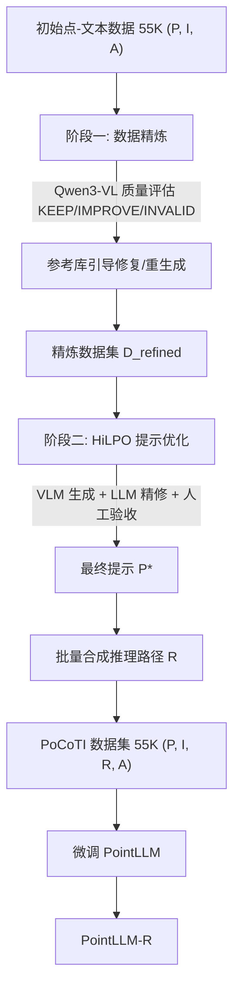

## 一句话总结

用"数据为中心"的两阶段流水线，为 3D 点云理解自动构建带显式思维链（CoT）推理路径的大规模指令数据 PoCoTI（约 55K 样本），再以此微调 PointLLM 得到会"先推理、后作答"的 PointLLM-R，在生成式 3D 分类与描述任务上取得 SOTA。

## 研究背景

- 领域现状：多模态大模型（MLLM）已从 2D 图像扩展到点云，出现了 PointLLM、ShapeLLM、MiniGPT-3D 等一批能直接从原始点云做生成式分类和描述的 3D MLLM。与此同时，思维链推理在纯语言模型和 2D 多模态模型里已被证明能显著提升推理能力与泛化性。
- 核心痛点：现有 3D MLLM 大多是"单步预测"，缺乏显式的中间推理过程，导致可解释性和鲁棒性不足，面对需要多步推断或细粒度几何推理的问题容易给出片面或幻觉答案。把 CoT 引入 3D 的最大障碍是缺乏带显式、几何落地推理标注的高质量 3D 数据集，而 3D 数据的大规模人工标注又昂贵困难。
- 本文 idea：不改模型结构，而是从数据入手。先把已有的点-文本指令数据清洗提纯，再用"人在回路的提示优化"稳定地合成高质量 CoT 推理路径，构造出 PoCoTI 数据集，最后用它微调 PointLLM，把推理能力"教"进模型。

## 方法

整体框架分三步：先做数据精炼（Data Refinement）建立可靠的语义底座，再用人在回路提示优化（HiLPO）迭代出一个好的 CoT 生成提示词并批量合成推理路径得到 PoCoTI，最后用 PoCoTI 微调 PointLLM 得到 PointLLM-R。

关键设计：

- 数据精炼与质量评估：初始数据 $$D_{init}$$ 约 55K 个 $$(P, I, A)$$ 三元组（约 45K 来自 ShapeLLM SFT 数据，另约 10K 由点云对齐 Cap3D 描述构成）。作者把每个点云渲染成四个视角 $$V_P = f_{render}(P) = \{v_1, v_2, v_3, v_4\}$$，用 Qwen3-VL 作为质量评估器，从"问题相关性、答案准确性、答案完整性"三个维度打标签 $$C \in \{\text{KEEP}, \text{IMPROVE}, \text{INVALID}\}$$。KEEP 直接保留；IMPROVE 用评估器给出的修订答案 $$A'$$ 替换；INVALID 不是直接丢弃，而是检索参考库里同一点云的有效 $$(I, A)$$ 对做重新评估——问题合理就修复答案，否则重新合成新的 $$(I, A)$$ 对，并显式要求生成内容与参考不同以保证多样性。
- 人在回路的提示优化（HiLPO）：手工写的 CoT 生成提示常常诱发次优或幻觉推理。HiLPO 从初始提示 $$P_0$$ 出发迭代：用 Qwen3-VL 按当前提示生成 $$N_S = 100$$ 个 CoT 样本 $$s_{k,j} = L_V(V_{P_j}, I_j, A_j, P_{current})$$，再用 Claude 分析样本与提示、产出候选提示，最后由人类专家选择接受或拒绝，即 $$P_{current} \leftarrow H(L_R(S_k, P_{current}))$$。核心分工是：把大规模样本分析和候选提示生成交给 LLM，人只负责专家验收。该过程两轮迭代即收敛，得到最终提示 $$P^*$$。
- PoCoTI 合成与模型训练：用 $$P^*$$ 批量生成，$$(R, A) = L_V(V, I, A, P^*)$$，其中把真值答案 $$A$$ 一并喂入，引导 VLM 推出一条能"自圆其说地导向已知结论"的推理路径 $$R$$，保证合成 CoT 既忠于事实又几何一致，最终得到约 55K 个 $$(P, I, R, A)$$ 样本。PointLLM-R 以 Point-BERT（ULIP-2 预训练）作点云编码器并冻结，只训练投影层和语言模型 $$\theta = (\theta_{proj}, \theta_{LLM})$$，目标是最小化目标序列 $$Y = R + A$$ 的负对数似然：

$$L(\theta) = -\sum_{(P,I,R,A) \sim D_{CoT}} \sum_{k=1}^{\lvert Y \rvert} \log P_\theta(\text{token}_k \mid \text{prefix}_k, P, I; \theta)$$

这样模型被训练成先输出推理步骤、再给出最终答案。

## 实验结果

在 ModelNet40、Objaverse 和真实扫描数据 OmniObject3D 上做零样本生成式 3D 分类，用多家 LLM 评委自动判分取平均。PointLLM-R-7B 在所有基准上均取得最佳，平均准确率 51.49%，比同规模的 PointLLM-7B 高出 9.70 个百分点，且超过 13B 的更大模型。真实扫描的 OmniObject3D 上提升尤其明显，说明推理导向的数据不仅利于合成基准，也显著改善真实场景的迁移鲁棒性。

| 模型 | M40.(I) | Obj.(I) | Omni.(I) | 平均 |
|------|---------|---------|----------|------|
| PointLLM-R-7B（本文） | 62.40 | 59.17 | 33.22 | 51.49 |
| MiniGPT-3D | 57.49 | 52.90 | 25.99 | 45.46 |
| PointLLM-13B | 53.79 | 49.83 | 23.82 | 42.51 |
| PointLLM-7B | 53.24 | 48.85 | 23.46 | 41.79 |
| ShapeLLM-13B | 22.17 | 32.28 | 19.95 | 24.72 |

（表中为指令式提示 I 及三数据集平均准确率；完整表还含补全式提示 C。）

3D 物体描述任务在 Objaverse 上评测，PointLLM-R-7B 在 GPT-4、Gemini-3、Qwen-3、GLM-4.6 四个 LLM 评委下均最优，平均 LLM 分 58.28，比最强基线 MiniGPT-3D 高 4.14 分，Sentence-BERT 与 SimCSE 文本相似度也最高。

消融方面：数据来源上，ShapeLLM SFT 数据贡献主要增益（单用即达分类 50.88 / 描述 57.87），Cap3D 描述提供互补收益，二者结合最优。流水线阶段上，去掉 HiLPO 带来的下降（分类 -5.17）比去掉数据精炼（-1.80）更大，说明提示质量是决定合成 CoT 有用性的关键因素；两者都去掉时最差，二者互补且共同关键。数据规模上，随 PoCoTI 训练样本增多，分类与描述性能持续提升，验证了流水线的可扩展性。

## 亮点与局限

- 亮点：
  - 走"数据为中心"路线，不动模型结构就把显式 CoT 推理能力注入 3D MLLM，思路简洁且可复用。
  - HiLPO 把"大规模样本分析 + 候选提示生成"交给 LLM、人只做专家验收，两轮即收敛，是一种可扩展的提示工程范式。
  - 在真实扫描数据（OmniObject3D）上增益最大，且 7B 模型反超 13B 基线，说明高质量 CoT 数据能让小模型更强。
- 局限：
  - 当点云采样稀疏、缺乏判别性证据时会误判（如把海绵认成砖块），错误主要源于输入信号不足而非推理机制本身。
  - 合成 CoT 依赖把真值答案喂给 VLM 反推理由，本质是"由答案倒推过程"，可能与模型推理时的真实归纳过程不完全一致。
  - 目前聚焦单物体点云的分类与描述，尚未覆盖场景级 3D 点云和更复杂的推理任务。

## 延伸思考

这篇工作与 2D 领域的"多模态思维链 + 数据合成"路线一脉相承，核心贡献在数据而非架构，本质上是把 VLM/LLM 当作可扩展的标注器，再用人在回路兜住质量。值得追问的是：用真值答案引导生成的 CoT 是否会带来"事后合理化"偏差，推理路径的正确性如何独立评估；以及这套流水线迁移到场景级点云（多物体、空间关系、遮挡）时，四视角渲染 + VLM 评估的范式是否还够用。与作者提到的 PointCoT 等同期"显式几何推理"工作对照阅读，能更清楚地看出 3D CoT 目前的边界所在。
