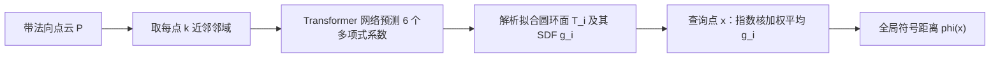

## 一句话总结

把点云里每个点局部拟合成一个有闭式符号距离的圆环面（torus），再用指数核加权把这些局部 SDF 融成一个可在任意分辨率、任意查询点上快速求值的全局符号距离函数——无需全局求解、无需空间离散化。

## 研究背景

- 领域现状：符号距离函数（SDF）同时编码"离表面多远"和"在表面内还是外"两类信息，在建模、仿真、渲染、路径规划、几何学习里用途极广。对封闭几何定义 SDF 很直接，但现实中大量数据是扫描/摄影测量得到的**点云**，其内外与符号距离本身就是病态的。
- 核心痛点：现有的点云符号距离/重建方法（缠绕数 Winding Number、泊松重建 PSR、以及各类神经隐式场）几乎都要**全局求解**或**逐形状训练**，代价高、难扩展到大规模数据、无法实时或在算力受限设备上跑。而经典的"卷积距离近似"公式虽然快，却在点采样表面上只会给出到"采样点"而非"底层真实表面"的距离。
- 本文 idea：作者先在理论上把符号距离、缠绕数、泊松重建统一到一套带屏蔽项（screening）的偏微分方程框架下，指出**自归一化型卷积距离公式**才是可行路线；再用它做工程落地——用局部圆环面（tori）作为二阶曲面代理去拟合每个点的邻域，圆环面恰好有便宜的闭式 SDF，从而把"重建 + 距离"一次性解决。

## 方法

整体框架：给定带法向的点云 $$P = \{(\boldsymbol{p}_i, \boldsymbol{n}_i)\}$$，先用一个预训练神经网络为每个点预测其邻域最佳拟合曲面的六个多项式系数（对应曲面的第一、第二基本形式与一个平移量），据此解析地拟合出一个圆环面 $$T_i$$ 并得到它的 SDF $$g_i$$；查询任意点 $$\boldsymbol{x}$$ 的符号距离时，用指数核对各点的 $$g_i$$ 做加权平均：

$$\phi(\boldsymbol{x}) = \frac{\sum_{i=1}^{\lvert P \rvert} g_i(\boldsymbol{x})\, \exp(-\lambda_{\boldsymbol{x}} \lVert \boldsymbol{x} - \boldsymbol{p}_i \rVert)}{\sum_{i=1}^{\lvert P \rvert} \exp(-\lambda_{\boldsymbol{x}} \lVert \boldsymbol{x} - \boldsymbol{p}_i \rVert)}$$

拟合圆环面只需做一次预计算，且可对所有点并行。

关键设计：

1. **为什么用圆环面**：卷积距离公式的精度取决于局部代理曲面的质量。作者不用平面（只有一阶、易崩）、也不用一般二次曲面（没有闭式距离），而选圆环面——它能局部逼近球面、椭球、鞍面，并以圆柱、平面为极限，且到圆环面的距离有便宜的闭式表达 $$\phi_T(\boldsymbol{x}) = \lVert \boldsymbol{d} \rVert - r$$（相当于对圆做两次距离运算）。拟合时让圆环面赤道过点的偏移位置，主曲率与主方向对齐局部曲面。

2. **只学"最难的那一块"**：与其端到端地直接学整条点云到 SDF 的映射，作者刻意把学习量压到最小——收敛性由经典理论（拉普拉斯方法的渐近分析）保证，只用网络去预测唯一没有简单解析解的部分：每个邻域的六个曲面系数 $$a_{0,0}, a_{0,1}, a_{1,0}, a_{1,1}, a_{0,2}, a_{2,0}$$。网络在所有邻域、所有形状间**共享权重**，训练一次即可用于任意新点云，无需逐形状再训练。

3. **网络结构**：对每个 $$k$$ 近邻邻域，先按中心点法向构造正交基、以相对坐标编码位置与法向以获得刚体变换不变性，投影到 128 维后过一个八层、八头的 Transformer（用注意力去学邻域里哪些点对局部拟合最重要，注意力本身也是一种核回归），最后用一层 MLP 输出六个系数。损失同时包含距离误差（$$L_1$$）与 eikonal 误差，后者隐式鼓励相邻邻域平滑衔接。

4. **屏蔽参数 $$\lambda$$ 的选取与加速**：有了好的局部拟合后，只要取足够大的 $$\lambda$$ 就能逼近真实距离。作者用一个基于机器精度的移位公式稳定求值，并按点云平均近邻间距自动设定 $$\lambda$$；求值时只在半径 $$R_{\text{eval}}$$ 内求和（否则退化到最近 32 点），使复杂度可控。相比 eikonal 会被破坏的非归一化公式，自归一化形式允许空间变化的 $$\lambda$$。

## 实验结果

在 ABC、程序生成 blob、Thingi10K、解析 SDF 四个数据集上（点云仅 512 点的稀疏设置），本文方法的符号距离平均绝对误差**稳定低于**其它基于点的卷积方法（signed Hopf-Cole、smoothed signed planar distance）以及全局的 signed heat method（SHM）；相比"泊松重建→网格化→算距离"的端到端管线，SPSR 在四个数据集里三个略优，但本文在 ABC 上更好。本文尤其不易出现基线常见的灾难性失败（其符号估计依赖脆弱的切平面测试）。

速度上，本文接近朴素卷积方法、比全局 SHM 快数个数量级；预计算与查询时间都随点云规模**线性**增长，2900 万点的点云预计算约 12.5 分钟、单次查询约 4 毫秒。下表为 MacBook 上单次顺序查询耗时对比：

| 方法 | 单次查询时间（MacBook, 无独显） | 说明 |
|------|------|------|
| 本文 PAT | 约 $$7.4\times10^{-5}$$ s | 兼给重建 + 符号距离 |
| Fast Winding Number | 约 $$3.9\times10^{-6}$$ s | 并行 + 层次加速，仅占用性 |
| Signed Heat Method | 慢数个数量级 | 全局网格求解 |

应用上，得到 SDF 后即可对点云直接做偏移面、布尔运算、形态学腐蚀/膨胀、球面追踪直接可视化，并可对 3D 高斯、神经隐式、COLMAP/GLOMAP 多视几何输出的点云计算符号距离；还能用 SDF 梯度迭代地纠正朝向不一致的法向。

## 亮点与局限

- 亮点：
  - 理论贡献扎实——用带屏蔽项的（Hopf-Cole 变换后）PDE 把符号距离、缠绕数、正则化缠绕数、泊松重建统一起来，并论证了为何只有自归一化卷积公式适合点云。
  - "最小学习"哲学：只学一个局部、跨形状共享的小网络，训练一次通用，绕开了神经隐式场逐形状训练、拟合 eikonal 方程难收敛的老大难。
  - 输出敏感、无需全局求解或空间离散化，单点查询亚毫秒级、易并行，天然可微，对噪声/离群点/不均匀采样有一定容忍度。

- 局限：
  - 采样特征若与训练分布差异大，预测不够鲁棒；对大面积缺失数据的补洞不如 SHM 平滑。
  - 对含噪点云网络难以学好（作者归因于曲率估计本身病态），且必须依赖较好的法向朝向信息，完全无朝向时仍需更复杂策略。
  - 有趣的反直觉现象：采样越密，SDF 内部反而可能变差（$$k=64$$ 邻域变小后网络可能拟合出过紧的圆环面）；$$\lambda$$ 目前只用固定启发式，未针对局部密度/噪声调优。
  - 千万级点云的预计算需数分钟，比 SPSR 慢约一倍，实时性主要体现在查询而非预计算。

## 延伸思考

这篇工作把"生成模型只会记忆训练数据"和"卷积距离只会 snap 到最近样本"点破为同一现象——都是指数渐近下的单点主导，很有启发性：它暗示凡是想从离散样本恢复"底层连续真值"的问题，都需要引入更高阶的局部信息而非单纯的标量扩散。方法本身完全可微、输出敏感，作者也点名了逆向渲染与生成建模作为后续方向；把 PAT 作为一种可查询、可微的形状表示嵌入到可微渲染或扩散/流匹配管线里，或许能同时获得几何正则与快速距离查询。另一个自然的追问是 $$\lambda$$ 的自适应调优与层次化加速——这与 NKSR、泊松重建里的带宽调参一脉相承，是把该方法推向更强鲁棒性与更大规模的关键。
