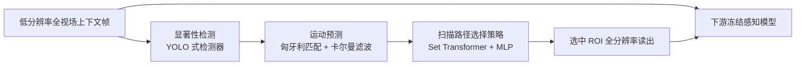

## 一句话总结

面向 200 MP 级超高分辨率传感器，本文把"该采哪些像素、什么时候采"建模成一个任务感知的传感器注意力策略学习问题，在采集时刻就把有限的像素带宽动态投给任务相关的高分辨率 ROI，从而在极低带宽下保住下游感知性能，并在真实双流传感器原型上跑通。

## 研究背景

- 领域现状：商用图像传感器已突破 200 MP，400 MP 原型也在研发中。超高分辨率对目标跟踪、文字识别、机器人操作等下游视频感知任务越来越重要，因为很多关键线索（小目标、细小文字、精细纹理）在低分辨率下就丢了。
- 核心痛点：受带宽、延迟、功耗限制，系统根本无法以全分辨率采集/传输/处理所有像素。现有做法是任务无关的空间下采样（保帧率、丢空间细节）或时间下采样（保空间细节、丢时间连续性）——这类"一刀切"的降采样在采集阶段就不可逆地丢掉了可能对任务至关重要的高频信息，事后处理再也补不回来。
- 本文 idea：借鉴人眼中央凹（fovea）视觉——用低分辨率全视场做全局上下文，同时把高分辨率"凝视"动态投向最相关区域。新兴的双流传感器恰好支持同时读出低分辨率全视场帧与位置可编程的全分辨率 ROI。于是本文让"过去的观测"驱动"未来的采样动作"，在采集时刻做预测性、任务驱动的中央凹式采集，闭合"感知—采集"回路。

## 方法

整体框架：系统在每帧同时拿到一张固定下采样的低分辨率全视场上下文帧和一块全分辨率 ROI 裁剪；传感器注意力因此简化为"选哪块 ROI"。作者没有端到端从原始像素学一个大策略，而是把问题拆成三个轻量、可解释、可独立替换的模块：显著性检测、运动预测、扫描路径选择策略。这样能在边缘设备上实时推理，也避免了单体大策略的不稳定与高延迟。

关键设计：

- 从低分辨率上下文做显著性检测：只在低分辨率上下文帧上跑一个 YOLO 式检测器（按任务微调），输出候选物体的边界框、外观嵌入、类别和置信度。只在低分辨率帧上算，把采集与计算开销压到最低，快速抽取全局场景结构与候选目标。
- 短时距运动预测：用匈牙利匹配把跨帧检测关联起来，再用恒速卡尔曼滤波把每个物体的边界框中心与速度向前外推 $$T_p$$ 帧，得到候选裁剪参数。作者的判断是采集只需短时距预测加频繁的滚动重规划，所以简单恒速模型已足够准且延迟低，可应对快速运动、遮挡和交互。
- 扫描路径选择策略：策略不直接回归连续 ROI 参数，而是在检测到的物体上输出一条离散扫描路径。每个物体拼成一个 token $$z_i^{(k)}$$，由三部分构成——用冻结的 MobileNetV3-Small 编码的高分辨率 ROI 外观特征、经时序一维卷积聚合的低分辨率全局上下文特征、以及检测与运动特征。再用置换不变的 Set Transformer 做全局物体推理（可接入可选任务条件 token），经轻量 MLP 头对未来每个时刻输出物体选择的类别分布：

$$p_\theta(i \mid k+\tau) = \mathrm{softmax}\,\mathrm{MLP}(\tilde{z}_i^{(k)}), \quad \tau = 1, \dots, T_p$$

  选中的物体索引映射为对应预测框的 ROI 参数。该形式天然支持滚动时域控制：执行 $$T_a < T_p$$ 个动作后再重规划，在推理延迟与环境适应性之间取平衡。
- 为什么用模块化策略：相比端到端大策略，拆分带来三点好处——延迟可预测的实时推理、逐组件训练带来的稳定性与可解释性、以及可按下游任务独立替换/升级组件。训练时策略参数在冻结的任务感知模型下端到端学习；实际中整条流水线可在 CPU 和低端 GPU 上实时运行。

## 实验结果

在三个对空间细节、时间分辨率、闭环响应性要求各异的视频感知任务上做仿真评测，下游模型全程冻结以隔离"采集策略"本身的效果。所有方法在相同的平均像素吞吐（带宽）约束下比较：目标跟踪与文字识别用 1/8 预算、机器人操作用 1/16 预算。任务分别为 SoccerNet 目标跟踪（MixFormerV2，IoU）、RoadText-1K 场景文字识别（DeepSolo，转写正确率）、Static ALOHA 双臂插入操作（ACT，成功率）。

| 任务 | 指标 | 全分辨率 | GT Oracle | 空间下采样 | 时间下采样 | 本文 Foveated |
|------|------|------|------|------|------|------|
| 目标跟踪 | IoU ↑ | 0.281 | 0.405 | 0.122 | 0.148 | 0.283 |
| 文字识别 | 转写率 ↑ | 0.333 | 0.271 | 0.067 | 0.248 | 0.264 |
| 机器人操作 | 完整成功率 ↑ | 0.15 | N/A | 0.10 | 0.07 | 0.12 |

本文方法在同等带宽下一致优于任务无关基线：目标跟踪上以 8× 更低带宽达到 IoU 0.283，甚至略超全分辨率（0.281），因为 ROI 裁剪抑制了背景干扰；文字识别的转写率 0.264 也逼近 GT Oracle（0.271）。机器人操作上完整/部分成功率（0.12 / 0.57）明显好于时间下采样（0.07 / 0.30）和空间下采样（0.10 / 0.51），接近全分辨率（0.15 / 0.61）。

消融方面：系统级对比中，"始终居中 ROI"和"轮询扫描"都远逊于学习策略（归一化性能上，本文在三任务分别达到 100.7% / 79.3% / 93.4%）。策略输入消融表明去掉运动特征、全局上下文特征或高分辨率 ROI 特征都会掉点，三者缺一不可。硬件方面，作者在基于三星 ISOCELL HP2 的 200 MP 双流传感器原型上实现该流水线：全视场流 2040×1148、ROI 流 4080×2296（16× 空间分辨率提升），端到端稳定 30 fps，每帧只以全分辨率读出约 6.25% 的传感器面积，跑通了平滑追踪（跟踪）与扫视（文字识别）两类扫描路径。

## 亮点与局限

- 亮点：
  - 把中央凹式采集的时机前移到"采集时刻"而非后处理，直击"降采样一旦丢信息就不可逆"的根本痛点。
  - 模块化（显著性检测 + 卡尔曼运动预测 + Set Transformer 扫描策略）设计带来实时性、可解释性与组件可替换性，能层叠在冻结的现成感知模型之上，无需重训下游。
  - 不只停留在仿真：在真实 200 MP 双流传感器原型上以 6.25% 面积读出、30 fps 跑通，验证了工程可行性。
- 局限：
  - 预测性中央凹依赖时间连贯性，高度随机或瞬时事件会削弱"预测"的收益。
  - 采集时刻的实时约束严格，轻量策略仍引入额外系统复杂度。
  - 当前原型每帧支持的 ROI 数量有限，更灵活或层次化的中央凹模式仍待探索。

## 延伸思考

这项工作把中央凹式成像从图形学里"渲染/显示时刻的注视相关优化"推进到"传感器采集时刻的主动感知"，与主动视觉（next-best-view、主动 SLAM）在"闭合感知—动作回路"上一脉相承，但控制层级不同——它调的是相机中央凹机制的参数而非相机位姿。值得追问的方向包括：把框架推广到多相机系统、其他传感模态或闭环机器人感知流水线；用强化学习替代当前依赖冻结感知模型的端到端监督，以处理更长时距、更强随机性的任务；以及探索层次化/多 ROI 的带宽分配。对做计算成像、边缘感知或机器人视觉的读者，这是一个"感知—采集协同设计"的很好范例。
