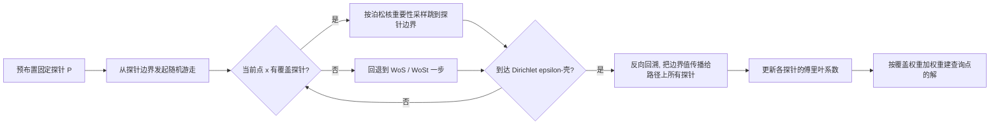

## 一句话总结

利用随机游走的马尔可夫性质，把 Walk on Spheres 每条路径上的所有中间落点都变成可复用的无偏样本，并通过一组预先布置的固定"探针球"把这些落点整理成可高效聚合的边界样本，从而大幅降低方差、加速网格无关的 PDE 求解。

## 研究背景

- 领域现状：Walk on Spheres（WoS）是求解偏微分方程的网格无关蒙特卡洛方法，天生无需网格、易并行、支持局部求值，近年在图形学里被 Sawhney 与 Crane 重新发扬，衍生出处理 Neumann 边界的 Walk on Stars（WoSt）、可微分公式等一系列扩展。
- 核心痛点：作为蒙特卡洛方法，WoS 收敛速度只有 $$O(N^{-1/2})$$，慢。已有的方差缩减手段（Boundary Value Caching、Mean Value Caching、Harmonic Caching 等）都把底层 WoS 当成一个黑盒求解器，只在离散采样点上缓存结果，忽视了随机游走轨迹本身蕴含的大量信息。
- 本文 idea：从马尔可夫性质出发——一条 WoS 轨迹不仅对起点无偏，对路径上每一个中间落点都提供无偏估计。若能复用这些中间点，样本效率可显著提升。难点在于标准 WoS 里的球是随距边界距离动态生成的，缺乏持久结构，无法高效聚合。作者用一组固定探针球取代动态球来解决这一点。

## 方法

整体框架：先在感兴趣区域内预先布置一组固定的球形"探针"，随机游走不再在当前点动态生成球，而是在覆盖当前点的探针边界上跳转（off-center 采样）。这样每条路径经过的所有点都被映射到有限个固定探针上，探针随时间累积大量边界样本，再借助泊松积分公式 / 傅里叶级数展开在探针内部重建解。

关键设计：

1. **路径复用的理论基础（off-center 估计器）**。泊松积分公式对球内任意点都成立，而不仅是球心。对查询点 $$x$$ 及覆盖它的球 $$B_c$$，有 $$\hat{u}(x; B_c) = \frac{1}{N}\sum_{i=1}^{N} \frac{P_{B_c}(x, Z_i)}{p_i(Z_i)}\hat{u}(Z_i)$$。由此定义邻居集合 $$\mathcal{N}_x = \lbrace c \mid x \in B(c, d(c, \partial\Omega)) \rbrace$$，把落在多个球内的估计做归一化加权叠加即得广义估计器。直接复用整条轨迹（naive path reuse）信息利用最大，但每个查询点会被 $$O(Q)$$ 个路径球覆盖，评估复杂度飙到 $$O(Q^2)$$，不可行。

2. **Walk on Probes（WoP）——用固定探针换掉动态球**。核心是把"为每步每条路径生成一次性球"改成"把所有游走步映射到有限的固定探针集合"，从而把无穷多的路径球压缩成有限集合。游走时若当前点被某探针覆盖就在其边界按泊松核重要性采样跳转，否则回退到标准 WoS / WoSt（这也让方法能处理 Neumann 边界）。由 Feynman-Kac / Kakutani 原理可证明其无偏，泊松核恰是维纳过程在探针边界上首次命中点的精确 PDF。**必须按泊松核做重要性采样**，否则会累积重要性权重连乘 $$\prod_i \frac{P_{B_c}(x_{i-1}, z_i)}{p_i(z_i)}$$ 导致方差爆炸。

3. **谐波缓存把复杂度降回线性**。显式存所有边界样本再逐点用泊松核评估（Poisson Kernel Caching）仍是 $$O(Q^2)$$。改用 Zhou 等人的傅里叶级数表示 $$u(r,\theta;B_c)$$，把路径落点投影成 $$L$$ 阶傅里叶系数（投影 $$O(QL)$$、评估 $$O(QL)$$），总复杂度降到 $$O(Q)$$。截断阶数 $$L=10$$ 在精度与效率间取得稳定平衡。

4. **自归一化 + 控制变量的方差缩减**。对傅里叶系数估计采用混合策略：零阶系数 $$\hat{a}_0^{B_c}$$ 用自归一化重要性采样（SNIS）估计；高阶系数则用 $$\hat{a}_0^{B_c}$$ 作控制变量，减去这个直流分量——因常数与正弦基函数正交，不改变期望却显著降低被积函数能量、缩减方差。探针布置用贪心覆盖策略，引入重建比 $$\alpha_{\text{rec}}=0.9$$ 和游走比 $$\alpha_{\text{walk}}=0.6$$ 两个参数分别控制重建区域和游走偏心度，并用四叉树 / 八叉树做空间加速找最优探针。方法通过把 Green 函数换成 Yukawa 势、径向基换成修正贝塞尔函数，自然扩展到 Poisson 与 screened Poisson 方程。

## 实验结果

在 C++ 中用 FCPW 做几何查询实现，与 WoSt、MVC、HC 在多个 2D / 3D 混合 Dirichlet-Neumann 边值问题上对比。下表取各场景"解"的相对均方误差（relMSE，越低越好），可见 WoP 在更短时间内取得比所有基线低约一个数量级的误差：

| 方法 | Ladybug (2D) | Engine (2D) | Lock (2D) | Bunny (3D) |
|------|-------------|-------------|-----------|-----------|
| WoSt / WoS | 2.110e-02 | 1.089e-01 | 2.020e-01 | 4.727e-01 |
| MVC | 2.852e-03 | 9.675e-03 | 3.720e-03 | 1.860e-02 |
| HC | 2.367e-04 | 6.787e-04 | 8.511e-04 | 2.829e-03 |
| 本文 (WoP) | 1.425e-04 | 2.419e-04 | 1.873e-04 | 6.024e-04 |

消融实验（Lock 与 Gear 场景）表明性能提升主要来自路径复用：开启复用后相比"仅用起点样本"在等时间下误差降低约一个数量级；而在不复用时，把 WoP 游走换成 WoSt 几乎无差异，印证二者数值等价。自归一化（SN）与控制变量（CV）组合在所有场景取得最低误差且额外开销可忽略，CV 甚至对 HC 也有效。此外 WoP 在靠近 Neumann 边界的区域反而样本更密——这些区域游走更长、天然产出更多可复用样本，把慢收敛的难点转化为优势。

## 亮点与局限

- 亮点：
  - 从马尔可夫性质切入，第一次系统性地复用整条随机游走轨迹（而非只复用第一步），理论清晰、无偏性有 Feynman-Kac 保证。
  - 用"固定探针"这一几何正则化把难以处理的路径点分布转成固定边界上的样本，配合谐波缓存把复杂度从 $$O(Q^2)$$ 降到 $$O(Q)$$，工程上可落地。
  - 在各类边界条件与 2D/3D 场景下均以更短时间取得最低误差，并保持 WoS 网格无关的优势。
- 局限：
  - 内存开销显著。为了反向回溯重建中间点，必须缓存整条轨迹信息（探针索引、采样角、PDF、源项/边界贡献），单条游走可达上万步，per-thread 存储很大，制约大规模并行，尤其难以高效上 GPU。
  - 运行时瓶颈集中在 Fallback WoSt，在 Neumann 主导场景和 3D（探针覆盖局限于 ROI 平面）中回退频繁、开销更大。
  - 最优回退概率 $$p_{\text{fb}}$$ 依场景而定，无统一取值。

## 延伸思考

- 探针上收集的中间估计天然构成解的粗略表示，可进一步用于 path guiding 重要性采样（作者已引用 Guiding-Based Importance Sampling for Walk on Stars 作为方向）。
- 把探针从球形推广到星形区域、半球或扇形，有望更好支持 Neumann 边界、减少基元数量并缓解近边界几何误差。
- 变系数 PDE 仍是硬骨头，需要为空间变化系数推导对应的局部级数展开。
- 这套"把随机过程约束到解析可解几何上再做时间累积"的思路，与渲染里的辐照度探针 / DDGI 一脉相承，或可反向启发渲染端的缓存结构设计。
