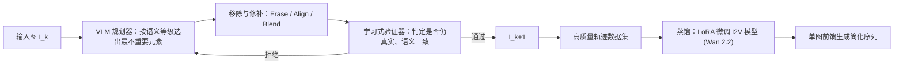

## 一句话总结

在保持照片真实感的前提下，按语义重要性逐步移除并修补画面元素，把一张照片渐进地"抽象"成越来越简洁却依然像真实照片的序列。

## 研究背景

- 领域现状：图像"抽象/简化"长期以来主要走非真实感渲染（NPR）路线——把照片转成素描、卡通、油画等风格化表达，通过改变视觉媒介来降低复杂度。
- 核心痛点：NPR 类方法在降低视觉复杂度的同时牺牲了照片真实感（结果不再像照片）。而通用的物体移除工具通常需要手工画蒙版、逐个指定，缺乏"该先移除什么、移除到什么程度"的语义判断。
- 本文 idea：提出一个互补方向——语义图像简化（semantic image simplification）。抽象不必是非真实感的：通过在内容层面按语义重要性顺序移除元素并高质量修补，让每一步中间结果都仍是一张可信的自然照片，从而在"真实"与"抽象"之间形成一条连续谱。

## 方法

整体框架分两阶段。第一阶段用一个基于搜索的 Select–Remove–Verify（选择–移除–验证）闭环，逐步生成高质量但计算昂贵的简化轨迹；第二阶段把这些轨迹蒸馏进一个图像到视频（I2V）扩散模型，实现从单张输入图直接前馈预测整段简化序列的高效推理。

问题被形式化为"照片真实的减法式简化"：给定初始图 $$I_0$$ 及其 $$n$$ 个元素，目标是找到一个按语义重要性递增排列的移除顺序 $$\pi$$，从而生成轨迹 $$I_0, \dots, I_n$$。这相当于在一棵概念树中找从根到叶的最优路径，面临两大挑战：搜索空间是 $$n!$$ 的超多项式规模无法穷举；且元素重要性本身带有主观性，缺乏可靠的解析打分函数。

关键设计：

- **语义重要性分级（taxonomy）**：不追求逐物体的精细排序，而是提出一个粗粒度但可解释的四级"脚手架"——干扰元素（Distracting，最先移除）、次要元素（Secondary）、主体元素（Primary-Subject）、背景元素（Background，最后移除）。用户研究（3 名标注者、93 张图）显示分级与人类感知一致性强（Kendall $$\tau_b \in [0.63, 0.75]$$），跨类别的移除先后共识压倒性（干扰元素 100% 最先被移除，次要元素相对主体被优先移除占 96.1%），而同类别内部顺序则高度模糊——这正说明"粗分级做骨架 + VLM 做类内细排"的混合设计合理。

- **Select–Remove–Verify 闭环**：选择阶段用 VLM（Gemini 3 Pro）作高层规划器，在当前激活的类别内挑出语义最不重要的单个元素，并在每步重新规划以适应前序编辑带来的构图与遮挡变化；移除阶段用通用编辑模型生成候选，再经一套稳健融合管线抑制漂移——先用关键点匹配把编辑结果配准回原图，再按局部梯度倒数加权算差异蒙版（在强边缘附近抑制改动），最后在蒙版内做局部直方图匹配与软 alpha 融合、其余像素直接复制原图。

- **学习式验证器**：为过滤移除失败，用一个孪生 DINOv2-Large 主干（LoRA 适配，$$r=16$$）作分类门控。它把 patch token 重排成特征网格并计算差异图 $$\Delta = \lvert G_{in} - G_{out} \rvert$$，将 $$[G_{in}; G_{out}; \Delta]$$ 送入轻量两层 CNN 头。每步最多生成 5 个候选，接受第一个通过验证的，否则跳过该次移除。分类器在约 8000 对样本（人工正例 + 合成/反向轨迹/对抗负例）上训练。

- **蒸馏为 I2V 视频生成**：把简化序列视作"减法式定格动画"，时间维即简化深度。冻结 140 亿参数的 Wan 2.2（I2V 潜扩散模型），只用 LoRA 微调注意力与前馈层，在阶段一验证过的轨迹上以标准扩散去噪目标训练、以首帧 $$I_0$$ 为条件。推理时对单张输入自回归生成：把生成片段的末帧作为下一段输入，早期帧做保守清理、后期帧收敛到极简构图。

## 实验结果

评测用 Open Images 的 93 张图子集，由人工按分级标注出 530 个物体（68 张图、平均每图 7.8 个）的严格语义等级作为真值。核心指标是 Pairwise Order Accuracy（基于改良 Kendall $$\tau_b$$）：只比较不同类别的物体对，统计"高重要性物体被先于低重要性物体移除"（逆序）与"不同重要性物体被同时移除"（无法区分层级）两类错误。主实验把本文方法与两个开箱即用的 I2V 大模型在相同文本提示下对比：

| 方法 | Order Accuracy ↑ |
|------|------|
| Wan 2.2 (Base) | 0.214 |
| Veo 3.1 | 0.402 |
| 本文 | 0.728 |

预训练视频模型在减法式简化任务上表现差（Wan 2.2 近乎随机 0.214，Veo 3.1 仅 0.402 且常先移除背景），本文方法以 0.728 显著贴合真值层级。

消融实验（5 轮种子/温度）显示：蒸馏模型从"不过滤全部约 7500 条轨迹"（0.641）到"仅用约 1500 条人工精选高质量轨迹"的 HQ-Only（0.716）逐步提升，而搜索式方法本身达 0.728；去掉验证分类器对语义排序分数影响不大（0.723 vs 0.728），因为分类器主要保障视觉质量而非排序。效率方面，阶段一每张图平均耗时超 2 小时（复杂场景超 4 小时），蒸馏后的阶段二仅需约 15 分钟。

## 亮点与局限

- 亮点：
  - 提出"照片真实的减法式抽象"这一新视角——抽象不必牺牲真实感，realism 与 abstraction 可沿连续谱共存。
  - 可解释的四级语义分级 + VLM 类内细排的混合设计，兼顾稳健骨架与细粒度判断，并有用户研究支撑其与人类感知的一致性。
  - "高质量搜索轨迹 → I2V 模型蒸馏"的范式把两小时级的昂贵流程压到分钟级，并天然衍生出内容感知去杂、语义分层分解、交互式分支编辑等应用。

- 局限：
  - 蒸馏模型的视频推理仍偏慢（依赖未来更快的基础模型）。
  - 移除顺序仍有主观争议，需靠交互式树探索缓解。
  - 阶段一的移除与修补高度依赖底层生成模型，偶有失败或视觉伪影。

## 延伸思考

这项工作把经典的"抽象即选择性简化以引导感知"（Gombrich、Gestalt 等）与现代生成模型接了起来，思路上与 Visual Jenga 的物体逐次移除相关，但那里按物理稳定性、这里按语义重要性排序，目标是保持场景可解释性。把简化序列当作"定格视频"来蒸馏 I2V 先验是很聪明的一步，值得追问的是：语义分级目前是硬编码的四层启发式，能否让模型自适应学习更细或场景相关的层级？验证器与移除模型都建立在特定商用/开源大模型之上，方法的上限也随之绑定，底模更换时的稳定性与可复现性值得关注。此外"减法式抽象"作为可控编辑接口，天然适配 2.5D 视差动画、重打光、物体插入等合成流程的预分层需求。
