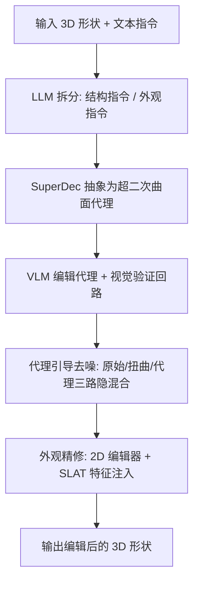

## 一句话总结

Prox-E 是一个免训练的 3D 编辑框架：把输入形状抽象成一组可解释的几何基元（超二次曲面），让视觉语言模型在这个"代理"上做结构编辑，再用编辑后的代理引导 3D 扩散模型去噪，从而在严格保持物体身份的前提下完成细粒度、局部化的几何与外观修改。

## 研究背景

近年基于 2D 图像编辑模型驱动 3D 编辑的范式非常流行：把 3D 结构当作多视图合成的脚手架，用 2D 扩散模型编辑投影视图再聚合回 3D。这个范式隐含两个假设——预训练 2D 扩散模型能从投影视图产出语义与几何都正确的编辑，且少量编辑视图足以传播到完整 3D 形状。

对于细粒度 3D 编辑，这两个假设都站不住脚。作者观察到，现有 2D 编辑器（如 Flux-Kontext、Nano-Banana）擅长外观修改和语义插入（例如"在椅子上放只兔子"），却难以完成需要度量推理的几何指令（例如"把座面加宽 1.5 倍""把腿变短"）。原因是像素扩散模型缺乏对 3D 空间中度量属性的显式理解。

核心矛盾在于：真实创作流程更多是对已有几何做精确的局部修改（把桌腿按固定倍数加长、转动车轮），同时严格保留整体身份，而不是从头生成。作者主张需要一个既能桥接图像编辑先验、又能提供视角无关的度量引导的显式中间表示。

## 方法

整体流程分三步：基元抽象编辑、结构生成、外观精修。

### 表示与骨干

几何基元采用超二次曲面（Superquadric），其隐式方程为：

$$
f(x, y, z; \lambda) = \left( \left( \frac{x}{a_1} \right)^{\frac{2}{\epsilon_2}} + \left( \frac{y}{a_2} \right)^{\frac{2}{\epsilon_2}} \right)^{\frac{\epsilon_2}{\epsilon_1}} + \left( \frac{z}{a_3} \right)^{\frac{2}{\epsilon_1}} = 1
$$

每个基元用 11 个参数描述：尺度 $\boldsymbol{a} = [a_1, a_2, a_3]$、形状指数 $\boldsymbol{\epsilon} = [\epsilon_1, \epsilon_2]$、平移 $\boldsymbol{t}$、旋转 $\boldsymbol{r}$。生成骨干是 TRELLIS：先生成稀疏结构（$64^3$ 占据栅格），再在结构化隐空间（SLAT）合成外观，两阶段都用整流流 Transformer。

### 基元抽象编辑

先用 LLM 把文本指令 $c_{txt}$ 拆成结构编辑指令 $c^{struct}_{txt}$ 和外观编辑指令 $c^{app}_{txt}$。对输入形状采样密集点云，用 SuperDec 分解成一组超二次曲面得到原始代理 $P_{orig}$。关键点是：基元被当作粗糙的体积引导而非刚性边界条件，让扩散模型的形状先验去补偿离散化误差。

VLM 作为编辑智能体：给每个基元分配唯一索引和颜色，把参数打包成结构化 JSON。VLM 收到四个正交视图的着色代理图、原始形状渲染图、参数 JSON 和结构指令。颜色编码让 VLM 能把视觉特征（"红色的腿"）对应到符号化的参数条目。VLM 以"最小干预"原则修改参数或增删基元，并输出思维链推理。最后有一个视觉验证回路：渲染编辑后的代理 $P_{edit}$ 反馈给 VLM 确认是否满足指令，不满足则迭代，直到通过或达到最大次数。

### 结构编辑：代理引导去噪

把 $P_{edit}$ 相对 $P_{orig}$ 的基元分为三类：未变 $Q_{uc}$、编辑 $Q_{ed}$、新增/删除 $Q_{new}$，各类基元的体积并集定义空间掩码 $M_{uc}$、$M_{ed}$、$M_{new}$。

对每个被编辑的基元对，用其位姿矩阵 $M = TRS$ 计算相对仿射变换：

$$
M^{(i)}_{rel} = M^{(i)}_{edit} \left( M^{(i)}_{orig} \right)^{-1}
$$

把它作用到 $S_{orig}$ 顶点得到"扭曲形状" $S_{warp}$。随后对 $S_{orig}$、$S_{warp}$、$P_{edit}$ 分别做 DDIM 反演到 $t_{init}$，用反演后的 $P_{edit}$ 初始化去噪，并存下 $S_{orig}$ 与 $S_{warp}$ 的中间反演隐栅格。每一步先做去噪器更新，再按掩码覆写：

- $M_{uc}$（原始形状注入）：对 $v \in M_{uc}$，用原始形状隐栅格覆写 $z_t[v] \leftarrow z^{orig}_t[v]$，从 $t_{init}$ 一直到接近 0 的 $t_{uc}$，严格保留未改区域。
- $M_{new}$（新增区域）：直接取自演化中的隐栅格 $z_t$，由反演的代理提供粗结构。
- $M_{ed}$（编辑区域注入）：用扭曲形状的反演隐 $z^{warp}_t$ 覆写，从 $t_{init}$ 到中间时刻 $t_{warp}$（满足 $t_{uc} < t_{warp} < t_{init}$），把原始表面细节搬到新位置，后续步骤把各块缝合成连贯整体。

### 外观精修

利用 TRELLIS 结构与外观解耦的特点，从文本引导切换到图像引导。渲染原始形状视图 $V_{orig}$，用 2D 图像编辑器按 $c^{app}_{txt}$ 编辑得 $V_{edited}$。反演 $S_{orig}$ 的 SLAT 特征得 $z^{app}_t$，再从高斯噪声起以 $V_{edited}$ 为条件去噪，用 $M_{uc}$ 和 $M_{ed}$ 做类似的特征混合。对 $v \in M_{ed}$，取其编辑前位置 $v' = (M^{(i)}_{rel})^{-1} v$ 处的特征注入。阈值 $t_{app}$ 用二元策略控制：有外观编辑时设得接近 $T$，无外观编辑时用较小固定值以保原貌。

## 实验结果

在 ShapeTalk 数据集的 Chair、Table、Lamp 三类各随机采样 200 对"hard"样本评测，指标覆盖身份保持（l-GD、LPIPS、DINO-I）、质量（PFD、FID）和编辑保真度（CLIP、VQA）。

| Model | l-GD↓ | LPIPS↓ | DINO-I↑ | PFD↓ | FID↓ | CLIP↑ | VQA↑ |
| --- | --- | --- | --- | --- | --- | --- | --- |
| ChangeIt3D | 0.02 | – | – | 30.58 | – | 0.21 | 0.49 |
| BlendedPC | 0.01 | – | – | 7.81 | – | 0.23 | 0.51 |
| Spice-E | 0.03 | 0.15 | 0.86 | 11.79 | 56.56 | 0.27 | 0.62 |
| EditP23 | 0.03 | 0.16 | 0.82 | 39.58 | 54.13 | 0.28 | 0.58 |
| VoxHammer | 0.01 | 0.14 | 0.86 | 12.89 | 52.45 | 0.27 | 0.55 |
| TRELLIS | 0.02 | 0.15 | 0.91 | 16.43 | 36.64 | 0.28 | 0.65 |
| Ours | 0.02 | 0.10 | 0.92 | 11.34 | 32.60 | 0.28 | 0.71 |

本方法在 LPIPS、DINO-I、FID、VQA 上取得最佳。VoxHammer 和 BlendedPC 的 l-GD、PFD 略优，但它们依赖显式 3D 编辑掩码或训练目标对未改区域的显式保留，这在提升身份保持的同时牺牲了编辑表达力，反映在更低的 VQA 分上。本方法的最高 VQA 分说明其编辑保真度更强。44 人用户研究中，本方法对所有竞争者的胜率均显著领先，最接近的 TRELLIS 在编辑质量上仅 21.2% 胜率。

消融实验验证了混合机制中各路反演隐的作用：仅用编辑代理会丢失身份；去掉编辑代理身份保持最好但编辑保真度下降（尤其无法添加新部件如灯的凸起）；去掉扭曲形状会损失质量；外观精修模块在所有指标上都带来提升。

## 亮点与局限

亮点：

- 免训练、即插即用。不需要配对数据或类别监督，直接借用现成 VLM 与 3D 扩散骨干，且对分解后端不敏感，未来更强的分解方法可直接受益。
- 显式几何代理提供了视角无关的度量引导，弥补了 2D 像素编辑器缺乏 3D 度量推理的短板，能精确执行"加宽 1.5 倍"这类参数化指令。
- 神经符号结合：把参数化基元当作"高效词汇表"，让 VLM 以带视觉验证的方式做空间推理，同时支持添加/删除部件这类拓扑编辑，而非仅限形变。
- 三路隐混合（原始注入、扭曲注入、代理注入）配合结构外观解耦的去噪策略，在身份保持、质量、保真度之间取得最佳权衡。

局限：

- 表现受制于初始基元分解的粒度与语义准确度。若分解错误地把不同部件合并成一个基元，细粒度控制就失效（例如未能分离椅背侧边的支条导致"移除支条"只部分成功；灯的把手与灯罩被合并导致"放大灯罩"扭曲了把手）。
- 高度依赖编辑智能体的空间推理与指令跟随能力，不同 VLM 差异巨大，只有最强的模型才能可靠支撑整条流水线。

## 延伸思考

Prox-E 的核心洞见是：与其硬逼像素模型去理解 3D 度量，不如构造一个显式、可解释、参数化的中间表示，让语言模型在"符号层"推理，再把生成的重活交给扩散模型。这种"神经符号代理"思路很可能推广到更复杂的场景——文中已提到场景级编辑，进一步可延伸到带关节的物体、动态资产乃至可动画角色的可控生成。

另一个值得关注的点是它把系统能力与底层组件（分解后端、VLM、生成骨干）解耦，使得整条流水线能随基础模型进步而自动提升，这在快速迭代的生成式 3D 领域是很务实的架构选择。当前瓶颈——基元分解的语义粒度——本质上是一个表示学习问题，若能引入语义感知或可交互的分解，将直接放大整个框架的编辑上限。
