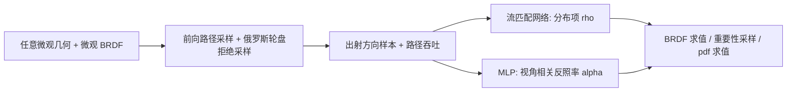

## 一句话总结

PureSample 提出了一种神经 BRDF 表示：不再推导解析 BRDF 公式，而是直接在任意微观几何上做前向随机游走采样，用流匹配网络学出出射方向分布、用小 MLP 学出视角相关反照率，从而同时支持 BRDF 求值、重要性采样和 pdf 求值。

## 研究背景

- 领域现状：物理渲染里的材质模型（微表面、微片、微球、分层材质、多次散射等）都依赖对某种微观几何做统计推导，得到解析 BRDF；再针对该 BRDF 单独设计重要性采样方法并推导其 pdf。神经网络已被用来压缩、加速、拟合这些复杂材质，也能给最终模型加上重要性采样。
- 核心痛点：这些解析推导高度"因模型而异"，引入一种新微观几何往往需要大量工作，遇到多次弹射、多种微观几何混合、分层或空间变化时更难——因为 BRDF 本质是连接入射-出射方向的所有微观几何路径上的路径积分，没有通用的闭式求解办法。而且即便现有神经材质方法，训练时仍然需要一个真值 BRDF 公式来生成合成数据。
- 本文 idea：核心观察是,对绝大多数微观几何,"前向粒子追踪采样"很容易实现——只需在粒子每次与微元交互时对微观 BRDF 做重要性采样,直到离开表面。这些采样出的出射方向,天然构成给定入射方向下的条件分布。作者由此彻底绕开 BRDF 公式推导,直接从采样数据学习材质,无需 NEE(下一事件估计)或双向追踪。

## 方法

整体框架:PureSample 把一个 BRDF 精确分解成两项的乘积——一个条件概率分布项 $$\rho(\omega_o \mid \omega_i)$$(描述反射函数归一化后的整体形状)和一个视角相关反照率项 $$\alpha(\omega_i)$$(描述能量吸收与各通道颜色变化):

$$f(\omega_i,\omega_o) = \rho(\omega_o \mid \omega_i)\,\alpha(\omega_i)$$

其中 $$\alpha(\omega_i) = \int_{\Omega^+} f(\omega_i,\omega)\,\mathrm{d}\sigma^\perp(\omega)$$ 是在投影立体角测度下对上半球的积分。这两项都能用一个蒙特卡洛过程从微观几何估计出来。

关键设计:

1. **蒙特卡洛采样构造训练数据**。从入射方向 $$\omega_i$$ 射入粒子,做前向路径追踪:每次表面反射或介质散射都对微观 BRDF(或相函数)做重要性采样,得到等于"BRDF 值 / 采样 pdf"的权重;再用俄罗斯轮盘拒绝采样,以"1 减权重"的概率丢弃样本,存活路径除以存活概率以维持单位吞吐。粒子离开表面时记录出射方向 $$\omega_o$$。可以证明:离开表面的出射方向分布恰好是 $$\rho(\omega_o \mid \omega_i)$$,而被接受(未终止)样本的比例期望恰好是 $$\alpha(\omega_i)$$。整个过程只需前向采样,不需要 NEE 或双向估计。

2. **流匹配网络学分布项**。分布项定义在投影半球(单位圆盘)上。用一个五层、每层 64 神经元的 MLP $$u_\theta$$ 预测速度场,把二维高斯基分布变换到目标分布 $$\rho$$。条件 $$c$$ 包含入射方向和用 one-hot 编码的颜色通道(从而学到 RGB 三通道各自不同的分布)。训练用条件流匹配(CFM)损失,时间步 $$t$$ 从偏向小值的两段均匀分布混合中采样(权重 0.7),把更多训练预算分配到数据端点附近以捕捉高频细节。采样时用固定步长的欧拉积分求解 ODE;pdf 求值则把流反向跑,累积每步的雅可比行列式,再乘上基高斯分布的 pdf,并乘余弦项从投影立体角测度转到立体角测度。

3. **MLP 学反照率项**。反照率项把入射方向 $$\omega_i$$ 映射为 RGB 值,行为平滑,用一个两层、每层 32 神经元的小 MLP 学习,$$\omega_i$$ 用四阶球谐编码,以预测值与蒙特卡洛估计之间的 L1 损失训练。

4. **神经纹理支持空间变化**。引入一张神经(隐)纹理,每个纹素的隐编码作为流匹配的额外条件(与 $$\omega_i$$、通道并列),从而支持空间变化的微观几何、颜色或法线。空间变化版本把每层神经元加到 128、反照率网络扩到五层并加一个残差层,并加总变差(TV)损失抑制神经纹理噪声。训练先训流匹配网络并更新神经纹理,再冻结纹理训反照率网络。

5. **加速:MeanFlow 与 pdf 蒸馏**。流匹配采样需多步 ODE 积分,pdf 求值还要额外算雅可比,开销大。作为可选加速:用 MeanFlow 实现单次前向的一步采样;用一个额外 MLP 蒸馏近似 pdf 用于 BRDF 求值和 MIS,而保留精确 pdf 求值用于无偏 BRDF 采样。二者合起来约 8 倍加速,质量仅轻微下降。方法不绑定特定神经采样模型,也演示了用归一化流的版本。

## 实验结果

在 Mitsuba 3(启用 CUDA)中实现,训练与渲染在 NVIDIA RTX 4090 上完成,渲染分辨率 512×512。真值用路径追踪、1024 spp 渲染显式网格。主实验是在多种微观几何上与真值对比:方法在球体、椭球、金字塔、微表面等结构上都能紧密匹配真值外观,同时相对真值加速约 7.7×~8.8×、存储减少约 2×。

| 对比维度 | PureSample | 对照 |
|----------|------------|------|
| 微观几何渲染 | 匹配真值,加速 7.7×~8.8×,存储省约 2× | 真值:显式网格路径追踪 1024 spp |
| 加速版 | 约 8× 加速,质量仅轻微下降 | 未加速版为高质量变体 |
| 复杂解析材质 | 与多次弹射微表面、位置无关分层材质模型结果一致 | Cui 等多弹射微表面 / Guo 等分层模型 |

其他实验用文字说明:与 NeuMIP 对比,NeuMIP 能拟合漫反射微观几何,但在光泽微观 BRDF 上有明显伪影、在纯镜面上完全失败(因其训练数据用 NEE 路径追踪,镜面情形噪声大、掠射角自遮挡导致大量零值样本),PureSample 因用纯采样策略而避开这些问题。与 NBRDF 对比分层材质,PureSample 拟合质量更好,因流匹配把数据建模为分布,更能从蒙特卡洛模拟固有的噪声数据(尤其掠射角)中学习。与解析微表面 BRDF 对比时,PureSample 的重要性采样 pdf 与其 BRDF 求值更吻合,因为解析的 VNDF 采样没考虑菲涅尔项,而本方法按构造学到了"完美的 BRDF 采样"。TV 正则、神经采样模型、网络大小的消融放在补充材料。

## 亮点与局限

- 亮点:
  - 从根本上绕开 BRDF 公式推导——只要能对微观几何做前向路径追踪(通常很直接),就能表示其材质,把不同材质模型统一到同一框架并易于扩展新微观几何。
  - 分布/反照率分解既优雅又实用:流匹配同时提供采样与 pdf 求值,一套表示满足渲染所需的三种操作(求值、重要性采样、pdf 求值),并支持 RGB 与空间变化。
  - 纯前向采样比 NEE/双向追踪更易实现、更鲁棒(镜面、掠射角场景不易失败),在噪声数据上学习也更稳。

- 局限:
  - 目前只表示半球上的 BRDF,尚未扩展到全球面以支持带透射的 BSDF(作者指出可自然扩展)。
  - 只针对微观尺度效应,不处理中观/宏观视差。
  - 材质属性改变需要重新训练模型。
  - 目前不支持真实世界数据测量,留待未来工作。

## 延伸思考

这项工作把生成模型里的流匹配(及一步式 MeanFlow)引入材质表示,思路上与 Fu 等的扩散 BSDF 采样、NeuSample、Wu 等的重参数化神经 BRDF 采样一脉相承,但关键区别在于"不再假设已有真值反射函数",而是证明仅凭微观几何的采样就足以学到重要性采样 pdf 乃至整个空间变化材质。值得追问的方向:一是扩展到 BSDF/透射与体积散射后,前向采样构造训练数据的效率与收敛如何;二是"材质改变需重训"这一点能否通过让神经纹理/条件承载更多可控参数来缓解,做到可编辑材质;三是能否把该框架与逆向渲染结合,从真实测量数据反推微观几何或直接学出可采样材质。
