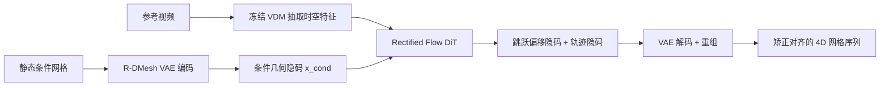

## 一句话总结

R-DMesh 用单目参考视频驱动任意静态网格生成高保真 4D 动画，核心是显式建模一个"跳跃偏移"把网格的任意初始姿态先"矫正"到视频首帧，再用视频扩散模型的时空先验生成后续运动。

## 研究背景

- 领域现状：4D 内容生成分两条路。一是整体式 4D 生成（靠 SDS 蒸馏或多视频生成），二是网格动画（复用高质量静态资产、把运动与几何解耦）。前者时空一致性差、易闪烁；后者常受限于特定模板（如 SMPL 骨架）、需逐场景优化、或缺乏精确控制。
- 核心痛点：作者指出一个被普遍忽视的实际障碍——**姿态错位困境**。用户提供的静态网格初始姿态，几乎不可能恰好对齐参考视频的首帧。若强行让网格去跟随一段错位的轨迹，会导致严重几何畸变甚至动画失效。
- 本文 idea：先"矫正"再"驱动"。把输入解耦成条件基础网格、相对运动轨迹，以及一个关键的**矫正跳跃偏移**（rectification jump offset），让模型自动学会把任意初始姿态变换到视频起始状态，之后再做运动迁移。

## 方法

整体框架分两级：先训练一个 R-DMesh VAE，把动态网格序列压缩进一个解耦的隐空间；再训练一个基于 Rectified Flow 的 Diffusion Transformer（DiT），以预训练视频扩散模型（VDM）抽取的视频隐特征为条件，生成隐空间里的运动分量。

关键设计：

1. **四路解耦表示**。给定共享拓扑的条件网格与目标动态序列，作者不直接重建绝对顶点坐标（那会把几何与运动纠缠在一起），而是分解为四部分：面片 $$F$$、初始顶点 $$V_{cond}$$、跳跃偏移 $$\Delta J = V_1 - V_{cond}$$、以及相对轨迹 $$T_{rel} = V_{1:T} - V_1$$。跳跃偏移专门承载条件网格到序列首帧的大幅位移，把"矫正"从"连续运动"中剥离出来。配合双中心归一化（条件网格按自身质心、序列按首帧质心分别归一），进一步消除不可学的全局平移。

2. **Triflow Attention**。这是编码器的核心。先对 $$V_{cond}$$ 做受邻接矩阵约束的自注意力编码局部几何，再用最远点采样（FPS）下采样出代表性顶点作为查询。关键做法是：只用采样几何 $$\hat V^n_{cond}$$ 与全量几何 $$\hat V_{cond}$$ 算出**一张共享注意力图**，再把它同时施加到几何、跳跃、轨迹三路特征上。用几何拓扑统一引导三路聚合，既编码了局部刚性与运动协同的物理先验，又不破坏特征解耦。因为条件几何 $$x_{cond}$$ 在推理时总是给定的，VAE 只对跳跃与轨迹两个概率分量做高斯建模并加 KL 正则。

3. **条件于 VDM 的 Rectified Flow 生成**。用 Rectified Flow 对动态分量 $$Z_{dyn} = [z_\Delta, z_{traj}]$$ 建模，把 $$x_{cond}$$ 当作干净条件按通道拼接进网络。速度估计器是 12 层 DiT，用 AdaLN-Zero 注入时间步。视频先验来自冻结的 Wan2.2-TI2V-5B，作者发现取**第 10 层中间块**特征最有效——太浅只有低层空间细节、太深则过度特化于去噪目标而丢失时序一致性。视频特征经交叉注意力注入，训练时以 0.1 概率丢弃条件以支持 CFG。

4. **数据与错位模拟**。为训练构建 Video-RDMesh 数据集：从 Objaverse 的约 25 万独特动态资产出发，经抽取、切片、严格过滤，得到 51 万余段 64 帧顶点轨迹片段并配 Blender 渲染的参考视频。训练时刻意从序列中随机取一帧（而非首帧）作条件，主动模拟姿态错位场景，提升鲁棒性。

## 实验结果

主实验是与四类相关方法的对比：视频到 4D 的 SC4D 与 L4GM、文本驱动的 AnimateAnyMesh（AAM）、视频引导的 Puppeteer（PUPT）。评测涵盖渲染质量（PSNR）、时序一致性（VBench 的主体一致性 SC.、运动平滑度 SM.）、几何精度（欧氏距离 EucD）与推理耗时。

| 方法 | PSNR↑ | SC.↑ | SM.↑ | EucD↓ | 耗时↓ |
|------|-------|------|------|-------|-------|
| SC4D | 23.4 | 0.933 | 0.993 | / | 约 40 分 |
| L4GM | 22.3 | 0.915 | 0.995 | / | 约 30 秒 |
| AAM | 13.5 | 0.948 | 0.994 | / | 约 8 秒 |
| PUPT | 19.8 | 0.932 | 0.991 | 0.035 | 约 25 分 |
| 本文 | 25.8 | 0.949 | 0.995 | 0.012 | 约 10 秒 |

本文在 PSNR、SC.、SM. 全面领先，几何误差 EucD 仅 0.012（远低于 PUPT 的 0.035），推理约 10 秒，与最快的 AAM 相当，比优化式方法快几个数量级。定性上，SC4D/L4GM 在新视角有明显色彩形变、对细长物体（如翼龙）易漂移；AAM 靠文本难做细粒度控制、罕见类别易失真；PUPT 依赖 2D 光流，在径向运动和姿态错位场景下失败。

消融方面（衡量重建 EucD）：去掉跳跃分解（Jump-Decomp）误差从 0.005 恶化到 0.025，是最关键组件——没有它首帧几乎停在条件网格姿态无法过渡；去掉 Triflow Attention 升到 0.020；双中心归一化与解耦损失也各有正向贡献。视频特征层消融确认第 10 层（EucD 0.012）优于 0/20/30 层及多层拼接。

## 亮点与局限

- 亮点：
  - 明确提出并系统解决"姿态错位"这一被同类视频驱动方法普遍忽视的实际痛点，用可学习跳跃偏移把矫正显式化。
  - 前馈推理约 10 秒、无需逐场景优化，也不依赖预定义骨架或模板，可驱动拓扑多变的角色与一般物体。
  - 借用冻结视频扩散模型的时空先验，零样本泛化到不同身份、真实世界视频，并支持姿态/运动重定向与整体视频到 4D 等下游应用。

- 局限：
  - 输出偶发网格自穿插（self-intersection），源于训练数据本身含难以清除的自相交几何。
  - 对罕见类别（如"披甲的猫"）泛化受限，数据稀疏导致姿态与运动的合理性下降。

## 延伸思考

这项工作把"视频扩散大模型作为运动先验的特征提取器"这一范式迁移到了显式网格动画，思路上与用 VDM 特征驱动 3D/4D 的近期工作一脉相承，但落点在网格顶点轨迹而非高斯或 NeRF，天然保有高质量资产的拓扑与保真度。值得追问的点：跳跃偏移的显式建模是否也能用于处理拓扑不完全一致的驱动、或多物体交互场景；以及依赖单一中间层特征（第 10 层）是否会随不同 VDM 骨干而漂移，特征层选择的可迁移性还有待验证。自穿插问题指向一个更普遍的方向——在生成式网格动画里引入碰撞/物理后处理约束。
