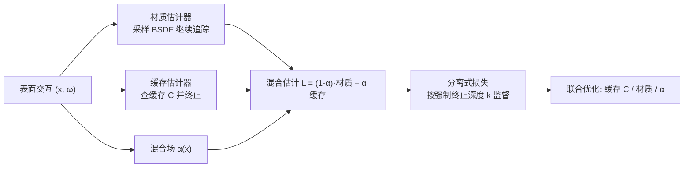

## 一句话总结

在可微路径追踪里引入一个空间可学习的"混合场" $$\alpha(\mathbf{x})$$，在每次表面交互上自适应地在"查辐射缓存"与"继续路径追踪"两个估计器之间插值，从而在光照未知、全局光照复杂的困难场景下稳健地反解出可复用的材质参数。

## 研究背景

- 领域现状：可微路径追踪为从图像反解物理材质与光照提供了原理性路径，辐射缓存（radiance cache）此前主要用于正向渲染的方差削减，最近才被 Hadadan 等人引入到逆向渲染做降噪。
- 核心痛点：逆向路径追踪同时被三个问题困扰——蒙特卡洛估计的高方差导致梯度噪声大、数值条件差放大了对噪声与初始化的敏感、以及充满局部极小的优化地形。尤其当光照完全未知时，优化器会用"到处放自发光"来轻松拟合参考图，得到并非期望的材质-光照分解。单纯加大采样数代价高昂且只能缓解三者之一。
- 本文 idea：不再让缓存与材质各自为战，而是用一个空间混合场把两个估计器局部线性插值成一个混合估计器；再围绕它设计一族"分离式损失"，逼迫缓存估计器与材质估计器各自单独正确，而不只是它们的混合结果正确。这样反解出的材质在丢弃缓存后仍可用于重光照与编辑。

## 方法

整体框架：从渲染方程出发，在每个表面交互点用混合场 $$\alpha(\mathbf{x}) \in [0,1]$$ 把"材质估计器"（采样 BSDF 继续追踪）与"缓存估计器"（直接查缓存并终止路径）做线性插值。训练时用这个混合估计器渲染图像并回传误差，但真正的关键是额外施加一族损失，把不同的强制终止深度对应到不同的缓存值与材质因子上，使二者在混合之外也各自被约束。评估时丢弃缓存与 $$\alpha$$，只用反解出的材质在新光照下重新路径追踪。

关键设计：

1. **混合估计器与"朴素混合"的病态性**。混合估计器写作 $$\hat{L}_o(\mathbf{x},\boldsymbol{\omega}) = (1-\alpha(\mathbf{x}))\,\hat{L}_{\text{mat}} + \alpha(\mathbf{x})\,\hat{L}_{\text{cache}}$$，只需几行代码就能快速逼近参考图。但只监督混合结果时，缓存和材质各自可以离真值很远——重建只对训练时那个特定的空间混合有效，无法复用于重光照或材质编辑。这是全文要解决的核心病态。

2. **为什么一致性损失不够**。一种直觉是让缓存去匹配材质积分（缓存一致性损失），或反过来让材质去匹配缓存（材质一致性损失）。作者论证二者都有根本缺陷：缓存一致性把信息从光源方向传向相机，方向与逆向渲染的监督流（来自相机侧参考图）相反；训练早期两者都不可靠会"垃圾进垃圾出"；且都假设表面非自发光，一旦光照未知，反射与自发光无法分离，一致性关系失去意义。材质一致性损失还因非线性 $$L_2$$ 损失与把导数传入积分而产生有偏梯度，需要专门的去相关两样本估计器才能修正。

3. **分离式估计器与分离式损失（核心贡献）**。作者改用一个思路：让缓存表示"总的出射辐射"（含自发光与散射），并在路径上采样一个强制终止深度 $$k$$。终止深度为 $$k$$ 时的估计为 $$\hat{L}^{(k)}_j = (1-\alpha_j)\frac{f_j\cos\theta_j}{p_j}\hat{L}^{(k)}_{j+1} + \alpha_j C_j$$（当 $$j\lt k$$），以及 $$\hat{L}^{(k)}_k = C_k$$（当 $$j=k$$）。$$k=1$$ 直接训练主命中点的缓存；$$k=2$$ 用第二命中点的缓存辐射训练第一跳的 BSDF；更大的 $$k$$ 监督更长的材质链再由缓存终止。每次迭代只采样一个 $$k$$，内存恒定；不同深度的损失合起来消除了"只有混合被监督"的歧义。反向梯度用 path replay backpropagation 计算。

4. **混合场作为可学习的置信度**。$$\alpha(\mathbf{x})$$ 被当作可学习的置信场，与缓存、材质联合优化。默认按"低偏差"目标优化（去相关路径），在材质估计器不可靠处（高方差、初始化差、传输困难）$$\alpha$$ 自动升高转而信缓存；在缓存不可靠处（如镜面）$$\alpha$$ 降低回退到路径追踪。一个自然的副产品是：在自发光表面 $$\alpha$$ 会收敛到 1，因为只有这样才能正确建模未知的自发光。作者还讨论了一个"方差感知"变体（不去相关路径），会整体更偏向缓存。此外 Hadadan 等人的方法被证明是本框架在单跳材质优化下的一个特例。

## 实验结果

主实验是"未知光照下的房间尺度材质重建"：已知几何，光照与材质均未知，评估时丢弃缓存与 $$\alpha$$、只用材质在新光照下渲染测试视角。下表摘取各场景的 PSNR（越高越好），对比本文方法、PRB（无偏可微路径追踪）与 Hadadan 2023。

| 场景 | Ours ↑ | PRB ↑ | Hadadan 2023 ↑ |
|------|--------|-------|----------------|
| Bedroom | 24.85 | 11.46 | 16.47 |
| Bathroom2 | 23.43 | 4.66 | 14.82 |
| Kitchen | 26.96 | 10.09 | 23.92 |
| Living-rm | 22.64 | 15.46 | 18.50 |
| Living-rm-2 | 27.56 | 10.54 | 20.33 |
| Living-rm-3 | 29.57 | 6.15 | 30.42 |
| Staircase | 20.71 | 10.65 | 12.15 |

本文方法在几乎所有场景显著超过 PRB、并整体优于 Hadadan。PRB 在此设定下失败，因为它倾向用优化出的自发光去"解释"外观，导致材质本身不可用。SSIM 与 LPIPS 指标结论一致。仅 Living-room-3 例外：该场景以直接光照为主，单跳优化已足够，多跳反而引入额外噪声。

其余分析用文字概括：消融显示学习异质的 $$\alpha(\mathbf{x})$$ 明显优于固定 $$\alpha=0.5$$ 或关闭混合（$$\alpha=0$$），也优于用粗糙度手工构造的 $$\alpha$$；最大路径深度从 2 增到 3 通常带来提升、更深处收益趋于平缓；对缓存哈希表容量（$$2^{18}$$–$$2^{23}$$）不敏感。已知光照的 Veach Ajar 场景下，混合估计器在低采样时比纯路径追踪收敛更快。性能开销可忽略：平均每次迭代 0.094 秒，PRB 为 0.091 秒、Hadadan 为 0.088 秒。

## 亮点与局限

- 亮点：
  - 用一个简单的"混合滑块 + 分离式损失"把逆向渲染中"辐射场表示"与"物理模型"两个极端连成连续谱，既保住物理可编辑性、又借缓存吸收模型暂时解释不了的部分，使问题更良态。
  - 在光照未知这一常令逆向路径追踪直接失败的困难设定下取得稳健重建，且相对 PRB 几乎零额外开销。
  - 把 Hadadan 等人的工作纳为特例，理论框架清晰，实现只需在现有（可微）路径追踪器上做少量改动。

- 局限：
  - 全程假设几何已知，而实际中常需与材质、光照联合恢复；几何可变时如何引入缓存与混合场仍待研究。
  - 实验为合成设定，任务被设计成模型能完美复现数据；真实照片中外观必然超出任何 BSDF 的建模能力，框架在此情形下的表现未验证。
  - 存在"early alpha collapse"失败模式（$$\alpha$$ 过早到 1 使材质分支拿不到梯度），正则化可缓解但会引入敏感超参并略降质量，故正文结果未采用。

## 延伸思考

- 这条"混合场"思路与作者课题组此前的 Many-Worlds / Radiance Surfaces 一脉相承：都在"用一个可学习分布/场吸收难以直接优化的部分"上做文章，值得对照阅读它们如何处理歧义与局部极小。
- 缓存表示总出射辐射（含自发光）来规避反射-自发光分离难题是很务实的一招；能否把它推广到次表面散射、参与介质这类同样高方差、长路径的场景是明确的未来方向。
- 方差感知地优化 $$\alpha$$ 只做了初步探索，在极噪声设定下把偏差与方差联合纳入 $$\alpha$$ 的目标可能进一步提升鲁棒性，是一个可追问的开放点。
