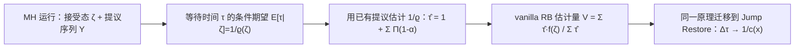

## 一句话总结

针对 MCMC 光线传输里长期被当作"标配"的 Rao–Blackwellization（RB）方差缩减手段——waste-recycling（废料回收）——本文指出它在实践中几乎不降方差，并提出一种计算几乎零额外开销、却能实实在在大幅降方差的 vanilla RB 估计量，同时适配 Metropolis–Hastings（MH）和最近的 Jump Restore Light Transport（JRLT）两大框架。

## 研究背景

- 领域现状：光线传输本质是求解高维积分（渲染方程），Monte Carlo 是主力工具。MCMC 方法（Veach 把 MH 引入图形学、Kelemen 的主样本空间、Hachisuka 的多路复用 MLT，以及近年 Holl 等人的连续时间 Jump Restore）擅长在复杂光照区域做有针对性的探索。
- 核心痛点：MCMC 估计量的方差直接表现为图像噪声或等质量下更长的渲染时间。业界通用的降方差手段是 RB——用"充分统计量下的条件期望"替换原估计量，理论上方差不增。光线传输里长期沿用的 RB 版本是 waste-recycling：被拒绝的提议样本也拿来加权贡献到估计里。问题在于，waste-recycling 只能"保证不增方差"，却无法证明能降方差，实测中往往降幅微乎其微，两条误差曲线几乎重叠。
- 本文 idea：统计学界另有一条 RB 路线——Douc 和 Robert 提出的 vanilla RB，它能证明严格降方差，但需要额外生成大量提议样本来估计"期望接受概率"，在提议生成极其昂贵的光线传输里不可行。本文改造这条路线，让它只复用 MH 运行中"本来就要生成"的那些提议样本来估计等待时间，从而在几乎不增开销的前提下拿到 vanilla RB 的降方差红利。

## 方法

整体框架：MH 每步会产生两条序列——被接受状态构成的链，以及所有提议构成的序列。标准估计量是遍历平均 $$A_t f = \frac{1}{t}\sum_{s=0}^{t-1} f(X_s)$$。本文把注意力放在"每个被接受状态 $$\zeta_i$$ 在链中停留多久"这个随机等待时间 $$\tau_i$$ 上：既然条件期望可替代随机量而不增方差，就用 $$\tau_i$$ 的条件期望去替换它，得到 vanilla RB 估计量。

关键设计：

1. 把 MH 链拆成"tour"。定义第 $$i$$ 次接受发生的时刻 $$\sigma_i$$ 与其后的等待步数 $$\tau_i$$，被接受状态记为 $$\zeta_i$$。这样标准估计量可重写为按等待时间加权的形式 $$\tilde{A}_n f = \frac{\sum_i \tau_i f(\zeta_i)}{\sum_i \tau_i}$$。每个 $$\tau_i$$ 就是一次"局部探索直到被拒绝打断"的寿命。

2. 用条件期望替换等待时间。在给定当前状态 $$\zeta_i$$ 时，$$\tau_i$$ 服从几何分布，其期望为 $$E[\tau_i \mid \zeta_i] = 1/\varrho(\zeta_i)$$，其中 $$\varrho(x) = \int Q(x, dy)\,\alpha(x,y)$$ 是当前状态下的期望接受概率。理论上把 $$\tau_i$$ 换成 $$1/\varrho(\zeta_i)$$ 能严格降方差，但 $$\varrho$$ 没有闭式解。

3. 只用"本来就有"的提议来估计。Douc–Robert 的原方案需要额外从 $$Q(\zeta_n, \cdot)$$ 采样来估 $$1/\varrho$$，这在光线传输里太贵。本文改为只用当前 tour 内、直到下一次接受为止那 $$\tau_n$$ 个必然会生成的提议 $$Y_{\sigma_n+1}, \dots, Y_{\sigma_n+\tau_n}$$ 构造估计量 $$\hat{\tau}_n = 1 + \sum_{t=1}^{\tau_n} \prod_{s=1}^{t}\left(1 - \alpha(\zeta_n, Y_{\sigma_n+s})\right)$$。由此得到 vanilla RB 估计量 $$V_n f = \frac{\sum_i \hat{\tau}_i f(\zeta_i)}{\sum_i \hat{\tau}_i}$$，是一种类似自归一化重要性采样的"比值"结构，几乎零额外采样开销。作者在补充材料里给出了该截断带来的偏差表达式：当拒绝概率二阶矩小、或接受概率接近 1 时偏差可忽略，实验中未观测到可测偏差。

4. 迁移到 Jump Restore。JRLT 是连续时间的纯跳跃 Markov 过程，用局部动态 $$\kappa$$ 做快速局部探索、以正比于 $$1/p$$ 的杀灭率终止 tour、再由转移核 $$\mu$$ 全局重生。其标准估计量按持有时间 $$\Delta\tau_i$$ 加权。由于 $$E[\Delta\tau_i \mid x_i] = 1/c(x_i)$$，同一 RB 原理把随机持有时间替换为 $$1/c(x_i)$$ 即得 JRLT 的 vanilla RB 估计量。当局部动态本身就是 MH 链时，waste-recycling 也能一并纳入，作者给出了统一支持三种估计量的通用算法（分支可在编译期确定，无运行时开销）。

## 实验结果

作者在 PBRT-v4 和 LMC 中实现，对 Metropolis、MALA、H²MC 三种 MH 方法及其对应 JRLT 变体，在 GLASS OF WATER、SALLE DE BAIN、VEACH AJAR、TORUS、SWIMMING POOL、ZERO DAY 等场景上评估 MSE / MRSE / MAPE / 方差，每种方法用相同随机种子跑 100 次取平均以排查偏差，参考图用 BDPT 高采样生成。核心结论：在等样本数与等渲染时间下，vanilla RB 的各项误差都下降得明显更快，而 waste-recycling 相对标准估计几乎看不出改进（方差曲线常与标准估计重叠）。

下表取补充材料里的统计学玩具实验（MH，高斯提议 $$Q(x,\cdot)=N(x,\varsigma^2)$$，目标 $$\pi=N(0,1)$$，$$t=100$$，1000 次独立实验），报告方差比值（越小于 1 越好）：斜杠前为 vanilla RB 相对标准估计 $$\mathrm{Var}[V]/\mathrm{Var}[A]$$，斜杠后为 waste-recycling 相对标准估计 $$\mathrm{Var}[W]/\mathrm{Var}[A]$$。

| 提议尺度 | $$f=x$$ (V / W) | $$f=x^2$$ (V / W) | $$f=1\{x>0\}$$ (V / W) |
|----------|-----------------|-------------------|------------------------|
| $$\varsigma=0.1$$ | 0.982 / 0.998 | 0.975 / 0.998 | 0.983 / 0.999 |
| $$\varsigma=2$$ | 0.792 / 0.893 | 0.716 / 0.817 | 0.803 / 0.945 |
| $$\varsigma=5$$ | 0.789 / 0.941 | 0.803 / 0.905 | 0.757 / 0.912 |
| $$\varsigma=7$$ | 0.763 / 0.992 | 0.795 / 0.960 | 0.743 / 0.942 |

可见 vanilla RB（斜杠前）普遍把方差压到标准估计的 0.7~0.8 倍，而 waste-recycling（斜杠后）大多停在 0.9 以上、降幅有限。Cauchy、指数分布提议的补充实验以及 Jump Restore 的对应实验结论一致，且 JRLT 下 vanilla RB 的增益比 MH 更显著（部分配置压到 0.45~0.5）。

## 亮点与局限

- 亮点：
  - 指出并实证了一个"业界默认最优"的既有做法（waste-recycling）其实收效甚微，纠正了普遍认知。
  - 提出的 vanilla RB 只复用 MH/JRLT 已经生成的提议样本，几乎零额外采样开销——这正是过去 vanilla RB 无法用于渲染的症结所在，切中光线传输"提议生成极贵"的要害。
  - 通用性强：同一 RB 原理同时覆盖 MH 家族和连续时间的 Jump Restore，且实现里三种估计量分支可编译期确定，工程落地干净。
  - 附带把归一化常数吸收进杀灭率，省掉 MH 需要的 bootstrapping 阶段。

- 局限：
  - 严格说 vanilla RB 是"非精确"（inexact）MCMC，截断估计 $$\hat{\tau}$$ 会引入偏差；论文只给出持有时间估计量的偏差表达式，偏差如何传播到最终估计量的理论刻画留作未来工作，目前靠"实测无可测偏差"支撑。
  - 偏差可忽略的条件（拒绝概率二阶矩小 / 接受概率接近 1）基于小扰动直觉，并未覆盖所有实际提议机制，缺少形式化证明。
  - 实验全部在 CPU（最多 256 线程）上完成，未在 GPU 或更高并行度下验证；性能结论可能随硬件而变。

## 延伸思考

- 这项工作和 Holl 等人 2025 的 Jump Restore Light Transport 是一脉相承的：JRLT 提供了连续时间 MCMC 的通用框架，本文则给它和经典 MH 都配上了真正有效的方差缩减器，二者组合可能成为下一代 MCMC 渲染的基础设施。
- "只复用已有样本估计条件期望"这一思路本质上是把统计学里代价高昂的 RB 做了工程化裁剪，值得推广到其他昂贵采样场景（如可微渲染、体渲染中的 MCMC）。
- 非精确 MCMC 的偏差-方差权衡是关键待解问题：若能给出偏差随场景/提议核变化的可控界，vanilla RB 就能从"经验上安全"升级为"理论上可信"，这对生产环境采用至关重要。
- 与梯度型提议（MALA、H²MC）结合时增益如何随维度和光照复杂度变化、以及能否与分层/多链全局探索（如 Stratified MCMC）叠加，都是值得追问的方向。
