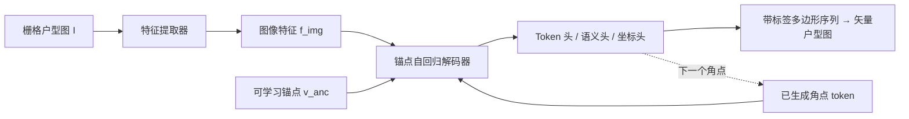

## 一句话总结

把"栅格户型图 → 矢量户型图"的重建任务重新表述为序列生成问题，用一个带可学习锚点（anchor）的自回归解码器逐个吐出"带语义标签的多边形角点序列"，从而同时恢复户型的几何结构与房间语义，并在复杂户型上显著超越已有方法。

## 研究背景

- 领域现状：户型图（floorplan）在设计时是矢量图（AutoCAD 等），但流通时大多被栅格化成图片，几何与语义信息被抹掉。栅格转矢量（raster-to-vector）任务因此被广泛研究，近年 Transformer 架构（HEAT、RoomFormer、Raster2Graph 等）推动了明显进展。
- 核心痛点：现有方法在面对"房间多、角点数量不定"的复杂真实户型时表现不佳。一类做法依赖预训练检测器、拼成多阶段流水线，泛化差；另一类（RoomFormer、PolyRoom）把重建当作目标检测，用固定数量的 object query（如 2800 个）预测，一旦户型复杂度超过这个固定预算就会性能骤降甚至爆显存。此外语义预测往往被稀释——RoomFormer 对定长房间序列内的角点嵌入做平均（还混进 padding 角点）再分类，丢失细粒度语义。
- 本文 idea：户型元素天然可以被建模成"序列"。把每个多边形写成一串带标签的角点，多个多边形用 `<SEP>` 拼接，按从左到右排序，然后用自回归解码器像写 CAD 一样一个角点一个角点地生成。这样输出长度可变、不受固定 query 预算约束，且能对每个角点做 token 级语义监督。

## 方法

整体框架：输入一张栅格户型图 $$I \in \mathbb{R}^{H \times W \times 3}$$，先经特征提取器编码成图像特征 $$f_{img}$$；核心是一个基于锚点的自回归解码器，它以图像特征、可学习锚点 $$v_{anc}$$ 以及此前已生成的角点为条件，逐个预测下一个"带标签角点"，直到输出 `<EOS>`。最终得到用带标签多边形序列表示的矢量户型图。

关键设计：

1. 带标签多边形序列表示。每个角点写作 $$c_i = (x_i, y_i, p_i)$$，其中 $$(x_i, y_i)$$ 是空间坐标，$$p_i \in [0,1]^C$$ 是在 $$C$$ 个语义类别上的概率向量。房间、窗、门都作为语义类别统一编码。整张户型图排成 `[<BOS>, c^1_1, c^1_2, …, <SEP>, …, <EOS>]`。由于不使用离散 tokenizer、直接回归连续坐标，每个 token 还额外带一个 token 类型向量 $$q \in [0,1]^3$$（`<CORNER>`/`<SEP>`/`<EOS>`）。这种变长表示天然容纳任意角点数的多边形。

2. 可学习锚点（Anchor）。解码器不直接回归绝对坐标，而是引入一组可学习锚点 $$v_{anc} \in \mathbb{R}^{L \times 2}$$，模型只学相对锚点的残差，坐标头输出的残差与锚点相加得到最终坐标。锚点思想借鉴目标检测，实验证明它带来最大的单项性能提升。

3. FeatFusion 早期融合 + 可变形注意力。解码块含三层：带因果掩码的 masked attention（保证左到右生成偏置）、deformable attention、前馈层。masked attention 中，query 携带来自锚点的位置嵌入，而 key/value 来自把图像特征与坐标 token 嵌入在序列维拼接得到的融合向量（形状 $$[L_I + L, D]$$，即 FeatFusion）——图像特征像前缀一样让每个 token 都能 attend，论文发现这种早期融合对精确坐标回归至关重要。随后 deformable attention 把锚点归一化到 $$[0,1]$$ 后预测采样偏移，只关注图像特征图中稀疏的相关区域，从而高效处理复杂大图。

4. 三路损失 + 左到右排序。坐标用 L1 损失 $$L_{coord} = \frac{1}{L}\sum_{l=1}^{L} m_l \lvert \hat{v}_l - v_l \rvert$$，token 类型与语义各用一个交叉熵损失，总损失为三者加权和。所有损失只在非 padding token（用掩码 $$m$$）上计算。训练时把多边形按左上角坐标做"从上到下、从左到右"排序，赋予强几何归纳偏置；推理时逐 token 生成到 `<EOS>`，房间语义标签用 token 级预测做多数投票聚合。

## 实验结果

在三套栅格转矢量数据集（Structured3D-B、CubiCasa5K、Raster2Graph）上，以 F1 评估几何（Room/Corner/Angle）与语义（Room Semantic、Window & Door）。本文方法在结构指标上几乎全面领先，语义指标也整体最优；尤其在角点/房间更复杂的 CubiCasa5K 与 Raster2Graph 上优势更明显。下表取 Room 与 Corner 两项结构 F1 及 Room Semantic 展示与主要基线的对比：

| 数据集 | 方法 | Room F1 | Corner F1 | Room Semantic |
|--------|------|---------|-----------|---------------|
| Structured3D-B | RoomFormer | 95.1 | 91.7 | 74.2 |
| Structured3D-B | PolyRoom | 98.9 | 96.0 | - |
| Structured3D-B | 本文 | 99.6 | 98.3 | 76.9 |
| CubiCasa5K | RoomFormer | 83.5 | 55.5 | 63.0 |
| CubiCasa5K | 本文 | 88.7 | 59.4 | 63.8 |
| Raster2Graph | Raster2Graph | 95.0 | 78.3 | 83.4 |
| Raster2Graph | 本文 | 97.0 | 80.3 | 85.1 |

补充结论：随户型复杂度（多边形数、角点数）上升，RoomFormer 与 FRI-Net 在超过约 15 个多边形或 150 个角点时明显掉点（RoomFormer 固定 query 预算还会爆显存），而本文方法凭借递归分解保持稳定，复杂场景增益更大。跨数据集交叉评测中本文泛化最强，在真实网络户型集 WAFFLE 上零样本领先幅度显著。消融显示 FeatFusion、可学习锚点、左到右排序逐项叠加把 Room F1 从 94.1 提升到 99.6，其中锚点贡献最突出、排序带来最终最佳结果。

## 亮点与局限

- 亮点：
  - 把户型重建从"固定 query 的目标检测"范式转成"变长序列生成"，从根本上解除了角点/房间数量上限，复杂真实户型上优势明显。
  - token 级语义监督让每个角点直接获得梯度，不被 padding 稀释，语义预测更准；表示本身也易扩展到窗、门乃至更多实体。
  - 可学习锚点 + FeatFusion 早期融合的设计经消融验证有效，且展示了 VLM 精化、矢量引导 3D 场景生成等下游应用潜力。

- 局限：
  - 对窗、门这类占比小的语义结构定位仍不够稳，会出现窗户跨越、门窗被画进房间内部等伪影，作者建议未来把这些元素与房间实体分开建模。
  - 依赖左到右排序的强归纳偏置，且需要把 Structured3D 点云投影转成二值栅格图（Structured3D-B）才纳入主实验，属于任务设定上的一层适配。

## 延伸思考

这项工作把"结构化视觉重建"进一步靠拢到序列生成/语言模型范式，和 SceneScript 用文本命令生成房屋布局、Liu et al. 用多边形序列做分割是同一脉络的延伸。真正有意思的是它对复杂度的可扩展性——一旦不再受固定 query 约束，向历史建筑、手绘户型等高度不规则的真实数据泛化就更现实。作者也指出可以在推理时注入语义条件（如通过轻量 condition adapter），用房间语义标签反过来引导解码生成坐标，这会把重建工具变成可控生成工具，配合户型引导的大规模 3D 场景生成，想象空间不小。值得追问的是：自回归逐点生成在超大户型下的推理延迟，以及排序偏置在拓扑异常户型上的鲁棒性边界。
