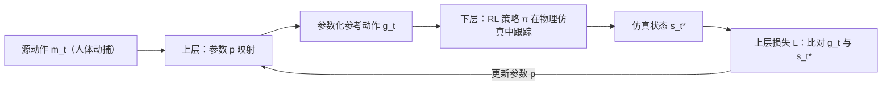

## 一句话总结

把人体动作迁移到差异巨大的机器人形态时，ReActor 不再把"重定向"当成一个孤立的预处理步骤，而是将其建模成一个双层优化问题——在物理仿真里一边用强化学习训练跟踪策略，一边联合优化重定向参数，从而产出无脚滑、无自穿模、动力学可行的参考动作。

## 研究背景

- 领域现状：动作数据（人体动捕、视频重建）是动画与机器人模仿学习的基石，但这些动作必须先"重定向"到目标形态上。现有做法分两类：基于优化的方法最小化源/目标姿态差异，基于学习的方法直接学源到目标的映射。
- 核心痛点：优化类方法通常需要预定义接触模式、容易陷入局部极小、要大量手工调参才能跨数据集扩展；学习类方法需要海量成对数据，且多局限于理想化球关节角色。两类方法都容易产出物理上不合理的动作——脚滑、自穿模、关节突变——而这些伪影正是下游强化学习策略训练性能退化的首要来源。
- 本文 idea：把重定向直接放进物理仿真里当成一个强化学习问题来解。用户只需在标定姿态下给出稀疏的语义刚体对应关系，系统就联合优化重定向参数与跟踪策略。因为轨迹与策略是一起优化的，参考动作与机器人形态之间的冲突能被自然化解，物理仿真本身则从设计上杜绝了脚滑、穿模等伪影。

## 方法

整体框架是一个双层优化：上层把源参考动作 $$\boldsymbol{m}_t$$（如人体动捕）经由参数 $$\boldsymbol{p}$$ 映射成参数化参考动作 $$\boldsymbol{g}_t$$；下层用强化学习训练策略 $$\pi_{\boldsymbol{\phi}}$$ 在物理仿真里跟踪 $$\boldsymbol{g}_t$$，滚动出仿真状态 $$\boldsymbol{s}_t^*$$。上层再拿仿真状态和参考动作比对，更新参数以最小化误差。形式化为

$$\min_{\boldsymbol{p}\in P} L(\boldsymbol{p}, \boldsymbol{\phi}^*(\boldsymbol{p})) \quad \text{s.t.} \quad \boldsymbol{\phi}^*(\boldsymbol{p}) = \arg\max R(\boldsymbol{p}, \boldsymbol{\phi})$$

关键设计分四点展开：

1. **简化的上层梯度估计**。等下层 RL 收敛再更新参数是不现实的，作者采用单循环的双时间尺度近似（TTSA），每个 RL 迭代同步更新上下层变量。标准做法要用隐函数定理算下层的逆 Hessian，代价极高。ReActor 转而利用重定向问题的特殊结构：限定损失只依赖 $$\boldsymbol{g}_t$$ 与 $$\boldsymbol{s}_t^*$$ 之差（于是 $$\partial_{\boldsymbol{s}_t^*}\ell = -\partial_{\boldsymbol{g}_t}\ell$$），并假设最优轨迹对参考动作的敏感度为 $$\alpha \boldsymbol{I}$$（$$\alpha\in[0,1]$$，直观表示最优轨迹会部分地跟随参考动作变化）。代入后得到一个可计算的估计 $$\tilde{d}_{\boldsymbol{p}}\ell = (1-\alpha)\,\partial_{\boldsymbol{g}_t}\ell\, d_{\boldsymbol{p}}\boldsymbol{g}_t$$，它只是原始梯度第一项的缩放，彻底绕开了 RL 解的复杂敏感度。

2. **稀疏语义对应的重定向参数化**。用户在标定姿态（如 T-pose）下选定源/目标刚体对，对应关系稀疏、允许两侧刚体数量不等。系统先由根部高度比 $$s = h_{\text{target}}/h_{\text{source}}$$ 自动求全局缩放，再计算标定变换让缩放后的源坐标系与目标对齐。之后在标定局部坐标里引入可优化的位置与朝向参数 $$\boldsymbol{p}^b_{\text{pos}}, \boldsymbol{p}^b_{\text{ori}}$$，外加逐动作可学习的竖直偏移 $$p_z$$ 来修正数据集里的漂浮/穿地噪声。参数被约束在凸集 $$P$$ 内（各自范数上界 $$\delta_{\text{pos}}, \delta_{\text{ori}}, \delta_z$$）。当机器人自由度少于人体时（如四足髋关节 2 DoF），用"摆动-扭转"分解只在需要的轴上计损失。

3. **下层 RL 与残差力控**。策略以 50 Hz 输出 PD 控制器的关节目标位置和作用在根部的辅助力/力矩（残差力控 RFC）。RFC 让单一策略能覆盖 AMASS 这种含倒立等在形态差异下本不可行的动作；同时在奖励里惩罚辅助力用量以鼓励物理真实，并对力施加连续死区让策略更容易输出精确的零力。区别于 DeepMimic 那类"跟踪已给参考"的模仿，ReActor 解的是它前面那步——生成一个适合被跟踪的参考。

4. **学习式初始化与自适应采样**。由于源/目标形态不同，无法直接用参考状态初始化（RSI）。作者引入随 episode 从 0 线性升到 1 的重定向相位变量 $$\psi_t$$：相位期间参考动作暂停、策略先把机器人从随机初姿移动到起始姿；$$\psi_t$$ 还用于奖励混合与数据过滤（$$\psi_t<1$$ 的片段不进上层数据批 $$D$$）。此外按动作片段的失败率自适应采样，优先训练策略啃不动的难片段。

## 实验结果

在 PHC 过滤后的 AMASS 数据集上，ReActor 与两个 SOTA 人体重定向方法 GMR、OmniRetarget 对比，覆盖两种不同尺度的人形机器人（Unitree G1、自研小型机器人 Lima）。下表取下游 RL 任务的成功率与关键伪影指标作为主实验：

| 机器人 | 方法 | 自穿模时间↓ | 脚滑 [cm/s]↓ | 脚浮 [cm]↓ | 下游成功率 [%]↑ | 关节误差 [deg]↓ |
|--------|------|------|------|------|------|------|
| Unitree G1 | GMR | 0.07 | 1.25 | 0.34 | 89.9 | 9.79 |
| Unitree G1 | OmniRetarget | 0.12 | 2.00 | 0.49 | 95.5 | 6.62 |
| Unitree G1 | ReActor | 0.00 | 0.17 | 0.12 | 97.5 | 4.22 |
| Lima | GMR | 0.04 | 1.97 | 1.27 | 91.2 | 10.45 |
| Lima | OmniRetarget | 0.09 | 2.40 | 0.31 | 79.9 | 14.10 |
| Lima | ReActor | 0.00 | 0.47 | 0.02 | 95.1 | 4.38 |

ReActor 在两个平台的所有指标上都显著领先，地面穿透与自穿模基本归零，下游跟踪策略的关节/根部误差也最小。基线的典型失败是优化陷入关节极限或奇异构型附近的局部极小导致严重伪影；OmniRetarget 在非均匀缩放的 Lima 上因接触估计退化而泛化困难。计算成本上，AMASS 全集并行训练+重定向单卡约 6.5 小时，与 CPU 上的 OmniRetarget（约 7 h）、GMR（约 5 h）相当。

消融方面：去掉上层双层优化（RL only）后跟踪奖励更低、损失更高，伪影更多，验证了参数化的有效性；把稠密对应换成仅根部+末端执行器仍稳定；甚至把机器人左手错误地对应到源的头部，方法依旧稳定。泛化实验中，在 AMASS 上训练的单一策略迁移到未见的 100STYLE 测试集仍保持低误差。此外还展示了迁移到 ANYmal D 四足、88.3 Hz 实时交互式动画编辑，以及在 Lima 实体机器人上的 sim-to-real 部署。

## 亮点与局限

- 亮点：
  - 把重定向从孤立预处理升级为与策略联合优化的双层问题，从物理仿真层面根除脚滑/穿模/关节突变等伪影，直接改善下游模仿学习。
  - 用问题结构导出简化的上层梯度，避开逆 Hessian，让 RL 作为下层的双层优化在计算上可行。
  - 用户输入极简：只需稀疏语义刚体对应，无需预定义接触模式、无需逐动作手工调参，能扩展到 AMASS 级别的大数据集，并支持人形/四足乃至实机。

- 局限：
  - 外部力惩罚权重是最敏感的超参，本质上是"物理真实 vs 极端动作成功率"的权衡旋钮，需要用户按需取舍。
  - 重定向物理上不可能的动作本身是病态问题（机器人该走上虚拟楼梯，还是把动作投影到地面？）缺乏明确答案。
  - 当前参数化假设随时间恒定，未探索时变参数化；语义对应仍需人工指定，尚未自动化。

## 延伸思考

这项工作与作者团队此前的 DOC（可微最优控制重定向）一脉相承，但把可微仿真换成了非可微的 RL 下层，从而能处理离散接触动力学、允许非可微目标——这对图形学里越来越多"仿真在环"的优化问题是个有启发的范式：用问题结构换掉昂贵的隐函数微分。更值得追问的是文末的展望：把这种双层思路推广到需要同时平衡参考跟踪与避障、操作乃至自动机器人设计的场景，即"把本该解耦的多步流程整体化"。对做角色动画生成或 sim-to-real 的研究者，ReActor 产出的无伪影参考数据可直接充当高质量训练语料，也提示"重定向质量"这一常被忽视的上游环节其实强烈决定了下游策略上限。
