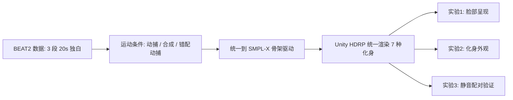

## 一句话总结

通过三组受控用户实验，系统性地证明了虚拟角色的"脸部呈现方式"和"身体化身外观"会显著且系统性地扭曲人们对语音驱动手势质量的感知评价，并据此给出了手势合成基准测试与部署的实用建议。

## 研究背景

- 领域现状：语音驱动的 3D 协同言语手势（co-speech gesture）生成正经历数据驱动的变革，大规模多模态数据集让生成运动逼近动捕水平。但该领域至今没有统一的评价标准，主观人评仍不可或缺——因为客观指标难以反映"自然度""语音-手势契合度"这类感知属性。
- 核心痛点：不同论文在做主观评价时，用的化身外观千差万别（火柴人、卡通角色、无纹理网格、高保真人像……），脸部呈现方式也各不相同（静态脸、动态脸、遮罩脸）。既有研究提示这些视觉选择会给运动质量判断引入偏差，但缺乏受控的、跨化身的横向证据。这直接削弱了论文间的可比性。
- 本文 idea：在统一评价协议下，先找出一种"最小化脸部干扰"的脸部呈现方式，再用它系统对比七种当代研究/应用中常见的化身表示，量化"外观如何调制运动质量感知"，最后用静音配对比较来隔离纯视觉运动质量的影响。

## 方法

整体上，这是一篇以受控感知实验为核心的研究，而非提出新算法。作者用统一的刺激制作流水线把"运动质量"和"视觉呈现"两个因素解耦，再用三组递进式实验逐一验证脸部呈现、化身外观、以及去除语音后的纯运动判别力。

关键设计分为四点：

1. 统一的刺激与运动条件。所有语音和运动都取自 BEAT2 数据集，选三段 20 秒中性独白（比 GENEA 常用的 10 秒更长，以提供更丰富的上下文）。运动分三类：真人动捕（Mocap）、三种前沿模型生成的合成运动（HoloGest、Semantic Gesticulator、GestureLSM），以及"错配动捕"——用同一演员另一段真实动捕、按时长裁剪后与当前语音强行配对，从而把"运动本身的自然度"与"语音-手势对齐"两个混淆因素拆开。所有运动统一转成 SMPL-X 格式，非原生化身通过重新蒙皮到 SMPL-X 骨架驱动，保证所有化身运动学完全一致。

2. 七种化身表示，覆盖四大类。辐射场类：Gaussian（用 3D Gaussian Splatting 重建、可实时驱动的高保真化身，基于 MMLPHuman 在 HumanRF 数据上训练）；可部署类：Deploy-Hi（Character Creator 4 制作的高保真资产）与 Deploy-Lo（Ready Player Me 的轻量化身）；研究基线类：TexSMPL-X（带纹理）、UntexSMPL-X（无纹理）、Mann（人体模特）；极简运动可视化：Stick（线渲染骨架）。全部在 Unity HDRP 下用同一场景配置（相机、灯光、后处理一致）渲染，Gaussian 条件借助 SplatBus 通过 GPU 进程间通信接入 HDRP 做深度合成。

3. 实验一——找到低偏差的脸部基线。用同一个 Deploy-Hi 化身实现四种脸部条件：静态脸、动态脸（含最小唇形同步和眨眼）、模糊脸、遮罩脸（GENEA 式不透明遮挡）。测量语音-手势契合、拟人度、喜好度、干扰度。目的是确定后续实验用哪种脸最不干扰对手势本身的判断。

4. 实验二与三——量化化身对运动判别力的调制。实验二采用 7（化身）× 3（匹配动捕 / 错配动捕 / 合成）混合设计，测运动拟人度、语音-手势契合、理解度、吸引力、诡异度。实验三取判别力最强到最弱的三种化身（Gaussian、TexSMPL-X、Stick），做静音的并排配对比较，用"动捕优势分数"（MAS，正值偏向动捕、负值偏向合成）量化在去除语音干扰后各化身对纯运动质量差异的敏感度。

## 实验结果

实验二是核心主实验。下表汇总七种化身在"匹配动捕 vs 合成运动"上区分运动质量的能力（用 Cohen's $$d$$ 效应量表示，值越大说明该化身越能放大真实与合成运动之间的差距）：

| 化身表示 | 运动拟人度 d | 语音契合 d | 理解度 d | 定性倾向 |
|----------|----------|----------|----------|----------|
| Gaussian | 2.65（最高） | 2.45 | 1.81 | 分辨力最强，但合成运动下最难理解、诡异度上升最猛 |
| Deploy-Hi | 中等偏高 | 1.40–1.83 区间 | 中等 | 高保真但吸引力低于 Deploy-Lo、更显诡异 |
| TexSMPL-X / UntexSMPL-X / Mann | 中等 | 1.40–1.83 区间 | 中等 | 标准基线，表现居中 |
| Deploy-Lo | 中等 | 1.40–1.83 区间 | 较稳 | 合成运动下理解度保持较好、诡异度低、吸引力高 |
| Stick | 0.88（最低） | 1.17 | 0.75 | 压缩了运动差异，常使错配与合成难以区分 |

补充关键结论（文字）：

- 运动条件主效应极强：匹配动捕在拟人度、契合度、理解度、吸引力上全面优于错配动捕和合成运动，诡异度则相反。值得注意的是，错配动捕虽用真实动捕，却被判得比匹配动捕更不"拟人"——说明被试即便被要求忽略语音，仍把语音-手势一致性带进了拟人度判断。
- 实验一：语音-手势契合上"动态脸 > 静态脸"，但动态脸会因面部同步而虚高手势评分，不适合做手势评价的对照；静态脸降低拟人度（冻脸配动身体加剧不协调）；遮罩脸最分散注意力。模糊脸在"低干扰、无冻脸伪影、减少契合度偏差"上权衡最优，被后续实验采用。
- 实验三：去除语音后，Gaussian（$$d=1.09$$）和 TexSMPL-X（$$d=0.77$$）的判别力都显著高于 Stick，二者之间无显著差异，印证运动质量差异在 Gaussian 上最清晰。

## 亮点与局限

- 亮点：
  - 首个系统性证据，证明虚拟角色视觉形态会影响人对生成手势的判断，填补了跨化身受控证据的空白。
  - 巧妙用"错配动捕"这一控制条件，把运动自然度与语音对齐拆开，首次揭示"即使真实动捕，只要与语音时序/语义不一致也会被惩罚"。
  - 结论落到可操作建议：评价时用模糊脸做低偏差基线、用 Gaussian 化身获得最强区分度；但部署时若运动不可靠应避免 Gaussian，改用 Deploy-Lo 等更"宽容"的化身。
  - 双面性洞察：高保真 Gaussian 是"放大镜"（利于基准测试的灵敏度），但也是"风险源"（外观与不可靠运动不匹配时理解度骤降、诡异度飙升）。

- 局限：
  - 刺激范围有限：仅 3 段中性独白、单一男性 Gaussian 化身（受数据集限制无匹配女性化身），未覆盖多样情感/交际意图和性别、体型多样性。
  - 脸部动画较简单，未验证更真实的面部动画是否会线性抬高手势相关评分。
  - Gaussian 化身是点云 + 动画驱动，而非显式时间维建模；多个生成模型被合并估计整体效应，缺乏模型级对比。

## 延伸思考

这篇工作对整个手势/虚拟人生成社区的评价方法论是一次"现实检验"：它提醒大家论文里报告的主观分数可能被化身选择和脸部呈现悄悄污染，跨论文比较需谨慎。对做 3D Gaussian Splatting 数字人的研究者尤其有价值——高保真重建化身既是评测灵敏度的利器，也对运动质量提出了更高要求，外观-运动的"相容性"成了 uncanny valley 的核心驱动。未来可延伸到 VR 沉浸式场景、加入眼动追踪等客观指标、以及扩展到双人交互评价，把感知评价工具做得更细粒度，以匹配日益逼近真实的合成运动。
