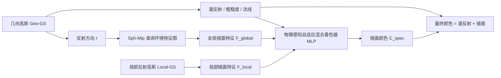

## 一句话总结

Ref-DGS 用"几何高斯 + 局部反射高斯"的双高斯表示，把近场镜面反射从几何中解耦出来，在纯光栅化管线里同时拿到高质量表面重建与新视角合成，且训练比依赖光线追踪的方法快数倍。

## 研究背景

- 领域现状：从 NeRF 到 3D Gaussian Splatting，新视角合成与表面重建都取得了长足进步。3DGS 借助可微光栅化，在效率上明显优于依赖体渲染密集采样的 NeRF 类方法。
- 核心痛点：反射（尤其是强烈的近场镜面反射）会破坏多视角外观一致性假设，是重建与渲染的根本难题。现有高斯方法陷入两难：一类只重建几何、不显式建模镜面反射，导致视角相关的高光被"吸收"进几何，出现表面收缩、局部凹陷、高频细节丢失；另一类引入显式反射建模，但要么只能处理远场反射、抓不住自反射和几何间的互反射，要么依赖光线追踪来建模近场互反射，计算开销巨大、训练变慢，反而丢掉了高斯泼溅的效率优势。
- 本文 idea：问题的根源在于用同一套表示同时编码"视角无关的几何"和"视角相关的复杂镜面反射"，逼两种互不相容的现象共用参数。Ref-DGS 提出反射外观不应被当作几何属性，且显式分离镜面反射并不需要昂贵的光线追踪。为此把几何与近场镜面反射拆给两组互补的高斯，在光栅化管线内完成反射外观建模。

## 方法

整体框架：Ref-DGS 建立在 2D Gaussian Splatting 之上，把场景拆成两组高斯——几何高斯 $$\mathcal{G}_{geo}$$ 负责视角无关的结构、漫反射与粗糙度，并输出深度、法线等几何量；局部反射高斯 $$\mathcal{G}_{local}$$ 专门承载近场视角相关的镜面反射。远场反射由一个可学习的球面特征图（Sph-Mip 编码）查询得到全局特征，近场反射由 $$\mathcal{G}_{local}$$ 光栅化得到局部特征，两者送入一个轻量的物理感知自适应混合着色器预测镜面辐射，最后与漫反射相加得到最终颜色。

关键设计：

1. 双高斯场景表示。几何高斯沿用 2DGS 的平面基元形式，附带漫反射色与粗糙度等视角无关材质属性，只负责几何，保证重建稳定。局部反射高斯则各自存一个可学习的局部镜面特征 $$f \in \mathbb{R}^d$$，光栅化后得到屏幕空间特征图 $$F_{local}(p)$$，紧凑地隐式表达自反射与互反射，且刻意不参与几何优化以免污染重建。

2. 为什么必须分离（物理动机）。作者用镜面反射定律解释：光滑表面上的镜像是虚像，虚像距离等于物距，即虚像位于表面"后方"。若把局部镜面特征塞进几何高斯，几何就会被迫向内塌陷去匹配虚像深度，从而破坏表面重建。$$\mathcal{G}_{local}$$ 的法线图确实呈现从物理表面向内凹陷的结构，正是在显式建模虚像几何。用位于表面后方的局部高斯来表示虚像，还能让虚像随视角自然平移，避免了光线追踪。

3. 全局—局部镜面特征。远场部分沿用 Ref-GS 的思路，用可学习球面特征图 $$M$$，按反射方向的球面坐标 $$x(r)$$ 和粗糙度选择的 mipmap 层级来查询，近似预滤波的环境反射：$$F_{global}(p) = \text{Sph-Mip}(x(r), \ell(\rho(p)), M)$$。近场部分由 $$\mathcal{G}_{local}$$ 直接渲染出 $$F_{local}(p)$$，补上全局环境模型抓不到的自反射与互反射。

4. 物理感知自适应混合着色器。一个仅 3 层、宽度 64 的轻量 MLP $$f_\Theta$$ 把全局特征、局部特征，以及物理条件项——粗糙度 $$\rho(p)$$ 与法线视线夹角余弦 $$\cos_{NV} = \max(n \cdot v, 0)$$——拼接后预测镜面辐射：$$C_{spec}(p) = f_\Theta(F_{global}(p), F_{local}(p), \rho(p), \cos_{NV})$$。因为不同区域、不同视角下远场与近场反射的主导地位会变化（开阔处以环境反射为主，凹陷与自遮挡处更依赖局部反射），着色器隐式学到逐像素的视角与材质相关混合权重，而非简单相加。最终线性颜色为 $$C(p) = C_{diff}(p) + C_{spec}(p)$$，再经 sRGB 转换输出。

## 实验结果

在 ShinySynthetic 与 GlossySynthetic 两个合成数据集、RefReal 与 GlossyReal 两个真实数据集上评估，几何用法线 MAE 和 Chamfer 距离，渲染用 PSNR/SSIM/LPIPS。下表取 ShinySynthetic 上的表面重建主实验（法线 MAE 均值与训练时间），Ref-DGS 在精度与速度上同时领先：

| 方法 | 法线 MAE 均值↓ | 训练时间↓ |
|------|------|------|
| 3DGS-DR | 2.43 | 26.5m |
| Ref-Gaussian | 2.17 | 35.9m |
| Ref-GS | 2.21 | 23.5m |
| MaterialRefGS | 2.20 | 2.42h |
| 本文 Ours | 1.43 | 12.6m |

其余结论用文字概括：在 GlossySynthetic 上，Ref-DGS 的 Chamfer 距离均值 0.62、法线 MAE 均值 1.88，均为最优。新视角合成方面，三个数据集上 PSNR/SSIM/LPIPS 整体领先（如 ShinySynthetic 达 PSNR 35.21、RefReal 达 PSNR 24.89）。效率上，渲染速度 76.34 FPS，比基于光线追踪的 EnvGS、MaterialRefGS 快 2–3 倍，也快于 Ref-GS。消融显示：去掉局部特征会让近场反射被吸进漫反射并劣化几何；不做双高斯解耦会引发近场高光泄漏与几何退化；去掉自适应混合会使视角相关的镜面响应不稳定；去掉物理条件项影响相对轻微但仍有正向作用。

## 亮点与局限

- 亮点：
  - 用"虚像位于表面后方"的物理观察，把近场镜面反射从几何中干净解耦，避免几何为拟合高光而塌陷，这是方法最核心也最优雅的洞见。
  - 全程光栅化、不用光线追踪就建模近场互反射，训练与渲染都显著更快，同时在重建与新视角合成两项上都达到 state-of-the-art。
  - 无需反射掩膜等额外标注（相比 NeRFReN 的 $$\beta$$ 混合是 label-free 的），且能处理曲面近场反射而不限于平面镜。

- 局限：
  - 近场反射用一组辅助高斯隐式表示，缺乏显式的物理/BRDF 语义，可能限制其在重光照、材质编辑等下游任务上的可解释性与可控性（论文未展示 relighting 等应用）。
  - 物理感知条件项带来的增益较小，作者归因于高维特征与 MLP 已能隐式编码部分视角/粗糙度信息，说明物理先验的作用尚未被充分利用。
  - 主要在以物体为中心、含玻璃/光泽材质的数据集上验证，对大规模复杂室内外场景、动态光照的泛化仍待考察。

## 延伸思考

- 双高斯"几何 / 反射分工"的思路，可推广到其他视角相关现象的解耦，例如次表面散射、半透明、荧光等，凡是"同一套基元被迫解释不相容现象"的场景都可能受益。
- 局部反射高斯本质上是把虚像显式几何化，这与 NeRFReN 的双分支、传统的镜像虚拟相机方法在思想上相通，值得比较其表达力边界（如多次弹射互反射、非镜面粗糙互反射能否覆盖）。
- 若能把隐式的局部镜面特征与显式 BRDF/环境光照解耦结合，或许能在保持光栅化效率的同时打通重光照与材质编辑，是很自然的后续方向。
