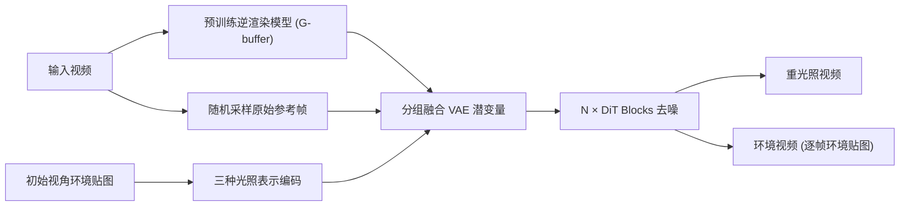

## 一句话总结

Relit-LiVE 把视频重打光重新表述为"同时生成重光照视频和逐帧环境视频"的联合扩散任务，并额外引入原始 RGB 参考帧来纠正内蕴分解误差，从而在不需要相机位姿先验的情况下实现物理一致、时序稳定的视频重打光。

## 研究背景

- 领域现状：大规模视频扩散模型正被改造成"神经渲染器"。一类做法直接用文本/背景图作粗糙光照条件端到端生成重光照视频；另一类走"分解-合成"两阶段路线，先做内蕴分解（反照率、法线、深度、粗糙度、金属度等 G-buffer），再在目标环境贴图下重新渲染。
- 核心痛点：两阶段范式严重依赖内蕴分解的保真度，而真实视频的分解往往不可靠，尤其在透明物体、复杂光传输、次表面散射等场景下会产生外观扭曲、材质崩坏、时序上误差累积。此外这些方法需要精确的逐帧相机位姿把环境贴图摆到视口里，实用性受限。近期把反照率估计与直接重光照并行学习的工作又受限于模型容量，难以扩展到更完整的内蕴属性。
- 本文 idea：两条关键洞见。其一，复杂全局光照效果在原始 RGB 视频里是直接可见的，所以用原始帧作参考来引导并纠正渲染，绕开不完美的内蕴分解。其二，把重光照重写为"逐帧环境贴图的形变 + 重光照视频"的联合生成，用一次推理隐式推断光照变换，从而免去显式位姿估计。

## 方法

整体框架：给定输入视频和初始视角下的环境贴图，先用预训练逆渲染模型（Diffusion Renderer 的 inverse renderer）把视频转成 G-buffer 内蕴属性，连同随机采样的原始参考帧一起编码进潜空间；经过分组融合与逐帧拼接后，送入 DiT 视频扩散模型去噪，同时输出重光照视频和逐帧环境视频。

关键设计：

- RGB-内蕴融合渲染器：内蕴属性给的是物理约束，但复杂光照效果在原始 RGB 里才看得清。作者把 G-buffer 编码成潜变量后，不像以往那样简单沿帧或通道拼接（前者算力开销大、后者收敛慢），而是先做"部分求和再沿帧拼接"。基于试验发现，数值特性相近或强相关的属性要分开：金属度与粗糙度（灰度、区域内近似常量）一组，深度与法线（数值强相关）一组，于是构造 $$z_{\{a,d,m\}} = z_a + z_d + z_m$$ 和 $$z_{\{n,r\}} = z_n + z_r$$ 两组内蕴条件。再从输入视频随机采样一帧原始图像编码为 $$z_I$$ 拼进去引导生成；随机采样打破了参考帧与生成结果的固定像素对应，抑制源光照沿像素传播，而且多步去噪时每步可采样不同帧以尽量保留细节。
- 重光照与环境视频的联合生成：因为渲染在 2D 图像空间进行，环境贴图必须与相机朝向对齐，而真实场景位姿常常未知或不准。作者不再假设已知位姿去 warp 环境贴图，而是让模型联合学习"形变后的环境视频"与重光照视频，即 $$V_t, \{E_i(C_i)\}_{i=1}^{n} = F_\theta(I_s, V_a, V_n, V_d, V_r, V_m, \{E_i(C_1)\}_{i=1}^{n})$$。HDR 环境贴图用三种互补表示（Reinhard 色调映射的 LDR、归一化对数强度、方向编码）沿通道拼接编码，还额外在 512×256 分辨率喂给交叉注意力做增强光照控制。环境视频以归一化对数强度图的形式输出（可反变换回 HDR/LDR），与重光照视频在帧维度拼接后一起去噪，强制形成几何-光照对齐。
- 三阶段训练策略：第一阶段标准监督学习获得基础重光照能力。第二阶段"内蕴感知增强"——对同一场景分别在用 $$z_I$$ 和把 $$z_I$$ 置零两种模式下生成，前者更真实但偶尔残留源光照，后者无残留但因逆渲染累积误差有细节失真，于是在潜空间按权重插值 $$z_{new} = \frac{z_{w/}}{1+w} + \frac{z_{w/o} \cdot w}{1+w}$$ 解码出兼顾真实感与光照合理性的伪真数据，再当作新参考帧训练。第三阶段"基于光照一致性的自监督（SIC）"——先在随机环境贴图下推理得到重光照视频及其环境光，再把视频帧序倒转、基于末帧环境光重新推理，两次结果按帧对应构成自监督训练对，在"固定相机、光照旋转"模式下提升泛化与对光照变化的敏感度。

## 实验结果

评测覆盖合成、人像、具身、自动驾驶等多域共 1400+ 动态视频，指标含视觉保真（PSNR/SSIM/LPIPS）、时序一致（RAFT）、材质保真（DINOv3）及用户研究。在合成与 MIT 多光照数据上与神经渲染/重光照方法对比，Relit-LiVE 在全部指标上领先：

| 方法 | 合成图像 PSNR↑ | 合成图像 LPIPS↓ | 合成视频 PSNR↑ | MIT 多光照 PSNR↑ | MIT 多光照 LPIPS↓ |
|------|------|------|------|------|------|
| NeuralGaffer | 12.84 | 0.463 | - | 17.87 | 0.241 |
| Diffusion Renderer | 17.09 | 0.264 | 16.45 | 17.29 | 0.355 |
| UniRelight | - | - | - | 20.76 | 0.251 |
| Ours | 24.85 | 0.175 | 25.39 | 21.86 | 0.132 |

在真实野外数据上对比文本条件方法（Light-A-Video、TC-Light）与 HDR 条件方法（Diffusion Renderer），Relit-LiVE 的运动保持（0.1692）、CLIP-MC（0.9246）、DINO-MC（0.9091）均更优，用户研究在视觉真实感、物理一致性、光照对齐上多数被试更偏好本方法。环境视频生成被当作一种新的光照估计任务评测，方向角误差（top-5 均值 20.35、中位 7.96）大幅低于逐帧估计的 StyleLight 与 DiffusionLight。消融显示去掉环境视频分支或去掉原始参考帧都会明显掉点，尤其在大相机运动/动态光照的合成视频上，联合建模带来显著提升。

## 亮点与局限

- 亮点：
  - 用"联合生成环境视频"的巧妙重表述，把显式相机位姿这一硬性依赖变成模型隐式学习的光照变换，扩大了真实场景适用面，并天然支持动态光照与相机运动。
  - RGB-内蕴融合直击两阶段范式的软肋——用可直接观测的原始 RGB 纠正不完美的内蕴分解，对透明/反射/折射等复杂光传输效果更鲁棒。
  - 通过潜空间插值造数据 + 循环一致自监督，在无需额外标注下增强泛化；框架还能延伸到场景渲染、材质编辑、物体插入、视频去光、流式长视频重光照等下游任务。
- 局限：
  - 仍依赖预训练逆渲染模型产出的 G-buffer 作为条件，其分解质量会构成性能下界，RGB 参考只是纠正而非替代。
  - 随机参考帧策略在源光照与目标差异极大时可能仍残留部分源光照（正是引入插值/自监督来缓解的现象）。
  - 长视频靠分段串联推理，段间光照条件由上一段环境视频估计传递，误差是否随段数累积、超长序列稳定性如何，正文未充分量化。

## 延伸思考

这项工作和 Diffusion Renderer、UniRelight 等"扩散模型即神经渲染器"的路线一脉相承，区别在于它没有把宝全押在内蕴分解上，而是承认真实视频分解不可靠、转而用原始观测来兜底——这种"物理先验 + 观测纠错"的折中思路对其他逆问题（材质估计、光照估计、SVBRDF 恢复）都有借鉴意义。把位姿依赖转化为可学习的环境视频，本质上是让网络隐式承担了几何-光照配准，值得追问的是它在极端视角变化或快速运动下的对齐精度上限。此外，环境视频作为副产物本身就是一个逐帧光照估计器，其精度远超传统单帧方法，或许可以单独拆出来服务于 AR 光照探测、视频合成插入等任务。
