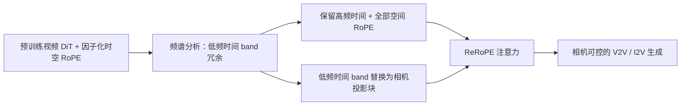

## 一句话总结

ReRoPE 发现预训练视频扩散模型的 RoPE 存在"低频冗余"，于是把相对相机位姿信息塞进这些被浪费的低频时间通道，从而在不改架构、不加编码器的前提下，给现成视频模型即插即用地装上精确的相机控制能力。

## 研究背景

- 领域现状：视频生成模型（如 Wan、CogVideoX 这类 Diffusion Transformer）已经能生成高质量视频，"可控相机视角"是内容创作、游戏、仿真等应用的刚需。主流做法是训练一个相机位姿编码器，把 6-DoF 位姿或射线特征注入模型。
- 核心痛点：现有方法几乎都把所有帧的相机位姿定义为"相对于某个固定参考帧（通常是第一帧）"的绝对表示。这种编码缺乏平移不变性（shift-invariance），泛化到没见过的轨迹或参考帧偏移时表现差，还会累积漂移。更自然的做法是用"任意两个视角之间的相对位姿"，但已有的相对位姿方法（如 PRoPE、GTA）需要重新划分 RoPE 的通道结构来表示 3D 变换，与预训练模型的 1D 旋转先验不兼容，等于要从头训练，代价高得离谱。
- 本文 idea：既然视频模型本身就用 RoPE 来编码相对位置，那能不能把"相机控制"重新表述成 RoPE 框架内的一个相对信号？作者观察到 RoPE 的频谱带宽没被充分利用——低频分量对相对位置编码几乎是冗余的，尤其是时间维度。于是把相机几何注入这些空闲的低频时间通道，既拿到相机控制，又不破坏预训练生成先验。

## 方法

整体框架：ReRoPE 建立在一个预训练视频 DiT 之上（在 $$T \times H \times W$$ 的 3D latent 网格上做多头注意力，头维度 $$d = d_\tau + d_h + d_w$$ 被分给时间、高、宽三个因子化 RoPE band）。核心操作只有一步：保留高频时间 RoPE 和全部空间 RoPE 不动，把低频时间 band 替换成相机投影块，注意力就能自动算出任意两个相机之间的相对变换。整个方法不动骨干网络、不加相机编码器、不加回归头。

关键设计：

1. **低频冗余的发现（是什么、为什么）**：RoPE 把特征看成 $$d/2$$ 个 2D 平面，每个平面用频率 $$\omega_f = \theta^{-2f/d}$$ 旋转。作者做了个玩具实验：把 query 和 key 都设成单位向量，注意力得分退化为 $$A = 2\cos((i-j)\omega_k)$$。结果发现高频 band 随位置差快速变相位（提供精细的位置区分），而低频 band 在正常视频长度（如 50 帧）内几乎不变、接近常数 2，说明这些低频分量对位置编码几乎没贡献、是冗余的。因为视频 latent 的时间序列长度通常远小于空间分辨率（如 Wan2.1 里 $$T=21$$ 而 $$H=30, W=52$$），时间维的位置偏移更小，冗余最严重。

2. **通过"屏蔽实验"验证冗余（怎么做）**：作者在 Wan2.1、Wan2.1-I2V、CogVideoX 三个模型上，把低频子空间 $$f \in \lbrace d_\tau/4, \dots, d_\tau/2-1 \rbrace$$ 对应的旋转矩阵直接置为单位阵。结果生成视频几乎不变；而反过来屏蔽高频 band 则导致模型崩溃。这从实证上确认了 RoPE 头维度中相当一部分是功能性冗余的，可以拿去承载相机几何等外部控制信号。

3. **在低频时间 band 注入相机（核心机制）**：沿用 PRoPE 的做法把相机投影矩阵 $$\tilde{P}_c$$ 提升为 $$4 \times 4$$ 齐次矩阵并沿对角线重复，构造投影块 $$\Phi_{\text{proj}}(c)$$。重构后的时间算子写作 $$\Phi_{\text{ReRoPE}}(\tau, c, h, w) = \operatorname{blkdiag}(\Phi^H_\tau(\tau), \Phi_{\text{proj}}(c), \Phi_h(h), \Phi_w(w))$$，其中高频时间和低频时间各占 $$d/6$$。这样注意力算出的就是任意相机对之间的相对变换 $$P_{c \leftarrow t} = \tilde{P}_c \tilde{P}_t^{-1}$$，只依赖相机对本身，天然是相对信号。空间 RoPE 完全不碰。

4. **训练与稳定化（怎么训）**：V2V 当作条件视频 inpainting——把源视频和目标视频的 latent 沿时间维拼接，只对目标帧做扩散，迫使模型学到所有源-源、源-目标、目标-目标视角对的几何关联；I2V 则把首帧当作无噪声的视觉锚点。由于相对相机变换 $$P_{c \leftarrow t}$$ 不保范数（non-norm-preserving），大平移量会放大注意力 logits 破坏稳定性，所以作者用训练序列中平移向量的最大 $$L_2$$ 范数做归一化，得到尺度不变的位姿表示。训练时只微调自注意力层、冻结其余骨干参数，用 flow matching 目标优化。

## 实验结果

作者用 Wan2.1 做 V2V、Wan2.2 做 I2V，在 MultiCamVideo、SDG-1.5M、DL3DV 上训练。评估相机精度（RRE/RTE/ATE 位姿误差，由 VIPE 估计）、VBench 视频质量子指标，以及 View Syn（用 GIM 统计生成帧与真值帧的高置信匹配像素对数）。

下面是 V2V 主实验（SDG-1.5M 上 200 段视频）与两个 SOTA 基线的核心对比：

| 方法 | RRE↓ | RTE↓ | ATE↓ | View Syn↑ |
|------|------|------|------|-----------|
| TrajectoryCrafter | 1.1693 | 0.0741 | 0.3824 | 1147 |
| ReCamMaster | 0.7758 | 0.2434 | 0.4814 | 1481 |
| ReRoPE（本文） | 0.7416 | 0.0629 | 0.1853 | 1600 |

ReRoPE 在相机精度（尤其 ATE 和 RTE）和几何一致性（View Syn）上明显领先：TrajectoryCrafter 依赖深度估计构建点云再重投影，美学质量高但对深度误差敏感、相机精度低；ReCamMaster 虽然也避免显式几何、用编码器把相机参数加到中间特征，但精度不如把相对关系直接编码进 RoPE 子空间的 ReRoPE。

I2V 上（DL3DV 静态场景），ReRoPE 相比 SEVA、DualCamCtrl 也拿到最低的位姿误差（RRE 0.0886 / RTE 0.0078 / ATE 0.0703），同时保持相当的画质。更关键的是 ReRoPE 能同时建模相机运动和物体动态——基线方法只能把动态主体渲染成"冻结的刚体扫描"，而 ReRoPE 能生成遵循文本提示的自然物体运动并跟随指定轨迹。

消融方面：与"完全替换时间 RoPE"和"Double RoPE（先做标准 RoPE 再叠加相机变换）"两个替代方案相比，ReRoPE 的 FID 最低、收敛最快——完全替换会破坏骨干的时间先验，Double RoPE 则让同一批通道同时编码时间位置和相机几何、产生信号干扰。平移归一化的消融也显示：不归一化时 FID 从 85.9 恶化到 185.6、FVD 从 59.5 恶化到 110.8，证明归一化对稳定投影条件很关键。

## 亮点与局限

- 亮点：
  - 洞察漂亮——把"RoPE 低频冗余"这一观察从玩具实验和跨三个模型的屏蔽实验两方面验证，再据此反推出注入位置，论证链条完整。
  - 真正的即插即用：不改骨干、不加编码器/回归头，只微调自注意力，训练代价低（V2V 约一天、I2V 两三天，8 卡）。
  - 用相对相机位姿而非固定参考帧，天然具备平移不变性，泛化和抗漂移更好；同一框架统一支持 V2V 和 I2V。
  - 能同时处理相机运动与场景动态，突破了基线"只能转静态视角"的限制。

- 局限：
  - 依赖骨干确实存在可利用的低频冗余，若某些模型的 RoPE 频谱利用更充分，方法收益可能下降。
  - 训练和评测的相机精度依赖 VIPE 等位姿估计工具；作者自己也指出动态场景下位姿估计难以解耦相机运动与物体运动，所以定量比较只能退回静态 DL3DV，动态场景主要靠定性展示。
  - 只把 ReRoPE 应用在时间维，虽然分析说空间维也有冗余，但空间注入的效果没有展开验证。

## 延伸思考

这篇工作把"相机控制"和"位置编码"这两件原本分开的事统一了起来，思路上和近期一批把相机当作相对位置编码的工作（PRoPE、GTA，以及并行的 BulletTime、UCPE）同源，区别在于 ReRoPE 强调"零新增权重、零架构改动"，靠的正是低频冗余这一发现。这提示一个更一般的问题：预训练 Transformer 的位置编码里是否普遍存在可回收的"频谱空位"，能否用同样的思路注入除相机之外的其他控制信号（光照、物体位姿、时间编辑等）？此外，把相对位姿归一化处理的技巧对任何"非保范数"的几何注入都可能通用。值得追问的是低频通道的容量上限——当要编码的几何信息更复杂时，$$d/6$$ 的低频预算是否够用，以及能否动态分配高低频预算。
