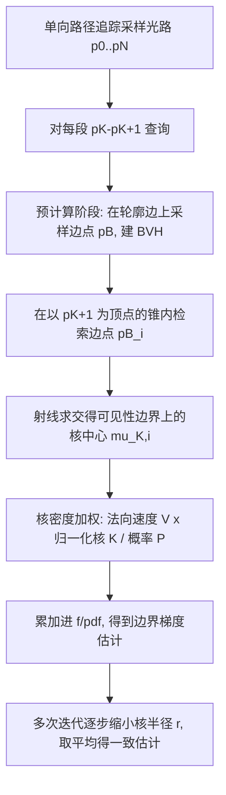

## 一句话总结

借用光子映射（photon mapping）的思路，用核密度估计把物理可微渲染中"零测度"的边界路径积分改写成普通的内部积分，从而得到一个简单、稳健、一致（consistent）的边界梯度估计器——只需在单向路径追踪上做很小的改动。

## 研究背景

- 领域现状：物理可微渲染是逆向渲染、优化与学习任务的核心工具，需要对场景参数（相机位姿、材质、几何）求渲染结果的导数。对几何参数求导时，导数由两部分组成：与前向渲染同域的**内部积分**，以及由可见性等不连续边界随参数移动而产生的**边界积分**。内部积分可复用前向渲染的采样策略，边界积分则是可微渲染独有的难点。
- 核心痛点：现有边界积分估计方法都不够稳健或高效。主流的"原样空间引导"（primary-sample-space guiding）类方法在高度细分的网格上会因加速结构被压垮而失效；基于重参数化（reparameterization）的方法把边界积分转成内部积分，但引入的散度项难以求值、更难做重要性采样，且梯度常带偏，导致重建结果过度平滑；近期的 MCMC 方法虽更稳健，却复杂、收敛不均匀、还会引入采样相关性。
- 本文 idea：与其硬着头皮在一条测度为零的曲线上直接采样，不如像光子映射那样用一个核（kernel）把这条零测度积分域"稍微撑开"成一个有面积的管状邻域，从而把边界积分转化为可以用常规路径追踪估计的内部积分。这是核密度方法首次被用于边界积分求值。

## 方法

整体框架：先在理论上把边界路径积分重写为内部路径积分——用一个"广义冲激函数"把面积分限制到可见性边界曲线上，再用光滑核把冲激函数软化成有限宽度的核，得到一个定义在普通（内部）路径空间上的等价积分。然后设计一个两阶段的蒙特卡洛估计器来高效求值，并通过逐步缩小核尺寸得到一致估计。

关键设计：

- **用核密度把边界积分改写成内部积分。** 边界积分的域是"边界路径空间"，其中恰好有一段被约束在可见性不连续曲线上（该段与场景几何相切于一点）。作者引入广义冲激函数 $$\delta_{\Delta B}$$ 把面积分限制到这些曲线上，并在曲线的管状邻域内把它写成一维 Dirac delta 的乘积。对于多边形网格，可见性边界是分段线性的，参数化的雅可比恒为 1，于是可以直接把 delta 软化成光滑核（如高斯核）。经过蒙特卡洛离散，冲激函数被近似为若干个中心落在边界上的二维核之和：$$\delta_{\Delta B}(\boldsymbol{p}) \approx \frac{1}{M} \sum_{i=1}^{M} \frac{K(\boldsymbol{p}; \boldsymbol{\mu}_{K,i})}{P_{K,i}}$$，最终整个边界积分被写成对内部路径空间的积分，被积函数就是测量贡献 $$f(\bar{\boldsymbol{p}})$$ 乘上一个对所有路径段求和的核密度调制项。

- **通过轮廓边采样定位核中心。** 直接在可见性边界曲线上采样核中心 $$\boldsymbol{\mu}_{K,i}$$ 并不容易。作者注意到可见性边界是场景轮廓相对于 $$\boldsymbol{p}_{K+1}$$ 的投影，而轮廓由分隔正/反面的网格边构成。于是改为在这些面边上均匀采样边点 $$\boldsymbol{p}^B_i$$，再从 $$\boldsymbol{p}_{K+1}$$ 向 $$\boldsymbol{p}^B_i$$ 发射线求交得到 $$\boldsymbol{\mu}_{K,i}$$，其采样概率 $$P_{K,i}$$ 用已有的边采样关系解析给出。运行时通过一个以 $$\boldsymbol{p}_{K+1}$$ 为顶点、沿 $$\overrightarrow{\boldsymbol{p}_{K+1}\boldsymbol{p}_K}$$ 为轴的锥体在 BVH 里检索附近边点，并用相邻两面法线的符号测试（一正一反）过滤出真正的轮廓边。

- **核归一化与近似加速。** 推导时假设 $$\boldsymbol{p}_K$$ 在整个场景几何上采样，但路径追踪实际只在 $$\boldsymbol{p}_{K+1}$$ 可见的子区域内采样，因此需要按可见子区域内圆盘的面积 $$A_{K,i}$$ 重新归一化核。由于可见性边界分段线性，作者用半个圆盘面积 $$A_{K,i} \approx \pi r^2 / 2$$ 近似；当核半径 $$r$$ 足够小时该近似误差趋于消失。此外只把射线与含 $$\boldsymbol{p}_K$$ 的平面求交（而非整个场景），进一步加速。

- **一致估计器。** 借鉴光子映射的一致性理论（Knaus 与 Zwicker），作者跑多次迭代并按 $$r_{t+1} = r_t \sqrt{\frac{t + \alpha}{t + 1}}$$ 逐步缩小核半径，最终梯度取各次迭代结果的平均：$$\langle I_{\text{bnd}} \rangle_{\text{final}} = \frac{1}{T} \sum_{t=0}^{T} \langle I_{\text{bnd}} \rangle_t$$。核越小偏差越小，随迭代增加估计收敛到无偏结果（论文附录给出一致性证明）。

## 实验结果

主实验是等样本数下的可微渲染梯度对比：在三个几何/可见性复杂的场景上，报告梯度图相对有限差分参考的 RMSE（越低越好）。lucy 用 shadow 配置，chandelier 与 vbunny 用 mirror 配置。可以看到本文方法在三个场景上都取得最低 RMSE，且在带镜面反射、高细分几何的 chandelier / vbunny 上对基线的优势尤其显著——重参数化的 WOS-WAS 在镜面二次边界上方差爆炸。

| 场景 | 本文 RMSE↓ | Projective | Quadric | MCMC | WOS-WAS |
|------|-----------|-----------|---------|------|---------|
| lucy | 0.249 | 0.260 | 0.332 | 0.446 | 0.529 |
| chandelier | 1.91 | 3.25 | 40.25 | 18.74 | 1665.10 |
| vbunny | 2.78 | 5.37 | 45.25 | 11.13 | 2751.48 |

其余实验用文字补充：消融实验验证了当核半径取三角形尺寸的约 2% 时，$$A_{K,i} \approx \pi r^2 / 2$$ 的近似几乎不引入额外偏差；一致性验证显示随迭代数 $$T$$ 增加（每次 4 spp）RMSE 稳步下降、收敛到参考。逆向渲染实验（mirror 配置、从 4 万顶点球面初始化、40 张目标图）中本文方法收敛更快更稳。效率上，teaser 场景在 GPU 上 4 spp 时本文仅需 0.4 s，而 projective 与 WOS-WAS 分别需 2.9 s 与 4.8 s。

## 亮点与局限

- 亮点：
  - 把成熟的核密度 / 光子映射思想迁移到边界积分求值，理论清晰、且是该方向的首次尝试。
  - 部署代价极低——只需在单向路径追踪上加一步核密度查询，无需 MCMC、无需散度项估计与重参数化。
  - 在高细分几何 + 镜面互反射这类"硬骨头"场景上稳健性与效率显著优于四个 SOTA 基线，同时给出了一致性证明。
- 局限：
  - 当导数被极软阴影或高粗糙度反射主导时优势消失，甚至落后于 projective sampling（不过这类效果在实际逆向渲染中信息量太低、少被依赖）。
  - 公式假设分段平面几何，推广到光滑曲面仍是待解问题。
  - 估计器基于单向路径追踪，扩展到双向路径追踪（BDPT）才能更好处理焦散等复杂效果。

## 延伸思考

这项工作把前向渲染里的"密度估计换偏差换方差"哲学干净地搬到了梯度估计上：核尺寸就是偏差-方差旋钮，逐步缩小即得一致估计，和渐进式光子映射（PPM）的收敛机制如出一辙。值得追问的是查询面积 $$A_{K,i}$$ 的估计——论文为了简单用了常数近似，而已有的无偏面积估计（Bernoulli trials）或几何方法本可进一步降偏差，是与本方法正交、可叠加的改进点。另一个自然方向是与 VCM/UPS 式的顶点合并框架结合，把边界核密度查询纳入更通用的路径空间估计里；再往前，若能推广到光滑隐式曲面（SDF），就能与 Wang 等针对隐式几何的边界松弛方法形成互补，覆盖显式与隐式两类几何表示。
