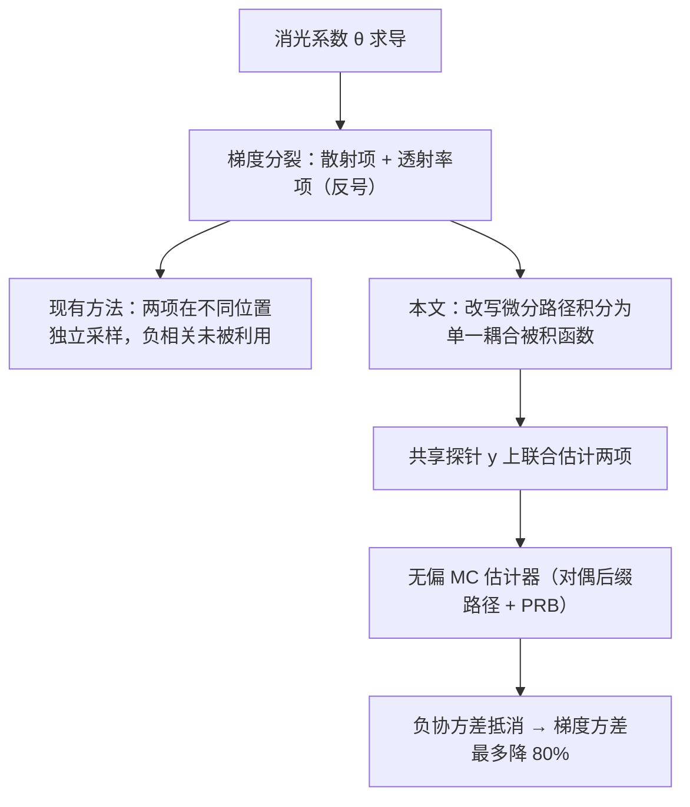

## 一句话总结

本文提出"样本匹配（sample matching）"原理：把消光系数梯度里符号相反、原本被独立采样的散射项与透射率项耦合进同一个被积函数、在同一个采样点上联合估计，从而在不引入偏差的前提下把体渲染反向求导的梯度方差最多降低 80%。

## 研究背景

- 领域现状：可微体渲染让人们能对参与介质做基于梯度的优化（体积反向渲染），用于三维资产生成、全息制造、外观精确的三维打印、等离子体重建等。相比 NeRF、3D Gaussian Splatting 这类零反弹发光场近似，基于完整辐射传输理论的方法能恢复消光系数、反照率等真实材质属性，支持可信的重光照。
- 核心痛点：所有现有的无偏消光梯度估计器（从 free-flight 采样到差分比率追踪 DRT、到路径空间公式）方差都偏高，拖慢收敛、损害重建质量。根源在于辐射传输公式的结构——消光系数 $$\sigma_t$$ 既以局部衰减项显式出现，又通过透射率隐式出现。对它求导后梯度自然分裂成两部分：一个在单个路径顶点上求值的**散射项**，一个沿线段内部积分的**透射率项**。这两项对应相互竞争的物理效应（某点消光增大既增强该处的内散射，又衰减穿过它的辐射），因而**带相反的符号**，天然存在负相关。
- 本文 idea：这种反号结构本应带来负协方差来抵消方差，但现有估计器都把两项放在几何上不同的位置采样（DRT 甚至为二者抽独立样本），把负相关白白丢掉。本文主张在**共享的采样位置**同时评估这两项，用负协方差压方差。

## 方法

整体框架：作者首先在路径空间语言下，对广义微分路径积分做重构，把原本分处两个不同积分域（线段端点 vs 线段内部）的散射与透射率两项，改写进**同一个被积函数**里，使得二者在构造上就绑定在同一个探针点求值；再基于这个新公式推导出一个无偏的蒙特卡洛估计器，并用路径重放反传（PRB）在 GPU 上高效实现。

关键设计：

1. **梯度的两项分裂与错位诊断**。对路径积分求导后，逐段贡献 $$(\partial_{\boldsymbol{\theta}} I)_{K,j}$$ 分成散射与透射率两块：散射项在线段端点 $$\boldsymbol{x}_j$$ 处评估 $$\partial_{\boldsymbol{\theta}}\sigma_t$$，透射率项在内部点 $$s\lt t$$ 处评估 $$\partial_{\boldsymbol{\theta}}\sigma_t$$。二者探测的是同一条光线上的同一消光场，却落在互不相关的位置——这个"位置错位"正是 free-flight 与 DRT 都存在的通病。

2. **耦合重构（核心贡献）**。作者利用透射率定义与 Fubini 定理交换积分次序，把逐段被积函数改写为一个沿线段 $$\boldsymbol{x}_{j-1}\boldsymbol{x}_j$$ 的积分 $$\mathcal{E}_j$$，其形式是"原始链（经 $$\boldsymbol{x}_j$$）"与"改动链（经共享探针 $$\boldsymbol{y}$$）"两条贡献之差，二者共享同一个梯度探针 $$\partial_{\boldsymbol{\theta}}\sigma_t(\boldsymbol{y})$$。这样散射与透射率贡献在同一点求值，实现所需的对齐。这是首个把两项耦合进单一被积函数的微分路径积分重构。

3. **无偏估计器：单/对偶后缀路径**。用单向体路径追踪（VPT）配 delta tracking 采一条前缀路径，并在其末段上均匀采一个探针 $$\boldsymbol{y}$$。估计内部积分时有两种做法：**单后缀路径**理论方差更低，但涉及从 $$\boldsymbol{y}$$ 重连的额外光线遍历，以及一个把两次介质查询耦合的透射率比值追踪器（式中透射率比通过共享碰撞位置 $$\{u_k\}$$ 折叠成单个指数以避免除法带来的偏差），在 GPU 上难高效实现；**对偶后缀路径**从 $$\boldsymbol{y}$$ 与 $$\boldsymbol{x}_K$$ 各追一条后缀路径，透射率项干净相消。作者最终采用对偶后缀方案，配合 PRB 反传，仅在已有 DRT 实现上改 60–70 行代码即可落地。

4. **线性/二次变体与多探针摊销**。与 DRT 类似，估计器有二次（每段都放探针，$$O(K^2)$$）与线性（用加权蓄水池采样只选一段并按逆概率重加权，$$O(K)$$）两种复杂度变体，均无偏。为摊销前缀路径构造开销，每段放 $$\Lambda>1$$ 个探针，并把内散射拆成直接/间接：直接项在全部 $$\Lambda$$ 个探针上评估，间接项只在其中一个探针上递归追踪。实践中 $$\Lambda=4$$ 表现好，也与 DRT 设定一致以便公平比较。

## 实验结果

作者在 Mitsuba 3 中实现方法与 DRT 基线，在 NVIDIA RTX 4090 上、8 个含环境贴图与高分辨率异质体网格的场景上做等时（每场景每方法 30–90 分钟优化）反向渲染对比。主实验为等时重光照重建的逐场景 PSNR（列为 Ours 二次 / Ours 线性 / DRT 二次 / DRT 线性）：

| 场景 | Ours 二次↑ | Ours 线性↑ | DRT 二次↑ | DRT 线性↑ |
|------|-----------|-----------|-----------|-----------|
| Teapot | 33.79 | 32.80 | 25.19 | 24.34 |
| Bunny-Cloud | 30.93 | 30.19 | 26.24 | 25.55 |
| Jellyfish | 36.05 | 35.99 | 30.90 | 30.65 |
| Dust-Devil | 31.70 | 31.04 | 27.10 | 26.39 |
| Dragon | 18.33 | 17.96 | 17.34 | 16.99 |

关键结论：本文两种复杂度变体在 PSNR 上都优于对应的 DRT 变体，且**线性变体常能追平甚至超过 DRT 的二次变体**——说明"用诱导协方差降方差"比单纯堆样本数更关键。视觉上本文在空区域更干净、显著抑制了 DRT 常见的漂浮伪影；对某些异质体（Teapot、Bunny-Cloud）还恢复出更细的几何与外观细节。补充实验：合成 1D 场景下两法都满足 $$O(1/N)$$ 收敛率，但本文 MSE 约低 6 倍；Jellyfish 的逐体素梯度方差最多比 DRT 低 80%，且在 $$\sigma_t\approx 0$$ 的空区域降幅最大，均值梯度与 DRT 在空间上一致，验证了无偏性。$$\Lambda$$ 的消融显示 PSNR 随 $$\Lambda$$ 从 1 到 8 单调提升，$$\Lambda=1\to2$$ 增益最大、$$\Lambda=4$$ 之后饱和。

## 亮点与局限

- 亮点：
  - 抓住了辐射传输公式里一个被长期忽视的结构性事实（散射与透射率梯度反号 → 负相关），并给出首个系统性利用它的方法，理论洞察漂亮。
  - 首次把两项耦合进单一微分路径积分被积函数，为体积可微渲染的"面向导数的重要性采样"打开了新设计空间。
  - 工程上极易落地：在现成 DRT 实现上改 60–70 行即可，天然兼容 Mitsuba 3 的 PRB 框架，且方差最多降 80%、收敛更快。

- 局限：
  - 假设基于物理的光传输，线性透射率、纯发光等非物理模型不在适用范围。
  - 出于 GPU 效率采用对偶后缀路径，放弃了理论方差更低的单后缀路径变体（其发散的重连光线与紧耦合透射率比追踪器不适配单一 megakernel）。
  - 多探针摊销存在不对称性：每段仅一个探针递归追踪间接光，其余只算直接光，间接项有效样本数被限制在 1。

## 延伸思考

- 作者点名的自然方向是把"样本匹配"推广到基于体渲染的神经方法（NeRF、3DGS），若能把这种负协方差降方差迁移到神经场的反向优化，价值可观。
- 间接项采样成本可借神经辐射缓存或分层样本复用来降低；单后缀路径变体的 megakernel 友好实现也值得探索。
- 更一般地，"两项反号 → 诱导负相关"的思路是否能推广到其它参数（如反照率、相函数）或界面/表面导数的估计，是一个值得追问的方向——本文只针对消光系数 $$\sigma_t$$。
