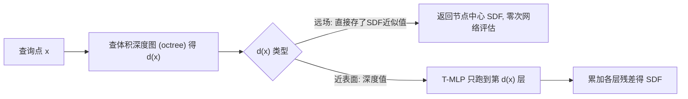

## 一句话总结

SAND 让隐式神经表面（如 SDF）根据查询点的空间重要性和局部几何复杂度自适应地决定"算到网络第几层就停"，从而在几乎不损失几何精度的前提下把推理查询速度提升一到两个数量级。

## 研究背景

- 领域现状：隐式神经表示（INR）用一个 MLP 把 3D 形状编码成连续函数（SDF、占用场等），紧凑、可微、细节丰富，已成为神经渲染、三维重建与仿真的主流几何表示之一；SIREN、FINER、Fourier Features 等在提升拟合频率细节上不断推进。
- 核心痛点：INR 推理开销大，且**对所有查询点一视同仁**——不管点离表面远近、所在区域几何复杂与否，都要把网络跑满全部深度。但实际上精度需求是空间非均匀的：离表面远的点只要符号正确即可，同一等值面上简单区域也用不着深层网络。统一深度被"最难的点"绑架（bottleneck effect），造成大量冗余计算。
- 本文 idea：借鉴传统离散表示"按局部复杂度分配分辨率"（网格加密、点云加采样、体素细分）的思想，在连续神经表示里做**空间自适应的网络深度分配**：给几何重要/复杂区域跑更深的网络，简单/空旷区域浅层甚至零层即可。

## 方法

SAND 由两部分组成：一个记录"每个空间区域需要算到多深"的**体积化网络深度图（octree）**，和一个能在任意中间深度给出有效预测的**带尾多层感知机（T-MLP）**。训练时先训 T-MLP 学隐式函数，再据其各层输出为空间各处计算所需深度并存进 octree；推理时每个查询点先查表拿到目标深度 $$d(x)$$，网络只跑到该深度即停。

关键设计：

1. **带尾 MLP（T-MLP）：残差式早退架构。** 在标准 MLP 每个隐藏层后挂一个输出分支（tail）。第一个 tail 输出目标函数的粗略近似，之后第 $$k$$ 个 tail 只学"前 $$k-1$$ 个 tail 累加输出与真值之间的残差"，最终预测是各 tail 输出的累加：$$y_i = y_{i-1} + t_i$$。这样任意中间深度都能给出可用预测，为按需早退提供基础。训练目标对所有深度的累加输出同时监督：$$L_{total} = \sum_{i=1}^{L} L(y_i)$$。

2. **乘性尾（低秩二次变换）稳定小残差学习。** 越深的残差量级越小（远小于 1），线性输出层难以训练。作者把深层 tail 写成两条线性分支的 Hadamard 积：$$t_i = t_{i0} \circ t_{i1}$$，等价于对隐藏表示做一个低秩二次变换，用大量级的乘子拼出小量级的残差，增强每个尾分支的表达力（附录给出理论证明）。消融显示它优于"可学习标量缩放"，因为后者难以在各层做差异化初始化。

3. **体积化网络深度图：octree 存深度而非特征。** 用 octree 离散空间：与目标形状相交且未达最大深度的节点继续细分；叶节点分为"近表面"与"远场"两类。近表面叶节点的所需深度由式（5）确定——取"符号与最终输出一致，且中间输出与最终输出之差 $$\lvert y_L(x) - y_i(x) \rvert < r$$"的最小层 $$i$$，同一叶节点内对所有点的深度做 max pooling。远场叶节点则**根本不需要网络评估**：直接在节点存下中心处的近似 SDF 值（只需保证符号正确）。由此得到最终的深度查找表。

4. **推理与天然 LOD。** 推理时先批量查 octree：落在远场的点直接取存好的近似值（零次网络评估），其余点按各自深度跑 T-MLP。因为 T-MLP 的中间层本身就是由粗到细的多级输出，**限制最大评估深度即可得到不同细节层次（LOD1–LOD4）**，同一套表示无需多个网络或显式抽稀就能做细节分级。对无真值几何的任务（如点云重建），先常规训练 T-MLP，再从零等值面抽网格、据此建 octree，不引入额外误差也不增加推理成本。

## 实验结果

在 Stanford 3D Scanning Repository 与 Thingi10K（Thingi32 子集）上做形状过拟合表示，指标为 Chamfer Distance（CD，↓）、F-Score（↑）、Normal Consistency（NC，↑），Time 为 MC 在 $$512^3$$ 网格下的查询耗时（含 octree 查询 + 网络评估）。下面取 Stanford 上的主对比（括号内倍数为相对最快 SAND 配置的耗时比，原文标注）：

| 方法 | CD ↓ | F-Score ↑ | NC ↑ | Time (s) |
|------|------|-----------|------|----------|
| SIREN | 1.523 | 95.16 | 97.86 | 12.14（约 32×） |
| FINER | 1.520 | 95.19 | 97.91 | 21.62（约 57×） |
| NGLOD | 1.603 | 94.62 | 97.75 | 5.541（约 15×） |
| BANF | 1.870 | 89.09 | 94.82 | 45.26（约 120×） |
| SAND-SIREN | 1.512 | 95.23 | 98.26 | 0.310 |
| SAND-FINER | 1.498 | 95.30 | 98.29 | 0.378 |

把 SAND 套到 SIREN / FINER 骨干上，查询速度相较原骨干快约一到两个数量级，同时 CD/NC/F-Score 还略有提升——因为网络把表达力集中到了近表面区域。代价是 octree 带来一点额外存储；即便把基线放大到相当存储量（表中带 * 变体），SAND 精度仍占优。

其余结论（文字简述）：

- **深度分布随复杂度变化**：简单形状（圆角立方体）大量点在浅层就终止，复杂形状（雕像）更多点被推到深层，验证了"按几何复杂度自动分配算力"；也因此复杂形状的加速比更低。
- **对比 Instant-NGP**：SAND 精度更高（CD/NC/F-Score 全面领先），FLOPs 与之相当；但绝对速度仍慢一截，作者归因于实现差异（Instant-NGP 是高度优化的 CUDA，SAND 是 PyTorch），而非算法复杂度。
- **消融**：去掉 octree 改用逐层动态判停，速度（13.67s vs 0.378s）和精度都变差；去掉残差设计或乘性设计，精度均下降；octree 最大深度 9、误差阈值 $$r=0.00015$$ 是精度与开销的折中。

## 亮点与局限

- 亮点：
  - 把"按局部复杂度分配资源"这一离散表示的经典思想，干净地迁移到了连续神经隐式表示上，视角新颖。
  - T-MLP 的残差 + 乘性尾设计让"任意深度早退"真正可用，且几乎不损精度；即插即用，可套在 SIREN、FINER 等不同骨干上。
  - 天然支持 LOD，一套表示按需给出多级细节，LOD1 下相较基线优势尤其明显。
  - 远场点零网络评估 + octree 常数级查表，是加速的主要来源，工程上简单可靠。

- 局限：
  - 自适应深度是在**训练完成之后**离线确定的，训练阶段本身没能享受自适应算力；octree 也是逐形状构建的，缺乏跨形状的泛化深度预测。
  - 额外的 octree 带来存储开销，且随最大深度增大而快速上升（深度 10 时存储 7.9MB）。
  - 绝对速度仍不及高度优化的 Instant-NGP，PyTorch 实现是瓶颈之一；论文主要在单形状过拟合与 LOD 任务上验证，未大规模覆盖从图像/扫描直接重建等更复杂管线。

## 延伸思考

- 作者指出的最直接方向是把深度决策**前移到训练中甚至训练前**（据局部几何复杂度预测深度），让训练阶段也自适应；再进一步是学一个可泛化的深度预测器，摆脱逐形状 octree。
- "早退 + 残差累加"与经典的 BranchyNet / MSDNet 早退网络、以及 NGLOD/BACON 的多尺度 LOD 是两条思想的融合，值得关注它能否推广到占用场、UDF、乃至神经辐射场的自适应采样上。
- octree 存"深度/符号"而非"特征"，是一种很轻的混合表示；若与哈希网格特征结合，或许能在精度、存储、速度三角上取得更好平衡。
